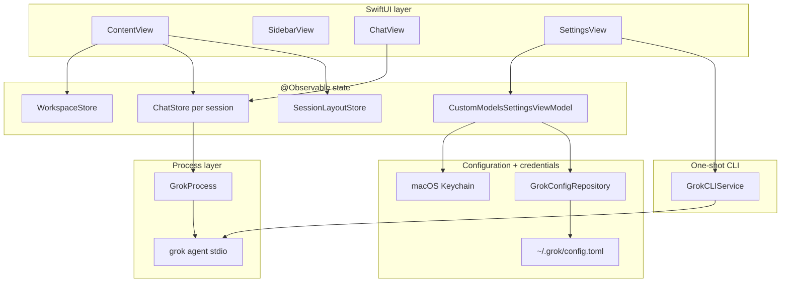
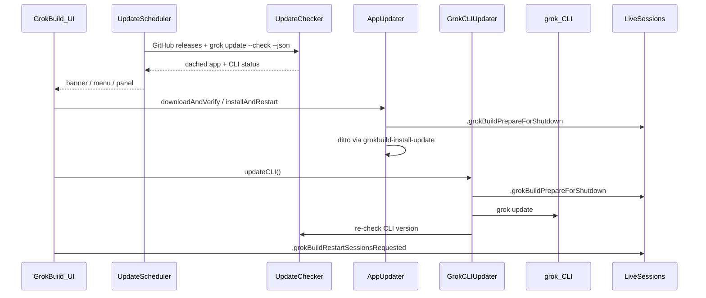

# GrokBuild — architecture reference

> [!CAUTION]
> **Canonical application line:**
> `/Users/jimmyschmitz/Desktop/Projects/MCP Servers/Grok Build/grok-build-desktop`
> → `schmitzjimmy1-star/grok-build-desktop` → `codex/warm-glass-ui` →
> `/Applications/GrokBuild.app`. The separate
> `/Users/jimmyschmitz/Documents/Grok Builf` / `jimmmy-Jim/Grok-Build-GUI`
> repository is retired reference material. Never build or install it. Run the
> identity preflight in `CANONICAL_WORKTREE.md` before changing code.

**Read this first in every new chat after `CANONICAL_WORKTREE.md`.** This document is the canonical map of how GrokBuild works. `AGENTS.md` points here; `.cursor/rules/` add file-specific conventions.

---

## Table of contents

1. [What GrokBuild is](#what-grokbuild-is)
2. [Design rules for agents](#design-rules-for-agents)
3. [Repository layout](#repository-layout)
4. [App lifecycle & shell](#app-lifecycle--shell)
5. [Runtime architecture](#runtime-architecture)
6. [GrokProcess & ACP](#grokprocess--acp)
7. [ChatStore](#chatstore)
8. [Multi-session model](#multi-session-model-contentview)
9. [Workspaces & projects](#workspaces--projects)
10. [Persistence](#persistence-userdefaults)
11. [Feature subsystems](#feature-subsystems)
12. [Settings system](#settings-system)
13. [In-app updates](#in-app-updates)
14. [UI layout & panels](#ui-layout--panels)
15. [Notifications](#notifications)
16. [Git integration](#git-integration)
17. [Build, test & release](#build-test--release)
18. [Common tasks → files](#common-tasks--files)
19. [Tests](#tests)
20. [Anti-patterns](#anti-patterns)
21. [Related docs](#related-docs)

---

## What GrokBuild is

GrokBuild is a **windowed macOS project workbench** (SwiftUI + AppKit) over the `grok` CLI. It spawns `grok agent stdio` per build session and speaks **ACP (Agent Client Protocol)** JSON-RPC over stdin/stdout. The transcript is an auditable record of project work; the product model is not a standalone chatbot.

| GrokBuild owns | `grok` CLI owns (do NOT reimplement in Swift) |
|----------------|-----------------------------------------------|
| Windows, sidebar, composer, settings panes | ACP session lifecycle, tool execution |
| Multi-tab sessions, LRU process cap | MCP server wiring at runtime (GrokBuild only *injects* configs) |
| Per-tab model, per-project effort, layout persistence | Skills, hooks, plugins, plan mode, subagents |
| Browser/Computer Use **enablement** + bundled skills | Agent reasoning, permissions policy enforcement |
| In-app updates (app + CLI) | `grok update`, auth (`grok login`) |

**Platform:** macOS 26+. **Version:** `VERSION` → `AppVersion.display`. **Build:** SwiftPM only — no Xcode project; use `make` / `swift build`.

Every packaged bundle also stamps the personal build channel, source repository,
branch, exact commit, and dirty state into `Info.plist`. `AppBuildIdentity`
surfaces that receipt in About and Settings → App. `0.1.20` by itself is not
accepted as source identity because the maintained personal line and upstream
can share the same marketing version.

---

## Design rules for agents

1. **Stay thin** — UI and local state only; wrap the CLI, don't replace it.
2. **Reuse services** — extend `GrokProcess`, `GrokCLIService`, `ChatStore`, `WorkspaceStore`, `SessionLayoutStore`, and feature services below.
3. **Match conventions** — read surrounding code before editing; minimize diff scope.
4. **Draft vs applied settings** — migrated panes edit parent-owned `SettingsValueState` drafts; storage changes only at the explicit Apply boundary, and `EffectiveSessionReceipt` separately proves what the current process launched (see [Settings system](#settings-system)).
5. **Post notifications** — message/turn changes → `.liveSessionMessagesChanged` (titles, transcript save, diff detection); settings that affect MCP → `reloadConfiguration()`.
6. **Docs + tests with every code change** — run `make test`, add/extend `Tests/GrokBuildTests/`, update this file and other relevant docs in the same session (`.cursor/rules/docs-and-tests.mdc`).
7. **Commit only when asked** — user rule in this repo.

---

## Repository layout

```
grok-build-desktop/
├── GrokBuild/                    # Main app target (SwiftUI + AppKit)
│   ├── main.swift                # NSApplication entry
│   ├── AppDelegate.swift         # Single instance, main window, menus
│   ├── MainWindowLayout.swift    # Main window min/default size + composer max width
│   ├── AppTheme.swift            # Neutral graphite palette, typography, radii, shared surface modifier
│   ├── ContentView.swift         # Root view: multi-session orchestration
│   ├── Views/                    # SwiftUI screens (SettingsView is large)
│   ├── Services/                 # Business logic, CLI integration
│   ├── Models/                   # Workspace, Message, Composer types
│   ├── Resources/
│   │   ├── Assets.xcassets/      # Brand mark, app icon
│   │   └── Skills/               # Bundled grok skills (copied at build)
│   ├── AboutPanel.swift          # AppKit About panel
│   └── UpdatePanel.swift         # AppKit Updates panel
├── GrokBuildComputerUseCore/     # Shared Computer Use contract (tools, argv, policy, env)
├── GrokBuildComputerUseMCP/      # Separate SPM target: stdio MCP bridge → agent-desktop
├── Tests/GrokBuildTests/         # Unit/integration tests
├── scripts/                      # build-macos-app.sh, release.sh, notarize.sh, install-update
├── Package.swift                 # SPM manifest (macOS 26+)
├── VERSION                       # App version source
├── Makefile                      # make run | test | app | release
├── AGENTS.md                     # Agent entry (points here)
└── BUILDING.md                   # Signing, notarization, CI
```

The AppKit pair `main.swift` + `AppDelegate` is the only entry point (the legacy SwiftUI `GrokBuildApp.swift` was deleted).

---

## App lifecycle & shell

### Entry point

`main.swift` → `AppDelegate.applicationDidFinishLaunching`:

1. **Single instance** — advisory `flock` on `~/Library/Application Support/GrokBuild/instance.pid`. Second launch posts `com.grokbuild.showMainWindow` and exits.
2. **Activation policy** — `.regular` (Dock icon + standard application menus).
3. **Application menu** — `AppDelegate.setupMainMenu()` owns About, Settings, update checks, Project, Session, and Window commands. GrokBuild does not create an `NSStatusItem`.
4. **Update scheduler** — `UpdateScheduler.start()` (background checks).
5. **Main window** — `openMainWindow()` hosts `ContentView` in `NSHostingController`.

### Window behavior

- **Close button** hides the window (`orderOut`), does not quit (`applicationShouldTerminateAfterLastWindowClosed` → false).
- **Reopen** (Dock click) → `applicationShouldHandleReopen` → show main window.
- Frame autosave name: `"MainWindow"`.

### Application menus

| Menu | Location | Purpose |
|------|----------|---------|
| **GrokBuild** | `AppDelegate.setupMainMenu()` | About, Settings ⌘,, update checks (re-entrancy guarded), View Usage on grok.com, Hide ⌘H, Quit |
| **Edit** | `AppDelegate.setupMainMenu()` | Standard text editing commands |
| **View** | `AppDelegate.setupMainMenu()` | Show/Hide Sidebar ⌃⌘S (posts `.toggleSidebarRequested`; title tracks `SidebarVisibility.currentPreference()`) |
| **Project** | `AppDelegate.setupMainMenu()` | Add Project |
| **Session** | `AppDelegate.setupMainMenu()` | New Session, Browse Sessions, Stop Generation, Focus Input |
| **Window** | `AppDelegate.setupMainMenu()` | Minimize, Zoom |

Commands that need SwiftUI post notifications (for example `.newSessionRequested` and `.openSettingsRequested`) that `ContentView` handles. DEBUG builds add **GrokBuild → Simulate Updates** after the update item.

---

## Runtime architecture



### Request path (send a message)

1. User types in `ChatView` → `ChatStore.send(_:)`.
2. `ChatStore` ensures workspace selected and `GrokProcess` is `.ready` (restarts if needed).
3. Appends user `Message`, creates empty assistant `Message`, sets `isStreaming`.
4. `GrokProcess.send(prompt)` → ACP `session/prompt` JSON-RPC on stdin.
5. `GrokProcess` reader parses stdout → `AcpEvent` stream.
6. `ChatStore.consumeOutput()` maps events → message text, tool cards, permissions, thinking blocks.
7. On completion → `isStreaming = false`, posts `.liveSessionMessagesChanged` (also on user send).

### CLI discovery (shared)

`GrokProcess.locateGrokCLI()` and `GrokCLIService.locateGrokCLI()` search in order:

1. `GROK_CLI_PATH` environment variable
2. `~/.grok/bin/grok`
3. Homebrew paths
4. `PATH`

User must run `grok login` for authenticated sessions. Auth failures surface inside the active session through `ChatStore.authRequiredMessage`; no launch-time credential guess is shown in app chrome.

---

## GrokProcess & ACP

**File:** `Services/GrokProcess.swift`

`GrokProcess` is the long-running **ACP client**. One instance per `ChatStore`.

### Process states (`GrokProcessState`)

| State | Meaning |
|-------|---------|
| `.idle` | No process |
| `.starting` | Launching CLI, ACP handshake in progress |
| `.ready` | Session created/loaded, can accept prompts |
| `.busy` | Turn in progress |
| `.failed(String)` | Startup or fatal error; check `needsAuthentication` |

### Launch command shape

```
grok [--no-memory] [--permission-mode X] [--sandbox X] [--allow RULE] … \
     agent [--reasoning-effort X] [--model M] stdio
```

Built from `GrokLaunchOptions` in `ChatStore.restartProcess`. Working directory = **workspace path**.

Permission launch arguments are centralized in `GrokPermissionLaunchArguments`. Ask omits a flag, Always approve emits `--always-approve`, and advanced modes emit their exact `--permission-mode` value. `GrokPermissionMode` owns the user-facing names and explanations; legacy `bypassPermissions` values normalize to Always approve. `dontAsk` is displayed as **Deny unapproved (CI)** because the CLI silently denies tools without an explicit allow rule in that mode. Every launch increments `GrokProcess.processGeneration` and creates a credential-free `GrokLaunchReceipt` bound to the local tab, workspace, PID, backend ID, launch outcome, requested model/agent/effort, permission/sandbox state, capability booleans, and MCP server **names only**. Stopped or failed receipts remain historical evidence and cannot be described as live. Permission cards use the launched receipt rather than mutable Settings state. If the CLI still emits a request, `PermissionRequestPolicy` auto-selects an actual allow option under Always approve/YOLO, auto-selects rejection under Deny unapproved, and leaves Ask/Auto requests interactive. GrokBuild only answers ACP—the CLI remains the executor, so sandbox, hooks, and deny rules cannot be bypassed by a client-side file write.

### ACP lifecycle

1. `start(workspace:options:)` — spawn process, `initializeACP()` (JSON-RPC handshake).
2. `createSession(workspace:mcpServers:)` **or** `loadSession(id:…)` if resuming. When `session/load` fails with `FS_NOT_FOUND` / “Path not found” (stale on-disk grok session), GrokBuild falls back to `session/new`, sets `sessionLoadStartedFreshFallback`, and `ChatStore` adds a system note — local transcript is preserved. During load, the CLI replays prior turn history via `session/update` with `_meta.isReplay: true`; `GrokProcess` skips routing those to `ChatStore` (still applies `contextUsage` / `totalTokens`) so resume does not re-drive live tool/thinking UI.
3. MCP servers from `MCPServerConfig` passed in `session/new` (browser, computer use when enabled).
4. `send(_:)` — prompt during `.ready`/`.busy`.
5. `stop()` — tear down process (LRU cap, settings reload, app shutdown).

The initialize handshake advertises ACP client terminal support. Grok-owned shell calls are served by `ACPClientTerminalManager` (`terminal/create`, `terminal/output`, `terminal/wait_for_exit`, `terminal/kill`, and `terminal/release`): commands run in the approved working directory with an explicit environment, stdout/stderr are combined into a bounded UTF-8 buffer, exit state is retained until release, and all outstanding terminals are released during process cleanup. Current grok builds sometimes put a complete shell command in ACP's `command` field with an empty `args` array; when that string is not an executable path, the manager preserves it as one exact `/bin/zsh -lc` argument instead of re-tokenizing it.

`session/prompt` can resolve before grok's final `_x.ai/session/update` `turn_completed` notification. `GrokProcess` now yields `.turnCompleted` through the same `AcpEvent` queue as chunks and waits until `ChatStore` calls `GrokProcess.acknowledgeTurnCompleted()`. `TurnSettlementCoordinator` finalizes exactly once only after both the RPC result and queue-barrier consumption; a turn generation rejects stale Stop/restart completions. `ChatStore` flushes buffered text and reconciles the exact backend history receipt before acknowledging. A closed-turn assistant target survives until the next prompt/Stop/restart for contract-breaking late chunks, while an already-reconciled authoritative backend final suppresses a duplicate late ACP copy. The bounded grace timeout emits the same queue event for older CLIs; it never clears the message from a side channel.

### ACP events (`AcpEvent`)

Consumed by `ChatStore.consumeOutput()`:

| Event | UI effect |
|-------|-----------|
| `.messageChunk` | Append to streaming assistant message |
| `.thoughtChunk` | Thinking panel text |
| `.toolCall` / `.toolCallUpdate` | Live tool call cards |
| `.permissionRequest` | Permission dialog in chat |
| `.exitPlanRequest` | Plan mode approval UI |
| `.questionRequest` | Ask-user question UI |
| `.modeChanged` | Agent / Plan / Yolo selector |
| `.contextUsage` | Token usage indicator |
| `.availableCommands` | Slash command autocomplete |
| `.schedulerActivity` | Update the scheduled-tasks mirror (`ChatStore.scheduledTasks`) |
| `.error` | Error banner |

### Agent modes

`AgentMode`: `.agent`, `.plan`, `.yolo` — synced from process to `ChatStore.currentMode`.

### Model switching

`ModelExecutionState` and its pure reducer own model truth. States are Unknown, Requested, Pending, Confirmed, and Rejected. Every launch/model request carries `ModelRequestIdentity` (local tab UUID, backend ID, process generation, and request UUID); wrong-tab, wrong-backend, old-generation, duplicate, and out-of-order completions are discarded. `session/set_model` never changes `currentModelId` optimistically. An explicit ACP effective-model readback confirms; a successful response without effective state remains Requested; rejection preserves the last confirmed effective model in the receipt while `ChatStore` restores the prior picker/intent. Failures still surface through `modelSwitchError` / `modelSwitchNeedsNewSession`.

The composer label and the keyboard-reachable session receipt distinguish Saved, Pending, Requested, Live, Last live, Rejected, and Unknown. Launch arguments and picker intent prove only what GrokBuild requested; when ACP omits effective state the details explicitly say the backend model is not independently exposed. Restore no longer emits a hidden second `session/set_model` to force the picker to match saved state.

Before ACP is connected, `GrokModelCatalog` supplies fresh-session choices from `grok models`, caches successful discovery briefly, and falls back only to `grok-4.5` (500K context). ACP remains authoritative once connected. Settings uses the same catalog, so new chats and the default-model picker do not depend on stale hardcoded model IDs.

---

## ChatStore

**File:** `Services/ChatStore.swift` — `@Observable @MainActor`

One `ChatStore` per live session tab. Owns a `GrokProcess`.

### Key published state

| Property | Purpose |
|----------|---------|
| `messages` | Chat history (`Message` model) |
| `connectionState` | Mirrors `GrokProcess.state` |
| `isStreaming` / `isGrokking` | Turn in progress |
| `currentModel` / `availableModels` | Model picker (from ACP + custom models) |
| `modelExecutionState` | Persisted, generation-bound requested/effective model receipt |
| `currentMode` | agent / plan / yolo |
| `pendingPermissions` | Tool permission prompts |
| `pendingExitPlan` / `pendingQuestions` | Plan / ask-user flows |
| `fileAttachments` | Composer chips; hidden chips are excluded from the prompt |
| `composerDraft` | Unsent composer text for this tab (in-memory; survives tab switch + LRU eviction) |
| `authRequiredMessage` | Login banner text |
| `grokSessionId` | `process.sessionId` — persisted for resume |

### Lifecycle methods

| Method | When |
|--------|------|
| `prepare(workspace:)` | Lazy restore — set workspace, no process spawn |
| `start(workspace:resumeSession:)` | Full start + optional resume |
| `restartProcess(resumeSessionID:)` | Build `GrokLaunchOptions`, spawn process, inject MCP |
| `reloadConfiguration()` | Settings changed — restart with new MCP/env |
| `startNewSession()` | Fresh grok session (same project) |
| `resumeSession(_:)` | Load existing grok session id |
| `shutdown()` | Stop process (app update / prepare for shutdown) |
| `retryConnection()` | Restart after CLI update |
| `send(_:)` | User message → ACP prompt (attachments become plain paths under `Attached file(s):`, not `@` reads) |

### `restartProcess` — what gets injected

On every (re)start, `ChatStore`:

1. Loads **permission settings** from `GrokSettingsKeys` (UserDefaults).
2. Loads **applied** browser + computer use settings.
3. Installs bundled **skills** to `~/.grok/skills/` if features enabled.
4. Starts external browser if browser tools enabled (CDP mode).
5. Builds MCP list:
   - `AgentBrowserService.browserMCPConfig(settings:)` → `grokbuild-browser`
   - `ComputerUseService.computerUseMCPConfig(settings:)` → `grokbuild-computer-use`
6. Resolves the **session agent** via `GrokAgentProfiles.launchArgument(for:)` → `GrokLaunchOptions.agent` (`--agent`).
7. Resolves the model from the active tab's v3 `TabModelIntent`: an explicit override wins, `legacyUnknown` preserves the old resolved value without inventing intent, and inherited tabs continue to follow the project/app default.

### Per-tab model + per-project reasoning effort

**Model intent** is **per session tab** (`SavedSessionRecord.modelIntent` in `GrokBuild.sessionLayout.v3`), matching grok's per-ACP-session `session/set_model`. The intent is `inheritProjectDefault`, `explicit(modelID)`, or migration-only `legacyUnknown(modelID)`. `SavedSessionRecord.modelExecutionState` separately retains the last generation-bound request/effective receipt; a historical confirmed receipt is labeled Last live until a new process independently confirms. Changing model in the composer settles the tab to explicit and posts `.liveSessionModelChanged` at request and terminal receipt boundaries. Tab switch calls the intent-aware `bindTabSession` + `syncTabModelToLiveProcessIfNeeded()`; the latter reads only that tab's live receipt and never issues a cosmetic model RPC. Resolving a project/app default never freezes inheritance into an explicit tab value. A CLI lookup, process spawn, or ACP initialization failure closes the active generation and rejects any launch-model request, so a dead process can never retain a Requested/live-looking receipt.

**Transcript continuity** is a separate pre-launch authority from process and model readiness. A saved backend enters `verifying`; `ChatStore.verifyContinuityBeforeResume` streams only that backend's history off-main through the 2 MB / 2,000-row soft bound and five-second cancellable extension. `SessionTranscriptRecovery` compares versioned, Keychain-keyed HMAC tags for normalized root-conversation role, order, and content. Exact matches, verified local prefixes, and valid backend-only histories may start; missing, unreadable, incomplete, divergent, and composite-suspected histories leave the process stopped and the composer draft editable with Send blocked. Ordinary startup never searches neighboring histories. **Relink** is an explicit bounded candidate review: one shared prompt is review-only, and the chosen candidate is re-read and re-verified before its exact ID is saved. **Continue as New** clears the active binding, persists a predecessor intent, and creates no backend until the next real submission records the successor ledger entry. Local-only tabs create a backend lazily on first send. Re-selecting the same live binding preserves its verified receipt instead of resetting it to an unfinishable checking state.

**Project default model** (`WorkspaceAgentSettings.model`) is followed by new/inherited tabs. It is **not** updated when you change model in chat.

**Session-agent intent** is also **per session tab** (`SavedSessionRecord.agentIntent`): `inheritGlobalDefault` or `explicit(agentID)`. Each tab launches with its effective `--agent`; an inherited tab follows `grokbuild.selectedAgent`, while an explicit tab keeps its override. The status-bar agent menu settles a choice to explicit, restarts that tab's Grok process, and persists the semantic intent.

**Reasoning effort** stays **per project** (`WorkspaceAgentSettings.reasoningEffort`):

- Loaded via `loadWorkspaceReasoningEffort()` on prepare/start; tab switch syncs effort only via `syncWorkspaceReasoningEffortFromStorage()`
- `restartProcess` reads `workspaceReasoningEffort` for `--reasoning-effort` (never the global key directly)
- The global `grokbuild.reasoningEffort` (Settings → Permissions → "Default reasoning effort") is only a **seed for new/untouched projects**: `ChatStore.resolveReasoningEffort(saved:globalDefault:)` = saved per-project value (incl. explicit "Default") if present, else the global default. Do not add a second effort editor elsewhere — the Models pane no longer has one.

### Session selection persistence

`grokbuild.sessionSelections.v1` — per **grok session id**: saved mode + model backup when resuming by grok id (e.g. Sessions browser).

---

## Multi-session model (`ContentView`)

**File:** `ContentView.swift` — root orchestrator.

### Core types

```swift
ContentView.LiveSession {
    id: UUID              // Stable tab id (persisted)
    store: ChatStore      // One GrokProcess inside
    workspace: Workspace
    title: String         // Sidebar label
    grokSessionID: String? // For lazy resume after LRU teardown
}
```

### LRU connection cap

| Constant | Value | Behavior |
|----------|-------|----------|
| `maxConnectedSessions` | 4 | Max live `grok agent stdio` processes |
| `recentSessionOrder` | True MRU list derived from `lastActivationOrdinal` | Drives eviction |

**Lazy restore at launch:** `restorePersistedSessions()` decodes the layout once, rebuilds lightweight `LiveSession` shells, and precomputes one `SessionRestoreCandidate` per tab from its metadata sidecar. The metadata snapshot and restore-candidate work run through `GrokBuildBackgroundWork` off the main actor; only the selected tab loads and decodes its local transcript in `selectSession`. `persistSessionLayout()` reuses that metadata snapshot instead of rereading transcript bodies or scanning history. The pure `SessionRestorePolicy.restoreDecision` prefers a viable saved selection, then the first qualified tab by `lastActivationOrdinal`, timestamp, and stable UUID order. Transcript length is never a ranking signal. A local transcript with an unverified migrated backend binding restores visibly but defers backend start; divergence fails closed. Ordinary startup no longer scans history directories or guesses a backend ID from transcript text.

Only an intentional tab activation increments `lastActivationOrdinal` and updates `lastAccessed`. Streaming, background recovery, persistence, process readiness, and LRU eviction do not manufacture recency. The activation is recorded before the v3 layout write, so a rapid A → B → quit restores B deterministically.

**Transcript reconciliation:** Empty, partial, and already-populated tabs with a `grokSessionID` reconcile against exactly one known `~/.grok/sessions/{encoded-cwd}/{grokSessionID}/chat_history.jsonl` only after the continuity relationship is permitted, and again at successful turn completion. `GrokSessionTranscriptImporter` first retains ordered row provenance: backend ID, row index, parent/root/worker relation, agent identity, terminal marker, keyed content tag, and quarantine classification. Synthetic/runtime context, reasoning/tool output, and assistant tool-call preambles remain non-conversational. Known worker output may be retained for display, but binding verification and root identity use only authoritative user/root-final rows; unknown or non-final assistant rows fail closed. `SessionTranscriptReconciler` aligns normalized user prompts occurrence-by-occurrence, preserves local UUIDs, extends prefix answers in place, preserves divergent/newer local text, appends a missing root final or authoritative suffix once, and is idempotent across repeated restore. `SessionMessageStore` also refuses an equal-count partial save that would shorten a completed assistant. `encodeWorkspacePath` matches grok's layout: `%2FUsers%2F…%2Fproject` with **no** trailing `%2F`. The ordinary path reads the exact saved binding; it never scans all histories.

**Eviction:** `enforceConnectionCap()` stops processes for sessions beyond MRU cap (keeps selected + busy sessions). It snapshots candidate tab IDs rather than array indices, re-resolves each tab after asynchronous teardown, and accepts a backend receipt only through `SessionProcessLRUPolicy`: local tab, backend, and active process generation must all match. A mismatched process is stopped but its backend ID is never adopted by the tab.

### Session persistence flow

```
selectSession / rename / close
    → SessionLayoutStore.saveSessions(SessionLayoutSnapshot)

accepted send / completed turn / recovery boundary / controlled quit
    → mark the affected tab dirty
    → SessionMessageStore.saveAll(dirty tabs only)
    → SessionLayoutStore.saveSessions(SessionLayoutSnapshot)
```

`SavedSessionRecord`: local/workspace IDs, structured `backendBinding`, title, model/agent intent, generation-bound `modelExecutionState`, display timestamp, activation ordinal, transcript generation/storage version, optional fork-ledger reference, and an optional authenticated pending recovery intent for **Continue as New**. A pending intent forces the persisted backend binding to `nil`, even while the in-memory tab shell still remembers the predecessor for display. The generation comes from the per-tab transcript metadata sidecar, so the authenticated v3 marker still covers lifecycle/layout state without embedding transcript bodies.

`SessionLayoutStore.saveSessions` writes a v3 candidate, verifies its complete decode plus schema/IDs/count/generations and keyed integrity tag, then writes and re-verifies a separate commit marker. `GrokBuild.sessionLayout.v2` is rollback input and is never overwritten. A missing/tampered marker or candidate falls back to the preserved v2 presentation in read-only mode instead of opening an empty workspace. Controlled quit records `GrokBuild.sessionLifecycle.lastFlush.v1` only after the layout commit and transcript write have both completed.

Sidebar shows max `SessionLayoutStore.maxSidebarSessions` (10) per project; older sessions in **Browse Sessions**.

### Session titles

Sidebar/dashboard titles come from `cachedSessionTitles`, refreshed by `refreshSessionTitles()` whenever `sessionListRevision` bumps. `ContentView.body` must not call `computeSessionTitle` directly — it reads `store.messages`, which would subscribe the whole root view to every streamed chunk. Event paths that need a fresh title in the same event turn as a revision bump (fork, `persistSessionLayout`) call `computeSessionTitle(for:)`.

### Active store routing

| Selection | Chat UI binds to |
|-----------|------------------|
| Session selected | `activeStore` = that session's `ChatStore` |
| No session | `placeholderStore` (empty state) |

### Bootstrap sequence

```
.onAppear → bootstrap() → restorePersistedSessions()
    → rebuild LiveSession shells and one-load restore candidates
    → rebuild recentSessionOrder from activation ordinals
    → SessionRestorePolicy.restoreDecision
    → selectSession without counting messages or rereading the selected transcript
    → ensureSessionStarted (spawn process if grokSessionID set)
```

---

## Workspaces & projects

**File:** `Services/WorkspaceStore.swift`, `Models/Workspace.swift`

A **workspace** = one folder on disk (`Workspace.path`). Multiple sessions can belong to one workspace.

| Operation | Method |
|-----------|--------|
| Add project | `WorkspaceStore.add` — dedupes by resolved path |
| Remove | `WorkspaceStore.remove` — also clears agent settings |
| Pin / reorder | `pin` / `unpin` / `moveWorkspaces` → `SessionLayoutStore` workspace layout |
| Pick folder | `WorkspacePicker` sheet |

Display name: `workspace.displayName` (custom `name` or folder basename).

---

## Persistence (UserDefaults)

**Domain:** `~/Library/Preferences/com.grokbuild.app.plist` (standard UserDefaults).

Do **not** commit exported plist files from repo root (`.gitignore`).

### Keys reference

| Key | Store | Contents |
|-----|-------|----------|
| `GrokBuild.projects.v1` | `WorkspaceStore` | `[Workspace]` JSON |
| `GrokBuild.sessionLayout.v2` | `SessionLayoutStore` | Preserved rollback input; never overwritten by v3 migration |
| `GrokBuild.sessionLayout.v3` | `SessionLayoutStore` | Candidate lifecycle snapshot with semantic intents, model execution receipts, backend bindings plus continuity receipts, pending explicit-recovery intent, append-only fork ledger, activation ordinals, and transcript generations |
| `GrokBuild.sessionLayout.v3.committed` | `SessionLayoutStore` | Candidate commit marker: schema/count/IDs/generations/ordinal/byte-count plus Keychain-backed HMAC |
| `GrokBuild.sessionLifecycle.lastFlush.v1` | `SessionLayoutStore` | Last verified app-owned layout/transcript flush receipt |
| `GrokBuild.sessionMessages.v1` | `SessionMessageStore` | Legacy per-tab transcript dictionary retained as rollback input. Slice 8 copies it only after every entry is decoded, atomically written, and keyed-verified; this release never removes it. |
| `GrokBuild.workspaceLayout.v1` | `SessionLayoutStore` | Pin order, workspace order, **`agentSettingsByWorkspace`** |
| `grokbuild.sessionSelections.v1` | `ChatStore` | Per grok session id: mode |
| `grokbuild.permissionMode` | `GrokSettingsKeys` | CLI permission mode |
| `grokbuild.sandboxProfile` | | Sandbox profile string |
| `grokbuild.reasoningEffort` | | Default reasoning effort (settings UI) |
| `grokbuild.noMemory` | | Legacy `--no-memory` flag key (superseded by `grokbuild.memoryEnabled`; no longer written by the UI) |
| `grokbuild.memoryEnabled` | `GrokSettingsKeys` | Cross-session memory toggle (Settings → **Memory**). `true` → `--experimental-memory`, `false` → `--no-memory`. Default off |
| `grokbuild.disableWebSearch` | | `--disable-web-search` |
| `grokbuild.noSubagents` | | `--no-subagents` |
| `grokbuild.allowRules` / `denyRules` | | Newline-separated `--allow` / `--deny` rules |
| `grokbuild.selectedAgent` | `GrokSettingsKeys` | **Default** session agent for **new** tabs (empty = grok default; otherwise a discovered agent name). Per-tab overrides live in `SavedSessionRecord.agent`. |
| `grokbuild.browser.*` | `BrowserSettingsStore` | Draft browser settings (agent-browser CLI: runtime mode, CDP URL, profile, external app) |
| `grokbuild.browser.applied.*` | | **Applied** settings used at process start |
| `grokbuild.computerUse.*` | `ComputerUseSettingsStore` | Draft computer use settings |
| `grokbuild.computerUse.applied.*` | | **Applied** settings used at process start |
| `grokbuild.customModelProviders` | `ProviderStore` | Reusable custom model metadata only (UserDefaults; credentials are excluded) |
| `grokbuild.customModelMetadata.v1` | `CustomModelMetadataStore` | Per-model GrokBuild capability hints and stable provider link; no credential. Legacy context values remain only as a fallback until projected to native `context_window`. |
| `grokbuild.legacyDisabledMCPServersBackup.v1` | `GrokConfigLegacyMigration` | One-time non-secret backup of the obsolete `[plugins].disabled_mcp_servers` stanza removed from Grok's TOML |
| `grokbuild.updates.autoCheckEnabled` | `UpdateSettingsStore` | Background update checks |
| `grokbuild.updates.dismissedVersion` | | Skipped GrokBuild version |
| `grokbuild.updates.dismissedCLIVersion` | | Skipped grok CLI version |
| `grokbuild.updates.lastCheckDate` | | Last check timestamp |

### External files (not UserDefaults)

| Path | Purpose |
|------|---------|
| `~/.grok/config.toml` | Grok-schema-owned configuration only: custom model tables plus `[models].default`, supported compatibility cells, and custom subagent roles (`[subagents.roles.*]`). Every GrokBuild mutation goes through `GrokConfigRepository`, atomically replaces the file, preserves unrelated content, and enforces `0600`. GrokBuild UI metadata never goes here. |
| macOS Keychain service `com.grokbuild.provider-credential` | Provider credentials keyed by stable provider ID. The CLI-required per-model copy is projected into the owner-only TOML file. |
| `~/.grok/prompts/<name>.md` | Instruction bodies for custom subagent roles (referenced by `prompt_file`) |
| `~/.grok/skills/` | Installed skills (bundled skills copied by installers) |
| `~/.grokbuild/computer-use/` | Cursor MCP helper binaries |
| `~/Library/Application Support/GrokBuild/Updates/` | Downloaded app update zips |
| `~/Library/Application Support/GrokBuild/instance.pid` | Single-instance lock |
| `~/Library/Application Support/GrokBuild/Transcripts/<local-session-uuid>.json` | Owner-only v2 transcript body for one local tab. The envelope carries its schema and monotonic dirty generation; writes use a serialized temporary-sibling atomic replacement. |
| `~/Library/Application Support/GrokBuild/Transcripts/<local-session-uuid>.metadata.json` | Owner-only metadata sidecar: local tab ID, schema, generation, message/restorable-message counts, and modified date. Restore selection and counts read this sidecar without parsing message bodies. |
| `~/Library/Application Support/GrokBuild/Transcripts/legacy-v1-migration.json` | Owner-only keyed migration-complete marker. It is written only after the complete v1 dictionary is copied and verified; legacy preferences remain untouched for rollback. |

---

## Feature subsystems

### Browser control

| Piece | Location |
|-------|----------|
| Settings | `SettingsView` → `.browser` tab; keys in `BrowserSettings.swift` |
| Service | `AgentBrowserService.swift` — agent-browser CLI, CDP, external browser launch |
| MCP | Name: `grokbuild-browser`; config from `browserMCPConfig` |
| Skill | `Resources/Skills/grokbuild-browser-control/` + `grokbuild-grok-web/` → `BrowserSkillInstaller` (installs both when browser tools enabled) |
| Presets | `BrowserPreset` (e.g. `.grokCom`) — one-click runtime/session-name setup in `BrowserSettings.swift`, applied from the Browser pane |
| Chat UI | Status pill in `ChatView` (composer chrome). Menu offers on/off toggle, **runtime choice** (managed ↔ existing Chromium), and Open Browser Settings |

**Backend:** the bundled `agent-browser` CLI exposed to grok as an stdio MCP server (`grokbuild-browser`). Managed Chromium vs external browser (Chrome/Brave/Edge/Arc) via CDP URL.

**agent-browser tools (via MCP):** `browser_open_url`, `browser_snapshot`, `browser_click_ref`, etc.

**grok.com web:** drive grok.com via browser tools to reach web-only features (Imagine, skills, connectors), then continue locally with Computer Use — see `grokbuild-grok-web` skill.

### Agents

| Piece | Location |
|-------|----------|
| Default (new sessions) | `SettingsView` → `.agents` tab (viewer + "Default agent for new sessions" picker → `grokbuild.selectedAgent`) |
| Per-session override | `ChatView.agentStatusPill` → `ChatStore.setSessionAgent` (persisted in `SavedSessionRecord.agent`) |
| Discovery | `GrokCLIService.listAgents(cwd:)` → `GrokAgentInfo` (parses `agents` from `grok inspect --json`); loaded lazily by `ChatStore.loadDiscoveredAgentsIfNeeded` for the pill |
| Built-in options | `GrokAgentProfiles.builtInOptions` (Default only) — shared by Settings + pill |
| Selection → launch | `ChatStore.effectiveAgentSelection` → `GrokAgentProfiles.launchArgument(for:)` → `--agent` |
| **Custom subagents (roles)** | `SettingsView` → `.agents` tab "Custom subagents" section (`SubagentRoleEditor`) → `SubagentRoleStore` writes `[subagents.roles.*]` in `~/.grok/config.toml` + prompt files |

The app stays thin: grok owns agents/personas. GrokBuild surfaces discovered agents and lets the user pick one by name; `""` = grok's default agent (no `--agent`). Agent is **per session tab** (see *Per-tab model + session agent*): the global setting is the default for **new** sessions; each open session can override it from the status-bar pill, which restarts that session's grok.

**Custom subagents (roles).** grok owns subagent orchestration (the main agent delegates to subagents that run in parallel, gated by `--no-subagents`). GrokBuild adds a thin CRUD editor for **roles** — `[subagents.roles.<name>]` tables in `~/.grok/config.toml` with `model` (empty = inherit the parent session's model) and a `prompt_file`. `SubagentRole` + `SubagentRoleStore` (`CustomModelSettings.swift`) mirror `CustomModelStore`: minimal targeted TOML edits that preserve every other section and unmanaged role keys (for example `default_capability_mode`), plus the role's instruction written to `~/.grok/prompts/<name>.md`. Relative `prompt_file` values are resolved from the user's home directory to match grok's documented `.grok/prompts/...` examples. Names matching grok's built-in subagents (`general`, `general-purpose`, `explore`, `plan`, `vision`, `verify`, `computer`) are rejected. Roles are a *separate* concept from the read-only discovered agents list (`grok inspect --json` does not report roles), but custom role names are offered under **Run as custom role** in the Settings default-agent picker and the chat agent pill menu; choosing one there runs the whole session as that role rather than spawning a child subagent. grok's `/agents` TUI manager is a pager builtin not exposed over `grok agent stdio`, so editing the config file is how GrokBuild manages them.

### Scheduled tasks

grok owns scheduling (`scheduler_create` / `scheduler_list` / `scheduler_delete`, surfaced to users via the `/loop` slash command). GrokBuild does **not** call these tools directly — the ACP surface is prompt-only — so it **mirrors** them by observing tool-call activity.

| Piece | Location |
|-------|----------|
| Model + parsing | `ScheduledTaskStore.swift` — `ScheduledTask`, `SchedulerToolParsing` (detect/parse scheduler `session/update` payloads), `ScheduledTaskTracker` (accumulates list, correlating `tool_call` rawInput with completing `tool_call_update` rawOutput) |
| ACP event | `GrokProcess` yields `AcpEvent.schedulerActivity(payload:)` for any `tool_call`/`tool_call_update` whose `_meta."x.ai/tool".name` starts `scheduler_` (or rawOutput `type` starts `scheduler`) |
| Store | `ChatStore.scheduledTasks` (updated from `schedulerActivity`); actions `refreshScheduledTasks()` (drives `scheduler_list`), `createScheduledTask(interval:prompt:)` (sends `/loop`), `cancelScheduledTask(_:)` (drives `scheduler_delete`) — all via prompts, so they cost a turn |
| Chat UI | `ChatView.tasksStatusPill` — lists tasks (interval + prompt + next fire), Cancel per task, Refresh Tasks |

`scheduler_list` output is authoritative (replaces the mirror); create/delete update it incrementally. It only reflects activity seen in the live session — tasks made in the grok TUI or another session appear after a refresh. Schedules fire only while the session's grok process is alive (LRU-capped).

**Wire caveats (verified live, grok 0.2.93):** the completing `tool_call_update` carries `rawOutput` but no `_meta`, and `rawOutput.type` is CamelCase (`SchedulerList`), so detection matches `_meta` name **or** a case-insensitive `rawOutput.type` prefix. The `/loop` slash command is handled by the CLI and emits **no** scheduler tool call, so the pill updates on **Refresh** (or when grok schedules via its tool, e.g. natural-language requests).

### Background tasks (richer Tasks pill)

Extends the Tasks pill beyond scheduled `/loop` tasks to mirror background shells, monitors, and subagents observed via ACP.

| Piece | Location |
|-------|----------|
| Model + parsing | `BackgroundTaskStore.swift` — `BackgroundActivity`, `BackgroundToolParsing`, `BackgroundTaskTracker` |
| ACP event | `GrokProcess` yields `AcpEvent.backgroundActivity(payload:)` for `run_terminal_command` (when `background` in rawInput), `monitor`, `spawn_subagent`, `kill_command_or_subagent`, `get_command_or_subagent_output`, plus scheduler tools |
| Store | `ChatStore.backgroundActivities` (also keeps `scheduledTasks` in sync) |
| Chat UI | `ChatView.tasksStatusPill` — sections: Scheduled, Background commands, Monitors, Subagents |

### Rhai workflows (distinct from skill chips)

grok's **Rhai workflow engine** (`.grok/workflows/`, `/workflow`, `/workflows`) is separate from **skill slash commands** (`/design`, `/review`, …) shown as composer chips.

| Piece | Location |
|-------|----------|
| Config toggle | `WorkflowsConfigStore` — `[workflows] enabled` in `~/.grok/config.toml` (shared with grok TUI); `SettingsView` → `.workflows` (`WorkflowsSettingsPane`); posts `.workflowsConfigChanged` |
| Runs mirror | `WorkflowRunStore.swift`, `ChatStore.workflowRuns`, `AcpEvent.workflowActivity` |
| Saved scripts | `SavedWorkflowStore.swift`, `SavedWorkflowsPanel.swift` |
| Chat UI | `ChatView.workflowsStatusPill` — runs, saved workflows, deep research, Open Workflow Settings |

### Session goals (`/goal`)

| Piece | Location |
|-------|----------|
| Parsing | `ComposerModels.GoalCommand` — supports `--budget N` on set |
| State | `ChatStore.goalState` (`SessionGoalState` with optional `budget`) |
| UI | `GoalBanner`, `SetGoalSheet` in `ComposerViews.swift`; top-bar session menu |

### Fork session

| Piece | Location |
|-------|----------|
| Launch | `GrokLaunchOptions.forkSession` + `newSessionID` → `--fork-session` / `--session-id` |
| Store | `ChatStore.startForked(workspace:fromSessionID:)` |
| UI | `ContentView.forkCurrentSession()` → new tab; `ChatView` session menu **Fork session** |

### Prompt queue

While `ChatStore.isStreaming`, composer sends enqueue to `ChatStore.promptQueue`; drained automatically on turn complete. Badge + menu in `ChatView` composer (`Send now` / `Remove`). `sendQueuedPromptNow` refuses while streaming and re-inserts the prompt if deliver fails so queued work is not dropped.

### `/btw` aside

Sending `/btw` sets `pendingBtw`; the next assistant reply is captured in `ChatStore.btwAsideText` and shown via `BtwAsideBanner`.

### Session dashboard

`SessionDashboardPanel.swift` — groups live tabs by needs-input / working / idle / failed. Opened from chat top bar; `ContentView` owns `dashboardEntries`.

### Share session

When `/share` is advertised: session menu → `ChatStore.shareSession()`; URL parsed from assistant reply (`ShareURLParser`) and copied to pasteboard. `pendingShareURLCapture` is cleared if send fails (including async process send failure) so a later unrelated URL is not captured.

### Create skill / Imagine

When advertised: session menu **Create skill…** sheet → `/create-skill`; `ImagineSlashCommands` chips + sheet → `/imagine`.

### Compatibility layers

| Piece | Location |
|-------|----------|
| Config | `CompatConfigStore` — one UI switch expands to Grok's supported per-capability cells. Cursor/Claude manage `skills`, `rules`, `agents`, `mcps`, `hooks`, and `sessions`; Codex manages `sessions` only. Missing cells retain Grok's documented default-on behavior. |
| Discovery | `GrokCLIService.listExternalCompat()` from `grok inspect --json` |
| UI | `SettingsView` → `.compatibility` (`CompatibilitySettingsPane`) |

### Memory (cross-session)

grok owns memory storage, indexing, search, and first-turn injection ([`13-memory.md`](https://docs.x.ai/build/features/memory)). GrokBuild stays thin: it flips the launch flag, browses the files read-only, and appends "Remember" notes.

| Piece | Location |
|-------|----------|
| Toggle | `SettingsView` → `.memory` tab (`MemorySettingsPane`), key `grokbuild.memoryEnabled` |
| Launch flag | `GrokLaunchOptions.experimentalMemory`; `GrokMemoryFlag.argument(noMemory:experimentalMemory:)` resolves the single flag; `ChatStore.restartProcess` sets `experimentalMemory: memoryEnabled`, `noMemory: !memoryEnabled` |
| Files | `MemoryStore.swift` — enumerate `~/.grok/memory/` (global `MEMORY.md`, `<slug-hash>/MEMORY.md`, `<slug-hash>/sessions/*.md` newest-first); `readContents`, `deleteSessionFile` (session-only guard), `appendGlobalNote` (+ pure `appendingNote`), `revealInFinder` |
| Browser UI | `MemoryBrowserPanel.swift` — grouped list + read-only preview; copy path / reveal / delete session log (with confirm) |
| Chat UI | `ChatView.memoryStatusPill` — **shown only while memory is enabled** (hidden when off; label is just "Memory"): Browse Memory Files…, Remember… (writes global note via `ChatStore.remember`), Open Memory Settings |

**Enable/disable is a launch flag, app-scoped** (not `config.toml`), so the grok TUI is unaffected. `--no-memory` has absolute priority in grok, so the app never emits both flags.

**ACP limitation (verified live, grok 0.2.93):** enabling memory registers the read tools `memory_search`/`memory_get` and automatic first-turn recall, but `/remember`, `/flush`, `/dream`, `/memory` are **TUI pager builtins** and are **not** exposed over `grok agent stdio`. So the app writes "Remember" notes by appending directly to global `MEMORY.md` (grok's file watcher reindexes them); flush/dream run **automatically** (session end / pre-compaction / dream gates) or in the grok TUI — the app does not surface buttons for them.

### Computer Use

| Piece | Location |
|-------|----------|
| Settings | `SettingsView` → `.computerUse` tab; keys in `ComputerUseSettings.swift` |
| Service | `ComputerUseService.swift` — agent-desktop discovery, permissions probe |
| MCP helper | **`GrokBuildComputerUseMCP/`** separate SPM executable (stdio MCP → `agent-desktop`, spawned per tool call with concurrent pipe drain + SIGKILL escalation) |
| Shared contract | **`GrokBuildComputerUseCore/`** library target — tool table, argv mapping, policy, error mapping, env keys; shared by app, helper, and tests |
| MCP name | `grokbuild-computer-use` |
| Skill | `Resources/Skills/grokbuild-computer-use/` |
| Cursor bridge | `ComputerUseCursorInstaller` — copies helper, merges `~/.cursor/mcp.json` |

**Tools (complete surface):** `computer_snapshot`, `computer_screenshot` (gated on the screenshots setting), `computer_click`, `computer_type`, `computer_press` (also how scrolling happens — there is no scroll tool), `computer_close_app`, `computer_get`, `computer_wait`, `computer_list_apps`, `computer_list_windows`, `computer_permissions`. `computer_close_app` maps to agent-desktop's native graceful `close-app`; optional `force: true` is an explicit app-targeted termination path that may discard unsaved work. Force is not exposed on generic key presses. App snapshots without a supplied `window_id` first rank list-windows candidates by visible/positive size, focus, area, title quality, and stable ID so hidden menu/helper surfaces cannot outrank the main standard window. Env contract: `AGENT_DESKTOP_PATH`, `GROKBUILD_COMPUTER_USE_POLICY` (`auto`/`deny`; only deny enforces), `GROKBUILD_COMPUTER_USE_TIMEOUT`, `GROKBUILD_COMPUTER_USE_SCREENSHOTS` — pinned by an env-parity test.

**Permissions:** macOS Accessibility (+ Screen Recording when screenshots are enabled). Bundled agent-desktop shares the app's signing identity, so any of GrokBuild/helper/agent-desktop grants proves trust; an **external** agent-desktop is authoritative for itself — only its own grant counts, and GrokBuild's trust never masks a denied actuator. Screen Recording uses `CGPreflightScreenCaptureAccess` for the bundled copy; a known denial blocks readiness when screenshots are on. Editing the screenshots toggle is draft-only and never triggers a system prompt; the explicit **Request Screen Recording** action is the sole in-pane prompt gate and is available only after that setting is applied.

### Custom models

| Piece | Location |
|-------|----------|
| Settings | `SettingsView` → `.models`; persistent pane state in `CustomModelsSettingsViewModel` |
| Persistence | Provider metadata in UserDefaults; credentials in macOS Keychain; model entries written atomically to owner-only **`~/.grok/config.toml`** by `GrokConfigRepository` |
| Validation | `ProviderModelFetcher` with typed auth schemes and results; **Test connection** fetches the catalog, detects configured-model absence separately from authentication, and exposes redacted diagnostics |
| Native model fields | `CustomModelStore` reads/writes Grok's `api_backend` (`chat_completions`, `responses`, or `messages`) and `context_window`, while preserving other CLI-owned model fields it does not edit |
| UI metadata | `CustomModelMetadataStore` keeps reasoning, vision, thinking-display, and provider-link hints in non-secret UserDefaults keyed by model ID; old context metadata is only a migration fallback |
| Chat | Merged into every live `ChatStore.availableModels` via typed `ConfigurationChange`; default-only changes affect future sessions, affected idle sessions reload, affected streaming sessions queue, and unaffected sessions stay up |
| Cline Pass | Same **Test connection** action as other providers (required before Add model); live list from `https://api.cline.bot/api/v1/ai/cline/recommended-models` (`clinePass` array, no API key) via `ProviderModelFetcher.fetchClinePassRecommended`. Picker lists models **alphabetically** by slug-derived display name. No hardcoded model table |

OpenAI-compatible provider URLs; not a replacement for grok-native models. Official presets may save only model IDs returned by their catalog. Custom/local providers can save an unverified ID only through the explicit advanced toggle. Provider credentials migrate transactionally from legacy UserDefaults/model copies: existing Keychain, then saved provider, then one matching model; conflicting matching model keys stop migration rather than guessing. No project `.env` is loaded. GrokBuild defaults new OpenAI-preset models to Grok's native Responses backend; other presets default to Chat Completions, and the model editor exposes all three supported protocols. Custom capability metadata is a UI fallback: ACP-reported model names/context limits stay authoritative when the CLI provides them. Reasoning-effort support is **opt-out** and defaults to `true` until the user disables it in the sidecar. Models explicitly marked as not supporting reasoning effort do not receive `--reasoning-effort` at launch, and the composer hides the effort picker for them. Provider catalog success proves key, endpoint, and account model visibility; it does not prove the Grok CLI's chosen completion endpoint/tool combination is compatible.

Opening Models must not synchronously query Keychain on the SwiftUI main actor. `SettingsBackgroundLoader` runs `ProviderStore.loadResult()` and `CustomModelStore.load()` on a detached task, then the pane applies the loaded snapshot on the main actor. This keeps navigation and clicks responsive even when Security.framework credential migration is slow.

`GrokConfigLegacyMigration` runs before the first window opens. It imports old `grokbuild_*` model hints into the sidecar, projects legacy context size to native `context_window`, selects native `api_backend = "responses"` for the known OpenAI `gpt-5.6-terra` route, removes the unknown fields, converts obsolete blanket compatibility `enabled` values into the [documented Grok capability cells](https://github.com/xai-org/grok-build/blob/main/crates/codegen/xai-grok-pager/docs/user-guide/05-configuration.md), and removes the ignored `[plugins].disabled_mcp_servers` key after retaining a non-secret backup. The pass is idempotent, preserves model keys/MCPs/unrelated sections, and enforces `0600`.

### MCP config shape

`MCPServerConfig` → JSON for ACP `session/new`. Supports stdio (command + args + env) and http/sse transports.

Settings-side CLI management is deliberately separate from ACP injection. `GrokMCPServerDraft` models name, transport, user/project scope, executable or URL, ordered arguments, environment entries, and headers. `GrokCLIService.mcpAddArguments` serializes the installed 0.2.118 command schema with repeated `--env`, repeated `--header`, and a literal `--` boundary before the stdio command so empty, spaced, and flag-looking arguments are never flattened through a shell string. Project scope passes the selected workspace as `cwd`; no workspace means validation failure. The CLI advertises literal values rather than secret references, so Settings requires explicit acknowledgment before saving an environment/header value. Persistent inventory and operation receipts retain only secret names and redacted targets/output.

---

## Settings system

**File:** `Views/SettingsView.swift` (large — search `SettingsTab`, pane struct names).

### Navigation (`SettingsTab` + `SettingsSection`)

Ordered config-first (session config → capabilities → grok ecosystem/inspection → app). `.agents` is the default landing tab (generic Settings gear + initial state; `.app` when an update is pending).

The settings chrome uses a persistent grouped **vertical sidebar** (`SettingsView.settingsSidebar`) rather than a horizontal tab strip. `SettingsSection` organizes the fourteen destinations into Grok, Tools, Extensions, Controls, and Application groups (`SettingsTabTests` pins the exact grouping). Only the selected pane is mounted. Switching panes removes the old view tree so SwiftUI cancels its `.task`; durable draft state belongs above that tree in `SettingsView`, not in a permanently hidden pane. `CustomModelsSettingsViewModel` is likewise retained by the parent, so provider/model catalog state survives pane unmount without retaining hidden view work. File, config, and catalog parsing uses `GrokBuildBackgroundWork` off the main actor and applies only the resulting snapshot on the main actor.

| Tab | Pane | Data source |
|-----|------|-------------|
| `.agents` | Discovered agents + **default** session-agent picker (new sessions) + **custom subagent roles** CRUD | `listAgents`, `grokbuild.selectedAgent`, `SubagentRoleStore` |
| `.models` | Custom providers | `CustomModelStore` |
| `.permissions` | Session safety toggles | `GrokSettingsKeys` |
| `.memory` | Cross-session memory toggle + browser | `grokbuild.memoryEnabled`, `MemoryStore` |
| `.workflows` | Rhai workflows enable toggle | `WorkflowsConfigStore` → `[workflows] enabled` in config.toml |
| `.browser` | Browser tools | `BrowserSettingsStore` draft keys |
| `.computerUse` | Desktop automation | `ComputerUseSettingsStore` draft keys |
| `.mcpServers` | External MCP + health | `listMCPServers` |
| `.skills` | Discovered skills | `listSkills` |
| `.plugins` | Installed plugins | `listPlugins` |
| `.marketplace` | Marketplace sources + install | `listPlugins(includeAvailable:)`, `listAvailablePlugins` |
| `.compatibility` | Cursor/Claude/Codex compat toggles | `CompatConfigStore`, `listExternalCompat` |
| `.hooks` | Hooks list | `GrokCLIService.listHooks` |
| `.app` | App + CLI updates | `UpdateScheduler`, `UpdateSettingsStore` |

### Draft vs applied pattern

`Models/SettingsState.swift` owns the shared contract:

- `SettingsValueState<Value>` keeps draft, persisted, applied, and live values plus validation, restart need, configuration generation, and last operation receipt.
- `SettingsApplyRequest` declares capability, persistence owner, scope (`externalConfigOnly`, `futureSessions`, `activeTabRestart`, or `allEligibleLiveTabs`), restart/permission requirements, and a redacted pending receipt.
- `EffectiveSessionReceipt` projects only credential-free `GrokLaunchReceipt` fields and marks older/stopped generations historical.
- `SettingsApplyReceiptResolver` accepts success only for the exact tab/backend and a newer live generation. A disclosed reconnect fork is `partial`; an undisclosed identity change or stale callback is failure.
- `SettingsLoadState`, `SettingsPaneStateHeader`, `SettingsApplyBar`, `SettingsLoadStateView`, `SettingsFormRow`, and `SettingsReceiptDisclosure` provide shared checking/content/empty/stale/error, Draft/Saved/Restart required/Live/Unknown, adaptive row, and redacted receipt UI.

Slice 6 extends the parent-owned draft contract to Agents, Models, Permissions, Memory, Browser, and Computer Use. No migrated pane uses an `@AppStorage` control as its draft. Direct actions—provider catalog validation, Browser diagnostics/runtime setup, macOS permission requests, and custom-role/Cursor actions—remain action-specific and do not masquerade as a successful launch apply.

| Feature | Parent-owned draft | Persistence / scope | Live evidence |
|---------|--------------------|---------------------|---------------|
| Agents | Default-agent string | UserDefaults; future inherited tabs only | Current tab's requested-agent receipt, never a claim about the new default |
| Models | Default-model string | `~/.grok/config.toml`; future inherited tabs only | Current tab's requested-model receipt, never a claim about the new default |
| Permissions | `PermissionSettingsDraft` | UserDefaults; restart only the current live tab | Newer matching permission/sandbox launch receipt; rule text is excluded |
| Memory | `SettingsValueState<Bool>` | `grokbuild.memoryEnabled`; restart only the current live tab | Newer matching memory launch receipt |
| Browser | `SettingsValueState<BrowserSettings>` | current + applied Browser stores; restart only the current live tab | Applied setting plus helper readiness and current receipt; diagnostics do not apply drafts |
| Computer Use | `SettingsValueState<ComputerUsePaneSettings>` | current + applied Computer Use stores; restart only the current live tab | Applied setting plus helper/permission readiness and current receipt; macOS prompts are explicit actions |

Slice 7 extends the same contract across the remaining Settings surface:

| Feature | Retained state / action | Persistence and truth boundary |
|---------|-------------------------|--------------------------------|
| MCP Servers | Parent-owned structured `GrokMCPServerDraft`, retained inventory, row-local Doctor/add/remove receipts | `grok mcp` user/project scope; only secret names persist in UI state; safe hidden-pane work cancels; current-tab restart is requested after a successful mutation |
| Workflows | Parent-owned Boolean draft | Atomic `[workflows] enabled` write on Apply; current-tab restart scope; Live is inferred only from an exact newer process receipt because inspect has no effective-toggle readback |
| Skills / Hooks | Retained `SettingsInventoryState` | Read-only CLI inspection with honest checking/empty/stale/error/retry and hidden-pane cancellation |
| Plugins | Retained inventory plus per-row status/receipt | Trust acknowledgment before enable/install and destructive confirmation before uninstall; successful mutation requests only the current-tab restart |
| Marketplace | Independent retained source and plugin inventories | Provenance remains visible; source and plugin trust are separate explicit gates; failures cannot erase the other successful inventory |
| Compatibility | Parent-owned `CompatibilitySettingsDraft` plus retained 13-cell inventory | `CompatConfigStore` writes supported cells atomically; `GrokExternalCompatDecoder` accepts current `externalCompat.cells` and legacy arrays but fails closed on malformed current schema; Codex is sessions-only |
| App | Parent-owned auto-check draft plus separate update and active-session receipts | `UpdateSettingsStore` changes only on Apply with external-config scope; installed source identity never masquerades as the active process receipt |

`SettingsInventoryState<Value>` preserves the last successful snapshot as stale when refresh fails, records refresh time, and owns a configuration generation. `SettingsRowOperationReceipt` is credential-free and local to the affected row. Mutation tasks are cancellable only where interruption is safe; `BoundedProcess` still terminates all hidden-pane one-shot CLI work and the panes cancel their view-owned tasks on unmount.

**Live Grok sessions read applied settings only** in `ChatStore.restartProcess` → `BrowserSettingsStore.loadApplied()` / `ComputerUseSettingsStore.loadApplied()`.

`ContentView.handleConfigurationChange(SettingsApplyRequest)` binds active/all-live scopes to the exact `ChatStore.settingsApplyTarget`. `ChatStore` puts legacy general reloads, typed model changes, and Settings applies into one `RuntimeConfigurationReloadQueue`. A streaming turn drains the coalesced batch once after ordered completion (success or failure); multiple waiting Apply callers receive receipts from that one reconnect. An idle Apply captures and resumes `ChatStore.durableGrokSessionID`. A loaded exact backend is success; a legitimate stale-session fallback remains a lossless, visibly `partial` recovery fork; an undisclosed backend/tab/generation change cannot paint the pane Live. Layout persistence continues to prefer durable store truth over transient process state.

Permissions tab (`GrokSettingsKeys`) applies on next `restartProcess` (no separate applied copy). Interactive choices are Ask, Auto, and Always approve; Accept edits, Deny unapproved (CI), and Plan are grouped as advanced modes. The app must not describe `dontAsk` as a prompt-free full-capability mode.

Each settings pane puts its own "Refresh"/action buttons **inline in the pane header**, not in a `.toolbar { }` modifier — a window-level `.toolbar` item declared on one tab's view leaks into the shared title bar and can persist after switching to a tab that declares no toolbar of its own (observed and fixed on `PluginsSettingsPane`). Don't reintroduce `.toolbar` on settings pane views; use an inline header button instead.

`SettingsToggleRow` is the shared switch primitive: label and help copy take the flexible column, while a small native switch stays on one trailing axis. Marketplace is deliberately stacked — compact source management above one full-width plugin list — because an `HSplitView` crushed plugin descriptions while leaving most of the Sources column empty. `AppTheme.Layout` owns the 760 pt content cap, 180 pt control width, and shallow permission-editor height.

---

## In-app updates

Two parallel updaters — **GrokBuild app** (GitHub) and **grok CLI** (`grok update`). UI surfaces: the standard GrokBuild application menu, main-window banner, Settings, and `UpdatePanel`.

| Service | Role |
|---------|------|
| `UpdateChecker.swift` | Detect: notarized GitHub releases; `grok update --check --json` |
| `UpdateScheduler.swift` | Background checks; cache; `hasActionableAppUpdate` / `hasActionableCLIUpdate` |
| `UpdateSettingsStore.swift` | Auto-check, skip/dismiss per version |
| `AppUpdater.swift` | Download, verify, install, relaunch |
| `GrokCLIUpdater.swift` | Run `grok update`, phases, re-check |
| `UpdateUI.swift` | Present panel; `restartLiveSessions()` |
| `UpdatePanel.swift` | AppKit UI for both updaters |
| `UpdateDebugSimulator.swift` | **DEBUG only** — simulate updates (compiled out of release) |



### App updates

| Step | Detail |
|------|--------|
| Detect | `checkAppRelease()` — newest **notarized** release from GitHub list |
| Notarized filter | Title `(Notarized)` or notes contain `properly code-signed and notarized`; unsigned ignored |
| Download | `GrokBuild-{tag}.app.zip` → `~/Library/Application Support/GrokBuild/Updates/` |
| Verify | `codesign` + `spctl`; Team ID must match installed app |
| Install | `scripts/grokbuild-install-update.sh` (bundled) — wait PID, `ditto`, `open` |
| Skip | `grokbuild.updates.dismissedVersion` |

### CLI updates

| Step | Detail |
|------|--------|
| Detect | `grok update --check --json` |
| Install | `grok update` via `GrokCLIService.updateGrokCLI()` |
| Safety | `.grokBuildPrepareForShutdown` before binary swap |
| Restart | **Restart Sessions** → `retryConnection()` on each live session |
| Skip | `grokbuild.updates.dismissedCLIVersion` |

### UI surfaces

- **Menu:** **Upgrade Available…** / **Check for Updates…** — refresh checks, then open `UpdatePanel` directly (whether or not updates are available)
- **Banner:** `UpdatesBanner` in `ContentView` — **Updates Available** opens `UpdatePanel`
- **Panel:** dual sections; mutual busy lock during install

### DEBUG simulate updates

Menu **Simulate Updates** (`#if DEBUG` only — use `make run-debug`, not `make run`): fake `99.0.0` pending updates and show the main-window banner only. Same discovery flow as real updates — open the update panel from the banner. Simulated app install relaunches GrokBuild without replacing the binary; simulated CLI updates never run `grok update`. **Clear Simulation** runs real checks.

---

## UI layout & panels

### Main window (`ContentView`)

Minimum size **1100×720** and default logical canvas **1440×900** (`MainWindowLayout` via `AppDelegate`). On first launch (no saved frame) new main windows fill the current display's available frame, matching the usable canvas of a 13-inch Apple Silicon MacBook Air instead of opening as a floating utility; on later launches the user's saved window frame is restored via the `"MainWindow"` autosave. Displays smaller than the minimum get a minimum-size frame with the title bar pinned on-screen. The titlebar and chat toolbar omit separator rules. The project sidebar stays compact (220–280 pt) when visible and can collapse into a full-width work canvas; the leading toolbar button restores it. `SidebarVisibility` owns the persisted session preference, while Settings always suppresses the project sidebar and uses only its own compact navigation rail. The toolbar keeps sidebar/new-session controls visible on the leading edge, with direct Settings access and one overflow menu on the trailing edge. The transcript centers in a 760 pt reading column, the matte composer is bounded at 820 pt, and every Settings pane uses the shared centered 760 pt detail column. Project/session controls are visible by default because project, branch, process/model receipt, agent, automation, workflow, task, and memory state are primary workbench context. The compact receipt menu is keyboard reachable and exposes only redacted generation-bound fields. Skills, workflows, research, and imagine commands share one menu instead of occupying permanent chip rows. The empty state is titled **Build Workspace** and its four cards map architecture, implement a scoped change, review the working tree, and diagnose build/test failures.

`AppTheme.swift` owns the monochrome graphite palette, flat matte surfaces, compact 11/14/17 pt native SF type scale, restrained 4/6/8 pt radii, layout widths, `GrokChromeButtonStyle`, and the `grokGlassSurface` modifier. Main/Settings toolbar controls and every composer action use at least 36×36 hit targets with content shapes plus hover, pressed, focus, disabled, and busy-compatible states. `ContentView.AppRoute` is the single main/settings route; Settings reopens its last tab, contextual links select a requested tab, and Session or Escape returns to the same active session. Decorative color, assistant avatars, and capsule treatments are removed; assistant output is labeled **Build agent**, and monospace is reserved for actual commands, code, and diagnostic logs. `ChatTranscriptLayout` attaches the current turn's Thinking disclosure and live Tool activity immediately before the streaming or most recent assistant message, so a web page or tool receipt cannot mount below the answer and hijack bottom-follow; when the latest turn has no assistant answer (a failed turn removes its empty reply), the disclosures fall back to the transcript tail below the prompt so the trace is never lost or attached to an older answer. ACP text is passed through `StreamingTextBuffer`, which coalesces tiny chunks and paces unusually large web-answer bursts over adaptive 20 ms frames before finalizing the turn. The transcript follows a dedicated bottom anchor during streaming and repeats instant scroll passes through the next ~800 ms of layout settlement; this covers one-shot final chunks and delayed rich-text/WebKit sizing that would otherwise put the answer below the composer after the first pre-layout scroll. Stop and the **Agent working…** status use static symbols/text: a periodic indicator inside the transcript's `LazyVStack` can continuously invalidate a long session while a provider is silent and pin a CPU core. The composer model control is one native `Menu` with model choices directly visible and a compact Effort submenu; stable accessibility identifiers keep it distinct from the neighboring mode menu. Fresh lazy tabs seed the hammer menu from `GrokCommandCatalog`; an empty catalog still opens a `/`-browse action, so the control is never a dead button before the first process launch. Tool rows use the same 36-point target, show running/done/failed state, and expose selectable expandable failure receipts. The legacy modifier name remains to avoid pointless call-site churn; its implementation has no material or highlight gradient and only a minimal composer shadow. `AppDelegate` forces the dark appearance, transparent title bar, and screen-filling launch frame.

`ContentView` keys `ChatView` by `ChatStore.tabSessionID`. Switching tabs therefore creates a fresh scroll/input view identity instead of carrying a long transcript's scroll offset into a new session and hiding the welcome state off-screen. The composer draft is exempt from that reset: `ChatView` mirrors its input into `ChatStore.composerDraft` (in-memory, per tab, not persisted) and restores it on appear, so switching tabs and back does not lose a half-written prompt. `ComposerSubmissionPolicy` clears the draft only after `ChatStore.send` accepts it and only if the user has not changed the text while startup was resolving; a failed lazy resume or typing race cannot erase work. Starting-state copy distinguishes **Starting agent…** from **Resuming session…**.

```
┌─────────────────────────────────────────────────┐
│ UpdatesBanner (optional)                        │
├──────────────┬──────────────────────────────────┤
│ SidebarView  │  ChatView  │  PreviewPane (opt)  │
│ - projects   │  composer  │  diff review        │
│ - sessions   │  messages  │  commit / PR        │
├──────────────┴──────────────────────────────────┤
│ SettingsView (replaces chat when open)          │
└─────────────────────────────────────────────────┘
```

### Key views

| File | Role |
|------|------|
| `AppTheme.swift` | Neutral graphite palette, typography, layout widths, radii, and reusable matte surface |
| `SidebarView.swift` | Collapsible project/session navigation, pins, on-demand filter, model/running/last-used metadata, hover/context rename and close actions, settings entry |
| `ChatView.swift` | Centered work transcript, matte composer, compact model/effort menu, consolidated command menu, visible workbench status controls, goal banner, build-oriented four-card empty state |
| `ComposerViews.swift` | File chips, workflow chips, goal banner, plan/question cards |
| `GrokChatChrome.swift` | Shared session chrome |
| `RichMessageView.swift` / `MessageBubble.swift` | Compact avatar-free build-agent results, structured Markdown blocks (headings, lists, quotes, one- or multi-column tables, code, dividers), thinking, tools, and permissions. Thinking is attached above its answer by `ChatTranscriptLayout`. Markdown parsing runs in detached utility work and reuses the bounded process-local `RichContentCache`, keyed by message identity, content digest, width, and render version. Native Markdown links receive accent/underline treatment and distinct accessibility link elements. Mermaid/display-LaTeX (`$$…$$` and `\\[…\\]`) use visible-only `WKWebView` wrappers with cached sizing, deterministic accessibility fallback labels, and explicit dismantling that stops loading and clears delegates/HTML. Tables expose a summary plus header/cell labels. Inline `$…$`/`\\(…\\)` math is normalized to readable native text inside its original paragraph or table cell, so formulas cannot split Markdown tables; dollar spans still require math signals (not currency/`$PATH`). |
| `PreviewPane.swift` | Diff detection from assistant messages; apply/commit |
| `SessionBrowserView.swift` | Resume historical grok sessions; per-row **delete** + **Clear Empty** bulk cleanup (`GrokCLIService.deleteSession` + `SessionNameStore.removeName`) |
| `GitCheckoutSheet.swift` | Branch switch / worktree create |
| `WorkspacePicker.swift` | Add project folder |

### AppKit panels (not SwiftUI sheets)

| Panel | File | Style |
|-------|------|-------|
| About | `AboutPanel.swift` | `AboutStyle` metrics |
| Updates | `UpdatePanel.swift` | Same shared style |
| Sessions browser | `SessionsBrowserPanel.swift` | Optional AppKit host |

Shared metrics: `AboutStyle.swift` (icon size, fonts).

---

## Notifications

Defined in `ContentView.swift` (`extension Notification.Name`).

### General

| Name | Posted when | Handler |
|------|-------------|---------|
| `.chooseWorkspaceRequested` | Add project | `ContentView` → picker sheet |
| `.newSessionRequested` | Menu new session | `ContentView.startNewSessionForCurrentProject` |
| `.sessionsRequested` | Browse sessions | Session browser sheet |
| `.stopGenerationRequested` | Stop shortcut | `ChatStore.stop` |
| `.focusInputRequested` | Focus composer | `ChatView` |
| `.openSettingsRequested` | Settings from the application menu or toolbar (⌘,) | `ContentView.openSettings` (`.app` tab when update pending, else `.agents`) |
| `.workspaceAgentSettingsChanged` | Reasoning effort saved | Sync effort to sibling sessions in project |
| `.liveSessionModelChanged` | Tab model changed in composer | `persistSessionLayout()` |
| `.liveSessionAgentChanged` | Tab session agent changed via pill | `persistSessionLayout()` |
| `.liveSessionMessagesChanged` | Messages updated (prompt boundaries: send / turn complete / failure) | Bumps `sessionListRevision` → sidebar title cache refresh; saves that session's transcript; diff auto-selection for the active session |
| `.subagentRolesChanged` | Custom subagent roles saved in Settings | `ChatView` refreshes `cachedCustomSubagentNames` in the agent pill |


### Updates

| Name | Use |
|------|-----|
| `.grokBuildUpdateAvailable` | Actionable update found |
| `.grokBuildUpdateStateChanged` | Check finished or version skipped |
| `.grokBuildUpdaterPhaseChanged` | App download/install phase |
| `.grokBuildCLIUpdaterPhaseChanged` | CLI update phase |
| `.grokBuildPrepareForShutdown` | Stop all live sessions |
| `.grokBuildRestartSessionsRequested` | Reconnect after CLI update |


---

## Git integration

**File:** `Services/GitService.swift`

Used from sidebar status row and `GitCheckoutSheet`:

- List branches, checkout, create branch
- Worktree add/open
- Shown in `ContentView` via `gitCheckoutRequest` sheet

Not a full git UI — thin wrapper over `git` CLI in workspace path.

---

## Build, test & release

```bash
make run       # release build + open .build/GrokBuild.app
make run-debug # debug build + open .build/GrokBuild.app (Simulate Updates menu)
make test      # swift test
make app       # dist/GrokBuild.app (unsigned packaging)
make install   # copy to /Applications
make release   # GitHub release via scripts/release.sh
```

| Script | Purpose |
|--------|---------|
| `scripts/build-macos-app.sh` | Assemble `.app` bundle, copy resources/skills |
| `scripts/build-identity.sh` | Resolve and escape personal repo / branch / commit / dirty bundle receipts |
| `scripts/release.sh` | Build, zip, DMG, `gh release create` |
| `scripts/notarize.sh` | Notarize signed app |
| `scripts/grokbuild-install-update.sh` | In-app replace + relaunch |

**SPM targets:** `GrokBuild` (app), `GrokBuildComputerUseCore` (shared Computer Use contract library), `GrokBuildComputerUseMCP` (MCP helper), `GrokBuildTests`.

**Resources in bundle:** `Assets.xcassets`, three skill folders (`Package.swift` `resources:`).

**Release types:** `unsigned` (default tag push) vs `notarized` (manual CI / `make release RELEASE_TYPE=notarized`). Only **notarized** releases are offered by the in-app updater.

See `BUILDING.md` for signing, notarization, CI workflow.

---

## Common tasks → files

| Task | Start here |
|------|------------|
| **Composer, send, streaming** | `ChatView.swift`, `ChatStore.send`, `consumeOutput` |
| **Workflow slash commands** | `WorkflowSlashCommands` in `ComposerModels.swift`, consolidated Skills and workflows menu in `ChatView` |
| **Session goal banner** | `GoalBanner` in `ComposerViews.swift`, `ChatStore.goalState` + `/goal` helpers, `GoalCommand` in `ComposerModels.swift` |
| **Empty/welcome state, quick starts** | `ChatView.swift` (`welcomeState`, `noProjectState`, `QuickStartChip`), `QuickStartPrompt` in `ComposerModels.swift` |
| **ACP events / tool cards** | `GrokProcess` (`AcpEvent`), `RichMessageView` |
| **Permissions UI** | `ChatStore.pendingPermissions`, `MessageBubble` |
| **Model / effort picker** | `ChatView`, `ChatStore.setModel`, `applyReasoningEffort` |
| **Per-tab model/process truth** | `ModelExecutionState`, `GrokLaunchReceipt`, `SavedSessionRecord.modelIntent` / `modelExecutionState`, `ChatStore.bindTabSession`, `.liveSessionModelChanged` |
| **Per-tab session agent** | `SavedSessionRecord.agentIntent`, `ChatStore.setSessionAgent` / `effectiveAgentSelection`, `ChatView.agentStatusPill`, `.liveSessionAgentChanged` |
| **Per-project reasoning effort** | `SessionLayoutStore.saveAgentSettings`, `ChatStore.loadWorkspaceReasoningEffort` |
| **New / resume session** | `ChatStore.startNewSession`, `resumeSession`, `GrokProcess.loadSession` |
| **Sidebar sessions** | `ContentView` (`selectSession`, `persistSessionLayout`, LRU) |
| **Session restore at launch** | `ContentView.restorePersistedSessions`, `SessionRestorePolicy`, `SessionTranscriptRecovery`, `ensureSessionStarted` |
| **Continuity verifier / send gate** | `GrokSessionTranscriptImporter.importMessagesBounded`, `SessionTranscriptRecovery.verifyContinuity`, `SessionSendGate`, `ChatStore.verifyContinuityBeforeResume`, `SessionContinuityBanner` |
| **Recovery candidate review / Continue as New / Relink** | `GrokSessionTranscriptImporter.importTranscriptBounded`, `SessionTranscriptRecovery.recoveryCandidates`, `ChatStore.reviewRecoveryCandidates` / `continueAsNew` / `relink`, `RecoveryCandidateReviewSheet` |
| **Lifecycle migration/integrity** | `SessionLayoutStore`, `SessionLifecycleIntegrity`, `SessionLifecycleV3Tests` |
| **Performance signposts** | `PerformanceInstrumentation`, plus call sites in app/session/process/settings/render services |
| **Add/remove project** | `WorkspaceStore`, `WorkspacePicker` |
| **Browser tools** | `AgentBrowserService`, `BrowserSettingsStore`, settings `.browser` (agent-browser CLI over MCP) |
| **Session agent** | `GrokAgentProfiles`, `GrokCLIService.listAgents`, settings `.agents` |
| **Custom subagents (roles)** | `SubagentRole` / `SubagentRoleStore` (`CustomModelSettings.swift`), `SubagentRoleEditor` in `SettingsView`, `~/.grok/config.toml` `[subagents.roles.*]` + `~/.grok/prompts/` |
| **Scheduled tasks** | `ScheduledTaskStore.swift`, `ChatStore.scheduledTasks` + refresh/create/cancel, `ChatView.tasksStatusPill`, `AcpEvent.schedulerActivity` |
| **Background tasks** | `BackgroundTaskStore.swift`, `ChatStore.backgroundActivities`, `AcpEvent.backgroundActivity` |
| **Rhai workflows** | `WorkflowsConfigStore`, `WorkflowRunStore`, `SavedWorkflowStore`, `ChatView.workflowsStatusPill`, `.workflowsConfigChanged` |
| **Fork / share / queue** | `GrokLaunchOptions.forkSession`, `ChatStore.startForked`, `shareSession`, `promptQueue`, `btwAsideText` |
| **Dashboard** | `SessionDashboardPanel.swift`, `ContentView.dashboardEntries` |
| **Compat** | `CompatConfigStore`, `CompatibilitySettingsPane`, `listExternalCompat` |
| **MCP Settings editor** | `GrokMCPServerDraft`, `GrokCLIService.mcpAddArguments` / `listMCPServers` / `doctorMCPServer`, `MCPSettingsPane` |
| **Extension Settings inventories** | `SettingsInventoryState`, `SettingsRowOperationReceipt`, Skills/Plugins/Marketplace/Hooks panes |
| **Memory (cross-session)** | `MemoryStore.swift`, `MemoryBrowserPanel.swift`, settings `.memory`, `GrokMemoryFlag`, `ChatView.memoryStatusPill`, `ChatStore.remember`/`isMemoryEnabled` |
| **Computer Use** | `ComputerUseService`, `GrokBuildComputerUseMCP/main.swift`, `.computerUse` |
| **Custom models** | `CustomModelsSettingsViewModel`, `ProviderStore`, `KeychainProviderCredentialStore`, `CustomModelStore`, `GrokConfigRepository`, `~/.grok/config.toml` |
| **Settings state/apply contract** | `SettingsState`, `SettingsView` shared components, `ContentView.handleConfigurationChange(SettingsApplyRequest)`, `ChatStore.applySettingsRequest` / `RuntimeConfigurationReloadQueue` |
| **Settings tab** | `SettingsView` — search pane struct by tab |
| **MCP injection** | `ChatStore.restartProcess` → `browserMCPConfig` / `computerUseMCPConfig` |
| **Skill install** | `BrowserSkillInstaller`, `ComputerUseSkillInstaller` |
| **Diff review / apply** | `PreviewPane`, `ChatStore` diff detection on `Message.hasDiff` |
| **Application menus / auth UI** | `AppDelegate`, `ChatStore.authRequiredMessage`, `ChatView` |
| **Main window / single instance** | `AppDelegate` |
| **In-app updates** | `UpdateScheduler`, `UpdateChecker`, `AppUpdater`, `GrokCLIUpdater`, `UpdatePanel` |
| **Simulate updates (dev)** | `UpdateDebugSimulator`, `#if DEBUG` menu in `AppDelegate` |
| **About / version** | `AppVersion.swift`, `AboutPanel` |
| **Git branch/worktree** | `GitCheckoutSheet`, `GitService` |
| **Release / notarize** | `scripts/release.sh`, `.github/workflows/release.yml`, `BUILDING.md` |

The v3 commit marker is authenticated with a per-install 32-byte random key stored under the standard macOS login-Keychain service `com.grokbuild.session-lifecycle-integrity`. `ContentView` loads layout and Keychain state off the main actor, and the provider caches the accepted key for the process lifetime. Local SwiftPM builds deliberately do not use `kSecUseDataProtectionKeychain`: restricted keychain-access-group entitlements require a provisioning profile, while the standard login Keychain still satisfies the plan's per-install secret requirement without blocking the UI.

---

## Tests

```bash
make test    # Tests/GrokBuildTests/
```

| File | Covers |
|------|--------|
| `SessionPersistenceTests.swift` | Layout/workspace persistence, per-tab model + agent, truthful sidebar metadata including the unpersisted **New session** state, and Slice 8 file-store generation, migration, ownership, serialization, 1,000-message, and v3-marker coverage |
| `SliceNinePerformanceTests.swift` | Off-main restore/parsing contracts, rich-content cache identity and separation, bounded cache behavior, and WebKit sizing-cache boundaries |
| `SessionLifecycleV3Tests.swift` | Untouched/idempotent v2 migration, authenticated v3 rollback, semantic intent/model-receipt cycles, continuity-receipt/fork-ledger/pending-recovery cycles, true MRU/ties/A→B, divergence/no-candidate decisions, flush receipts, normalization/HMAC vectors, and Slice 0 fixture/signpost coverage |
| `GrokSessionTranscriptImporterTests.swift` | Provenance-rich row import, root-final/worker separation, quarantine fail-closed behavior, exact-binding idempotence, explicit candidate evidence, no heuristic auto-binding, and Continue as New / Relink lifecycle contracts |
| `BrowserIntegrationTests.swift` | Browser MCP config, skill install, settings round-trip, external browser launch args, presets |
| `AgentsAndCapabilitiesTests.swift` | Agent-profile mapping/discovery, permission-mode labels and exact launch arguments, and custom subagent role validation/TOML rewrite |
| `ScheduledTaskTests.swift` | Scheduler tool detection + `ScheduledTaskTracker` (list authoritative, create prompt-correlation, delete, casing tolerance) |
| `MemoryStoreTests.swift` | `MemoryStore` enumeration/grouping (global/workspace/session, newest-first), session-only delete guard, note appending; `GrokMemoryFlag` mapping + memory-enabled default in `AgentsAndCapabilitiesTests` |
| `ComputerUseIntegrationTests.swift` | Settings round-trips, MCP config shape, permission resolution truthfulness, process runner (pipe drain + timeout), helper RPC plumbing, Cursor installer refresh |
| `ComputerUseCoreTests.swift` | Helper contract: 10-tool table, argv mapping, policy enforcement, error mapping, SKILL.md/tool parity, app↔helper env parity |
| `QuickStartPromptTests.swift` | Empty-state quick-start prompt catalog (`QuickStartPrompt.defaults`) |
| `UpdateCheckerTests.swift` | Version compare, GitHub asset selection, CLI JSON parse, notarized filter |
| `GrokCLIUpdaterTests.swift` | Updater helpers / phase reset |
| `SettingsExtensionContractTests.swift` | Current/legacy/malformed compatibility schema, exact MCP argument/env/header/scope serialization, secret redaction, and stale inventory retention |
| `AppMenuTests.swift` | Standard application-menu update title helpers |
| `MarkdownBlockParserTests.swift` | Inline-math normalization/table preservation; Markdown blocks; display-LaTeX delimiters; native link parsing/styling; spoken equation and table accessibility labels |
| `ChatTranscriptLayoutTests.swift` | Thinking placement, post-layout auto-scroll, diff markers, model-menu effort names, starting/resuming copy, and draft-retention policy |
| `AcpLineBufferTests.swift` | Byte-wise ACP line framing incl. UTF-8 codepoints split across pipe reads |
| `ACPClientContractTests.swift` | Terminal lifecycle, bounded UTF-8 output, command compatibility, tool failure parsing, generation-bound model reducer/ACP fixtures, model fallback, composer targets, static progress, off-main settings work, restored-view bottom-follow, updater freshness, and workbench-not-chatbot source contracts |
| `OpenRouterOAuthTests.swift` | PKCE/authorization/exchange parsing plus real loopback capture and a cancellation-safe timeout |
| `SettingsTabTests.swift` | Settings destination metadata/grouping, selected-pane-only lifecycle, shared value-state/status/accessibility reducers, adaptive rows, explicit persistence, and the six-priority-pane parent-draft/cancellation source contract |
| `LifecycleAndSubprocessTests.swift` | Coalesced streaming Settings reconnects, exact apply/fork receipts, process-LRU identity safety, store/process release, and one-shot subprocess hygiene |

Prefer extending existing test files. Test pure logic without launching real `grok` when possible.

---

## Anti-patterns

| Don't | Do instead |
|-------|------------|
| Reimplement ACP, MCP protocol, or grok skills in Swift | Inject MCP configs; let CLI execute tools |
| Reintroduce a SwiftUI `@main` entry point | `main.swift` + `AppDelegate` own the app lifecycle |
| Read draft browser/computer settings in `ChatStore` | Use `loadApplied()` at process start |
| Use `/releases/latest` for app updates | Use notarized release scan in `UpdateChecker` |
| Auto-run `grok update` silently | Explicit button + confirm in `UpdatePanel` |
| Add new per-chunk or per-keystroke UserDefaults writes | Transcripts persist only through the serialized file-backed `SessionMessageStore` at prompt boundaries; selection writes only v3 layout metadata and only dirty tab files are encoded |
| Add an Xcode project | Stay on SwiftPM + Makefile |
| Commit without user request | Ask first |

---

## Related docs

| Doc | Use |
|-----|-----|
| `AGENTS.md` | Agent entry point (points here) |
| `CANONICAL_WORKTREE.md` | Maintained path/remotes/branch and retired duplicate stop rule |
| `README.md` | User-facing features |
| `BUILDING.md` | Signing, notarization, release CI |
| `.cursor/rules/` | Architecture, SwiftUI, CLI integration, AppKit panels |
| `.cursor/skills/grokbuild-*` | Dev workflow, release, CLI checks |
| `GrokBuild/Resources/Skills/` | Bundled runtime skills only; the unused `grokbuild-desktop` editing skill was retired |

---

## 2026-07-31 UI stress-hardening invariants

The installed-app stress pass established three lifecycle rules that are now architectural contracts rather than incidental view behavior:

1. **A populated restored tab owns a durable backend session receipt.** `ChatStore.bindTabSession` reasserts the saved backend ID, and `restartProcess` resolves an omitted resume request back to that receipt when the transcript already contains user messages. The process may start fresh only for an explicitly new/forked session or a handled stale-backend recovery.
2. **Process teardown cannot erase session identity.** `GrokProcess.shutdown()` clears transient live state, but `SessionIdentityPersistencePolicy` prevents that `nil` from overwriting a previously persisted non-empty `SavedSessionRecord.grokSessionID`. A shutdown callback is not a user-visible conversation mutation.
3. **Bottom-follow covers both content growth and view reconstruction.** Streaming/final chunks schedule bounded post-layout retries, and `ChatView.onAppear` schedules the same settled scroll because Settings navigation and tab restoration recreate the view around an already-populated transcript.

The Settings App pane observes `.grokBuildUpdateStateChanged` while mounted and recomputes its CLI receipt after an updater run. Because hidden panes now unmount, re-entering App also starts a fresh load instead of displaying a receipt captured by an old hidden view tree.

The follow-up workbench pass adds five contracts:

4. **GrokBuild is presented as a project workbench.** Session controls are visible by default, the empty state is a Build Workspace with build/review actions, and assistant output uses the neutral Build agent label.
5. **Permission names must match CLI semantics.** Ask, Auto, and Always approve are interactive choices. `dontAsk` is Deny unapproved (CI); Always approve alone emits `--always-approve`. Never silently widen a stored deny-by-default preference.
6. **Draft clearing is transactional.** Clear only after an accepted send and only when the draft still matches what was submitted. Lazy-resume failure and concurrent typing preserve the current draft.
7. **Rich output exposes semantic artifacts.** Links are separate accessibility children; equations and diagrams hide WebKit fragments behind one spoken label; tables expose summaries, headers, and cells.
8. **Absent activity is not ancient activity.** New local tabs have no last-accessed date until persisted and announce New session; never use `Date.distantPast` as display data.

Final verification for the combined slice, hostile-stress repairs, and 2026-08-01 canonical-identity follow-on: `make test` ran **413 tests with 0 failures** (the four focused identity tests also passed); final signed `dist` and installed main executables match at SHA-256 `464e2cd2bdcfa7e1ba2b94a3b442ca35677e25a00a7cab8b10fd09b78f84ccd8`; the bundle stamps clean source commit `f7cb31837bd48685fe5338342ef489ffb6b313e9`, branch `codex/warm-glass-ui`, channel `personal`, and `schmitzjimmy1-star/grok-build-desktop`. The CLI update receipt is `/Users/jimmyschmitz/.grok/bin/grok`, `grok 0.2.118 (1e1687c1cf6a) [stable]`. The immediate recoverable pre-identity install is `/Users/jimmyschmitz/.Trash/GrokBuild-pre-canonical-identity-20260801-162643.app`; the three earlier signed hostile-repair checkpoints remain as recorded in `CANONICAL_WORKTREE.md` and the UI review receipts. Deep/strict signing passed for the app and native helpers, Team ID is `DD2GCQJVB4`, dist/install parity passed, and quarantine is absent. Live Computer Use acceptance covered the Build Workspace and repaired feature matrix, then visibly proved the personal repository/branch/commit receipt in both About and Settings → App.

### Final hostile feature-acceptance findings

The repaired installed executable was stressed through a disposable Swift package and local web target using Grok 4.5, GPT 5.6 Terra, OpenRouter DeepSeek V4 Flash 0731, and Kimi K3; the disposable package finished with 2 tests and 0 failures. Agentic terminal/edit/test/diff, attachments, deterministic browser interaction, rich Markdown/code/math rendering, final-synthesis restoration, model selection, Stop recovery, permission-mode transitions, configuration reload, and Computer Use perception/clicking/close all worked in the signed installed app. Final Settings state is Always approve, Sandbox Default, web enabled, subagents enabled, Browser Tools Ready, and Computer Use Ready with Accessibility granted. Screen Recording remains intentionally disabled because accessibility snapshots were sufficient. Settings → App showed CLI Installed/Latest 0.2.118.

The hostile pass adds four more architectural contracts:

9. **Turn completion is an acknowledged transcript barrier.** `GrokProcess` routes `turn_completed` into the ordered ACP event stream; `ChatStore` joins the prompt response and completion event before clearing the streaming target. A bounded exact-session backend-tail reconciliation runs at completion and restore, uses role/turn/occurrence identity rather than local UUID equality, and is idempotent.
10. **A saved backend is unusable until continuity is proved.** Bounded exact-history verification runs before `GrokProcess.start`; uncertain or mismatched state fails closed without mutating the readable local transcript or composer draft. Recovery forks persist predecessor, successor, reason, date, boundary count, and a versioned opaque tag inside authenticated v3 state. Raw prompts and tags never enter diagnostics.
11. **Recovery is explicit, provenance-safe, and reversible.** Startup cannot infer a binding by scanning histories or matching one prompt. Candidate review is user-triggered and redacted; Relink re-verifies the exact selected backend and only root-authoritative rows prove identity. Continue as New durably preserves its predecessor while clearing the active binding, then records the successor exactly once when the next real send creates it.
12. **The live process receipt owns permission truth.** Every launch/restart records a credential-free `GrokLaunchReceipt`. Always approve auto-selects an ACP allow option unless an explicit deny or sandbox result already blocked the action; Ask waits; Deny unapproved rejects without an affirmative card. Permission UI describes that effective receipt rather than a possibly newer Settings selection.
13. **Configuration reload preserves durable identity or discloses a lossless fork.** Reload captures the backend ID before teardown, coalesces queued changes, and preserves model/agent. A transient `nil` cannot erase the receipt. Stale-backend fallback imports prior history and emits one explicit fork note. Lazy post-start recovery may rehydrate only an empty in-memory store from a non-empty durable local transcript; it never replaces newer live messages.
14. **Computer Use close is a first-class safe action.** `computer_close_app` maps to `agent-desktop close-app`, exposes an explicit optional `force` boolean, defaults to graceful close, and documents the elevated path. Snapshot targeting rejects hidden, zero-size, and helper windows before ranking the main visible standard window.

Installed restoration proves the repaired boundaries: `SUBAGENT-STRESS-OK-0731`, `GPT-BROWSER-REPAIR-OK-0731`, `GPT-RELOAD-IDENTITY-OK-0731`, `OPENROUTER-DEEPSEEK-RICH-OK-0731`, `DEEPSEEK-RELOAD-IDENTITY-OK-0731`, and `KIMI-CLOSE-REPAIR-OK-0731` all rendered from the exact installed bundle after relaunch without duplicate assistant messages. The final window is idle on the Kimi close receipt above the composer.

## Slice 10 accessibility and reader-control contracts

Slice 10 extends the workbench without changing the authenticated v3 lifecycle or provider routing. `ChatTranscriptScrollPolicy` treats the transcript as attached only within a 52-point bottom threshold. Scroll geometry marks a deliberate reader interaction as detached; stream revisions, message-count changes, and final rich-layout retries then leave the viewport alone while the bounded unread count and one-shot VoiceOver announcement feed the accessible **Jump to latest** control. Returning to the bottom or activating that control clears the count and resumes the existing bottom-anchor behavior.

`AppAppearance.swift` owns System/Light/Dark persistence and the one-time upgrade rule: existing GrokBuild UserDefaults migrate to Dark so the established Slice 9 surface does not unexpectedly change, while a fresh install defaults to System. `AppTheme.Palette` uses dynamic AppKit colors, stronger borders for Increase Contrast/Differentiate Without Color, and solid surfaces for Reduce Transparency. `ViewThatFits` keeps composer controls usable at narrow widths and large text; Settings form rows already use the same adaptive rule and selected-pane accessibility focus.

`VoiceOverAnnouncer` is deliberately sparse: terminal connection failure, continuity blocking, model-switch rejection, completed turns, Jump to latest, and code copy are announced, while streamed tokens and background ticks are silent. Rich code blocks expose language and Copy, tables expose a linear row description, and Mermaid/LaTeX expose selectable source fallbacks when WebKit or its CDN renderer cannot produce a preview. Rich cache render version 2 and appearance-aware WebKit height keys prevent a stale dark/low-motion size from being reused in another presentation.

The signed installed Slice 10 acceptance receipt, exact test count, source stamp, executable parity hash, user-state digests, rollback bundle, and draft PR parity are recorded in `CANONICAL_WORKTREE.md` and `docs/UI_ACCEPTANCE_MATRIX.md` once the clean implementation is packaged and exercised.
