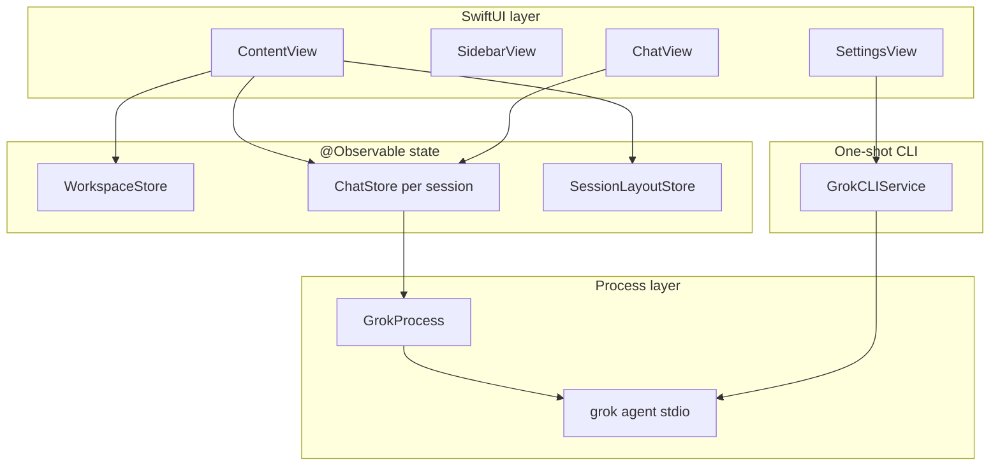
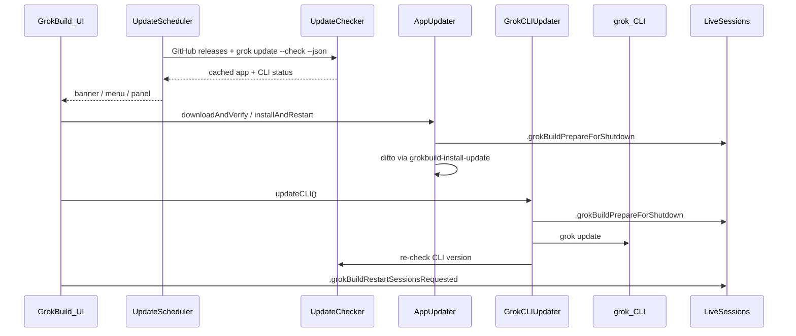

# GrokBuild — architecture reference

**Read this first in every new chat.** This document is the canonical map of how GrokBuild works. `AGENTS.md` points here; `.cursor/rules/` add file-specific conventions.

---

## Table of contents

1. [What GrokBuild is](#what-grokbuild-is)
2. [Design rules for agents](#design-rules-for-agents)
3. [Repository layout](#repository-layout)
4. [App lifecycle & shell](#app-lifecycle--shell)
5. [Runtime architecture](#runtime-architecture)
6. [GrokProcess & ACP](#grokprocess--acp)
7. [ChatStore](#chatstore)
8. [Multi-session model](#multi-session-model-contentview)
9. [Workspaces & projects](#workspaces--projects)
10. [Persistence](#persistence-userdefaults)
11. [Feature subsystems](#feature-subsystems)
12. [Settings system](#settings-system)
13. [In-app updates](#in-app-updates)
14. [UI layout & panels](#ui-layout--panels)
15. [Notifications](#notifications)
16. [Git integration](#git-integration)
17. [Build, test & release](#build-test--release)
18. [Common tasks → files](#common-tasks--files)
19. [Tests](#tests)
20. [Anti-patterns](#anti-patterns)
21. [Related docs](#related-docs)

---

## What GrokBuild is

GrokBuild is a **windowed macOS app** (SwiftUI + AppKit) that is a **UI shell over the `grok` CLI**. It spawns `grok agent stdio` per chat session and speaks **ACP (Agent Client Protocol)** JSON-RPC over stdin/stdout.

| GrokBuild owns | `grok` CLI owns (do NOT reimplement in Swift) |
|----------------|-----------------------------------------------|
| Windows, sidebar, composer, settings panes | ACP session lifecycle, tool execution |
| Multi-tab sessions, LRU process cap | MCP server wiring at runtime (GrokBuild only *injects* configs) |
| Per-tab model, per-project effort, layout persistence | Skills, hooks, plugins, plan mode, subagents |
| Browser/Computer Use **enablement** + bundled skills | Agent reasoning, permissions policy enforcement |
| In-app updates (app + CLI) | `grok update`, auth (`grok login`) |

**Platform:** macOS 26+. **Version:** `VERSION` → `AppVersion.display`. **Build:** SwiftPM only — no Xcode project; use `make` / `swift build`.

---

## Design rules for agents

1. **Stay thin** — UI and local state only; wrap the CLI, don't replace it.
2. **Reuse services** — extend `GrokProcess`, `GrokCLIService`, `ChatStore`, `WorkspaceStore`, `SessionLayoutStore`, and feature services below.
3. **Match conventions** — read surrounding code before editing; minimize diff scope.
4. **Draft vs applied settings** — settings panes edit *draft* keys; live Grok sessions use *applied* keys (see [Settings system](#settings-system)).
5. **Post notifications** — auth/process changes → `.grokStatusChanged`; session title changes → `.liveSessionMessagesChanged`.
6. **Docs + tests with every code change** — run `make test`, add/extend `Tests/GrokBuildTests/`, update this file and other relevant docs in the same session (`.cursor/rules/docs-and-tests.mdc`).
7. **Commit only when asked** — user rule in this repo.

---

## Repository layout

```
grok-deck2/
├── GrokBuild/                    # Main app target (SwiftUI + AppKit)
│   ├── main.swift                # NSApplication entry (NOT GrokBuildApp.swift)
│   ├── AppDelegate.swift         # Single instance, main window, menus
│   ├── MainWindowLayout.swift    # Main window min/default size + composer max width
│   ├── AppTheme.swift            # Neutral graphite palette, typography, radii, shared surface modifier
│   ├── ContentView.swift         # Root view: multi-session orchestration
│   ├── Views/                    # SwiftUI screens (SettingsView is large)
│   ├── Services/                 # Business logic, CLI integration
│   ├── Models/                   # Workspace, Message, Composer types
│   ├── Resources/
│   │   ├── Assets.xcassets/      # Brand mark, app icon
│   │   └── Skills/               # Bundled grok skills (copied at build)
│   ├── AboutPanel.swift          # AppKit About panel
│   └── UpdatePanel.swift         # AppKit Updates panel
├── GrokBuildComputerUseMCP/      # Separate SPM target: stdio MCP bridge → agent-desktop
├── Tests/GrokBuildTests/         # Unit/integration tests
├── scripts/                      # build-macos-app.sh, release.sh, notarize.sh, install-update
├── Package.swift                 # SPM manifest (macOS 26+)
├── VERSION                       # App version source
├── Makefile                      # make run | test | app | release
├── AGENTS.md                     # Agent entry (points here)
└── BUILDING.md                   # Signing, notarization, CI
```

**Excluded from build:** `GrokBuild/GrokBuildApp.swift` (legacy `@main` — do not use).

---

## App lifecycle & shell

### Entry point

`main.swift` → `AppDelegate.applicationDidFinishLaunching`:

1. **Single instance** — advisory `flock` on `~/Library/Application Support/GrokBuild/instance.pid`. Second launch posts `com.grokbuild.showMainWindow` and exits.
2. **Activation policy** — `.regular` (Dock icon + standard application menus).
3. **Application menu** — `AppDelegate.setupMainMenu()` owns About, Settings, update checks, Project, Session, and Window commands. GrokBuild does not create an `NSStatusItem`.
4. **Update scheduler** — `UpdateScheduler.start()` (background checks).
5. **Main window** — `openMainWindow()` hosts `ContentView` in `NSHostingController`.

### Window behavior

- **Close button** hides the window (`orderOut`), does not quit (`applicationShouldTerminateAfterLastWindowClosed` → false).
- **Reopen** (Dock click) → `applicationShouldHandleReopen` → show main window.
- Frame autosave name: `"MainWindow"`.

### Application menus

| Menu | Location | Purpose |
|------|----------|---------|
| **GrokBuild** | `AppDelegate.setupMainMenu()` | About, Settings ⌘,, update checks, Hide ⌘H, Quit |
| **Edit** | `AppDelegate.setupMainMenu()` | Standard text editing commands |
| **Project** | `AppDelegate.setupMainMenu()` | Add Project |
| **Session** | `AppDelegate.setupMainMenu()` | New Session, Browse Sessions, Stop Generation, Focus Input |
| **Window** | `AppDelegate.setupMainMenu()` | Minimize, Zoom |

Commands that need SwiftUI post notifications (for example `.newSessionRequested` and `.openSettingsRequested`) that `ContentView` handles. DEBUG builds add **GrokBuild → Simulate Updates** after the update item.

---

## Runtime architecture



### Request path (send a message)

1. User types in `ChatView` → `ChatStore.send(_:)`.
2. `ChatStore` ensures workspace selected and `GrokProcess` is `.ready` (restarts if needed).
3. Appends user `Message`, creates empty assistant `Message`, sets `isStreaming`.
4. `GrokProcess.send(prompt)` → ACP `session/prompt` JSON-RPC on stdin.
5. `GrokProcess` reader parses stdout → `AcpEvent` stream.
6. `ChatStore.consumeOutput()` maps events → message text, tool cards, permissions, thinking blocks.
7. On completion → `isStreaming = false`, posts `.liveSessionMessagesChanged` (also on user send), `.grokStatusChanged`.

### CLI discovery (shared)

`GrokProcess.locateGrokCLI()` and `GrokCLIService.locateGrokCLI()` search in order:

1. `GROK_CLI_PATH` environment variable
2. `~/.grok/bin/grok`
3. Homebrew paths
4. `PATH`

User must run `grok login` for authenticated sessions. Auth failures surface inside the active session through `ChatStore.authRequiredMessage`; no launch-time credential guess is shown in app chrome.

---

## GrokProcess & ACP

**File:** `Services/GrokProcess.swift`

`GrokProcess` is the long-running **ACP client**. One instance per `ChatStore`.

### Process states (`GrokProcessState`)

| State | Meaning |
|-------|---------|
| `.idle` | No process |
| `.starting` | Launching CLI, ACP handshake in progress |
| `.ready` | Session created/loaded, can accept prompts |
| `.busy` | Turn in progress |
| `.failed(String)` | Startup or fatal error; check `needsAuthentication` |

### Launch command shape

```
grok [--no-memory] [--permission-mode X] [--sandbox X] [--allow RULE] … \
     agent [--reasoning-effort X] [--model M] stdio
```

Built from `GrokLaunchOptions` in `ChatStore.restartProcess`. Working directory = **workspace path**.

### ACP lifecycle

1. `start(workspace:options:)` — spawn process, `initializeACP()` (JSON-RPC handshake).
2. `createSession(workspace:mcpServers:)` **or** `loadSession(id:…)` if resuming. When `session/load` fails with `FS_NOT_FOUND` / “Path not found” (stale on-disk grok session), GrokBuild falls back to `session/new`, sets `sessionLoadStartedFreshFallback`, and `ChatStore` adds a system note — local transcript is preserved. During load, the CLI replays prior turn history via `session/update` with `_meta.isReplay: true`; `GrokProcess` skips routing those to `ChatStore` (still applies `contextUsage` / `totalTokens`) so resume does not re-drive live tool/thinking UI.
3. MCP servers from `MCPServerConfig` passed in `session/new` (browser, computer use when enabled).
4. `send(_:)` — prompt during `.ready`/`.busy`.
5. `stop()` — tear down process (LRU cap, settings reload, app shutdown).

### ACP events (`AcpEvent`)

Consumed by `ChatStore.consumeOutput()`:

| Event | UI effect |
|-------|-----------|
| `.messageChunk` | Append to streaming assistant message |
| `.thoughtChunk` | Thinking panel text |
| `.toolCall` / `.toolCallUpdate` | Live tool call cards |
| `.permissionRequest` | Permission dialog in chat |
| `.exitPlanRequest` | Plan mode approval UI |
| `.questionRequest` | Ask-user question UI |
| `.modeChanged` | Agent / Plan / Yolo selector |
| `.contextUsage` | Token usage indicator |
| `.availableCommands` | Slash command autocomplete |
| `.schedulerActivity` | Update the scheduled-tasks mirror (`ChatStore.scheduledTasks`) |
| `.error` | Error banner |

### Agent modes

`AgentMode`: `.agent`, `.plan`, `.yolo` — synced from process to `ChatStore.currentMode`.

### Model switching

`session/set_model` RPC. Failures set `modelSwitchError` / `modelSwitchNeedsNewSession` on both `GrokProcess` and `ChatStore`.

---

## ChatStore

**File:** `Services/ChatStore.swift` — `@Observable @MainActor`

One `ChatStore` per live session tab. Owns a `GrokProcess`.

### Key published state

| Property | Purpose |
|----------|---------|
| `messages` | Chat history (`Message` model) |
| `connectionState` | Mirrors `GrokProcess.state` |
| `isStreaming` / `isGrokking` | Turn in progress |
| `currentModel` / `availableModels` | Model picker (from ACP + custom models) |
| `currentMode` | agent / plan / yolo |
| `pendingPermissions` | Tool permission prompts |
| `pendingExitPlan` / `pendingQuestions` | Plan / ask-user flows |
| `fileAttachments` | Composer chips; hidden chips are excluded from the prompt |
| `composerDraft` | Unsent composer text for this tab (in-memory; survives tab switch + LRU eviction) |
| `authRequiredMessage` | Login banner text |
| `grokSessionId` | `process.sessionId` — persisted for resume |

### Lifecycle methods

| Method | When |
|--------|------|
| `prepare(workspace:)` | Lazy restore — set workspace, no process spawn |
| `start(workspace:resumeSession:)` | Full start + optional resume |
| `restartProcess(resumeSessionID:)` | Build `GrokLaunchOptions`, spawn process, inject MCP |
| `reloadConfiguration()` | Settings changed — restart with new MCP/env |
| `startNewSession()` | Fresh grok session (same project) |
| `resumeSession(_:)` | Load existing grok session id |
| `shutdown()` | Stop process (app update / prepare for shutdown) |
| `retryConnection()` | Restart after CLI update |
| `send(_:)` | User message → ACP prompt (attachments become plain paths under `Attached file(s):`, not `@` reads) |

### `restartProcess` — what gets injected

On every (re)start, `ChatStore`:

1. Loads **permission settings** from `GrokSettingsKeys` (UserDefaults).
2. Loads **applied** browser + computer use settings.
3. Installs bundled **skills** to `~/.grok/skills/` if features enabled.
4. Starts external browser if browser tools enabled (CDP mode).
5. Builds MCP list:
   - `AgentBrowserService.browserMCPConfig(settings:)` → `grokbuild-browser`
   - `ComputerUseService.computerUseMCPConfig(settings:)` → `grokbuild-computer-use`
6. Resolves the **session agent** via `GrokAgentProfiles.launchArgument(for:)` → `GrokLaunchOptions.agent` (`--agent`).
7. Passes model from the **active tab** (`SavedSessionRecord.model`), with grok-session and project-default fallbacks.

### Per-tab model + per-project reasoning effort

**Model** is **per session tab** (`SavedSessionRecord.model` in `GrokBuild.sessionLayout.v2`), matching grok's per-ACP-session `session/set_model`. Changing model in the composer updates only the active tab and posts `.liveSessionModelChanged` → `persistSessionLayout()`. Tab switch calls `bindTabSession` + `syncTabModelToLiveProcessIfNeeded()` — it does **not** overwrite from sibling tabs, and a missing saved model is ignored so workspace/app fallbacks still apply.

**Project default model** (`WorkspaceAgentSettings.model`) seeds **new** tabs only (and legacy tabs without a saved per-tab model). It is **not** updated when you change model in chat.

**Session agent** is also **per session tab** (`SavedSessionRecord.agent`). Each tab launches with its own `--agent` (`ChatStore.effectiveAgentSelection`): an explicit per-tab override when set, otherwise the global default `grokbuild.selectedAgent` (Settings → Agents). The chat status bar shows an **agent pill** (`ChatView.agentStatusPill`) whose menu lists the built-in Default option (`GrokAgentProfiles.builtInOptions`) plus agents discovered for the workspace; picking one calls `ChatStore.setSessionAgent` → **restarts that tab's grok** (agents can only change at launch) and posts `.liveSessionAgentChanged` → `persistSessionLayout()`. A tab that has not been overridden follows the global default live (so changing the default and restarting adopts it); overridden tabs keep their choice. Only overridden tabs persist a value (`ChatStore.persistedAgentSelection`).

**Reasoning effort** stays **per project** (`WorkspaceAgentSettings.reasoningEffort`):

- Loaded via `loadWorkspaceReasoningEffort()` on prepare/start; tab switch syncs effort only via `syncWorkspaceReasoningEffortFromStorage()`
- `restartProcess` reads `workspaceReasoningEffort` for `--reasoning-effort` (never the global key directly)
- The global `grokbuild.reasoningEffort` (Settings → Permissions → "Default reasoning effort") is only a **seed for new/untouched projects**: `ChatStore.resolveReasoningEffort(saved:globalDefault:)` = saved per-project value (incl. explicit "Default") if present, else the global default. Do not add a second effort editor elsewhere — the Models pane no longer has one.

### Session selection persistence

`grokbuild.sessionSelections.v1` — per **grok session id**: saved mode + model backup when resuming by grok id (e.g. Sessions browser).

---

## Multi-session model (`ContentView`)

**File:** `ContentView.swift` — root orchestrator.

### Core types

```swift
ContentView.LiveSession {
    id: UUID              // Stable tab id (persisted)
    store: ChatStore      // One GrokProcess inside
    workspace: Workspace
    title: String         // Sidebar label
    grokSessionID: String? // For lazy resume after LRU teardown
}
```

### LRU connection cap

| Constant | Value | Behavior |
|----------|-------|----------|
| `maxConnectedSessions` | 4 | Max live `grok agent stdio` processes |
| `recentSessionOrder` | MRU list | Drives eviction |

**Lazy restore at launch:** `restorePersistedSessions()` rebuilds `LiveSession` shells (titles, grok ids, disk transcripts) but only **starts the selected session's process**. Others resume on first `selectSession` via `ensureSessionStarted`. Launch selection uses `SessionRestorePolicy`: prefer the saved `selectedSessionID` when it has a **restorable transcript** (in-memory or `SessionMessageStore` user/assistant rows — stale-fallback system notes alone do not count); otherwise pick the MRU tab in that workspace with a transcript, then fall back to grok-id-only tabs. `recentSessionOrder` is rebuilt from saved `lastAccessed` timestamps at launch. Resumed sessions with no local transcript yet skip the project welcome screen (`ChatStore.isResumedSessionTab`). Stale grok session ids fall back to `session/new` with a system note (`GrokSessionLoadError`); wording reflects whether a local transcript was preserved.

**Transcript auto-repair:** When a tab's `SessionMessageStore` transcript is empty (or has no user/assistant rows) but the tab still has a `grokSessionID`, `SessionTranscriptRecovery` reads grok's on-disk `~/.grok/sessions/{encoded-cwd}/{grokSessionID}/chat_history.jsonl` via `GrokSessionTranscriptImporter` and persists imported user/assistant text. `encodeWorkspacePath` matches grok's layout: `%2FUsers%2F…%2Fproject` with **no** trailing `%2F`. Runs during `restorePersistedSessions` / `selectSession` (`ChatStore.restorePersistedMessages(for:grokSessionID:workspace:)`). Skips synthetic `<system-reminder>`-only rows and non-text session-update types. Stale-fallback-only tabs are not treated as restorable transcripts.

**Eviction:** `enforceConnectionCap()` stops processes for sessions beyond MRU cap (keeps selected + busy sessions).

### Session persistence flow

```
selectSession / send / close
    → persistSessionLayout()
    → SessionLayoutStore.saveSessions(SessionLayoutSnapshot)
```

`SavedSessionRecord`: `id`, `workspaceID`, `grokSessionID`, `title`, `model`, `lastAccessed`.

Sidebar shows max `SessionLayoutStore.maxSidebarSessions` (10) per project; older sessions in **Browse Sessions**.

### Active store routing

| Selection | Chat UI binds to |
|-----------|------------------|
| Session selected | `activeStore` = that session's `ChatStore` |
| No session | `placeholderStore` (empty state) |

### Bootstrap sequence

```
.onAppear → bootstrap() → restorePersistedSessions()
    → rebuild LiveSession array from disk (+ SessionMessageStore transcripts)
    → rebuild recentSessionOrder from lastAccessed
    → SessionRestorePolicy.restoreSelectedSessionID
    → selectSession (reloads transcript if needed)
    → ensureSessionStarted (spawn process if grokSessionID set)
```

---

## Workspaces & projects

**File:** `Services/WorkspaceStore.swift`, `Models/Workspace.swift`

A **workspace** = one folder on disk (`Workspace.path`). Multiple sessions can belong to one workspace.

| Operation | Method |
|-----------|--------|
| Add project | `WorkspaceStore.add` — dedupes by resolved path |
| Remove | `WorkspaceStore.remove` — also clears agent settings |
| Pin / reorder | `pin` / `unpin` / `moveWorkspaces` → `SessionLayoutStore` workspace layout |
| Pick folder | `WorkspacePicker` sheet |

Display name: `workspace.displayName` (custom `name` or folder basename).

---

## Persistence (UserDefaults)

**Domain:** `~/Library/Preferences/com.grokbuild.app.plist` (standard UserDefaults).

Do **not** commit exported plist files from repo root (`.gitignore`).

### Keys reference

| Key | Store | Contents |
|-----|-------|----------|
| `GrokBuild.projects.v1` | `WorkspaceStore` | `[Workspace]` JSON |
| `GrokBuild.sessionLayout.v2` | `SessionLayoutStore` | Session records, order, selection, expanded/hidden |
| `GrokBuild.sessionMessages.v1` | `SessionMessageStore` | Per live-session-tab chat transcript (`[Message]` JSON by session UUID); saved on `.liveSessionMessagesChanged` (user send + turn complete) and during full `persistSessionLayout(saveMessages: true)` passes such as app quit via `.grokBuildPrepareForShutdown` |
| `GrokBuild.workspaceLayout.v1` | `SessionLayoutStore` | Pin order, workspace order, **`agentSettingsByWorkspace`** |
| `grokbuild.sessionSelections.v1` | `ChatStore` | Per grok session id: mode |
| `grokbuild.permissionMode` | `GrokSettingsKeys` | CLI permission mode |
| `grokbuild.sandboxProfile` | | Sandbox profile string |
| `grokbuild.reasoningEffort` | | Default reasoning effort (settings UI) |
| `grokbuild.noMemory` | | Legacy `--no-memory` flag key (superseded by `grokbuild.memoryEnabled`; no longer written by the UI) |
| `grokbuild.memoryEnabled` | `GrokSettingsKeys` | Cross-session memory toggle (Settings → **Memory**). `true` → `--experimental-memory`, `false` → `--no-memory`. Default off |
| `grokbuild.disableWebSearch` | | `--disable-web-search` |
| `grokbuild.noSubagents` | | `--no-subagents` |
| `grokbuild.allowRules` / `denyRules` | | Newline-separated `--allow` / `--deny` rules |
| `grokbuild.selectedAgent` | `GrokSettingsKeys` | **Default** session agent for **new** tabs (empty = grok default; otherwise a discovered agent name). Per-tab overrides live in `SavedSessionRecord.agent`. |
| `grokbuild.browser.*` | `BrowserSettingsStore` | Draft browser settings (agent-browser CLI: runtime mode, CDP URL, profile, external app) |
| `grokbuild.browser.applied.*` | | **Applied** settings used at process start |
| `grokbuild.computerUse.*` | `ComputerUseSettingsStore` | Draft computer use settings |
| `grokbuild.computerUse.applied.*` | | **Applied** settings used at process start |
| `grokbuild.customModelProviders` | `ProviderStore` | Reusable custom model providers (UserDefaults) |
| `grokbuild.updates.autoCheckEnabled` | `UpdateSettingsStore` | Background update checks |
| `grokbuild.updates.dismissedVersion` | | Skipped GrokBuild version |
| `grokbuild.updates.dismissedCLIVersion` | | Skipped grok CLI version |
| `grokbuild.updates.lastCheckDate` | | Last check timestamp |

### External files (not UserDefaults)

| Path | Purpose |
|------|---------|
| `~/.grok/config.toml` | Custom model tables plus `[models].default`; GrokBuild-owned `grokbuild_*` model metadata keys; custom subagent roles (`[subagents.roles.*]`) |
| `~/.grok/prompts/<name>.md` | Instruction bodies for custom subagent roles (referenced by `prompt_file`) |
| `~/.grok/skills/` | Installed skills (bundled skills copied by installers) |
| `~/.grokbuild/computer-use/` | Cursor MCP helper binaries |
| `~/Library/Application Support/GrokBuild/Updates/` | Downloaded app update zips |
| `~/Library/Application Support/GrokBuild/instance.pid` | Single-instance lock |

---

## Feature subsystems

### Browser control

| Piece | Location |
|-------|----------|
| Settings | `SettingsView` → `.browser` tab; keys in `BrowserSettings.swift` |
| Service | `AgentBrowserService.swift` — agent-browser CLI, CDP, external browser launch |
| MCP | Name: `grokbuild-browser`; config from `browserMCPConfig` |
| Skill | `Resources/Skills/grokbuild-browser-control/` + `grokbuild-grok-web/` → `BrowserSkillInstaller` (installs both when browser tools enabled) |
| Presets | `BrowserPreset` (e.g. `.grokCom`) — one-click runtime/session-name setup in `BrowserSettings.swift`, applied from the Browser pane |
| Chat UI | Status pill in `ChatView` (composer chrome). Menu offers on/off toggle, **runtime choice** (managed ↔ existing Chromium), and Open Browser Settings |

**Backend:** the bundled `agent-browser` CLI exposed to grok as an stdio MCP server (`grokbuild-browser`). Managed Chromium vs external browser (Chrome/Brave/Edge/Arc) via CDP URL.

**agent-browser tools (via MCP):** `browser_open_url`, `browser_snapshot`, `browser_click_ref`, etc.

**grok.com web:** drive grok.com via browser tools to reach web-only features (Imagine, skills, connectors), then continue locally with Computer Use — see `grokbuild-grok-web` skill.

### Agents

| Piece | Location |
|-------|----------|
| Default (new sessions) | `SettingsView` → `.agents` tab (viewer + "Default agent for new sessions" picker → `grokbuild.selectedAgent`) |
| Per-session override | `ChatView.agentStatusPill` → `ChatStore.setSessionAgent` (persisted in `SavedSessionRecord.agent`) |
| Discovery | `GrokCLIService.listAgents(cwd:)` → `GrokAgentInfo` (parses `agents` from `grok inspect --json`); loaded lazily by `ChatStore.loadDiscoveredAgentsIfNeeded` for the pill |
| Built-in options | `GrokAgentProfiles.builtInOptions` (Default only) — shared by Settings + pill |
| Selection → launch | `ChatStore.effectiveAgentSelection` → `GrokAgentProfiles.launchArgument(for:)` → `--agent` |
| **Custom subagents (roles)** | `SettingsView` → `.agents` tab "Custom subagents" section (`SubagentRoleEditor`) → `SubagentRoleStore` writes `[subagents.roles.*]` in `~/.grok/config.toml` + prompt files |

The app stays thin: grok owns agents/personas. GrokBuild surfaces discovered agents and lets the user pick one by name; `""` = grok's default agent (no `--agent`). Agent is **per session tab** (see *Per-tab model + session agent*): the global setting is the default for **new** sessions; each open session can override it from the status-bar pill, which restarts that session's grok.

**Custom subagents (roles).** grok owns subagent orchestration (the main agent delegates to subagents that run in parallel, gated by `--no-subagents`). GrokBuild adds a thin CRUD editor for **roles** — `[subagents.roles.<name>]` tables in `~/.grok/config.toml` with `model` (empty = inherit the parent session's model) and a `prompt_file`. `SubagentRole` + `SubagentRoleStore` (`CustomModelSettings.swift`) mirror `CustomModelStore`: minimal targeted TOML edits that preserve every other section and unmanaged role keys (for example `default_capability_mode`), plus the role's instruction written to `~/.grok/prompts/<name>.md`. Relative `prompt_file` values are resolved from the user's home directory to match grok's documented `.grok/prompts/...` examples. Names matching grok's built-in subagents (`general`, `general-purpose`, `explore`, `plan`, `vision`, `verify`, `computer`) are rejected. Roles are a *separate* concept from the read-only discovered agents list (`grok inspect --json` does not report roles), but custom role names are offered under **Run as custom role** in the Settings default-agent picker and the chat agent pill menu; choosing one there runs the whole session as that role rather than spawning a child subagent. grok's `/agents` TUI manager is a pager builtin not exposed over `grok agent stdio`, so editing the config file is how GrokBuild manages them.

### Scheduled tasks

grok owns scheduling (`scheduler_create` / `scheduler_list` / `scheduler_delete`, surfaced to users via the `/loop` slash command). GrokBuild does **not** call these tools directly — the ACP surface is prompt-only — so it **mirrors** them by observing tool-call activity.

| Piece | Location |
|-------|----------|
| Model + parsing | `ScheduledTaskStore.swift` — `ScheduledTask`, `SchedulerToolParsing` (detect/parse scheduler `session/update` payloads), `ScheduledTaskTracker` (accumulates list, correlating `tool_call` rawInput with completing `tool_call_update` rawOutput) |
| ACP event | `GrokProcess` yields `AcpEvent.schedulerActivity(payload:)` for any `tool_call`/`tool_call_update` whose `_meta."x.ai/tool".name` starts `scheduler_` (or rawOutput `type` starts `scheduler`) |
| Store | `ChatStore.scheduledTasks` (updated from `schedulerActivity`); actions `refreshScheduledTasks()` (drives `scheduler_list`), `createScheduledTask(interval:prompt:)` (sends `/loop`), `cancelScheduledTask(_:)` (drives `scheduler_delete`) — all via prompts, so they cost a turn |
| Chat UI | `ChatView.tasksStatusPill` — lists tasks (interval + prompt + next fire), Cancel per task, Refresh Tasks |

`scheduler_list` output is authoritative (replaces the mirror); create/delete update it incrementally. It only reflects activity seen in the live session — tasks made in the grok TUI or another session appear after a refresh. Schedules fire only while the session's grok process is alive (LRU-capped).

**Wire caveats (verified live, grok 0.2.93):** the completing `tool_call_update` carries `rawOutput` but no `_meta`, and `rawOutput.type` is CamelCase (`SchedulerList`), so detection matches `_meta` name **or** a case-insensitive `rawOutput.type` prefix. The `/loop` slash command is handled by the CLI and emits **no** scheduler tool call, so the pill updates on **Refresh** (or when grok schedules via its tool, e.g. natural-language requests).

### Background tasks (richer Tasks pill)

Extends the Tasks pill beyond scheduled `/loop` tasks to mirror background shells, monitors, and subagents observed via ACP.

| Piece | Location |
|-------|----------|
| Model + parsing | `BackgroundTaskStore.swift` — `BackgroundActivity`, `BackgroundToolParsing`, `BackgroundTaskTracker` |
| ACP event | `GrokProcess` yields `AcpEvent.backgroundActivity(payload:)` for `run_terminal_command` (when `background` in rawInput), `monitor`, `spawn_subagent`, `kill_command_or_subagent`, `get_command_or_subagent_output`, plus scheduler tools |
| Store | `ChatStore.backgroundActivities` (also keeps `scheduledTasks` in sync) |
| Chat UI | `ChatView.tasksStatusPill` — sections: Scheduled, Background commands, Monitors, Subagents |

### Rhai workflows (distinct from skill chips)

grok's **Rhai workflow engine** (`.grok/workflows/`, `/workflow`, `/workflows`) is separate from **skill slash commands** (`/design`, `/review`, …) shown as composer chips.

| Piece | Location |
|-------|----------|
| Config toggle | `WorkflowsConfigStore` — `[workflows] enabled` in `~/.grok/config.toml` (shared with grok TUI); `SettingsView` → `.workflows` (`WorkflowsSettingsPane`); posts `.workflowsConfigChanged` |
| Runs mirror | `WorkflowRunStore.swift`, `ChatStore.workflowRuns`, `AcpEvent.workflowActivity` |
| Saved scripts | `SavedWorkflowStore.swift`, `SavedWorkflowsPanel.swift` |
| Chat UI | `ChatView.workflowsStatusPill` — runs, saved workflows, deep research, Open Workflow Settings |

### Session goals (`/goal`)

| Piece | Location |
|-------|----------|
| Parsing | `ComposerModels.GoalCommand` — supports `--budget N` on set |
| State | `ChatStore.goalState` (`SessionGoalState` with optional `budget`) |
| UI | `GoalBanner`, `SetGoalSheet` in `ComposerViews.swift`; top-bar session menu |

### Fork session

| Piece | Location |
|-------|----------|
| Launch | `GrokLaunchOptions.forkSession` + `newSessionID` → `--fork-session` / `--session-id` |
| Store | `ChatStore.startForked(workspace:fromSessionID:)` |
| UI | `ContentView.forkCurrentSession()` → new tab; `ChatView` session menu **Fork session** |

### Prompt queue

While `ChatStore.isStreaming`, composer sends enqueue to `ChatStore.promptQueue`; drained automatically on turn complete. Badge + menu in `ChatView` composer (`Send now` / `Remove`). `sendQueuedPromptNow` refuses while streaming and re-inserts the prompt if deliver fails so queued work is not dropped.

### `/btw` aside

Sending `/btw` sets `pendingBtw`; the next assistant reply is captured in `ChatStore.btwAsideText` and shown via `BtwAsideBanner`.

### Session dashboard

`SessionDashboardPanel.swift` — groups live tabs by needs-input / working / idle / failed. Opened from chat top bar; `ContentView` owns `dashboardEntries`.

### Share session

When `/share` is advertised: session menu → `ChatStore.shareSession()`; URL parsed from assistant reply (`ShareURLParser`) and copied to pasteboard. `pendingShareURLCapture` is cleared if send fails (including async process send failure) so a later unrelated URL is not captured.

### Create skill / Imagine

When advertised: session menu **Create skill…** sheet → `/create-skill`; `ImagineSlashCommands` chips + sheet → `/imagine`.

### Compatibility layers

| Piece | Location |
|-------|----------|
| Config | `CompatConfigStore` — `[compat.cursor|claude|codex] enabled` in config.toml |
| Discovery | `GrokCLIService.listExternalCompat()` from `grok inspect --json` |
| UI | `SettingsView` → `.compatibility` (`CompatibilitySettingsPane`) |

### Memory (cross-session)

grok owns memory storage, indexing, search, and first-turn injection ([`13-memory.md`](https://docs.x.ai/build/features/memory)). GrokBuild stays thin: it flips the launch flag, browses the files read-only, and appends "Remember" notes.

| Piece | Location |
|-------|----------|
| Toggle | `SettingsView` → `.memory` tab (`MemorySettingsPane`), key `grokbuild.memoryEnabled` |
| Launch flag | `GrokLaunchOptions.experimentalMemory`; `GrokMemoryFlag.argument(noMemory:experimentalMemory:)` resolves the single flag; `ChatStore.restartProcess` sets `experimentalMemory: memoryEnabled`, `noMemory: !memoryEnabled` |
| Files | `MemoryStore.swift` — enumerate `~/.grok/memory/` (global `MEMORY.md`, `<slug-hash>/MEMORY.md`, `<slug-hash>/sessions/*.md` newest-first); `readContents`, `deleteSessionFile` (session-only guard), `appendGlobalNote` (+ pure `appendingNote`), `revealInFinder` |
| Browser UI | `MemoryBrowserPanel.swift` — grouped list + read-only preview; copy path / reveal / delete session log (with confirm) |
| Chat UI | `ChatView.memoryStatusPill` — **shown only while memory is enabled** (hidden when off; label is just "Memory"): Browse Memory Files…, Remember… (writes global note via `ChatStore.remember`), Open Memory Settings |

**Enable/disable is a launch flag, app-scoped** (not `config.toml`), so the grok TUI is unaffected. `--no-memory` has absolute priority in grok, so the app never emits both flags.

**ACP limitation (verified live, grok 0.2.93):** enabling memory registers the read tools `memory_search`/`memory_get` and automatic first-turn recall, but `/remember`, `/flush`, `/dream`, `/memory` are **TUI pager builtins** and are **not** exposed over `grok agent stdio`. So the app writes "Remember" notes by appending directly to global `MEMORY.md` (grok's file watcher reindexes them); flush/dream run **automatically** (session end / pre-compaction / dream gates) or in the grok TUI — the app does not surface buttons for them.

### Computer Use

| Piece | Location |
|-------|----------|
| Settings | `SettingsView` → `.computerUse` tab; keys in `ComputerUseSettings.swift` |
| Service | `ComputerUseService.swift` — agent-desktop discovery, permissions probe |
| MCP helper | **`GrokBuildComputerUseMCP/`** separate SPM executable (stdio MCP → `agent-desktop`) |
| MCP name | `grokbuild-computer-use` |
| Skill | `Resources/Skills/grokbuild-computer-use/` |
| Cursor bridge | `ComputerUseCursorInstaller` — copies helper, merges `~/.cursor/mcp.json` |

**Tools:** `computer_snapshot`, `computer_click`, `computer_type`, `computer_screenshot`, etc.

**Permissions:** macOS Accessibility; merged status from GrokBuild, helper, agent-desktop, CLI.

### Custom models

| Piece | Location |
|-------|----------|
| Settings | `SettingsView` → `.models`; `CustomModelStore`, `CustomModelSettings` |
| Persistence | Providers in UserDefaults; model entries written to **`~/.grok/config.toml`** |
| Metadata | GrokBuild-owned TOML keys (`grokbuild_context_tokens`, `grokbuild_supports_*`) drive UI hints only |
| Chat | Merged into `ChatStore.availableModels` via `mergeCustomModels()` |
| Cline Pass | Same **Fetch models** button as other providers (required before Add model); live list from `https://api.cline.bot/api/v1/ai/cline/recommended-models` (`clinePass` array, no API key) via `ProviderModelFetcher.fetchClinePassRecommended`. Picker lists models **alphabetically** by slug-derived display name. No hardcoded model table |

OpenAI-compatible provider URLs; not a replacement for grok-native models. Custom model metadata is a UI fallback: ACP-reported model names/context limits stay authoritative when the CLI provides them. Reasoning-effort support is **opt-out** — `grokbuild_supports_reasoning_effort` defaults to `true` for new models and for existing config.toml entries missing the key, so the effort control keeps showing until the user disables it. Models explicitly marked as not supporting reasoning effort do not receive `--reasoning-effort` at launch, and the composer hides the effort picker for them.

### Bundled desktop skill

`Resources/Skills/grokbuild-desktop/` — hints for agents working on GrokBuild itself (copied at build, not auto-installed).

### MCP config shape

`MCPServerConfig` → JSON for ACP `session/new`. Supports stdio (command + args + env) and http/sse transports.

---

## Settings system

**File:** `Views/SettingsView.swift` (large — search `SettingsTab`, pane struct names).

### Navigation (`SettingsTab` + `SettingsSection`)

Ordered config-first (session config → capabilities → grok ecosystem/inspection → app). `.agents` is the default landing tab (generic Settings gear + initial state; `.app` when an update is pending).

The settings chrome uses a persistent grouped **vertical sidebar** (`SettingsView.settingsSidebar`) rather than a horizontal tab strip. `SettingsSection` organizes the fourteen destinations into Intelligence, Tools, Extensions, Safety & System, and Application groups. Visited panes stay mounted in a `ZStack` (`SettingsTabKeepAlive`) so `@State` / `.task` are not reset when switching destinations.

| Tab | Pane | Data source |
|-----|------|-------------|
| `.agents` | Discovered agents + **default** session-agent picker (new sessions) + **custom subagent roles** CRUD | `listAgents`, `grokbuild.selectedAgent`, `SubagentRoleStore` |
| `.models` | Custom providers | `CustomModelStore` |
| `.permissions` | Session safety toggles | `GrokSettingsKeys` |
| `.memory` | Cross-session memory toggle + browser | `grokbuild.memoryEnabled`, `MemoryStore` |
| `.workflows` | Rhai workflows enable toggle | `WorkflowsConfigStore` → `[workflows] enabled` in config.toml |
| `.browser` | Browser tools | `BrowserSettingsStore` draft keys |
| `.computerUse` | Desktop automation | `ComputerUseSettingsStore` draft keys |
| `.mcpServers` | External MCP + health | `listMCPServers` |
| `.skills` | Discovered skills | `listSkills` |
| `.plugins` | Installed plugins | `listPlugins` |
| `.marketplace` | Marketplace sources + install | `listPlugins(includeAvailable:)`, `listAvailablePlugins` |
| `.compatibility` | Cursor/Claude/Codex compat toggles | `CompatConfigStore`, `listExternalCompat` |
| `.hooks` | Hooks list | `GrokCLIService.listHooks` |
| `.app` | App + CLI updates | `UpdateScheduler`, `UpdateSettingsStore` |

### Draft vs applied pattern

| Feature | Draft keys | Applied keys | When applied |
|---------|------------|--------------|--------------|
| Browser | `grokbuild.browser.*` | `grokbuild.browser.applied.*` | **Enable toggle** applies immediately; other fields via **Apply and Restart** |
| Computer Use | `grokbuild.computerUse.*` | `grokbuild.computerUse.applied.*` | Same pattern |

**Live Grok sessions read applied settings only** in `ChatStore.restartProcess` → `BrowserSettingsStore.loadApplied()` / `ComputerUseSettingsStore.loadApplied()`.

Changing settings that affect MCP → call `ChatStore.reloadConfiguration()` (restarts process).

Permissions tab (`GrokSettingsKeys`) apply on next `restartProcess` (no separate applied copy).

Each settings pane puts its own "Refresh"/action buttons **inline in the pane header**, not in a `.toolbar { }` modifier — a window-level `.toolbar` item declared on one tab's view leaks into the shared title bar and can persist after switching to a tab that declares no toolbar of its own (observed and fixed on `PluginsSettingsPane`). Don't reintroduce `.toolbar` on settings pane views; use an inline header button instead.

`SettingsToggleRow` is the shared switch primitive: label and help copy take the flexible column, while a small native switch stays on one trailing axis. Marketplace is deliberately stacked — compact source management above one full-width plugin list — because an `HSplitView` crushed plugin descriptions while leaving most of the Sources column empty. `AppTheme.Layout` owns the 760 pt content cap, 180 pt control width, and shallow permission-editor height.

---

## In-app updates

Two parallel updaters — **GrokBuild app** (GitHub) and **grok CLI** (`grok update`). UI surfaces: the standard GrokBuild application menu, main-window banner, Settings, and `UpdatePanel`.

| Service | Role |
|---------|------|
| `UpdateChecker.swift` | Detect: notarized GitHub releases; `grok update --check --json` |
| `UpdateScheduler.swift` | Background checks; cache; `hasActionableAppUpdate` / `hasActionableCLIUpdate` |
| `UpdateSettingsStore.swift` | Auto-check, skip/dismiss per version |
| `AppUpdater.swift` | Download, verify, install, relaunch |
| `GrokCLIUpdater.swift` | Run `grok update`, phases, re-check |
| `UpdateUI.swift` | Present panel; `restartLiveSessions()` |
| `UpdatePanel.swift` | AppKit UI for both updaters |
| `UpdateDebugSimulator.swift` | **DEBUG only** — simulate updates (compiled out of release) |



### App updates

| Step | Detail |
|------|--------|
| Detect | `checkAppRelease()` — newest **notarized** release from GitHub list |
| Notarized filter | Title `(Notarized)` or notes contain `properly code-signed and notarized`; unsigned ignored |
| Download | `GrokBuild-{tag}.app.zip` → `~/Library/Application Support/GrokBuild/Updates/` |
| Verify | `codesign` + `spctl`; Team ID must match installed app |
| Install | `scripts/grokbuild-install-update.sh` (bundled) — wait PID, `ditto`, `open` |
| Skip | `grokbuild.updates.dismissedVersion` |

### CLI updates

| Step | Detail |
|------|--------|
| Detect | `grok update --check --json` |
| Install | `grok update` via `GrokCLIService.updateGrokCLI()` |
| Safety | `.grokBuildPrepareForShutdown` before binary swap |
| Restart | **Restart Sessions** → `retryConnection()` on each live session |
| Skip | `grokbuild.updates.dismissedCLIVersion` |

### UI surfaces

- **Menu:** **Upgrade Available…** / **Check for Updates…** — refresh checks, then open `UpdatePanel` directly (whether or not updates are available)
- **Banner:** `UpdatesBanner` in `ContentView` — **Updates Available** opens `UpdatePanel`
- **Panel:** dual sections; mutual busy lock during install

### DEBUG simulate updates

Menu **Simulate Updates** (`#if DEBUG` only — use `make run-debug`, not `make run`): fake `99.0.0` pending updates and show the main-window banner only. Same discovery flow as real updates — open the update panel from the banner. Simulated app install relaunches GrokBuild without replacing the binary; simulated CLI updates never run `grok update`. **Clear Simulation** runs real checks.

---

## UI layout & panels

### Main window (`ContentView`)

Minimum size **1100×720** and default logical canvas **1440×900** (`MainWindowLayout` via `AppDelegate`). New main windows fill the current display's available frame, matching the usable canvas of a 13-inch Apple Silicon MacBook Air instead of opening as a floating utility. The titlebar and chat toolbar omit separator rules. The project sidebar stays compact (220–280 pt) when visible and can collapse into a full-width chat canvas; the leading chat-toolbar button restores it. `SidebarVisibility` owns the persisted chat preference, while Settings always suppresses the project sidebar and uses only its own compact navigation rail. The chat toolbar keeps only sidebar/new-session controls visible on the leading edge, with direct Settings access and one overflow menu on the trailing edge. The transcript centers in a 760 pt reading column, the matte composer is bounded at 820 pt, and every Settings pane uses the shared centered 760 pt detail column. The composer shows only primary actions by default; project/session status controls live behind **Show session controls**. Skills, workflows, research, and imagine commands share one menu instead of occupying permanent chip rows. The empty state uses a responsive four-card quick-start row within a 960 pt content width.

`AppTheme.swift` owns the monochrome graphite palette, flat matte surfaces, compact 11/14/17 pt native SF type scale, restrained 4/6/8 pt radii, layout widths, and `grokGlassSurface` modifier. Decorative color, assistant avatars, and capsule treatments are removed; monospace is reserved for actual commands, code, and diagnostic logs. `ChatTranscriptLayout` attaches the current turn's Thinking disclosure to the streaming or most recent assistant message so it renders immediately above the answer rather than as a transcript footer; when the latest turn has no assistant answer (a failed turn removes its empty reply), the disclosure falls back to the transcript tail below the prompt so the trace is never lost or attached to an older answer. The composer model control is a native `Menu` with compact Model and Effort submenus rather than a custom all-options popover. The legacy modifier name remains to avoid pointless call-site churn; its implementation has no material or highlight gradient and only a minimal composer shadow. `AppDelegate` forces the dark appearance, transparent title bar, and screen-filling launch frame.

`ContentView` keys `ChatView` by `ChatStore.tabSessionID`. Switching tabs therefore creates a fresh scroll/input view identity instead of carrying a long transcript's scroll offset into a new session and hiding the welcome state off-screen. The composer draft is exempt from that reset: `ChatView` mirrors its input into `ChatStore.composerDraft` (in-memory, per tab, not persisted) and restores it on appear, so switching tabs and back does not lose a half-written prompt.

```
┌─────────────────────────────────────────────────┐
│ UpdatesBanner (optional)                        │
├──────────────┬──────────────────────────────────┤
│ SidebarView  │  ChatView  │  PreviewPane (opt)  │
│ - projects   │  composer  │  diff review        │
│ - sessions   │  messages  │  commit / PR        │
├──────────────┴──────────────────────────────────┤
│ SettingsView (replaces chat when open)          │
└─────────────────────────────────────────────────┘
```

### Key views

| File | Role |
|------|------|
| `AppTheme.swift` | Neutral graphite palette, typography, layout widths, radii, and reusable matte surface |
| `SidebarView.swift` | Collapsible project/session navigation, pins, on-demand filter, settings entry |
| `ChatView.swift` | Centered transcript, minimal matte composer, compact model/effort menu, consolidated command menu, collapsed session controls, goal banner, four-card empty state |
| `ComposerViews.swift` | File chips, workflow chips, goal banner, plan/question cards |
| `GrokChatChrome.swift` | Shared session chrome |
| `RichMessageView.swift` / `MessageBubble.swift` | Compact avatar-free assistant messages, structured Markdown blocks (headings, lists, quotes, tables, code, dividers), thinking, tools, and permissions. Thinking is attached above its answer by `ChatTranscriptLayout`. Mermaid/LaTeX WKWebView embeds reload only when source changes, report a fixed height after load, and inline `$…$` spans require math signals (not currency/`$PATH`). |
| `PreviewPane.swift` | Diff detection from assistant messages; apply/commit |
| `SessionBrowserView.swift` | Resume historical grok sessions; per-row **delete** + **Clear Empty** bulk cleanup (`GrokCLIService.deleteSession` + `SessionNameStore.removeName`) |
| `GitCheckoutSheet.swift` | Branch switch / worktree create |
| `WorkspacePicker.swift` | Add project folder |

### AppKit panels (not SwiftUI sheets)

| Panel | File | Style |
|-------|------|-------|
| About | `AboutPanel.swift` | `AboutStyle` metrics |
| Updates | `UpdatePanel.swift` | Same shared style |
| Sessions browser | `SessionsBrowserPanel.swift` | Optional AppKit host |

Shared metrics: `AboutStyle.swift` (icon size, fonts).

---

## Notifications

Defined in `ContentView.swift` (`extension Notification.Name`).

### General

| Name | Posted when | Handler |
|------|-------------|---------|
| `.grokStatusChanged` | Process state/auth change | Session stores keep visible connection/auth state current |
| `.showMainWindowRequested` | App reopen request | `AppDelegate.openMainWindow` |
| `.chooseWorkspaceRequested` | Add project | `ContentView` → picker sheet |
| `.newSessionRequested` | Menu new session | `ContentView.startNewSessionForCurrentProject` |
| `.sessionsRequested` | Browse sessions | Session browser sheet |
| `.stopGenerationRequested` | Stop shortcut | `ChatStore.stop` |
| `.focusInputRequested` | Focus composer | `ChatView` |
| `.retryConnectionRequested` | Session retry | `ContentView` → `activeStore.retryConnection()` |
| `.openSettingsRequested` | Settings from the application menu or toolbar (⌘,) | `ContentView.openSettings` (`.app` tab when update pending, else `.agents`) |
| `.workspaceAgentSettingsChanged` | Reasoning effort saved | Sync effort to sibling sessions in project |
| `.liveSessionModelChanged` | Tab model changed in composer | `persistSessionLayout()` |
| `.liveSessionAgentChanged` | Tab session agent changed via pill | `persistSessionLayout()` |
| `.liveSessionMessagesChanged` | Messages updated | Sidebar title refresh |
| `.subagentRolesChanged` | Custom subagent roles saved in Settings | `ChatView` refreshes `cachedCustomSubagentNames` in the agent pill |

`GrokProcess.notifyStatus()` posts `.grokStatusChanged` **asynchronously on the main queue** so background CLI/IO threads never block UI state updates. `ChatStore.postStatusUpdate` runs on `@MainActor` and posts inline.

### Updates

| Name | Use |
|------|-----|
| `.grokBuildUpdateAvailable` | Actionable update found |
| `.grokBuildUpdateStateChanged` | Check finished or version skipped |
| `.grokBuildUpdaterPhaseChanged` | App download/install phase |
| `.grokBuildCLIUpdaterPhaseChanged` | CLI update phase |
| `.grokBuildPrepareForShutdown` | Stop all live sessions |
| `.grokBuildRestartSessionsRequested` | Reconnect after CLI update |
| `.grokBuildCLIUpdated` | CLI update succeeded |

**Convention:** post `.grokStatusChanged` with `userInfo: ["status": "ready"|"busy"|"error"|"starting"|"idle", "authenticated": Bool]`.

---

## Git integration

**File:** `Services/GitService.swift`

Used from sidebar status row and `GitCheckoutSheet`:

- List branches, checkout, create branch
- Worktree add/open
- Shown in `ContentView` via `gitCheckoutRequest` sheet

Not a full git UI — thin wrapper over `git` CLI in workspace path.

---

## Build, test & release

```bash
make run       # release build + open .build/GrokBuild.app
make run-debug # debug build + open .build/GrokBuild.app (Simulate Updates menu)
make test      # swift test
make app       # dist/GrokBuild.app (unsigned packaging)
make install   # copy to /Applications
make release   # GitHub release via scripts/release.sh
```

| Script | Purpose |
|--------|---------|
| `scripts/build-macos-app.sh` | Assemble `.app` bundle, copy resources/skills |
| `scripts/release.sh` | Build, zip, DMG, `gh release create` |
| `scripts/notarize.sh` | Notarize signed app |
| `scripts/grokbuild-install-update.sh` | In-app replace + relaunch |

**SPM targets:** `GrokBuild` (app), `GrokBuildComputerUseMCP` (MCP helper), `GrokBuildTests`.

**Resources in bundle:** `Assets.xcassets`, three skill folders (`Package.swift` `resources:`).

**Release types:** `unsigned` (default tag push) vs `notarized` (manual CI / `make release RELEASE_TYPE=notarized`). Only **notarized** releases are offered by the in-app updater.

See `BUILDING.md` for signing, notarization, CI workflow.

---

## Common tasks → files

| Task | Start here |
|------|------------|
| **Composer, send, streaming** | `ChatView.swift`, `ChatStore.send`, `consumeOutput` |
| **Workflow slash chips** | `WorkflowSlashCommands` in `ComposerModels.swift`, `WorkflowChipBar` in `ComposerViews.swift`, `ChatView` composer |
| **Session goal banner** | `GoalBanner` in `ComposerViews.swift`, `ChatStore.goalState` + `/goal` helpers, `GoalCommand` in `ComposerModels.swift` |
| **Empty/welcome state, quick starts** | `ChatView.swift` (`welcomeState`, `noProjectState`, `QuickStartChip`), `QuickStartPrompt` in `ComposerModels.swift` |
| **ACP events / tool cards** | `GrokProcess` (`AcpEvent`), `RichMessageView` |
| **Permissions UI** | `ChatStore.pendingPermissions`, `MessageBubble` |
| **Model / effort picker** | `ChatView`, `ChatStore.setModel`, `applyReasoningEffort` |
| **Per-tab model** | `SavedSessionRecord.model`, `ChatStore.bindTabSession`, `.liveSessionModelChanged` |
| **Per-tab session agent** | `SavedSessionRecord.agent`, `ChatStore.setSessionAgent` / `effectiveAgentSelection`, `ChatView.agentStatusPill`, `.liveSessionAgentChanged` |
| **Per-project reasoning effort** | `SessionLayoutStore.saveAgentSettings`, `ChatStore.loadWorkspaceReasoningEffort` |
| **New / resume session** | `ChatStore.startNewSession`, `resumeSession`, `GrokProcess.loadSession` |
| **Sidebar sessions** | `ContentView` (`selectSession`, `persistSessionLayout`, LRU) |
| **Session restore at launch** | `ContentView.restorePersistedSessions`, `SessionRestorePolicy`, `SessionTranscriptRecovery`, `ensureSessionStarted` |
| **Add/remove project** | `WorkspaceStore`, `WorkspacePicker` |
| **Browser tools** | `AgentBrowserService`, `BrowserSettingsStore`, settings `.browser` (agent-browser CLI over MCP) |
| **Session agent** | `GrokAgentProfiles`, `GrokCLIService.listAgents`, settings `.agents` |
| **Custom subagents (roles)** | `SubagentRole` / `SubagentRoleStore` (`CustomModelSettings.swift`), `SubagentRoleEditor` in `SettingsView`, `~/.grok/config.toml` `[subagents.roles.*]` + `~/.grok/prompts/` |
| **Scheduled tasks** | `ScheduledTaskStore.swift`, `ChatStore.scheduledTasks` + refresh/create/cancel, `ChatView.tasksStatusPill`, `AcpEvent.schedulerActivity` |
| **Background tasks** | `BackgroundTaskStore.swift`, `ChatStore.backgroundActivities`, `AcpEvent.backgroundActivity` |
| **Rhai workflows** | `WorkflowsConfigStore`, `WorkflowRunStore`, `SavedWorkflowStore`, `ChatView.workflowsStatusPill`, `.workflowsConfigChanged` |
| **Fork / share / queue** | `GrokLaunchOptions.forkSession`, `ChatStore.startForked`, `shareSession`, `promptQueue`, `btwAsideText` |
| **Dashboard** | `SessionDashboardPanel.swift`, `ContentView.dashboardEntries` |
| **Compat** | `CompatConfigStore`, `CompatibilitySettingsPane`, `listExternalCompat` |
| **Memory (cross-session)** | `MemoryStore.swift`, `MemoryBrowserPanel.swift`, settings `.memory`, `GrokMemoryFlag`, `ChatView.memoryStatusPill`, `ChatStore.remember`/`isMemoryEnabled` |
| **Computer Use** | `ComputerUseService`, `GrokBuildComputerUseMCP/main.swift`, `.computerUse` |
| **Custom models** | `CustomModelStore`, `~/.grok/config.toml` |
| **Settings tab** | `SettingsView` — search pane struct by tab |
| **MCP injection** | `ChatStore.restartProcess` → `browserMCPConfig` / `computerUseMCPConfig` |
| **Skill install** | `BrowserSkillInstaller`, `ComputerUseSkillInstaller` |
| **Diff review / apply** | `PreviewPane`, `ChatStore` diff detection on `Message.hasDiff` |
| **Application menus / auth UI** | `AppDelegate`, `ChatStore.authRequiredMessage`, `ChatView` |
| **Main window / single instance** | `AppDelegate` |
| **In-app updates** | `UpdateScheduler`, `UpdateChecker`, `AppUpdater`, `GrokCLIUpdater`, `UpdatePanel` |
| **Simulate updates (dev)** | `UpdateDebugSimulator`, `#if DEBUG` menu in `AppDelegate` |
| **About / version** | `AppVersion.swift`, `AboutPanel` |
| **Git branch/worktree** | `GitCheckoutSheet`, `GitService` |
| **Release / notarize** | `scripts/release.sh`, `.github/workflows/release.yml`, `BUILDING.md` |

---

## Tests

```bash
make test    # Tests/GrokBuildTests/
```

| File | Covers |
|------|--------|
| `SessionPersistenceTests.swift` | Layout/workspace persistence, per-tab model + per-tab session agent (record round-trip, default-follow vs explicit override) |
| `BrowserIntegrationTests.swift` | Browser MCP config, skill install, settings round-trip, external browser launch args, presets |
| `AgentsAndCapabilitiesTests.swift` | `GrokAgentProfiles` launch-arg mapping + built-in options/display names, `GrokAgentInfo` parsing, `SubagentRole` validation/suggested-name + `SubagentRoleStore` TOML parse/rewrite (instruction round-trip, relative prompt files, preserve unrelated content/unmanaged role fields, inherit-model omission) |
| `ScheduledTaskTests.swift` | Scheduler tool detection + `ScheduledTaskTracker` (list authoritative, create prompt-correlation, delete, casing tolerance) |
| `MemoryStoreTests.swift` | `MemoryStore` enumeration/grouping (global/workspace/session, newest-first), session-only delete guard, note appending; `GrokMemoryFlag` mapping + memory-enabled default in `AgentsAndCapabilitiesTests` |
| `ComputerUseIntegrationTests.swift` | Computer use MCP, Cursor installer, permissions |
| `QuickStartPromptTests.swift` | Empty-state quick-start prompt catalog (`QuickStartPrompt.defaults`) |
| `UpdateCheckerTests.swift` | Version compare, GitHub asset selection, CLI JSON parse, notarized filter |
| `GrokCLIUpdaterTests.swift` | Updater helpers / phase reset |
| `AppMenuTests.swift` | Standard application-menu update title helpers |
| `MarkdownBlockParserTests.swift` | Inline-math heuristic plus Markdown headings, lists, quotes, tables, fenced code, dividers, mermaid, and LaTeX block parsing |
| `SettingsTabTests.swift` | Settings destination metadata, ordering, keep-alive behavior, and exact grouped-sidebar coverage |

Prefer extending existing test files. Test pure logic without launching real `grok` when possible.

---

## Anti-patterns

| Don't | Do instead |
|-------|------------|
| Reimplement ACP, MCP protocol, or grok skills in Swift | Inject MCP configs; let CLI execute tools |
| Add `@main` to `GrokBuildApp.swift` | Keep `main.swift` + `AppDelegate` |
| Read draft browser/computer settings in `ChatStore` | Use `loadApplied()` at process start |
| Use `/releases/latest` for app updates | Use notarized release scan in `UpdateChecker` |
| Auto-run `grok update` silently | Explicit button + confirm in `UpdatePanel` |
| Store chat history in UserDefaults | Messages live in memory; only session *metadata* persists |
| Add an Xcode project | Stay on SwiftPM + Makefile |
| Commit without user request | Ask first |

---

## Related docs

| Doc | Use |
|-----|-----|
| `AGENTS.md` | Agent entry point (points here) |
| `README.md` | User-facing features |
| `BUILDING.md` | Signing, notarization, release CI |
| `.cursor/rules/` | Architecture, SwiftUI, CLI integration, AppKit panels |
| `.cursor/skills/grokbuild-*` | Dev workflow, release, CLI checks |
| `GrokBuild/Resources/Skills/grokbuild-desktop/SKILL.md` | Hints for agents editing GrokBuild |
