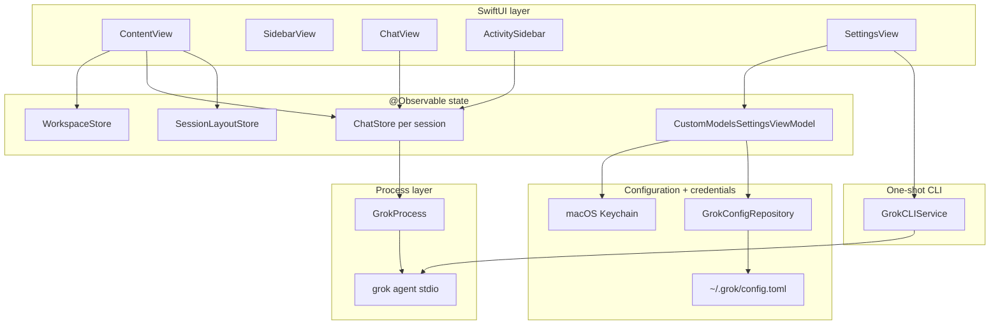
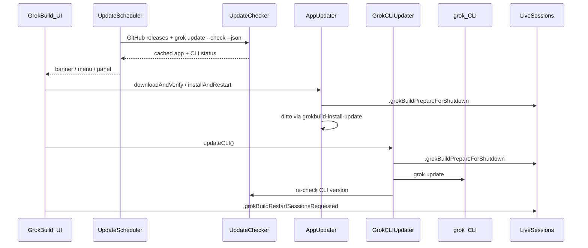

# GrokBuild — architecture reference

> [!CAUTION]
> **Canonical application line:**
> `/Users/jimmyschmitz/Desktop/Projects/MCP Servers/Grok Build/grok-build-desktop`
> → `schmitzjimmy1-star/grok-build-desktop` → `main` →
> `/Applications/GrokBuild.app`. The separate
> `/Users/jimmyschmitz/Documents/Grok Builf` / `jimmmy-Jim/Grok-Build-GUI`
> repository is retired reference material. Never build or install it. Run the
> identity preflight in `CANONICAL_WORKTREE.md` before changing code.

**Read this first in every new chat after `CANONICAL_WORKTREE.md`.** This document is the canonical map of how GrokBuild works. `AGENTS.md` points here; `.cursor/rules/` add file-specific conventions.

---

## Table of contents

1. [What GrokBuild is](#what-grokbuild-is)
2. [Design rules for agents](#design-rules-for-agents)
3. [Repository layout](#repository-layout)
4. [App lifecycle & shell](#app-lifecycle--shell)
5. [Runtime architecture](#runtime-architecture)
6. [GrokProcess & ACP](#grokprocess--acp)
7. [ChatStore](#chatstore)
8. [Multi-session model](#multi-session-model-contentview)
9. [Workspaces & projects](#workspaces--projects)
10. [Persistence](#persistence-userdefaults)
11. [Feature subsystems](#feature-subsystems)
12. [Settings system](#settings-system)
13. [In-app updates](#in-app-updates)
14. [UI layout & panels](#ui-layout--panels)
15. [Notifications](#notifications)
16. [Git integration](#git-integration)
17. [Build, test & release](#build-test--release)
18. [Common tasks → files](#common-tasks--files)
19. [Tests](#tests)
20. [Anti-patterns](#anti-patterns)
21. [Related docs](#related-docs)

---

## What GrokBuild is

GrokBuild is a **windowed macOS project workbench** (SwiftUI + AppKit) over the `grok` CLI. It spawns `grok agent stdio` per build session and speaks **ACP (Agent Client Protocol)** JSON-RPC over stdin/stdout. The transcript is an auditable record of project work; the product model is not a standalone chatbot.

| GrokBuild owns | `grok` CLI owns (do NOT reimplement in Swift) |
|----------------|-----------------------------------------------|
| Windows, sidebar, composer, settings panes | ACP session lifecycle, tool execution |
| Multi-tab sessions, LRU process cap | MCP server wiring at runtime (GrokBuild only *injects* configs) |
| Per-tab model, per-project effort, layout persistence | Skills, hooks, plugins, plan mode, subagents |
| Browser/Computer Use **enablement** + bundled skills | Agent reasoning, permissions policy enforcement |
| In-app updates (app + CLI) | `grok update`, auth (`grok login`) |

**Platform:** macOS 26+. **Version:** `VERSION` → `AppVersion.display`. **Build:** SwiftPM only — no Xcode project; use `make` / `swift build`.

Every packaged bundle also stamps the personal build channel, source repository,
branch, exact commit, and dirty state into `Info.plist`. `AppBuildIdentity`
surfaces that receipt in About and Settings → App. `0.1.22` by itself is not
accepted as source identity because the maintained personal line and upstream
can share the same marketing version.

---

## Design rules for agents

1. **Stay thin** — UI and local state only; wrap the CLI, don't replace it.
2. **Reuse services** — extend `GrokProcess`, `GrokCLIService`, `ChatStore`, `WorkspaceStore`, `SessionLayoutStore`, and feature services below.
3. **Match conventions** — read surrounding code before editing; minimize diff scope.
4. **Draft vs applied settings** — migrated panes edit parent-owned `SettingsValueState` drafts; storage changes only at the explicit Apply boundary, and `EffectiveSessionReceipt` separately proves what the current process launched (see [Settings system](#settings-system)).
5. **Post notifications** — message/turn changes → `.liveSessionMessagesChanged` (titles, transcript save, bounded Git review refresh); settings that affect MCP → `reloadConfiguration()`.
6. **Docs + tests with every code change** — run `make test`, add/extend `Tests/GrokBuildTests/`, update this file and other relevant docs in the same session (`.cursor/rules/docs-and-tests.mdc`).
7. **Commit only when asked** — user rule in this repo.

---

## Repository layout

```
grok-build-desktop/
├── GrokBuild/                    # Main app target (SwiftUI + AppKit)
│   ├── main.swift                # NSApplication entry
│   ├── AppDelegate.swift         # Single instance, main window, menus
│   ├── MainWindowLayout.swift    # Window size, TitlebarMetrics, sidebar overlay visibility
│   ├── AppTheme.swift            # Soft-black canvas, typography, radii, shared surface modifier
│   ├── ContentView.swift         # Root view: multi-session orchestration
│   ├── Views/                    # SwiftUI screens
│   │   ├── Settings/             # One file per Settings pane (Slice 10 split)
│   │   ├── ActivitySidebar.swift # Optional right-side run-evidence drawer
│   │   └── WelcomeStateView.swift # Quiet new-session welcome + intent chips
│   ├── Services/                 # Business logic, CLI integration
│   ├── Models/                   # Workspace, Message, Composer, RunEvidenceSnapshot types
│   ├── Resources/
│   │   ├── Assets.xcassets/      # Brand mark, app icon
│   │   └── Skills/               # Bundled grok skills (copied at build)
│   ├── AboutPanel.swift          # AppKit About panel
│   └── UpdatePanel.swift         # AppKit Updates panel
├── GrokBuildComputerUseCore/     # Shared Computer Use contract (tools, argv, policy, env)
├── GrokBuildComputerUseMCP/      # Separate SPM target: stdio MCP bridge → agent-desktop
├── GrokBuildProviderAuthCore/    # Credential-helper argument/keychain contract
├── GrokBuildProviderAuthHelper/  # Signed CLI credential helper; stdout token only
├── Tests/GrokBuildTests/         # Unit/integration tests
├── scripts/                      # build-macos-app.sh, release.sh, notarize.sh, install-update, acceptance/
├── Package.swift                 # SPM manifest (macOS 26+)
├── VERSION                       # App version source
├── Makefile                      # make run | test | app | release
├── AGENTS.md                     # Agent entry (points here)
└── BUILDING.md                   # Signing, notarization, CI
```

The AppKit pair `main.swift` + `AppDelegate` is the only entry point (the legacy SwiftUI `GrokBuildApp.swift` was deleted).

---

## App lifecycle & shell

### Sidebar selection semantics

The compact New chat, Sessions, Plugins, and Security rail entries are action buttons,
not persistent navigation destinations. They explicitly remove the accessibility
selected trait, so keyboard focus, hover, or the last clicked action cannot masquerade
as route state. Persistent selection belongs to the real conversation route: the
matching session row receives the same selected state visually and in accessibility,
or the matching project row does when no session is selected. Parent project and child
session never claim selection simultaneously. Settings owns its own selected pane;
returning to chat restores the unchanged project/session identity and the one
applicable selection.

### Entry point

`main.swift` → `AppDelegate.applicationDidFinishLaunching`:

1. **Single instance** — advisory `flock` on `~/Library/Application Support/GrokBuild/instance.pid`. Second launch posts `com.grokbuild.showMainWindow` and exits.
2. **Activation policy** — `.regular` (Dock icon + standard application menus).
3. **Application menu** — `AppDelegate.setupMainMenu()` owns About, Settings, update checks, Project, Session, and Window commands. GrokBuild does not create an `NSStatusItem`.
4. **Update scheduler** — `UpdateScheduler.start()` (background checks).
5. **Main window** — `openMainWindow()` hosts `ContentView` in `NSHostingController`.

### Window behavior

- **Close button** hides the window (`orderOut`), does not quit (`applicationShouldTerminateAfterLastWindowClosed` → false).
- **Reopen** (Dock click) → `applicationShouldHandleReopen` → show main window.
- Frame autosave name: `"MainWindow"`.

### Application menus

| Menu | Location | Purpose |
|------|----------|---------|
| **GrokBuild** | `AppDelegate.setupMainMenu()` | About, Settings ⌘,, update checks (re-entrancy guarded), View Usage on grok.com, Hide ⌘H, Quit |
| **Edit** | `AppDelegate.setupMainMenu()` | Standard text editing commands |
| **View** | `AppDelegate.setupMainMenu()` | Show/Hide Sidebar ⌃⌘S (posts `.toggleSidebarRequested`; title tracks `SidebarVisibility.currentPreference()`) |
| **Project** | `AppDelegate.setupMainMenu()` | Add Project |
| **Session** | `AppDelegate.setupMainMenu()` | New Session, Browse Sessions, Stop Generation, Focus Input |
| **Window** | `AppDelegate.setupMainMenu()` | Minimize, Zoom |

Commands that need SwiftUI post notifications (for example `.newSessionRequested` and `.openSettingsRequested`) that `ContentView` handles. DEBUG builds add **GrokBuild → Simulate Updates** after the update item.

---

## Runtime architecture



### Request path (send a message)

1. User types in `ChatView` → `ChatStore.send(_:)`.
2. If first-intent startup is still incomplete, `ChatStore` latches one exact
   `PendingSubmitIntent`. The composer becomes read-only, shows real preparation
   stage copy, and offers pre-dispatch Cancel. Duplicate Return/click events and a
   different draft cannot create another request. Cancellation restores editing and
   sends nothing; startup failure preserves the exact draft for retry/start-new.
3. `ChatStore` ensures workspace selected and `GrokProcess` is `.ready` (restarts if needed).
4. Appends user `Message`, creates empty assistant `Message`, sets `isStreaming`.
5. `GrokProcess.send(prompt)` → ACP `session/prompt` JSON-RPC on stdin.
6. `GrokProcess` reader parses stdout → `AcpEvent` stream.
7. `ChatStore.consumeOutput()` maps events → message text, tool activity, authoritative interaction cards, and thinking blocks. Question, permission, and plan cards require the exact live backend-session/request identity; tool-call rows never acquire response authority.
8. On completion → `isStreaming = false`, posts `.liveSessionMessagesChanged` (also on user send).

### CLI discovery (shared)

`GrokProcess.locateGrokCLI()` and `GrokCLIService.locateGrokCLI()` search in order:

1. `GROK_CLI_PATH` environment variable
2. `~/.grok/bin/grok`
3. Homebrew paths
4. `PATH`

User must run `grok login` for authenticated sessions. Auth failures surface inside the active session through `ChatStore.authRequiredMessage`; no launch-time credential guess is shown in app chrome.

---

## GrokProcess & ACP

**File:** `Services/GrokProcess.swift`

`GrokProcess` is the long-running **ACP client**. One instance per `ChatStore`. ACP startup failures append a bounded `GrokMCPRedactor` snapshot of process stderr (`redactedStartupStderr`) into `.failed` / `lastError`, so values such as `api_key=` never reach the UI.

### Process states (`GrokProcessState`)

| State | Meaning |
|-------|---------|
| `.idle` | No process |
| `.starting` | Launching CLI, ACP handshake in progress |
| `.ready` | Session created/loaded, can accept prompts |
| `.busy` | Turn in progress |
| `.failed(String)` | Startup or fatal error; check `needsAuthentication` |

### Launch command shape

```
grok [--no-memory] [--permission-mode X] [--sandbox X] [--allow RULE] [--deny RULE] … \
     agent [--reasoning-effort X] [--model M] stdio
```

Built from `GrokLaunchOptions` in `ChatStore.restartProcess`. Working directory = **workspace path**.

Permission launch arguments are centralized in `GrokPermissionLaunchArguments`. Ask omits a flag, Always approve emits `--always-approve`, and advanced modes emit their exact `--permission-mode` value. `GrokPermissionMode` owns the user-facing names and explanations; legacy `bypassPermissions` values normalize to Always approve. `dontAsk` is displayed as **Deny unapproved (CI)** because the CLI silently denies tools without an explicit allow rule in that mode. Every launch increments `GrokProcess.processGeneration` and creates a credential-free `GrokLaunchReceipt` bound to the local tab, workspace, PID, backend ID, launch outcome, requested model/agent/effort, permission/sandbox state, capability booleans, MCP gateway gate state, app-injected MCP names, and CLI-configured MCP server names observed through ACP. Stopped or failed receipts remain historical evidence and cannot be described as live. Permission cards use the launched receipt rather than mutable Settings state. If the CLI still emits a request, `PermissionRequestPolicy` auto-selects an actual allow option under Always approve/YOLO, auto-selects rejection under Deny unapproved, and leaves Ask/Auto requests interactive. GrokBuild only answers ACP—the CLI remains the executor, so sandbox, hooks, and deny rules cannot be bypassed by a client-side file write.

ACP `mcpServers: []` is additive and does not override MCP servers already configured in Grok CLI. A process generation with no explicit thread or turn MCP selection therefore launches with Grok's own `--deny MCPTool(*__*)` rule. The two globs deliberately cover the full `server__tool` identifier; installed CLI 1.0.0 acceptance proved the shorter `MCPTool(*)` pattern does not cross that separator. Before an MCP-enabled launch, GrokBuild performs a fresh nonbillable `grok mcp list`; failure or a server name that cannot be represented safely in an exact rule stops before dispatch. The launch keeps user denies and adds `--deny MCPTool(server__*)` for every enabled configured server not selected by this thread. This is necessary because Grok's deny rules outrank allow rules and `--always-approve` can otherwise resolve a call before ACP asks the client. The ACP permission responder independently checks the invocation's exact server against the generation-bound selected set. That check composes a `server__tool` identity from a wrapped `tool_name` **or** from split ACP `serverName` + `toolName` fields before disposition, including permission requests that have no `rawOutput` yet. `PermissionRequestPolicy.mcpGatewayEnabled` defaults to false so a missing launch receipt cannot auto-allow an MCP call under Always approve or YOLO. Approval still only answers ACP; it never executes the tool client-side. After a one-turn attachment clears, the next ordinary turn restarts with the default catch-all gate restored. The app does not mutate global CLI configuration or execute MCP tools itself: Grok CLI owns catalog discovery, orchestration, permission-rule enforcement, and invocation throughout.

### ACP lifecycle

1. `start(workspace:options:)` — spawn process, `initializeACP()` (JSON-RPC handshake).
2. `createSession(workspace:mcpServers:)` **or** `loadSession(id:…)` if resuming. When `session/load` fails with `FS_NOT_FOUND` / “Path not found” (stale on-disk grok session), GrokBuild falls back to `session/new`, sets `sessionLoadStartedFreshFallback`, and `ChatStore` adds a system note — the app-local transcript is preserved. During load, the CLI replays history through typed `session/update` and `x.ai/session/update` notifications marked `_meta.isReplay`. `GrokProcess` captures root user/assistant chunks in a separate backend/generation-bound replay accumulator and never routes historical thought, tool, completion, or message events into the live `ChatStore` event stream. Only after the load response does `ChatStore` verify and reconcile that replay against its local presentation cache.
3. If launch requested an explicit model, `confirmRequestedLaunchModel` compares the session readback and, when necessary, sends `session/set_model`. `.ready` is withheld unless ACP explicitly confirms the exact requested ID. This compensates for CLI versions that accept `--model` while `session/new` still starts at the default model, and prevents a custom-provider tab from silently billing Grok. A live `session/set_model` is allowed only before the first assistant response. Any assistant turn can carry provider-specific encrypted reasoning even when its visible transcript is plain text, so later changes require an explicit fresh-session boundary.
4. MCP servers from `MCPServerConfig` passed in `session/new` (browser, computer use when enabled).
5. `MCPReadinessPolicy` records a secret-free per-server lifecycle receipt. Configured servers are `Connecting` while ACP and MCP startup settle, become **Process ready** only after ACP session creation/model confirmation plus the bounded startup barrier, become `Failed` when the current generation cannot reach that boundary, and become `Stopped` when the owning process is torn down. Process readiness deliberately proves no inventory, qualified capability, or use; those facts come only from typed current-turn ACP tool receipts.
6. `send(_:)` — prompt during `.ready`/`.busy`.
7. User **Stop** tears down the exact process and creates a local `userStopped` `RunEvidenceSnapshot`; LRU/app shutdown stay lifecycle-only and do not fabricate that user outcome. Resume re-verifies only an exact tab/backend/process-generation continuity receipt. A mismatch makes the next send create a fresh, ledgered backend run.

### Typed ACP control plane

`Services/ACPControlPlane.swift` defines a narrow read-only facade over the same
per-tab JSON-RPC pipe. It is not another agent, process, or daemon. The live
`initialize._meta.agentVersion` is parsed into `ACPAgentVersion`; a missing or
known version below 1.0.5 makes official extensions unavailable without a wire
call. On 1.0.5 or newer each extension starts unknown, and a successful response
or JSON-RPC `-32601` settles that exact method only for the current
`processGeneration`. Restarting the CLI clears the cache. A response that
returns after the generation changes is rejected as stale.

The initial contracts are `x.ai/models/list`, `x.ai/session/usage`,
`x.ai/session/info`, and `x.ai/session/updates`. Catalog, cumulative usage, and
resident-session metadata become credential-free typed values. Persisted update
rows keep the official timestamp/method/session/update envelope in
`ACPJSONValue`, then cross back into Foundation objects only at the existing
tool parser. Update requests require an explicit limit no larger than 512; no
call asks for an unbounded session.

At the ordered parent completion barrier, child tool reconciliation asks the
current ACP connection for at most four 256-row tail pages. Only matching
`session/update` / `x.ai/session/update` / `_x.ai/session/update` terminal tool
rows become `ChildToolReceipt`; child prose remains excluded. Installed Grok
1.0.4 cannot serve the extension, so detailed child receipts are honestly
unavailable on that version. Slice 3 removed the private `updates.jsonl`
compatibility reader instead of keeping a second history authority.

**Context budget and owned-process closeout (historical tiny-turn Slice 6, 2026-08-09).** The Grok CLI remains
the system-prompt/tool owner and already uses progressive MCP discovery; GrokBuild
does not counterfeit provider token attribution or strip capabilities. The provider-free
`PromptContextBudget` fixture separately measures observable project-instruction,
skill-catalog, MCP-catalog, requested/deferred schema, history, memory, and optional
provider-wrapper bytes. Opaque CLI base/provider bytes stay explicitly unmeasured.
The repo instruction packet was compressed from 5,015 to 3,112 UTF-8 bytes (37%)
while contract tests retain canonical identity, testing, signing, helper, documentation,
and Gates A–H anchors; requested MCP schemas remain loaded and unrequested schemas
remain progressive/deferred.

Every launched CLI generation also starts an `OwnedProcessLedger` keyed by local tab,
backend, generation, root PID, and exact descendant fingerprints (PID, executable path,
and process start time). Stop, tab close, LRU eviction, configuration reload, failed
startup cleanup, and app quit close stdin/terminate the root, then signal only matching
pre-close descendants that survived reparenting. Production teardown never searches by
process name or command substring, so a wrong tab/backend/generation cannot kill another
session. `OwnedProcessTree` fixtures run five consecutive descendant trees to zero.

The initialize handshake advertises client filesystem read/write and terminal capabilities as `false`. GrokBuild never executes reverse-ACP `fs/*` or `terminal/*` requests; an unexpected request fails with JSON-RPC `-32601 Method not found`. The same-host Grok CLI therefore retains its native filesystem and terminal runners, keeping the actual operation beneath the CLI process sandbox, deny rules, hooks, and process ledger. Typed terminal status still arrives in ordinary Grok-owned `session/update` tool receipts, so `GrokProcess` continues to treat reported nonzero exits, timeouts, and signals as authoritative failures without running the command itself. Plan approval similarly consumes typed `planContent` from the interaction request instead of watching a CLI-owned plan file through client-side writes.

`session/prompt` can resolve after grok's terminal lifecycle notifications. `GrokProcess` accepts standard `session/update` plus current and legacy xAI notification spellings. It routes a completion receipt through the same `AcpEvent` queue as chunks only when its local tab, backend session, process generation, and prompt identity match the active turn. While that exact turn owns the process, `ChatStore.liveRunEvidenceProjection` derives a non-persisted **Live** read model from observed plan, tool, artifact, and current-turn worker state. It has no usage or outcome field and cannot settle anything. `ChatStore` consumes the exact completion barrier, flushes buffered text, replaces the live projection with `RunEvidenceSnapshot`, and calls `GrokProcess.acknowledgeTurnCompletionBridge(authoritative: true)`. Live ACP ordering is the current-turn transcript authority; GrokBuild no longer rereads a private backend tail at completion. `TurnSettlementCoordinator` finalizes exactly once only after both the RPC result and authoritative queue-barrier consumption; stale Stop/restart completions and wrong-session notifications are rejected. User Stop is separately explicit: `ChatStore` captures the local tab/backend/process-generation identity before teardown, creates a settled `userStopped` snapshot with no backend-completion claim, and opens Activity with a next action. Its cancellation write runs off the UI path while the exact old generation stays readable for one short receipt-drain window; late worker completions are retained under the user-Stopped parent outcome, whereas a late parent completion cannot reopen the UI or replace that outcome. Only an exact typed replay continuity receipt may re-verify and resume that backend; a mismatch makes the same frozen Send intent create a fresh ledgered run before dispatch. The bounded transport watchdog can emit `.turnCompletionReceiptMissing`, but can never synthesize `.turnCompleted`: the missing-receipt path preserves partial worker, tool, artifact, and transcript evidence, withholds usage and settled continuity, marks the run incomplete, tears down the broken process generation, and requires reconnect. A receipt rejected at the ChatStore identity boundary fails immediately with the mismatched field rather than silently aging into the watchdog.

**Durable Run history and export:** `RunHistory` is a pure projection of `AssistantTurnCheckpoint` values already attached to persisted assistant messages. Opening the Session dashboard snapshots only the newest bounded local-message window; the root SwiftUI body never reads every streamed transcript to re-project history at display cadence. The dashboard groups checkpoints by their retained parent backend ID, preserves every retained turn boundary, and labels them historical; it does not scrape Grok session directories or mint current-process truth after relaunch. Its Markdown and JSON exporters are deterministic and bounded: the receipt names source-window truncation, worker/artifact/tool lists have fixed caps, and every capped list discloses observed versus retained counts. They serialize only selected typed checkpoint receipt fields and omit user/assistant transcript prose, prompt text, tool payloads, artifact paths, environment values, credentials, and private reasoning. New checkpoints preserve the credential-free route detail from the exact process-generation contract; old checkpoints, retries, and parallel tool-group topology remain `not retained`. UI/export code must never infer them from prose or ordering.

Pipe readers capture the process generation that created them. `_x.ai/session/update` `subagent_spawned` and `subagent_finished` updates become typed lifecycle events carrying the local tab, parent backend, process generation, backend event ID, exact child identity, and the runtime model ID Grok reports at spawn. Terminal receipts retain status, duration, turns, tool-call count, token count, and only a bounded redacted error; worker result bodies never enter this state. Runtime model and configured role route remain separate receipts: Activity says **Ran on … (Grok ACP)** only for the lifecycle value and **Routes to … (configured)** only for the role declaration. `ChatStore` accepts a lifecycle event only when tab, backend, and active generation all match, then deduplicates the lifecycle fact before recording it. Slice 2 correlates those receipts with the worker row created by the exact `spawn_subagent` tool call; wait/collection and kill calls update existing rows and never create workers. The background tracker remains session-wide for durable work, while `currentTurnWorkerActivityIDs` admits only rows created or changed during this parent turn into its Live or Settled evidence. At the parent `turn_completed` barrier, only those owned rows can be marked unresolved: a worker without terminal evidence is shown as `Unknown` when its child identity is missing or `Orphaned` when the child is known, never as successful by implication from parent prose. A completed child lifecycle with one or more tool calls likewise remains outcome-unresolved until ACP supplies typed child-tool results; child final prose cannot promote it to success.

The terminal completion receipt retains Grok's authoritative input/output/total/cached/reasoning token splits, API duration, exact `costUsdTicks`, and per-model `modelUsage` map. The session ledger uses that map instead of assigning all tokens to the main route; provider-reported cost is labeled as such and outranks catalog estimates. Tool duration follows the same rule: `duration_ms`/`elapsed_ms` from the ACP receipt is formatted, while absence stays **Duration not reported**—no client stopwatch is presented as backend fact.

**Observed model performance:** `ModelPerformanceObservationStore` writes one bounded
local UserDefaults record only after the owned `turn_completed` barrier creates its
settled `RunEvidenceSnapshot`. It pairs that receipt with the locally measured
dispatch-to-first-text-chunk interval when available and the exact process-generation
`ModelRouteContract`; missing fields stay nil. Cohorts are exact model + stable route
identity (kind, provider, sanitized endpoint scheme/host/port/URL path, provider model,
and pinning) + comparable
workload class (no-tool, ordered or observed-overlap parallel multi-tool, exactly
two-child coordination, durable same-backend conversation continuation, or explicit
retry recovery). Continuation uses the greater truth available from durable completed
checkpoints for that backend and ACP's exact-session, non-replay, zero-based backend
user-prompt index, so reopening the backend in a new local tab does not reset its
workload class. A later same-backend prompt remains a continuation even when an earlier
attempt stopped or failed because that context still exists; provider `turnCount`
measures internal model cycles and never defines conversation continuation.
For native xAI the cohort model is the confirmed effective process model; custom
direct, local, and brokered routes use the frozen provider-facing model ID, falling
back to the confirmed process model only when that route field is absent. Usage
matching still considers both the confirmed selector/effective ID and provider model,
so canonical display never changes receipt attribution.
Unsupported one-tool, one-child, and three-or-more-child turns are ignored rather than
averaged into an “other” score. Multi-model turns use only the authoritative matching
`modelUsage` row. Native xAI's observed `-build` usage alias may match its exact base
model; otherwise, if no unique parent-model receipt exists, usage stays missing instead
of being charged to the parent route. Recovery succeeds only when every failed parent
tool has a typed successful retry correlation, never because the parent answer happened
to complete. Any failed child-tool receipt creates a recovery opportunity but remains
unrecovered because ACP does not yet retain child retry linkage. Settings → Models shows
**Observed on this Mac** with bounded
medians/ranges and rates; pinned OpenRouter and `openrouter/auto` are separate and both
keep downstream serving identity unproven. The store retains at most 40 rows per cohort
and 240 total, contains no prompt, response, tool payload, filesystem path, credential,
or private reasoning, performs no network or model selection, and clears only its one versioned
UserDefaults key after explicit confirmation.

### ACP events (`AcpEvent`)

Consumed by `ChatStore.consumeOutput()`:

| Event | UI effect |
|-------|-----------|
| `.messageChunk` | Append to streaming assistant message |
| `.thoughtChunk` | Thinking panel text |
| `.toolCall` / `.toolCallUpdate` | Live tool call cards |
| `.subagentSpawned` / `.subagentFinished` | Correlate exact-once, generation-bound worker lifecycle receipts with spawn-created rows and terminal metadata |
| `.permissionRequest` | One permission card keyed by backend session + ACP request id |
| `.exitPlanRequest` | One plan-review card keyed by backend session + ACP request id; approval resumes the same turn |
| `.questionRequest` | Ask-user question card keyed by backend session + ACP request id |
| `.modeChanged` | Chat / Agent / Plan / YOLO (or the CLI's advertised id) |
| `.contextUsage` | Token usage indicator |
| `.availableCommands` | Slash command autocomplete |
| `.schedulerActivity` | Update the scheduled-tasks mirror (`ChatStore.scheduledTasks`) |
| `.error` | Error banner |

`ACPInteractionRequestIdentity` is the shared interaction ownership boundary. `GrokProcess` rejects direct interaction requests for a backend other than its active session, and `ChatStore` accepts or answers only the exact request still pending in that session. Replays for the same id update one card. Distinct authoritative question ids remain distinct even when their text is identical. An ask-shaped tool call stays in tool activity and cannot mint a reply-capable question with a tool-call id. `_x.ai/exit_plan_mode` approval writes the one JSON-RPC result expected by the CLI; it does not enqueue a second user message or mutate Grok's durable transcript/log files. The native plan card intentionally omits the old comment field because that text had no ACP response field and was previously delivered only through the invalid synthetic prompt.

### Agent modes

`AgentMode` is an open ACP id (`chat`, `agent`, `plan`, `yolo`, or whatever the CLI advertises). `AgentSessionModeParsing` reads nested `modes: { currentModeId, availableModes }` on `session/new` **and** `session/load`, plus the older top-level `modes` / `availableModes` / `currentModeId` shapes. `_meta["x.ai/sessionConfig"]` effort rows (`high` / `low`) are not session modes. `availableModes` starts empty and is reset on every process generation; an absent ACP advertisement **clears** the list instead of inventing Agent / Plan / YOLO. The composer hides the mode control when the list is empty. Known ids label Chat / Agent / Plan / YOLO. Unknown ids keep the CLI name and are never silently renamed Agent. `session/set_mode` is sent only for an advertised id. Empty success is not confirmation: `ChatStore.currentMode` / `isYolo` persist only after `current_mode_update` or an authoritative result `currentModeId`. Restore does not fire a cosmetic `set_mode` to match a saved unconfirmed id.

### Model switching

`ModelExecutionState` and its pure reducer own model truth. States are Unknown, Requested, Pending, Confirmed, and Rejected. Every launch/model request carries `ModelRequestIdentity` (local tab UUID, backend ID, process generation, and request UUID); wrong-tab, wrong-backend, old-generation, duplicate, and out-of-order completions are discarded. `session/set_model` never changes `currentModelId` optimistically. An explicit ACP effective-model readback confirms only when it equals the requested table key or that custom model's one declared provider-facing ID; an unrelated readback rejects the switch and makes the process unsendable until a new session starts. A successful response without effective state remains Requested for an already-running manual switch, while launch-time reconciliation fails closed before Ready if exact confirmation is absent or mismatched. Rejection preserves the last confirmed effective model in the receipt while `ChatStore` restores the prior picker/intent. Failures still surface through `modelSwitchError` / `modelSwitchNeedsNewSession`.

The composer label and the keyboard-reachable session receipt distinguish Saved, Default, Connecting, Pending, Requested, Live, Last live, Rejected, and Unknown. An idle inherited New chat with a catalog model and no process yet is Default, not Unknown. Connecting is the unconfirmed spawn after Send. Unknown stays for a truly empty picker or a live process with a receipt conflict. Last live applies only when the picker is still on the confirmed receipt; an inherited tab that followed a newer CLI or project default is Default, not Last live on the wrong model. Launch arguments and picker intent prove only what GrokBuild requested; when ACP omits effective state the details explicitly say the backend model is not independently exposed. Restore no longer emits a hidden second `session/set_model` to force the picker to match saved state.

Before ACP is connected, `GrokModelCatalog` supplies fresh-session choices from `grok models`, caches successful discovery briefly, and falls back only to `grok-4.6` (default) and `grok-4.5`. ACP remains authoritative once connected. Settings uses the same catalog, so new chats and the default-model picker do not depend on stale hardcoded model IDs.

---

## ChatStore

**File:** `Services/ChatStore.swift` — `@Observable @MainActor`

One `ChatStore` per live session tab. Owns a `GrokProcess`.

### Key published state

| Property | Purpose |
|----------|---------|
| `messages` | Chat history (`Message` model) |
| `connectionState` | Mirrors `GrokProcess.state` |
| `mcpServerStatuses` | Secret-free lifecycle receipts for configured Browser/Computer Use MCP servers |
| `isStreaming` / `isGrokking` | Turn in progress |
| `currentModel` / `availableModels` | Model picker (from ACP + custom models) |
| `modelExecutionState` | Persisted, generation-bound requested/effective model receipt |
| `currentMode` | agent / plan / yolo |
| `pendingPermissions` | Tool permission prompts |
| `pendingExitPlan` / `pendingQuestions` | Plan / ask-user flows |
| `fileAttachments` | Composer chips; hidden chips are excluded from the prompt |
| `composerDraft` | Unsent composer text for this tab (in-memory; survives tab switch + LRU eviction) |
| `authRequiredMessage` | Login banner text |
| `grokSessionId` | `process.sessionId` — persisted for resume |

### Lifecycle methods

| Method | When |
|--------|------|
| `prepare(workspace:)` | Lazy restore — set workspace, no process spawn |
| `start(workspace:resumeSession:)` | Full start + optional resume |
| `restartProcess(resumeSessionID:)` | Build `GrokLaunchOptions`, spawn process, inject MCP |
| `reloadConfiguration()` | Settings changed — restart with new MCP/env |
| `startNewSession()` | Fresh grok session (same project) |
| `resumeSession(_:)` | Load existing grok session id |
| `shutdown()` | Stop process (app update / prepare for shutdown) |
| `retryConnection()` | Restart after CLI update |
| `send(_:)` | User message → ACP prompt (attachments become plain paths under `Attached file(s):`, not `@` reads) |

### `restartProcess` — what gets injected

On every (re)start, `ChatStore`:

1. Loads **permission settings** from `GrokSettingsKeys` (UserDefaults).
2. Loads **applied** browser + computer use settings.
3. Installs bundled **skills** to `~/.grok/skills/` if features enabled.
4. Starts external browser if browser tools enabled (CDP mode).
5. Builds MCP list:
   - `AgentBrowserService.browserMCPConfig(settings:)` → `grokbuild-browser`
   - `ComputerUseService.computerUseMCPConfig(settings:)` → `grokbuild-computer-use`
6. Resolves the **session agent** via `GrokAgentProfiles.launchArgument(for:)` → `GrokLaunchOptions.agent` (`--agent`).
7. Resolves the model from the active tab's v3 `TabModelIntent`: an explicit override wins, `legacyUnknown` preserves the old resolved value without inventing intent, and inherited tabs continue to follow the project/app default.

### Per-tab model + per-project reasoning effort

**Model intent** is **per session tab** (`SavedSessionRecord.modelIntent` in `GrokBuild.sessionLayout.v3`), matching grok's per-ACP-session `session/set_model`. The intent is `inheritProjectDefault`, `explicit(modelID)`, or migration-only `legacyUnknown(modelID)`. `SavedSessionRecord.modelExecutionState` separately retains the last generation-bound request/effective receipt; a historical confirmed receipt is labeled Last live only while the picker still names that receipt. An inherited tab that followed a newer CLI/project default is labeled Default instead of attaching Last live to the wrong model. Changing model in the composer settles the tab to explicit and posts `.liveSessionModelChanged` at request and terminal receipt boundaries. Tab switch calls the intent-aware `bindTabSession` + `syncTabModelToLiveProcessIfNeeded()`; the latter reads only that tab's live receipt and never issues a cosmetic model RPC. An explicit restored model that is no longer catalogued remains the launch request and fails closed through ACP instead of silently falling through to another provider. Resolving a project/app default never freezes inheritance into an explicit tab value. A CLI lookup, process spawn, or ACP initialization failure closes the active generation and rejects any launch-model request, so a dead process can never retain a Requested/live-looking receipt.

**Transcript continuity** is a separate dispatch authority from process and model readiness. A saved backend enters `verifying`; `session/load` first establishes the exact backend/process generation and delivers its rewind-filtered typed replay. `ChatStore.verifyContinuityBeforeResume` then compares versioned, Keychain-keyed HMAC tags for the normalized root user/assistant role, order, and content in that replay. Exact matches, verified local prefixes, and valid backend-only histories may become sendable. Missing replay, incomplete, divergent, and composite-suspected histories leave the exact no-prompt connection available only for official read-only recovery review; the continuity gate rejects dispatch. Continue as New tears that connection down before clearing its binding. If Send initiated lazy verification, the same frozen intent records the predecessor, creates a fresh successor, and dispatches only after that successor is ready. Ordinary startup never searches neighboring histories or private CLI storage. **Relink** is an explicit bounded review over standard `session/list` and at most one 512-update official history page per candidate, limited to 50 rows, five inventory pages, and a five-second candidate-start window. The chosen backend is re-fetched under the full 4,096-update fail-closed cap and re-verified; the predecessor connection is then torn down before the new exact ID is saved. Missing/old/unsupported methods stay unavailable rather than falling back to disk. Local-only tabs create a backend lazily on first send; successful `session/new` changes the receipt to `backendBound / freshBackendBound`, never `verified`, because no prior backend history existed to compare. Every live receipt is stamped with local tab UUID, backend ID, and process generation. Re-selecting an LRU-retained live binding adopts that exact process receipt instead of restoring stale `noBackendBinding` or an unfinishable checking state.

**Project default model** (`WorkspaceAgentSettings.model`) is followed by new/inherited tabs. It is **not** updated when you change model in chat.

**Session-agent intent** is also **per session tab** (`SavedSessionRecord.agentIntent`): `inheritGlobalDefault` or `explicit(agentID)`. Each tab launches with its effective `--agent`; an inherited tab follows `grokbuild.selectedAgent`, while an explicit tab keeps its override. The status-bar agent menu settles a choice to explicit, restarts that tab's Grok process, and persists the semantic intent.

**Reasoning effort** stays **per project** (`WorkspaceAgentSettings.reasoningEffort`):

- Loaded via `loadWorkspaceReasoningEffort()` on prepare/start; tab switch syncs effort only via `syncWorkspaceReasoningEffortFromStorage()`
- `restartProcess` reads `workspaceReasoningEffort` for `--reasoning-effort` (never the global key directly)
- The global `grokbuild.reasoningEffort` (Settings → Permissions → "Default reasoning effort") is only a **seed for new/untouched projects**: `ChatStore.resolveReasoningEffort(saved:globalDefault:)` = saved per-project value (incl. explicit "Default") if present, else the global default. Do not add a second effort editor elsewhere — the Models pane no longer has one.

### Session selection persistence

`grokbuild.sessionSelections.v1` — per **grok session id**: saved mode + model backup when resuming by grok id (e.g. Sessions browser).

---

## Multi-session model (`ContentView`)

**File:** `ContentView.swift` — root orchestrator.

### Core types

```swift
ContentView.LiveSession {
    id: UUID              // Stable tab id (persisted)
    store: ChatStore      // One GrokProcess inside
    workspace: Workspace
    title: String         // Sidebar label
    grokSessionID: String? // For lazy resume after LRU teardown
}
```

### LRU connection cap

| Constant | Value | Behavior |
|----------|-------|----------|
| `maxConnectedSessions` | 4 | Normal soft cap for live `grok agent stdio` processes; protected active/scheduled work may exceed it visibly |
| `recentSessionOrder` | True MRU list derived from `lastActivationOrdinal` | Drives eviction |

**Lazy restore at launch:** `restorePersistedSessions()` decodes the layout once, rebuilds lightweight `LiveSession` shells, and precomputes one `SessionRestoreCandidate` per tab from its metadata sidecar. The metadata snapshot and restore-candidate work run through `GrokBuildBackgroundWork` off the main actor; only the selected tab loads and decodes its local transcript in `selectSession`. `persistSessionLayout()` reuses that metadata snapshot instead of rereading transcript bodies or scanning history. The pure `SessionRestorePolicy.restoreDecision` prefers a viable saved selection, then the first qualified tab by `lastActivationOrdinal`, timestamp, and stable UUID order. Transcript length is never a ranking signal. Selection is presentation-only: it binds intent, records activation, and hydrates the local transcript, but never starts a backend. `ChatStore.deliverPrompt` owns continuity-gated lazy resume after a real submission. An unverified migrated binding therefore restores visibly; Send performs typed replay verification and either resumes the exact match or transparently forks before dispatch when verification fails. Ordinary startup never scans history directories or guesses a backend ID from transcript text.

**Restore pruning and pacing (2026-08-07):** Before rebuilding shells, `SessionRestorePolicy.pruneDecision` drops stale empty records — no restorable local transcript, not any workspace's saved selection, no pending recovery intent, and untouched for `emptySessionPruneAge` (24 h). Warm-started New chats acquire a backend binding without ever holding a message, so a binding alone is not protection; this is what kept every acceptance pass's empty tab forever and grew launch restore to 130 tabs. Pruned records are simply not restored (the next committed save persists the smaller set) and their transcript remnants are removed off the main actor. The rebuild loop yields once per tab so the overlay's counter and status text actually paint (previously every increment coalesced into the dismissal frame and the counter read "0 of N" throughout), and the per-tab cost itself collapsed via three caches: `GrokConfigRepository.read()` memoizes config.toml contents against an mtime+size stamp (external TUI/CLI writes still invalidate), `SessionLayoutStore.loadWorkspaceLayout()` caches its decoded snapshot (invalidated in `saveWorkspaceLayout`), and `SessionNameStore` mirrors its names dictionary in memory. During restore only the sidebar, settings, and review panes are disabled; the composer stays typeable with sends gated (`ChatView.isSessionRestoreInProgress`), and `selectSession` carries a draft typed into the placeholder store over to the first selected real session so the `.id()` remount cannot swallow it.

**Dashboard navigation:** `SessionDashboardPresentation` groups rows by status, sorts each group by activation ordinal with stable UUID tie-breaking, and supplies a durable accessibility identifier and explicit label. Each row is one full-width native button. The sheet's presenting `ContentView` is the single dismissal owner, and `sessionSelectionGeneration` rejects stale asynchronous hydration after rapid A → B → A switching. Dashboard selection resolves only an existing local UUID; historical backend discovery remains in Browse Sessions.

Only an intentional tab activation increments `lastActivationOrdinal` and updates `lastAccessed`. Streaming, background recovery, persistence, process readiness, and LRU eviction do not manufacture recency. The activation is recorded before the v3 layout write, so a rapid A → B → quit restores B deterministically.

**Transcript reconciliation:** Selection and offline browsing read only GrokBuild's owner-only local transcript cache. A resumed tab reconciles exactly one known backend only from the typed replay returned by `session/load`; historical replay is never mounted as live thinking, tools, workers, or completion state. `SessionTranscriptReconciler` aligns normalized user prompts occurrence-by-occurrence, preserves local UUIDs, extends prefix answers in place, preserves divergent/newer local text, appends a missing authoritative suffix once, and is idempotent across repeated loads. `SessionMessageStore` also refuses an equal-count partial save that would shorten a completed assistant. Current-turn ACP delivery remains authoritative until a later explicit load; completion no longer triggers a private tail read. `GrokSessionTranscriptImporter` exists only in DEBUG shadow-parity tests and is absent from the Release binary, as is the removed child-ledger reader.

**Public reasoning-summary presentation:** `agent_thought_chunk` remains ordered, ephemeral ACP presentation input in `ChatStore.reasoningSummaryChunks`; it is not a `Message`, layout field, transcript row, or diagnostic export. `ReasoningSummaryPresentation` normalizes transport noise per chunk without trimming explicit whitespace, joins token-sized deltas only when leading/trailing whitespace or punctuation proves continuation, and inserts an accessible presentation-stage boundary between word-like updates that otherwise would fuse. It derives only coarse public cue labels and adds blank lines only in its plain-text presentation fallback. The disclosure collapses at turn settlement; compact display is limited to 5 stages/4,000 characters and selectable expanded display to 20 stages/12,000 characters, with an explicit truncation receipt. GrokBuild never requests, reconstructs, stores, or exports hidden chain-of-thought.

**Eviction and runtime leases:** `SessionRuntimeRetentionPolicy` is the pure owner of the normal four-process window consumed by `enforceConnectionCap()`. It receives each tab's exact connection state, active-process fact, activation ordinal, selected identity, generation-bound schedule lease, and live background-task fact; the four most-recent ordinary live sessions are retained, while starting, busy, actively scheduled, and actively-background-working sessions are protected outside those ordinary slots. The protection reasons are `SessionRuntimeProtectionReason.{starting, busy, activeBackgroundTask, activeSchedule}`. `activeBackgroundTask` closes the long-horizon gap where a background `/loop`, background shell, monitor, or live subagent keeps running after the parent turn settles to `.ready`/`.idle`: `ChatStore.hasActiveBackgroundTasks` reports any non-scheduled active `backgroundActivities` row (or an unbound spawned subagent), and such a session is pinned like a busy turn so opening other tabs cannot silently sever its work. A protected session never consumes an ordinary slot: four ordinary sessions plus one protected runtime produce five live processes, and the Session dashboard shows the exact soft-cap excess (with the protection reason) instead of silently cancelling work. `ScheduledTaskInventoryReceipt` binds the last authoritative scheduler output to one local tab, backend, process generation, observation time, and task count; only a nonempty exact current receipt mints `SessionRuntimeLease`. Reconnect, Stop, close, quit, or process failure clears the lease, and restored/cached task metadata cannot recreate one until that live generation is observed again. The eviction loop still snapshots candidate IDs, re-resolves after every asynchronous teardown, and accepts a backend receipt only through `SessionProcessLRUPolicy`; a mismatched process is stopped but its identity is never adopted by another tab. Active schedule status is also surfaced in chrome: the workbench top-bar Tasks pill (`grok-tasks-status`) turns orange with a `clock.badge.checkmark` glyph and a "runtime pinned by active schedule" accessibility label, and each sidebar session row shows a `grok-sidebar-session-schedule` clock badge when `SidebarSession.hasActiveSchedule` is true.

### Session persistence flow

```
selectSession / rename / close
    → SessionLayoutStore.saveSessions(SessionLayoutSnapshot)

accepted send / completed turn / recovery boundary / controlled quit
    → mark the affected tab dirty
    → SessionMessageStore.saveAll(dirty tabs only)
    → SessionLayoutStore.saveSessions(SessionLayoutSnapshot)
```

`SavedSessionRecord`: local/workspace IDs, structured `backendBinding`, title, model/agent intent, generation-bound `modelExecutionState`, display timestamp, activation ordinal, transcript generation/storage version, optional fork-ledger reference, and an optional authenticated pending recovery intent for **Continue as New**. A pending intent forces the persisted backend binding to `nil`, even while the in-memory tab shell still remembers the predecessor for display. The generation comes from the per-tab transcript metadata sidecar, so the authenticated v3 marker still covers lifecycle/layout state without embedding transcript bodies.

`SessionLayoutStore.saveSessions` writes a v3 candidate, verifies its complete decode plus schema/IDs/count/generations and keyed integrity tag, then writes and re-verifies a separate commit marker. `GrokBuild.sessionLayout.v2` is rollback input and is never overwritten. A missing/tampered marker or candidate falls back to the preserved v2 presentation in read-only mode instead of opening an empty workspace. Controlled quit records `GrokBuild.sessionLifecycle.lastFlush.v1` only after the layout commit and transcript write have both completed.

**Controlled quit and explicit close (2026-08-09, quit window 2026-08-13):** `applicationShouldTerminate` returns `.terminateLater`, posts `.grokBuildPrepareForShutdown`, and replies within a 5 s deadline aligned with Gate G. A quit arriving while one is already pending keeps waiting on the same reply (the old path answered `.terminateNow` and silently skipped the teardown gate), and the pending flag resets after the reply. `handlePrepareForShutdown` persists the layout, then tears sessions down in a `TaskGroup` so the per-process grace sleeps interleave instead of summing, terminates any auto-started external CDP browsers GrokBuild launched into `~/Library/Application Support/GrokBuild/BrowserProfiles/` (never ordinary user Chrome), and posts `.grokBuildShutdownComplete` from the main actor (a background-thread post raced AppDelegate's poll and could burn the full deadline after a clean teardown). `GrokProcess.shutdown()` skips the courtesy `session/cancel` — a blocking pipe write with no timeout that could hold teardown hostage; stdin close is the exit signal — and escalates SIGTERM → 300 ms → SIGKILL, because grok's MCP helper children (browser, computer use) exit only when their stdin pipes close, which happens exactly when grok dies. Explicit tab close resolves the live, durable, and saved backend identities before removing local state: zero identities means local-only cleanup, one exact ID is deleted with `grok sessions delete` after process shutdown, and conflicting IDs stop the close. A backend deletion failure stays visible with the exact preserved ID. Ordinary app quit never deletes Grok history, and removing a workspace is local-only. `closeSession(id:persist:deleteBackend:)` lets `purgeEmptySessions` batch one layout save for a whole purge instead of O(n) encode/verify cycles.

Sidebar shows max `SessionLayoutStore.maxSidebarSessions` (10) per project; older sessions in **Browse Sessions**.

### Session titles

Sidebar/dashboard titles come from `cachedSessionTitles`, refreshed by `refreshSessionTitles()` whenever `sessionListRevision` bumps. `ContentView.body` must not call `computeSessionTitle` directly — it reads `store.messages`, which would subscribe the whole root view to every streamed chunk. Event paths that need a fresh title in the same event turn as a revision bump (fork, `persistSessionLayout`) call `computeSessionTitle(for:)`.

### Active store routing

| Selection | Chat UI binds to |
|-----------|------------------|
| Session selected | `activeStore` = that session's `ChatStore` |
| No session | `placeholderStore` (empty state) |

### Bootstrap sequence

```
.onAppear → bootstrap() → restorePersistedSessions()
    → rebuild LiveSession shells and one-load restore candidates
    → rebuild recentSessionOrder from activation ordinals
    → SessionRestorePolicy.restoreDecision
    → selectSession to hydrate the chosen local transcript without spawning a process
    → ChatStore.deliverPrompt resumes the exact continuity-gated backend on first real send
```

---

## Workspaces & projects

**File:** `Services/WorkspaceStore.swift`, `Models/Workspace.swift`

A **workspace** = one folder on disk (`Workspace.path`). Multiple sessions can belong to one workspace.

| Operation | Method |
|-----------|--------|
| Add project | `WorkspaceStore.add` — dedupes by resolved path |
| Remove | `WorkspaceStore.remove` — also clears agent settings |
| Pin / reorder | `pin` / `unpin` / `moveWorkspaces` → `SessionLayoutStore` workspace layout |
| Pick folder | `WorkspacePicker` sheet |

Display name: `workspace.displayName` (custom `name` or folder basename).

---

## Persistence (UserDefaults)

**Domain:** `~/Library/Preferences/com.grokbuild.app.plist` (standard UserDefaults).

Do **not** commit exported plist files from repo root (`.gitignore`).

### Keys reference

| Key | Store | Contents |
|-----|-------|----------|
| `GrokBuild.projects.v1` | `WorkspaceStore` | `[Workspace]` JSON |
| `GrokBuild.sessionLayout.v2` | `SessionLayoutStore` | Preserved rollback input; never overwritten by v3 migration |
| `GrokBuild.sessionLayout.v3` | `SessionLayoutStore` | Candidate lifecycle snapshot with semantic intents, model execution receipts, backend bindings plus continuity receipts, pending explicit-recovery intent, append-only fork ledger, activation ordinals, and transcript generations |
| `GrokBuild.sessionLayout.v3.committed` | `SessionLayoutStore` | Candidate commit marker: schema/count/IDs/generations/ordinal/byte-count plus Keychain-backed HMAC |
| `GrokBuild.sessionLifecycle.lastFlush.v1` | `SessionLayoutStore` | Last verified app-owned layout/transcript flush receipt |
| `GrokBuild.sessionMessages.v1` | `SessionMessageStore` | Legacy per-tab transcript dictionary retained as rollback input. Slice 8 copies it only after every entry is decoded, atomically written, and keyed-verified; this release never removes it. |
| `GrokBuild.workspaceLayout.v1` | `SessionLayoutStore` | Pin order, workspace order, **`agentSettingsByWorkspace`** |
| `grokbuild.sessionSelections.v1` | `ChatStore` | Per grok session id: mode |
| `grokbuild.permissionMode` | `GrokSettingsKeys` | CLI permission mode |
| `grokbuild.sandboxProfile` | | Sandbox profile string |
| `grokbuild.reasoningEffort` | | Default reasoning effort (settings UI) |
| `grokbuild.noMemory` | | Legacy `--no-memory` flag key (superseded by `grokbuild.memoryEnabled`; no longer written by the UI) |
| `grokbuild.memoryEnabled` | `GrokSettingsKeys` | Cross-session memory toggle (Settings → **Memory**). `true` → `--experimental-memory`, `false` → `--no-memory`. Default off |
| `grokbuild.disableWebSearch` | | `--disable-web-search` |
| `grokbuild.noSubagents` | | `--no-subagents` |
| `grokbuild.allowRules` / `denyRules` | | Newline-separated `--allow` / `--deny` rules |
| `grokbuild.selectedAgent` | `GrokSettingsKeys` | **Default** session agent for **new** tabs (empty = grok default; otherwise a discovered agent name). Per-tab overrides live in `SavedSessionRecord.agent`. |
| `grokbuild.browser.*` | `BrowserSettingsStore` | Draft browser settings (agent-browser CLI: runtime mode, CDP URL, profile, external app) |
| `grokbuild.browser.applied.*` | | **Applied** settings used at process start |
| `grokbuild.computerUse.*` | `ComputerUseSettingsStore` | Draft computer use settings |
| `grokbuild.computerUse.applied.*` | | **Applied** settings used at process start |
| `grokbuild.customModelProviders` | `ProviderStore` | Reusable custom model metadata only (UserDefaults; credentials are excluded) |
| `grokbuild.customModelMetadata.v1` | `CustomModelMetadataStore` | Per-model GrokBuild capability hints and stable provider link; no credential. Legacy context values remain only as a fallback until projected to native `context_window`. |
| `grokbuild.legacyDisabledMCPServersBackup.v1` | `GrokConfigLegacyMigration` | One-time non-secret backup of the obsolete `[plugins].disabled_mcp_servers` stanza removed from Grok's TOML |
| `grokbuild.updates.autoCheckEnabled` | `UpdateSettingsStore` | Background update checks |
| `grokbuild.updates.dismissedVersion` | | Skipped GrokBuild version |
| `grokbuild.updates.dismissedCLIVersion` | | Skipped grok CLI version |
| `grokbuild.updates.lastCheckDate` | | Last check timestamp |

### External files (not UserDefaults)

| Path | Purpose |
|------|---------|
| `~/.grok/config.toml` | Grok-schema-owned configuration only: app-owned custom model/provider tables plus `[models].default`, supported compatibility cells, and custom subagent roles (`[subagents.roles.*]`). Every GrokBuild mutation goes through `GrokConfigRepository`, validates the complete TOML document, atomically replaces the file, preserves unrelated content, and enforces `0600`. Unowned advanced model/provider structures remain locked and byte-preserved. GrokBuild UI metadata never goes here. |
| macOS Keychain service `com.grokbuild.provider-credential` | Provider credentials keyed by stable provider ID. The signed `GrokBuildProviderAuthHelper` reads one exact item on the CLI's request and emits only the token to stdout; model tables never receive linked-provider secret copies. |
| `~/.grok/prompts/<name>.md` | Instruction bodies for custom subagent roles (referenced by `prompt_file`) |
| `~/.grok/skills/` | Installed skills (bundled skills copied by installers) |
| `~/.grokbuild/computer-use/` | Cursor MCP helper binaries |
| `~/Library/Application Support/GrokBuild/Updates/` | Downloaded app update zips |
| `~/Library/Application Support/GrokBuild/instance.pid` | Single-instance lock |
| `~/Library/Application Support/GrokBuild/Transcripts/<local-session-uuid>.json` | Owner-only v2 transcript body for one local tab. The envelope carries its schema and monotonic dirty generation; writes use a serialized temporary-sibling atomic replacement. |
| `~/Library/Application Support/GrokBuild/Transcripts/<local-session-uuid>.metadata.json` | Owner-only metadata sidecar: local tab ID, schema, generation, message/restorable-message counts, and modified date. Restore selection and counts read this sidecar without parsing message bodies. |
| `~/Library/Application Support/GrokBuild/Transcripts/legacy-v1-migration.json` | Owner-only keyed migration-complete marker. It is written only after the complete v1 dictionary is copied and verified; legacy preferences remain untouched for rollback. |

---

## Feature subsystems

### Run inspector and progressive session chrome

`ChatView` keeps commands, voice, attachments, and Send permanently available. Its editor starts at one accessible 36-point line and grows through eight lines. Before the first request, the welcome state offers compact **Ask**, **Build**, and **Review** chips that seed editable drafts in the selected project folder. They do not send a prompt. The project name is the only welcome subcopy; outcome sentences stay in VoiceOver, not on-canvas card paragraphs. On a fresh empty tab, filling a draft (including those starters) hides the welcome chips but does not spawn grok; `deliverPrompt` / Send is the launch gate. `showsEmptyTranscriptWelcome` is also false when `isResumedSessionTab` (saved or live backend ID), so a restored tab never shows Ask/Build/Review while its transcript is still hydrating; that window shows **Loading saved conversation…** instead. `LaunchSessionChoices` (**Resume current task**, Start new, Browse old) appears when `continuityIsResuming && isResumedSessionTab`, including empty-hydrate. It is a quiet row of text actions, not a tinted banner. Genuine New chat stays quiet. While continuity is `.verifying`, the same `grok-send` control is labeled **Send and resume session**; after Ready it is **Send message**. Restored saved tasks still wait for an explicit resume or Send and never spawn `grok agent` at launch. Codex parity Slice 4 removed the Details telemetry shelf: the composer's bottom row is one **+** add/context menu (Attach Files, MCP connections, skills/workflows, and the Browser Tools/Computer Use submenus with their status refresh), the run-mode control, then the model menu, voice, and Send. The model menu owns the relocated telemetry — context budget, settled session usage, and the generation-bound route/process/model receipt (`grok-model-route-contract`) — while Review lives in the header and inline changed-files card, the Run inspector in the header dropdown (quick-look facts; live workers open a right-side tracker), and branch/worktree switching in the header More menu. `ChatStore` creates exactly one ephemeral `RunEvidenceSnapshot` at an ordered completion barrier, bound to local tab, workspace, backend, process generation, and backend prompt ID. Authoritative `turn_completed` produces a settled snapshot; `.turnCompletionReceiptMissing` produces an explicitly incomplete snapshot and automatically opens the Run inspector so a critical bridge failure cannot hide behind transcript prose. The outcome-first Run inspector summary presents compact worker, failed-tool, artifact, and usage metrics before placing detailed model/process/MCP and continuity receipts under a native disclosure. It derives all content from the existing authorities; it is cleared at the next turn boundary and is never persisted in transcripts or layout. `ActivitySidebar` receives only that snapshot and formats it; it does not create lifecycle, worker, tool, continuity, or run state. `ChatStore.runArtifacts` admits a path only after the exact write/edit tool call reaches a successful terminal status and labels paths outside the active workspace as external; reveal-in-Finder is an explicit user action. Separately, **Files in review** remains sourced from `GitService.changedFiles`, including pre-existing dirty and untracked files. A monotonic `gitRefreshRevision` requests one cancellable 250 ms refresh after a successful write/edit and after the ordered settlement barrier, coalescing nearby requests without polling; `ContentView` may attach that Git result only to the still-matching snapshot and cannot create or settle one. Worker receipts retain spawn-call/child identity, authoritative duration/tool counts, wait receipts, and explicit `Unknown`/`Orphaned` status when the backend does not provide a terminal receipt.

A pre-dispatch `PendingSubmitIntent` freezes the exact draft, model, mode, and MCP
server set. Every route/context control is disabled while it is latched, and the
delivery boundary still rejects a mismatch before provider dispatch. The ephemeral
`RunEvidenceSnapshot` remains the current Run inspector authority; only its bounded,
secret-free `AssistantTurnCheckpoint` projection is persisted with the owning assistant
turn for restored presentation.

Restored transcript transitions are split across transactions on purpose. Before
**Resume current task**, task-contract Resume, **Continue as New**, or a recovery Send
changes process/continuity state, `ChatView` cancels its active settled-scroll pass and
renders one non-selectable plain-text snapshot. The store operation starts after a main-
actor yield; rich selectable content returns after the operation settles, followed by
one coalesced bounded bottom-settlement window. Every ChatView send surface (composer,
slash/workflow/research actions, goal, Create Skill, and Imagine) uses this same boundary
when continuity requires recovery. Restore milestones request a trailing
pass instead of cancel/restarting the six-pass window. Transcript rows use composite
message-plus-block identities, settled tool output does not mount AppKit selection
overlays inside the lazy stack, and Markdown tables ignore invalid or sub-point width
jitter. These are presentation guards for the macOS 26
`SelectionOverlay`/`LazySubviewPlacements` feedback class; continuity authority and
backend launch behavior remain in `ChatStore`.

The continuity gate remains authoritative in `ChatStore`. Removing the top continuity banner is a presentation change only: blocked recovery actions remain available from the Run inspector, and `SessionRecoveryReviewSheet` still performs the same bounded review/relink flow.

**Durable task contract (thread-native Slice 10).** The compact header strip expands
into a read-only task contract sourced from current `RunEvidenceLiveProjection`, the
settled `RunEvidenceSnapshot`, fresh selected-worktree Git state, and the tab's saved
backend/model receipt. It is hidden on empty New chat and on idle restored
transcripts, where Resume / Start new / Browse is the one decision row. The strip
returns for a live, stalled, or recovery session. P3C makes its collapsed state one
single-line `objective · phase` summary plus a disclosure; project, worktree, branch,
model, review, requested tools, checkpoint, exact identities, and task controls remain
inside that disclosure rather than competing in a second header. At settlement,
`AssistantTurnCheckpoint` copies only
secret-free authoritative fields (objective, outcome, typed plan steps, full worker
receipts including runtime/configured model distinction, exact parent/child identities,
and reconciled child-tool outcomes, artifacts, review paths, unresolved warnings,
process generation, explicitly requested
MCP/GUI families, model, recovery flag, and next action) into the existing local
`AssistantTurnTrace`. Persisted tool receipts also retain only provider-reported
duration. This lets every restored assistant turn rebuild its own tool receipts and
lets the idle task header use the checkpoint model rather than mutable current settings.
It gives relaunch a durable presentation checkpoint without a
second transcript, runtime, session authority, or read of grok's private storage.
`ChatStore.resumeTaskSession()` is an explicit no-prompt action that calls the normal
`restartProcess(resumeSessionID:)`/ACP `session/load` path and succeeds only when the
exact saved backend returns Ready after continuity and model confirmation. Cancel
pre-dispatch, Stop, Grok `/goal pause`/`resume`, Continue as New, and Resume are
separate labeled controls; arbitrary live model turns expose Stop, never a synthetic
Pause. Background/scheduled receipts link back to the owning thread's Activity
projection, and an exited process is described as saved/stopped rather than working.

### Browser control

| Piece | Location |
|-------|----------|
| Settings | `SettingsView` → `.browser` tab; keys in `BrowserSettings.swift`; first-load and refresh presentation owned by `BrowserBackendProbeState` |
| Service | `AgentBrowserService.swift` — agent-browser CLI, CDP, external browser launch, auto-started GrokBuild-profile CDP PID ledger (terminated on last-tab close and Quit; never ordinary user Chrome), and the generation-bound browser support probe reducer |
| MCP | Name: `grokbuild-browser`; config from `browserMCPConfig` |
| Skill | `Resources/Skills/grokbuild-browser-control/` + `grokbuild-grok-web/` → `BrowserSkillInstaller` (installs both when browser tools enabled) |
| Presets | `BrowserPreset` (e.g. `.grokCom`) — one-click runtime/session-name setup in `BrowserSettings.swift`, applied from the Browser pane |
| Chat UI | Icon-only menu indicator in `ChatView` (composer chrome). Menu offers on/off toggle, **runtime choice** (managed ↔ existing Chromium), and Open Browser Settings; detailed lifecycle receipt is in `ActivitySidebar` |

**Backend:** the bundled `agent-browser` CLI exposed to grok as an stdio MCP server (`grokbuild-browser`). Managed Chromium vs external browser (Chrome/Brave/Edge/Arc) via CDP URL. Each bridge process assigns an isolated `AGENT_BROWSER_SESSION` ownership key while keeping the optional configured automation-session name as the stable `AGENT_BROWSER_RESTORE` login-state key. EOF, SIGTERM, and SIGINT close only that exact runtime session, so a daemonized managed browser cannot escape tab close or app quit after reparenting to PID 1; the generation-bound process ledger remains the final exact-fingerprint backstop.

Browser Settings starts with no assumed backend verdict. A cold pane shows **Checking browser support…** until its first probe settles, suppressing setup/install/destructive runtime controls meanwhile. Manual diagnostics retain the last settled status with a small checking indicator; request sequence plus applied-settings generation rejects stale completions, and unmounting the pane cancels its view-owned task. Probe failures retain any still-applicable settled status, show a bounded error with Retry, and never mutate draft, persisted, applied, or live settings.

**agent-browser tools (via MCP):** `browser_open_url`, `browser_snapshot`, `browser_click_ref`, etc.

**grok.com web:** drive grok.com via browser tools to reach web-only features (Imagine, skills, connectors), then continue locally with Computer Use — see `grokbuild-grok-web` skill.

### Agents

| Piece | Location |
|-------|----------|
| Default (new sessions) | `SettingsView` → `.agents` tab (viewer + "Default agent for new sessions" picker → `grokbuild.selectedAgent`) |
| Per-session override | `ChatStore.setSessionAgent` (persisted in `SavedSessionRecord.agent`); the picker is not permanent chat chrome |
| Discovery | `GrokCLIService.listAgents(cwd:)` → `GrokAgentInfo` (parses `agents` from `grok inspect --json`) |
| Built-in options | `GrokAgentProfiles.builtInOptions` (Default only), used by Settings and backend launch policy |
| Selection → launch | `ChatStore.effectiveAgentSelection` → `GrokAgentProfiles.launchArgument(for:)` → `--agent` |
| **Custom subagents (roles)** | `SettingsView` → `.agents` tab "Custom subagents" section (`SubagentRoleEditor`) → `SubagentRoleStore` writes `[subagents.roles.*]` in `~/.grok/config.toml` + prompt files |

The app stays thin: grok owns agents/personas. GrokBuild surfaces discovered agents and lets the user pick one by name; `""` = grok's default agent (no `--agent`). Agent is **per session tab** (see *Per-tab model + session agent*): the global setting is the default for **new** sessions; each open session can override it from the status-bar pill, which restarts that session's grok.

**Worker routing display (agentic roadmap Slice 5).** `SubagentRouting` (`Models/SessionUsage.swift`) maps `[subagents.roles.*]` to a name→model table (`ChatStore.subagentRoleModelsByName`, refreshed off-main at `prepare`); a spawned worker whose title exactly matches a role name (case-insensitive — prompt-derived titles never fuzzy-match) carries `Worker.routedModel`, and `workerReceiptDetail` leads with "Routes to <model> (configured)". This is declared config truth, deliberately labeled so it can never read as a runtime billing claim; grok still owns spawning, and no app-side fallback chain was added. The roles editor's model picker is provider-grouped (Grok vs config.toml models, including OpenRouter routes). Covered by `UsageAndRoutingTests`.

**Workbench polish — 2026-08-03.** Four coordinated arrangement contracts: (1) **fresh sessions spawn on Send** *(revised 2026-08-08, chrome honesty 2026-08-13; teardown 2026-08-13; spawn-on-Send 2026-08-13)* — the first keystroke no longer launches grok. `composerDraft` does not spawn grok; `deliverPrompt` / Send remains the launch gate, and Slice 1's `cancelLeftoverWarmStart` / `isPermanentlyShutdown` still refuse a leftover spawn after Stop, Close Session, or Quit. An untouched or draft-only New chat stays `connectionState == .idle` with no `sessionId`. The trigger that used to hide launch behind typing left one full helper set (grok + browser-mcp + ComputerUseMCP, plus a possible external Chromium) per draft tab. Resume paths keep their continuity-gated lazy start in `deliverPrompt`, and the LRU cap still applies. Helpers stay off unless the thread enabled them. While a Send-owned spawn is in `.starting`, the composer and task strip both say **Starting agent…** and the model picker says **Connecting** (`grok-send-startup-status`); a saved-backend resume still says **Resuming saved task**. After the process is `.ready` with no turn, the strip says **Connected — idle** and the sidebar stays **idle** (`SidebarSessionActivity.isWorking` is false for `.ready` and for an unsent draft). Welcome Ask/Build/Review pills hide as soon as `composerDraft` is non-empty, and they also stay hidden when `isResumedSessionTab` so a restored empty-hydrate tab never looks like New chat. (2) **Model menus are provider-grouped** (`ChatStore.groupedAvailableModels`: "Grok" natives vs "Your models" from config.toml; empty groups render nothing) so custom/OpenRouter routes read as first-class main-agent choices, and every model menu offers **Use Current Model for New Sessions in This Project** (`setCurrentModelAsProjectDefault` → per-workspace `SessionLayoutStore.agentSettings.model`, the exact source `inheritProjectDefault` resolves; posts `.workspaceAgentSettingsChanged`; no restart, no config.toml write). (3) *(superseded by Codex parity Slice 4)* The composer Details row was deleted; agent mode is a compact bottom-row control and telemetry moved to the model menu. (4) The Run inspector **hides empty sections** (settled artifacts/review files/workers; live plan/artifacts/workers/tools) — the summary grid already reports zeros, so "none observed" rows below it were pure redundancy. Pinned by `UsageAndRoutingTests.testWorkbenchPolishWiring` and the updated `WorkbenchIntentTests`.

**Consumer surfaces — Slices 7+8 (2026-08-03), completion wording repaired in audit Slice 1 (2026-08-08).** The Run inspector speaks plain language: "What the agent did" / "Happening now — not final" / "Finished" badge, "Run details" (was Technical details / Execution receipts), "Session details" (was Live binding), and "No final report"/"No final report (orphaned)"/"Not finished yet" worker statuses. Its settled summary is deliberately lifecycle-bounded: `turn_completed` may say only "Turn completed; no tool or worker failures were reported," never that the user's request succeeded. Active, unknown, orphaned, failed, stopped, and missing-receipt states retain distinct copy, while an empty next-action receipt is attributed as "The agent reported no next action." Successful tools, final prose, and markers cannot upgrade lifecycle completion into goal satisfaction. When no run evidence exists the inspector shows an **idle Workspace panel** instead of a dead placard: the project's changed files (click → diff review, magnifier → reveal in Finder) or a ready-to-work explainer; run receipts take the space back the moment a turn starts (`idleChangedFiles`/`onOpenReview`/`onRevealFile` props fed from ChatView's existing review state). *(superseded by Codex parity Slice 4)* The center hint was removed with the Details shelf; settled session usage reads from the model menu. `showsEmptyTranscriptWelcome` is false when `isResumedSessionTab`, so a restored empty-hydrate tab shows **Loading saved conversation…** plus Resume/Start/Browse instead of Ask/Build/Review; genuine New chat (`savedGrokSessionID == nil`, no live session, empty messages) still gets the pills. A hard continuity block also hides welcome. `ModelAPIBackend.displayName` uses consumer labels ("Standard chat (OpenAI-compatible)" / "OpenAI Responses" / "Anthropic Messages").

**Sidebar Agents hub — removed from the sidebar (Codex parity Slice 1, 2026-08-07).** The permanent **Agents** sidebar section and `AgentHubRow` were removed; agent defaults and custom roles stay in Settings → Agents, and per-session overrides stay in the session agent menu. The launch capability is fully preserved: `ContentView.createLiveSession(for:agent:)` still binds an explicit `TabAgentIntent` **before** any process exists (`bindTabSession(agentIntent:)`), so a future entry point carries `--agent` on the lazy first-send launch with no restart. Slice 6 deleted the orphaned `AgentHubProjection` model and its pure tests (zero truthful consumers). Bootstrap and `.subagentRolesChanged` now call `ContentView.refreshWorkspaceAgentInventories()`, which keeps the per-workspace `loadDiscoveredAgentsIfNeeded` and `refreshPromptMCPOptions` refreshes without the hub's role snapshot.

**Custom subagents (roles).** grok owns subagent orchestration (the main agent delegates to subagents that run in parallel, gated by `--no-subagents`). GrokBuild adds a thin CRUD editor for **roles** — `[subagents.roles.<name>]` tables in `~/.grok/config.toml` with `model` (empty = inherit the parent session's model) and a `prompt_file`. `SubagentRole` + `SubagentRoleStore` (`CustomModelSettings.swift`) mirror `CustomModelStore`: minimal targeted TOML edits that preserve every other section and unmanaged role keys (for example `default_capability_mode`), plus the role's instruction written to `~/.grok/prompts/<name>.md`. Relative `prompt_file` values are resolved from the user's home directory to match grok's documented `.grok/prompts/...` examples. Names matching grok's built-in subagents (`general`, `general-purpose`, `explore`, `plan`, `vision`, `verify`, `computer`) are rejected. Roles are a *separate* concept from the read-only discovered agents list (`grok inspect --json` does not report roles), but custom role names are offered under **Run as custom role** in the Settings default-agent picker and the chat agent pill menu; choosing one there runs the whole session as that role rather than spawning a child subagent. grok's `/agents` TUI manager is a pager builtin not exposed over `grok agent stdio`, so editing the config file is how GrokBuild manages them.

### Scheduled tasks

grok owns scheduling (`scheduler_create` / `scheduler_list` / `scheduler_delete`, surfaced to users via the `/loop` slash command). GrokBuild does **not** call these tools directly — the ACP surface is prompt-only — so it **mirrors** them by observing tool-call activity.

| Piece | Location |
|-------|----------|
| Model + parsing | `ScheduledTaskStore.swift` — `ScheduledTask`, `SchedulerToolParsing` (detect/parse scheduler `session/update` payloads), `ScheduledTaskTracker` (accumulates list, correlating `tool_call` rawInput with completing `tool_call_update` rawOutput), and generation-bound `ScheduledTaskInventoryReceipt` / `SessionRuntimeLease` |
| ACP event | `GrokProcess` yields `AcpEvent.schedulerActivity(payload:)` for any `tool_call`/`tool_call_update` whose `_meta."x.ai/tool".name` starts `scheduler_` (or rawOutput `type` starts `scheduler`) |
| Store | `ChatStore.scheduledTasks` plus `scheduledTaskInventoryReceipt` (updated only from authoritative scheduler output); actions `refreshScheduledTasks()` (drives `scheduler_list`), `createScheduledTask(interval:prompt:)` (sends `/loop`), `cancelScheduledTask(_:)` (drives `scheduler_delete`) — all via prompts, so they cost a turn |
| Chat UI | The Tasks menu names pinned/not-pinned state and the last scheduler receipt; Session dashboard rows name owning backend/generation, last settled checkpoint, next scheduled checkpoint, safe-stop copy, and any soft-cap overflow |

`scheduler_list` output is authoritative (replaces the mirror); create/delete update it incrementally. It only reflects activity seen in the live session — tasks made in the grok TUI or another session appear after a refresh. A nonempty exact current-generation inventory pins that live process against ordinary LRU eviction. This is deliberately a process lease, not persistence or a daemon: cancellation and every process teardown release it, while a reconnect or restore must re-observe inventory before runtime is pinned again.

**Wire caveats (verified live, grok 0.2.93):** the completing `tool_call_update` carries `rawOutput` but no `_meta`, and `rawOutput.type` is CamelCase (`SchedulerList`), so detection matches `_meta` name **or** a case-insensitive `rawOutput.type` prefix. The `/loop` slash command is handled by the CLI and emits **no** scheduler tool call, so the pill updates on **Refresh** (or when grok schedules via its tool, e.g. natural-language requests).

### Background tasks and subagent evidence

Extends the Tasks pill beyond scheduled `/loop` tasks to mirror background shells, monitors, and subagents observed via ACP. `BackgroundTaskTracker.beginUserTurn()` (called from `ChatStore.clearTurnState` at each new user send) prunes non-scheduled live workers from the mirror so the Tasks pill and Run inspector list reflect **this** turn only; scheduled tasks survive, and settled worker receipts remain on the message checkpoint via `attachCurrentTurnTrace`.

**Slice 5 subagent truth (audit campaign).** User **Stop** calls `markActiveSubagentsStoppedByUser()` before `markActiveActivitiesStopped()`: bound subagents without `subagent_finished` become **orphaned**; spawn rows with no `childID` become **cancelled**; non-subagent background commands still use `"stopped"`. `BackgroundTaskTracker.unboundSpawnedEvents` exposes pending `subagent_spawned` receipts that never matched a spawn row; `BackgroundTaskTracker.evidenceWorkers(...)` folds them into live/settled projections as synthetic workers (`unbound|<childID>`, status `unknown`) without inventing a `BackgroundActivity`. `ChatStore.currentTurnEvidenceWorkers()` is a thin delegate that supplies the current-turn activity IDs, plan-step map, and role→model table. `beginUserTurn()` drops those pending receipts with the prior-turn live mirror so they cannot leak into the next send. `ChildLedgerReadOutcome` (`unreadable` | `empty` | `receipts`) rides on `BackgroundActivity` and `RunEvidenceSnapshot.Worker`; `reconcileChildToolReceipts` and `subagent_finished` set it from official ACP updates, preserving nil vs `[]` vs receipts. Installed 1.0.4 reports detailed child receipts unavailable instead of reading private CLI files. Presentation (`workerReceiptDetail`, `ContextInspectorProjection.subagentSummary`, `Worker.isUnresolved`) treats orphaned/cancelled/stopped and unreadable receipts as non-success; `doneCount` checks `isUnresolved` before `isCompleted`.

**Permutation-proof coordination (forward Slice 1).** `BackgroundTaskTracker` remains the sole worker-correlation owner. A spawn tool row, typed `subagent_spawned`, or typed `subagent_finished` receipt now rechecks both pending lifecycle maps whenever it supplies a usable exact child identity or unique normalized description; all six benign arrival orders converge on one spawn-created row. Duplicate lifecycle receipts are idempotent, ambiguous descriptions stay unbound, and the existing `SubagentLifecycleEventPolicy` rejects wrong tab/backend/generation receipts before this reducer sees them. The same per-turn reducer records typed observations—not a quality score—for requested/spawned/finished children, maximum simultaneously live spawned children, reported child tool calls/tokens, unresolved identities, and local Stop-to-settle duration. `ChatStore.makeRunEvidenceSnapshot` adds authoritative parent tokens from `turn_completed`; unavailable backend metrics stay nil. The optional `RunEvidenceSnapshot.CoordinationMetrics` persists inside `AssistantTurnCheckpoint`, restores without upgrading legacy checkpoints, appears under Run details, and resets with `beginUserTurn` so no coordination state crosses the next send.

**Sidebar Activity lane — removed (Codex parity Slices 1+6).** The workbench header bell opens the **Session dashboard** (`sessionModal = .activityDashboard`); the per-tab **Run inspector** is the header toggle in `ChatView`. The sidebar Activity section was removed in Slice 1; Slice 6 deleted the orphaned `SidebarActivityProjection` model (`Models/SidebarActivity.swift`) and its pure tests once it had zero truthful consumers. Background/scheduled/workflow mirrors remain store evidence surfaced through the Run inspector's Run details.

| Piece | Location |
|-------|----------|
| Model + parsing | `BackgroundTaskStore.swift` — `BackgroundActivity`, `BackgroundToolParsing`, `BackgroundTaskTracker` |
| ACP event | `GrokProcess` yields `AcpEvent.backgroundActivity(payload:)` for observed background tool calls and typed `subagentSpawned` / `subagentFinished` events for authoritative backend lifecycle updates |
| Store | `ChatStore.backgroundActivities` is the correlated presentation projection; `clearTurnState` calls `BackgroundTaskTracker.beginUserTurn()` to drop prior-turn live workers **and** pending unbound spawn/finish receipts while keeping scheduled tasks; `subagentSpawnedEvents` / `subagentFinishedEvents` retain exact-once, generation-bound authoritative receipts; `unboundSubagentSpawnedEvents` reads unmatched pending spawn receipts; `ChatStore.currentTurnEvidenceWorkers()` delegates turn-scoped snapshot/live mapping to `BackgroundTaskTracker.evidenceWorkers` |
| Chat UI | **Run inspector** (`ActivitySidebar`, header toggle) shows spawn-created workers plus unbound spawn and finish-only receipts with terminal metadata and explicit unknown/orphaned/cancelled status; wait/collection and kill calls update existing rows and never create a second worker; the Tasks pill uses the same live mirror plus unbound spawn menu rows |

**Delegation inspector (agentic roadmap Slice 3 + Cockpit Phase 3).** Live and settled worker rows are expandable `DisclosureGroup`s (`grok-run-inspector-worker-<worker.id>`): the label keeps title, status, and `workerReceiptDetail`; expansion names the spawn tool id, child session id, and typed child-tool receipts. An unbound spawn that later (or earlier) receives `subagent_finished` keeps one `unbound|<childID>` row with the finish metrics merged on — finish evidence is not dropped by spawn-vs-finish dedup. `RunEvidenceSnapshot.Worker` now carries optional `tokenCount` / `turns` from typed `subagent_finished` (nil stays nil — never displayed as zero). `workerReceiptDetail` adds those counts plus an explicit `Spawn tool <id> → child <id>` correlation when both identities exist. A finish-only lifecycle receipt with no spawn row surfaces as a synthetic `unbound-finish|<childID>` worker so the inspector does not hide a finished child behind coordination totals. `AssistantTurnCheckpoint.WorkerReceipt` persists the same optional fields. Covered by `BackgroundTaskTests` and `ActivitySidebarTests`.

**Sidebar Connections lane — removed from the sidebar (Codex parity Slice 1, 2026-08-07).** The permanent **Connections** sidebar section and `ConnectionSidebarRow` were removed. The composer's MCP attachment menu (`grok-mcp-attachment-menu`) remains the visible attachment surface, backed by the same `ChatStore.promptMCPOptions` inventory and per-tab `togglePromptMCPAttachment` — still consumed at the next accepted send with **zero configuration writes**. Settings → MCP Servers remains the sole mutation path. grok owns MCP wiring at runtime; GrokBuild adds no second injection lane for user servers.

### Rhai workflows (distinct from skill chips)

grok's **Rhai workflow engine** (`.grok/workflows/`, `/workflow`, `/workflows`) is separate from **skill slash commands** (`/design`, `/review`, …) shown as composer chips.

| Piece | Location |
|-------|----------|
| Config toggle | `WorkflowsConfigStore` — `[workflows] enabled` in `~/.grok/config.toml` (shared with grok TUI); `SettingsView` → `.workflows` (`WorkflowsSettingsPane`); posts `.workflowsConfigChanged` |
| Runs mirror | `WorkflowRunStore.swift`, `ChatStore.workflowRuns`, `AcpEvent.workflowActivity` |
| Saved scripts | `SavedWorkflowStore.swift`, `SavedWorkflowsPanel.swift` |
| Chat UI | Composer command menu/slash commands plus **Add → Saved Workflows…**; workflow runs remain backend/CLI state and are not rendered as a permanent status pill |

### Session goals (`/goal`)

| Piece | Location |
|-------|----------|
| Parsing | `ComposerModels.GoalCommand` — supports `--budget N` on set |
| State | `ChatStore.goalState` (`SessionGoalState` with optional `budget`) |
| UI | `GoalBanner`, `SetGoalSheet` in `ComposerViews.swift`; top-bar session menu |

### Fork session

| Piece | Location |
|-------|----------|
| Launch | `GrokLaunchOptions.forkSession` + `newSessionID` → `--fork-session` / `--session-id` |
| Store | `ChatStore.startForked(workspace:fromSessionID:)` |
| UI | `ContentView.forkCurrentSession()` → new tab; `ChatView` session menu **Fork session** |

### Prompt queue

While `ChatStore.isStreaming`, composer sends enqueue to `ChatStore.promptQueue`; drained automatically on turn complete. Badge + menu in `ChatView` composer (`Send now` / `Remove`). `sendQueuedPromptNow` refuses while streaming and re-inserts the prompt if deliver fails so queued work is not dropped.

### `/btw` aside

Sending `/btw` sets `pendingBtw`; the next assistant reply is captured in `ChatStore.btwAsideText` and shown via `BtwAsideBanner`.

### Session dashboard

`SessionDashboardPanel.swift` — groups live tabs by needs-input / working / idle / failed. Opened from chat top bar; `ContentView` owns `dashboardEntries`.

### Share session

When `/share` is advertised: session menu → `ChatStore.shareSession()`; URL parsed from assistant reply (`ShareURLParser`) and copied to pasteboard. `pendingShareURLCapture` is cleared if send fails (including async process send failure) so a later unrelated URL is not captured.

### Create skill / Imagine

When advertised: session menu **Create skill…** sheet → `/create-skill`; `ImagineSlashCommands` chips + sheet → `/imagine`.

### Compatibility layers

| Piece | Location |
|-------|----------|
| Config | `CompatConfigStore` — one UI switch expands to Grok's supported per-capability cells. Cursor/Claude manage `skills`, `rules`, `agents`, `mcps`, `hooks`, and `sessions`; Codex manages `sessions` only. Missing cells retain Grok's documented default-on behavior. |
| Discovery | `GrokCLIService.listExternalCompat()` from `grok inspect --json` |
| UI | `SettingsView` → `.compatibility` (`CompatibilitySettingsPane`) |

### Memory (cross-session)

grok owns memory storage, indexing, search, and first-turn injection ([`13-memory.md`](https://docs.x.ai/build/features/memory)). GrokBuild stays thin: it flips the launch flag, browses the files read-only, and appends "Remember" notes.

| Piece | Location |
|-------|----------|
| Toggle | `SettingsView` → `.memory` tab (`MemorySettingsPane`), key `grokbuild.memoryEnabled` |
| Launch flag | `GrokLaunchOptions.experimentalMemory`; `GrokMemoryFlag.argument(noMemory:experimentalMemory:)` resolves the single flag; `ChatStore.restartProcess` sets `experimentalMemory: memoryEnabled`, `noMemory: !memoryEnabled` |
| Files | `MemoryStore.swift` — enumerate `~/.grok/memory/` (global `MEMORY.md`, `<slug-hash>/MEMORY.md`, `<slug-hash>/sessions/*.md` newest-first); `readContents`, `deleteSessionFile` (session-only guard), `appendGlobalNote` (+ pure `appendingNote`), `revealInFinder` |
| Browser UI | `MemoryBrowserPanel.swift` — grouped list + read-only preview; copy path / reveal / delete session log (with confirm) |
| Chat UI | No permanent memory control in the session strip; memory stays in Settings/backend launch state |

**Enable/disable is a launch flag, app-scoped** (not `config.toml`), so the grok TUI is unaffected. `--no-memory` has absolute priority in grok, so the app never emits both flags.

**ACP limitation (verified live, grok 0.2.93):** enabling memory registers the read tools `memory_search`/`memory_get` and automatic first-turn recall, but `/remember`, `/flush`, `/dream`, `/memory` are **TUI pager builtins** and are **not** exposed over `grok agent stdio`. So the app writes "Remember" notes by appending directly to global `MEMORY.md` (grok's file watcher reindexes them); flush/dream run **automatically** (session end / pre-compaction / dream gates) or in the grok TUI — the app does not surface buttons for them.

### Computer Use

| Piece | Location |
|-------|----------|
| Settings | `SettingsView` → `.computerUse` tab; keys in `ComputerUseSettings.swift` |
| Service | `ComputerUseService.swift` — agent-desktop discovery, permissions probe, typed end-to-end self-test receipt |
| MCP helper | **`GrokBuildComputerUseMCP/`** separate SPM executable (stdio MCP → `agent-desktop`, spawned per tool call with concurrent pipe drain + SIGKILL escalation) |
| Shared contract | **`GrokBuildComputerUseCore/`** library target — tool table, argv mapping, policy, error mapping, env keys; shared by app, helper, and tests |
| MCP name | `grokbuild-computer-use` |
| Skill | `Resources/Skills/grokbuild-computer-use/` |
| Cursor bridge | `ComputerUseCursorInstaller` — copies helper, merges `~/.cursor/mcp.json` as `grokbuild-computer-use`; Cursor Agent prefixes that user server `user-grokbuild-computer-use` |

**Two hosts, one helper family.** Cursor Agent `user-grokbuild-computer-use` (`~/.cursor/mcp.json` → `~/.grokbuild/computer-use/GrokBuildComputerUseMCP`) and a GrokBuild session's `grokbuild-computer-use` (bundled helper injected into `grok agent stdio`) share tool names and the agent-desktop backend, but they are different stdio buses. Drive GrokBuild's own UI only from the Cursor host. Let grok's in-session Computer Use drive other Mac UI from inside a GrokBuild turn. Do not invoke both against the same target in one turn, and do not Shell `agent-desktop` while the Cursor MCP is driving. Cursor `cursor-ide-browser` stays on web pages.

**Tools (complete surface):** `computer_snapshot`, `computer_screenshot` (gated on the screenshots setting), `computer_click`, `computer_type`, `computer_press` (also how scrolling happens — there is no scroll tool), `computer_close_app`, `computer_get`, `computer_wait`, `computer_list_apps`, `computer_list_windows`, `computer_permissions`. `computer_close_app` maps to agent-desktop's native graceful `close-app`; optional `force: true` is an explicit app-targeted termination path that may discard unsaved work. Force is not exposed on generic key presses. App snapshots without a supplied `window_id` first rank list-windows candidates by visible/positive size, focus, area, title quality, and stable ID so hidden menu/helper surfaces cannot outrank the main standard window. Env contract: `AGENT_DESKTOP_PATH`, `GROKBUILD_COMPUTER_USE_POLICY` (`auto`/`deny`; only deny enforces), `GROKBUILD_COMPUTER_USE_TIMEOUT`, `GROKBUILD_COMPUTER_USE_SCREENSHOTS` — pinned by an env-parity test.

**Permissions:** macOS Accessibility (+ Screen Recording when screenshots are enabled). Bundled agent-desktop shares the app's signing identity, so any of GrokBuild/helper/agent-desktop grants proves trust; an **external** agent-desktop is authoritative for itself — only its own grant counts, and GrokBuild's trust never masks a denied actuator. Screen Recording uses `CGPreflightScreenCaptureAccess` for the bundled copy; a known denial blocks readiness when screenshots are on. Editing the screenshots toggle is draft-only and never triggers a system prompt; the explicit **Request Screen Recording** action is the sole in-pane prompt gate and is available only after that setting is applied.

**End-to-end self-test:** Settings → Computer Use sends `initialize` followed by exactly one `computer_list_apps` call through `GrokBuildComputerUseMCP`. `ComputerUseService` validates the final request ID, JSON-RPC envelope, helper protocol/version, agent-desktop `list-apps` schema, command identity, and app count, then reports a bounded duration plus Accessibility/screenshot prerequisite proof. The default success surface never renders app names, bundle IDs, PIDs, process instances, paths, command lines, or raw JSON. A bounded diagnostic receipt is opt-in under **Show diagnostics** and collapses the entire app inventory to one redacted count. Timeout, nonzero helper exit, wrong response ID, malformed JSON, JSON-RPC error, and empty content remain separate failures, and the RPC runner closes stdin and terminates its exact helper after settlement.

### Custom models

| Piece | Location |
|-------|----------|
| Settings | `SettingsView` → `.models`; persistent pane state in `CustomModelsSettingsViewModel` |
| Persistence | Provider metadata in UserDefaults; credentials in macOS Keychain; official app-owned model/provider bindings written atomically to owner-only **`~/.grok/config.toml`** by `GrokConfigRepository` |
| Validation | `ProviderModelFetcher` with typed auth schemes and results; **Test connection** fetches the catalog, detects configured-model absence separately from authentication, and exposes redacted diagnostics |
| Native model fields | `CustomModelStore` reads/writes Grok's `api_backend` (`chat_completions`, `responses`, or `messages`), `context_window`, and official `model_provider` bindings; unsupported partial/unknown fields lock writes instead of being default-filled or flattened |
| UI metadata | `CustomModelMetadataStore` keeps reasoning, vision, thinking-display, and provider-link hints in non-secret UserDefaults keyed by model ID; old context metadata is only a migration fallback |
| Chat | Merged into every live `ChatStore.availableModels` via typed `ConfigurationChange`; default-only changes affect future sessions, affected idle sessions reload, affected streaming sessions queue, and unaffected sessions stay up |
| Cline Pass | Same **Test connection** action as other providers (required before Add model); live list from `https://api.cline.bot/api/v1/ai/cline/recommended-models` (`clinePass` array, no API key) via `ProviderModelFetcher.fetchClinePassRecommended`. Picker lists models **alphabetically** by slug-derived display name. No hardcoded model table |
| Grok sign-in | `GrokAuthentication` probes coarse local state through `grok models` without inference and launches the exact resolved CLI as `grok login --oauth`; xAI/grok owns the browser session and tokens |
| OpenRouter auth | `OpenRouterOAuth` implements documented S256 PKCE with a `127.0.0.1` ephemeral listener, random exact callback path, timeout/cancellation, HTTPS key exchange, and transactional Keychain save; paste-key remains supported |
| Credential provenance | `ProviderCredentialMetadata` stores only kind/issuer/timestamps in UserDefaults. Secret values use device-only Keychain accessibility; local disconnect is distinct from remote revocation |

OpenAI-compatible provider URLs; not a replacement for grok-native models. Official presets may save only model IDs returned by their catalog. Custom/local providers can save an unverified ID only through the explicit advanced toggle. Provider credentials migrate transactionally from legacy UserDefaults/model copies: existing Keychain, then saved provider, then one matching model; conflicting matching model keys stop migration rather than guessing. No project `.env` is loaded. GrokBuild defaults new OpenAI-preset models to Grok's native Responses backend; other presets default to Chat Completions, and the model editor exposes all three supported protocols. Custom capability metadata is a UI fallback: ACP-reported model names/context limits stay authoritative when the CLI provides them. Reasoning-effort support is **opt-out** and defaults to `true` until the user disables it in the sidecar. Models explicitly marked as not supporting reasoning effort do not receive `--reasoning-effort` at launch, and the composer hides the effort picker for them. Provider catalog success proves key, endpoint, and account model visibility; it does not prove the Grok CLI's chosen completion endpoint/tool combination is compatible.

**Advanced-config and provider boundary (Official Runtime Alignment Slices 1 and 4).** `CustomModelStore` owns canonical `[model.<id>]`, `[models].default`, and only namespaced `[model_providers."grokbuild.<provider>"]` tables it generated. A pinned TOML 1.0 parser validates the complete document; the writer still patches only exact owned blocks so comments, ordering, and unrelated CLI configuration are preserved. Nested model tables, unowned provider definitions/references, root dotted keys, alternate spellings, partial overrides, and unknown flat fields lock writes rather than being flattened or silently default-filled. Linked bearer providers use the CLI's official inline auth-helper contract; the helper reads one Keychain item and returns only the credential to the CLI. Linked provider secrets are never copied back into `[model.*]`, Disconnect clears both Keychain and legacy model state, local keyless models get an explicit no-auth provider, and remote keyless flat models may only be rewritten through a validated provider migration. Provider loading becomes read-only while any hard boundary is active. The final authority check runs inside `GrokConfigRepository.update` against current bytes; immediately before rename the repository performs a best-effort source comparison that refuses the tested external-replacement window. This is not a cross-process transaction or cooperative lock, so the tiny compare-to-rename race remains explicit. Provider/Keychain changes use `ProviderModelConfigurationTransaction` and restore the prior provider state if that final config write refuses. Unsupported files remain byte-for-byte unchanged (owner-only permission enforcement may still repair file mode).

**Acceptance budget boundary (Official Runtime Alignment Slice 4).**
`AcceptanceBudgetGuard` is opt-in through one owner-only launch manifest and
requires the exact SHA-256 of the final submitted prompt after MCP/file attachment
blocks plus positive packet token/call allocations. Missing, malformed, ambiguous,
or mismatched manifests block Send. The reactive `x.ai/session/usage` Stop remains
defense in depth, not the hard provider-billing cap.

**Hard-budget fork checkpoint (Slice 4A).** The pinned 1.0.5 CLI fork owns one
private, durable, process-shared campaign ledger and immutable route-specific
packet allocations. All sampler dispatches validate the final serialized
text-only provider payload and reserve a conservative bound before network;
automatic retries, redirects, hosted search, remote Responses history,
multimodal/indirect inputs, and known direct built-in inference/media egress fail
closed while armed. Missing usage, Stop, stream failure, or process death retains
the full ambiguous reservation. This downstream feature is truthfully advertised
as `initialize._meta["com.grokbuild/hardTokenBudget"]` and queried on the same
tab connection with `com.grokbuild/budget/status` and
`com.grokbuild/budget/receipts`; it is never labeled `x.ai/*`.

GrokBuild authorizes only an exact match on campaign, 4M policy, 1M unreachable
reserve, 3M spendable CLI ceiling, manifest/build/allocation/packet, prompt, route,
bound provenance, containment, and remaining token/call state. Acceptance mode
does not warm an unarmed CLI. After the final prompt is frozen, the exact packet
contract launches a fresh process with an explicit manifest, shared ledger, and
allocation environment; ambient governor variables are stripped. The pre-dispatch
receipt freezes the ledger revision and sequence cursor. A successful terminal
checkpoint then requires typed CLI request records to advance that cursor through
the exact contiguous reservation range, match the frozen route and bounds, settle
within every reservation with exact charges, and reconcile to ACP model-call and
token usage. Stop cancels, drains, queries the still-live generation, and retains
reserved, ambiguous, or unavailable evidence before teardown.

The v2 harness still refuses billable launch before runtime discovery. It creates
one canonical private campaign manifest and ledger, a separate app authorization
sidecar, and one fresh allocation/process per packet; the manifest and ledger are
retained after process-zero for forensic reconciliation. Its allowlisted evaluator
independently verifies the pre/post cursor, typed request records, route, bounds,
calls, tokens, and partial `userStopped` evidence. It never scrapes private CLI
sessions or runs a second ACP client. Paid unlock still requires installing and
proving the exact committed fork, independently generating route-specific bound
provenance, materializing external-provider credentials without executable auth
helpers, and replacing or redesigning continuation packets that cannot satisfy the
immutable one-allocation-per-process contract. Nonbillable loopback
kill/restart/cancel/no-retry and side-egress proof must pass before any provider
Send.

The TOML parser is the one deliberate third-party SwiftPM exception to the lightweight default. Foundation and the Apple SDK expose no TOML 1.0 parser, while the previous line parser demonstrably misclassified valid nested/quoted/partial official Grok configuration and could corrupt it on save. `swift-toml` is pinned to an exact revision, statically linked, performs no I/O or networking, and is used only for parse validation; `THIRD_PARTY_NOTICES.md` ships in the app bundle. Grok CLI remains the sole owner of provider resolution, auth-helper execution/cache/timeout, inference, tools, sessions, and model-catalog membership.

Opening Models must not synchronously query Keychain on the SwiftUI main actor. `SettingsBackgroundLoader` runs `ProviderStore.loadResult()` and `CustomModelStore.load()` on a detached task, then the pane applies the loaded snapshot on the main actor. This keeps navigation and clicks responsive even when Security.framework credential migration is slow.

**Usage & pricing HUD (agentic roadmap Slice 6).** `SessionUsageLedger` (`Models/SessionUsage.swift`) records one entry per settled turn from the authoritative `turn_completed` receipt (`ChatStore.sessionUsage`, reset at `prepare`), and the composer's model menu shows `ChatStore.sessionUsageSummary` (Slice 4 home) ("12.4k tokens · 3 calls · 2 turns · ≈$low–$high est."). Dollar figures are honest bounds: ACP reports only combined `totalTokens`, so the range brackets all-prompt vs all-completion rates; models without known pricing contribute tokens only (a partially priced session says "(priced portion)"), and no pricing ever renders $0. `ModelPricingStore` captures per-token rates when a provider catalog advertises them (OpenRouter) during the existing **Test connection** fetch (`ProviderModelFetcher.parse` → `FetchedModel.promptPricePerToken`/`completionPricePerToken`; recorded in `CustomModelsSettingsPane.validateProvider`). No new network calls, nothing secret, display-only. Covered by `UsageAndRoutingTests`.

**Model route contract.** `ModelRouteContract` is a credential-free projection of the selected custom-model configuration. The composer's model menu (Slice 4 home) shows the native-xAI, direct-provider, local-endpoint, or brokered-OpenRouter badge submenu that owns the existing generation-bound process/model receipt. `ChatStore` snapshots the contract against the exact launch process generation so later Settings edits cannot rewrite an older receipt; a confirmed pre-response live model switch replaces only that generation's current route snapshot. Once any assistant response exists, changing models requires a fresh session because Grok history may retain provider-specific encrypted reasoning that is absent from visible prose. The receipt records endpoint host, provider-facing model pin, and the app-side fallback boundary. This is deliberately narrower than the ACP effective-model receipt: OpenRouter's downstream serving provider is labeled unproven because neither ACP nor GrokBuild observes that broker decision. No network call, credential read, fallback chain, or second proxy is introduced.

Provider connection, catalog validation, and inference are separate actions. OAuth/paste-key
success never sends a prompt; **Test connection** issues only the preset's bounded catalog
request and records a non-secret validation timestamp. A completion smoke remains explicit
because the grok CLI owns inference routing.

`GrokConfigLegacyMigration` runs before the first window opens. It imports old `grokbuild_*` model hints into the sidecar, projects legacy context size to native `context_window`, selects native `api_backend = "responses"` for the known OpenAI `gpt-5.6-terra` route, removes the unknown fields, converts obsolete blanket compatibility `enabled` values into the [documented Grok capability cells](https://github.com/xai-org/grok-build/blob/main/crates/codegen/xai-grok-pager/docs/user-guide/05-configuration.md), and removes the ignored `[plugins].disabled_mcp_servers` key after retaining a non-secret backup. The pass is idempotent, preserves model keys/MCPs/unrelated sections, and enforces `0600`.

### MCP config shape

`MCPServerConfig` → JSON for ACP `session/new`. Supports stdio (command + args + env) and http/sse transports.

Settings-side CLI management is deliberately separate from ACP injection. `GrokMCPServerDraft` models name, transport, user/project scope, executable or URL, ordered arguments, environment entries, and headers. `GrokCLIService.mcpAddArguments` serializes the installed Grok CLI command schema with repeated `--env`, repeated `--header`, and a literal `--` boundary before the stdio command so empty, spaced, and flag-looking arguments are never flattened through a shell string. Project scope passes the selected workspace as `cwd`; no workspace means validation failure. The CLI advertises literal values rather than secret references, so Settings requires explicit acknowledgment before saving an environment/header value. Persistent inventory and operation receipts retain only secret names and redacted targets/output.

---

## Settings system

**Files:** `Views/SettingsView.swift` (746-line shell: `SettingsTab`/`SettingsSection`, navigation, shared components) plus one file per pane under `Views/Settings/` (Slice 10 split; largest is `CustomModelsSettingsPane.swift`). Panes and shared components are internal — the shell instantiates them across files; behavior is unchanged. Shared line-level TOML helpers live once in `Services/TOMLLineParsing.swift` (`stripComment`/`unquote`/`quote`), with one-line shims in the config stores; `GrokConfigLegacyMigration` keeps its deliberately divergent escape-preserving `unquote`.

### Navigation (`SettingsTab` + `SettingsSection`)

Ordered config-first (session config → capabilities → grok ecosystem/inspection → app). `.agents` is the default landing tab (generic Settings gear + initial state; `.app` when an update is pending).

The settings chrome uses a persistent grouped **vertical sidebar** (`SettingsView.settingsSidebar`) rather than a horizontal tab strip. `SettingsSection` organizes the fourteen destinations into Grok, Tools, Extensions, Controls, and Application groups (`SettingsTabTests` pins the exact grouping). Only the selected pane is mounted. Switching panes removes the old view tree so SwiftUI cancels its `.task`; durable draft state belongs above that tree in `SettingsView`, not in a permanently hidden pane. `CustomModelsSettingsViewModel` is likewise retained by the parent, so provider/model catalog state survives pane unmount without retaining hidden view work. File, config, and catalog parsing uses `GrokBuildBackgroundWork` off the main actor and applies only the resulting snapshot on the main actor.

| Tab | Pane | Data source |
|-----|------|-------------|
| `.agents` | Discovered agents + **default** session-agent picker (new sessions) + **custom subagent roles** CRUD | `listAgents`, `grokbuild.selectedAgent`, `SubagentRoleStore` |
| `.models` | Custom providers | `CustomModelStore` |
| `.permissions` | Session safety toggles | `GrokSettingsKeys` |
| `.memory` | Cross-session memory toggle + browser | `grokbuild.memoryEnabled`, `MemoryStore` |
| `.workflows` | Rhai workflows enable toggle | `WorkflowsConfigStore` → `[workflows] enabled` in config.toml |
| `.browser` | Browser tools | `BrowserSettingsStore` draft keys |
| `.computerUse` | Desktop automation | `ComputerUseSettingsStore` draft keys |
| `.mcpServers` | External MCP + health | `listMCPServers` |
| `.skills` | Discovered skills | `listSkills` |
| `.plugins` | Installed plugins | `listPlugins` |
| `.marketplace` | Marketplace sources + install | `listPlugins(includeAvailable:)`, `listAvailablePlugins` |
| `.compatibility` | Cursor/Claude/Codex compat toggles | `CompatConfigStore`, `listExternalCompat` |
| `.hooks` | Hooks list | `GrokCLIService.listHooks` |
| `.app` | App + CLI updates | `UpdateScheduler`, `UpdateSettingsStore` |

### Draft vs applied pattern

`Models/SettingsState.swift` owns the shared contract:

- `SettingsValueState<Value>` keeps draft, persisted, applied, and live values plus validation, restart need, configuration generation, and last operation receipt.
- `SettingsApplyRequest` declares capability, persistence owner, scope (`externalConfigOnly`, `futureSessions`, `activeTabRestart`, or `allEligibleLiveTabs`), restart/permission requirements, and a redacted pending receipt.
- `EffectiveSessionReceipt` projects only credential-free `GrokLaunchReceipt` fields and marks older/stopped generations historical.
- `SettingsApplyReceiptResolver` accepts success only for the exact tab/backend and a newer live generation. A disclosed reconnect fork is `partial`; an undisclosed identity change or stale callback is failure.
- `SettingsLoadState`, `SettingsPaneStateHeader`, `SettingsApplyBar`, `SettingsLoadStateView`, `SettingsFormRow`, and `SettingsReceiptDisclosure` provide shared checking/content/empty/stale/error, Draft/Saved/Restart required/Live/Unknown, adaptive row, and redacted receipt UI.

Slice 6 extends the parent-owned draft contract to Agents, Models, Permissions, Memory, Browser, and Computer Use. No migrated pane uses an `@AppStorage` control as its draft. Direct actions—provider catalog validation, Browser diagnostics/runtime setup, macOS permission requests, and custom-role/Cursor actions—remain action-specific and do not masquerade as a successful launch apply.

| Feature | Parent-owned draft | Persistence / scope | Live evidence |
|---------|--------------------|---------------------|---------------|
| Agents | Default-agent string | UserDefaults; future inherited tabs only | Current tab's requested-agent receipt, never a claim about the new default |
| Models | Default-model string | `~/.grok/config.toml`; future inherited tabs only | Current tab's requested-model receipt, never a claim about the new default |
| Permissions | `PermissionSettingsDraft` | UserDefaults; restart only the current live tab | Newer matching permission/sandbox launch receipt; rule text is excluded |
| Memory | `SettingsValueState<Bool>` | `grokbuild.memoryEnabled`; restart only the current live tab | Newer matching memory launch receipt |
| Browser | `SettingsValueState<BrowserSettings>` | current + applied Browser stores; restart only the current live tab | Applied setting plus helper readiness and current receipt; diagnostics do not apply drafts |
| Computer Use | `SettingsValueState<ComputerUsePaneSettings>` | current + applied Computer Use stores; restart only the current live tab | Applied setting plus helper/permission readiness and current receipt; macOS prompts are explicit actions |

Slice 7 extends the same contract across the remaining Settings surface:

| Feature | Retained state / action | Persistence and truth boundary |
|---------|-------------------------|--------------------------------|
| MCP Servers | Parent-owned structured `GrokMCPServerDraft`, retained inventory, row-local Doctor/add/remove receipts | `grok mcp` user/project scope; only secret names persist in UI state; safe hidden-pane work cancels; current-tab restart is requested after a successful mutation |
| Workflows | Parent-owned Boolean draft | Atomic `[workflows] enabled` write on Apply; current-tab restart scope; Live is inferred only from an exact newer process receipt because inspect has no effective-toggle readback |
| Skills / Hooks | Retained `SettingsInventoryState` | Read-only CLI inspection with honest checking/empty/stale/error/retry and hidden-pane cancellation |
| Plugins | Retained inventory plus per-row status/receipt | Trust acknowledgment before enable/install and destructive confirmation before uninstall; successful mutation requests only the current-tab restart |
| Marketplace | Independent retained source and plugin inventories | Provenance remains visible; source and plugin trust are separate explicit gates; failures cannot erase the other successful inventory |
| Compatibility | Parent-owned `CompatibilitySettingsDraft` plus retained 13-cell inventory | `CompatConfigStore` writes supported cells atomically; `GrokExternalCompatDecoder` accepts current `externalCompat.cells` and legacy arrays but fails closed on malformed current schema; Codex is sessions-only |
| App | Parent-owned auto-check draft plus separate update and active-session receipts | `UpdateSettingsStore` changes only on Apply with external-config scope; installed source identity never masquerades as the active process receipt |

`SettingsInventoryState<Value>` preserves the last successful snapshot as stale when refresh fails, records refresh time, and owns a configuration generation. `SettingsRowOperationReceipt` is credential-free and local to the affected row. Mutation tasks are cancellable only where interruption is safe; `BoundedProcess` still terminates all hidden-pane one-shot CLI work and the panes cancel their view-owned tasks on unmount.

**Live Grok sessions read applied settings only** in `ChatStore.restartProcess` → `BrowserSettingsStore.loadApplied()` / `ComputerUseSettingsStore.loadApplied()`.

`ContentView.handleConfigurationChange(SettingsApplyRequest)` binds active/all-live scopes to the exact `ChatStore.settingsApplyTarget`. `ChatStore` puts legacy general reloads, typed model changes, and Settings applies into one `RuntimeConfigurationReloadQueue`. A streaming turn drains the coalesced batch once after ordered completion (success or failure); multiple waiting Apply callers receive receipts from that one reconnect. An idle Apply captures and resumes `ChatStore.durableGrokSessionID`. A loaded exact backend is success; a legitimate stale-session fallback remains a lossless, visibly `partial` recovery fork; an undisclosed backend/tab/generation change cannot paint the pane Live. Layout persistence continues to prefer durable store truth over transient process state.

Permissions tab (`GrokSettingsKeys`) applies on next `restartProcess` (no separate applied copy). Interactive choices are Ask, Auto, and Always approve; Accept edits, Deny unapproved (CI), and Plan are grouped as advanced modes. The app must not describe `dontAsk` as a prompt-free full-capability mode.

Each settings pane puts its own "Refresh"/action buttons **inline in the pane header**, not in a `.toolbar { }` modifier — a window-level `.toolbar` item declared on one tab's view leaks into the shared title bar and can persist after switching to a tab that declares no toolbar of its own (observed and fixed on `PluginsSettingsPane`). Don't reintroduce `.toolbar` on settings pane views; use an inline header button instead.

`SettingsToggleRow` is the shared switch primitive: label and help copy take the flexible column, while a small native switch stays on one trailing axis. Marketplace is deliberately stacked — compact source management above one full-width plugin list — because an `HSplitView` crushed plugin descriptions while leaving most of the Sources column empty. `AppTheme.Layout` owns the 760 pt content cap, 180 pt control width, and shallow permission-editor height.

---

## In-app updates

Two parallel updaters — **GrokBuild app** (GitHub) and **grok CLI** (`grok update`). UI surfaces: the standard GrokBuild application menu, main-window banner, Settings, and `UpdatePanel`.

| Service | Role |
|---------|------|
| `UpdateChecker.swift` | Detect: notarized GitHub releases; `grok update --check --json` |
| `UpdateScheduler.swift` | Background checks; cache; `hasActionableAppUpdate` / `hasActionableCLIUpdate` |
| `UpdateSettingsStore.swift` | Auto-check, skip/dismiss per version |
| `AppUpdater.swift` | Download, verify, install, relaunch |
| `GrokCLIUpdater.swift` | Run `grok update`, phases, re-check |
| `UpdateUI.swift` | Present panel; `restartLiveSessions()` |
| `UpdatePanel.swift` | AppKit UI for both updaters |
| `UpdateDebugSimulator.swift` | **DEBUG only** — simulate updates (compiled out of release) |



### App updates

| Step | Detail |
|------|--------|
| Detect | `checkAppRelease()` — newest **notarized** release from GitHub list |
| Notarized filter | Title `(Notarized)` or notes contain `properly code-signed and notarized`; unsigned ignored |
| Download | `GrokBuild-{tag}.app.zip` → `~/Library/Application Support/GrokBuild/Updates/` |
| Verify | `codesign` + `spctl`; Team ID must match installed app |
| Install | `scripts/grokbuild-install-update.sh` (bundled) — wait PID, `ditto`, `open` |
| Skip | `grokbuild.updates.dismissedVersion` |

### CLI updates

| Step | Detail |
|------|--------|
| Detect | `grok update --check --json` |
| Install | `grok update` via `GrokCLIService.updateGrokCLI()` |
| Safety | `.grokBuildPrepareForShutdown` before binary swap |
| Restart | **Restart Sessions** → `retryConnection()` on each live session |
| Skip | `grokbuild.updates.dismissedCLIVersion` |

### UI surfaces

- **Menu:** **Upgrade Available…** / **Check for Updates…** — refresh checks, then open `UpdatePanel` directly (whether or not updates are available)
- **Banner:** `UpdatesBanner` in `ContentView` — **Updates Available** opens `UpdatePanel`
- **Panel:** dual sections; mutual busy lock during install

### DEBUG simulate updates

Menu **Simulate Updates** (`#if DEBUG` only — use `make run-debug`, not `make run`): fake `99.0.0` pending updates and show the main-window banner only. Same discovery flow as real updates — open the update panel from the banner. Simulated app install relaunches GrokBuild without replacing the binary; simulated CLI updates never run `grok update`. **Clear Simulation** runs real checks.

---

## UI layout & panels

### Main window (`ContentView`)

Minimum size **1100×720** and default logical canvas **1440×900** (`MainWindowLayout` via `AppDelegate`). On first launch (no saved frame) new main windows fill the current display's available frame, matching the usable canvas of a 13-inch Apple Silicon MacBook Air instead of opening as a floating utility; on later launches the user's saved window frame is restored via the `"MainWindow"` autosave. Displays smaller than the minimum get a minimum-size frame with the title bar pinned on-screen. The titlebar and chat toolbar omit separator rules; `ChatTopBar` has no hairline under the characters. More actions is one ellipsis (`.menuIndicator(.hidden)`). Tasks appears only when a background/subagent/schedule count is live. The main window uses `.fullSizeContentView` so traffic lights sit on the canvas. The workbench header sits just under them (`TitlebarMetrics.belowTrafficLights` 8 pt, `height` 32 pt, `trafficLightLeading` 78 pt) with consistent white Dark icons (`TitlebarGlyph`). The idle connected (`.ready`) task strip stays off. The project sidebar is a Codex-style slide-over (`TitlebarMetrics.sidebarOverlayWidth` 228 pt) on top of a full-width chat canvas; hiding it does not leave a split-pane gap. Only the selected project expands its session list. `SidebarVisibility` owns the persisted session preference, while Settings always suppresses the project sidebar and uses only its own compact navigation rail. Slice 7 close-out wired the responsive order's second step: `shouldShow(availableContentWidth:)` consults `ResponsiveLayoutPolicy.sidebarFits` (200-pt sidebar minimum vs the 812-pt readable transcript minimum, fed by root geometry observation) — unreachable at the current 1100-pt window minimum by construction, but any smaller future minimum hides the overlay before the transcript. The toolbar keeps the sidebar toggle and title just under the traffic lights, with Review and Run inspector on the trailing edge. Settings opens from the sidebar account row (`grok-sidebar-account-settings`) and Command-comma. The transcript centers in a 760 pt reading column, the matte composer is bounded at 820 pt, and every Settings pane uses the shared centered 760 pt detail column. Submission and low-jargon creation actions remain visible by default; run mode sits in the composer row and telemetry sits in the model menu (the Details shelf was removed in Codex parity Slice 4). The compact receipt menu is keyboard reachable and exposes only redacted generation-bound fields. Skills, workflows, research, and imagine commands share one menu instead of occupying permanent chip rows. The empty state asks **What do you want to work on?** and offers three outcome-oriented intent cards; model choice lives solely in the composer's always-visible grouped menu (the mid-canvas welcome model pill was removed 2026-08-03 as redundant).

`AppTheme.swift` owns the cool-neutral canvas (AppKit window fill uses the same `canvasNSColor` token), flat matte surfaces, compact native SF type scale (15 pt transcript reading size over 11–14 pt chrome), restrained 4/6/8 pt radii, layout widths, semantic `accent` / `accentForeground` / `warning` / `link` tokens, `GrokChromeButtonStyle`, `GrokProminentButtonStyle`, and the `grokGlassSurface` modifier. `GrokProminentButtonStyle` replaces native `.borderedProminent` on app-owned CTAs because that native style inherits the user's macOS accent; warnings and links retain their separate semantic colors rather than collapsing into primary chrome. Light tokens keep a slight blue bias so the work surface is stone, not cream. Dark tokens keep a cool charcoal so the canvas does not read brown. Main/Settings toolbar controls and every composer action use at least 36×36 hit targets with content shapes plus hover, pressed, focus, disabled, and busy-compatible states. P3C centralizes the composer chrome in `ComposerDensityPolicy`: 11 pt horizontal / 7 pt vertical surface padding, 20 pt horizontal / 5 pt vertical outer padding, and no decorative surface shadow; the one-to-eight-line editor and all controls remain unchanged. P3D stops mounting `ThreadRunSpineView` in the transcript, uses a 340-point compact worker canvas, hides the raw parent request and exact identity/usage/tool reconciliation behind disclosures, and renders a completed worker with failed or unreconciled typed child tools as **Needs Review**. The vertically growing text editor overlays `ComposerCursorRegion`, a click-through `NSViewRepresentable` with one AppKit I-beam cursor rectangle exactly matching the editor bounds. A native tracking area reasserts that cursor on enter, movement, and cursor-update events and restores the arrow on exit; controls and the surrounding workbench therefore retain the normal arrow without SwiftUI `onHover`, cursor push/pop stacks, or timing heuristics. `ContentView.AppRoute` is the single main/settings route; Settings reopens its last tab, contextual links select a requested tab, and Session or Escape returns to the same active session. Codex parity Slice 2 completed the route-ownership map: the mutually exclusive `SessionModal` enum (`sessionModalBinding`) owns the Browse Sessions and activity-dashboard sheets (the bell, ellipsis entries, and `.sessionsRequested` all route through it), `showPreview` owns the Git review split, and the per-tab `ChatView.showActivitySidebar` owns the **Run inspector** (`ResponsiveLayoutPolicy`: docked third column at ≥1,180 pt chat area — including the default 1440×900 window — top-trailing overlay in the 900..<1,180 pt mid band, and a collapsed trailing strip below 900 pt that preserves open state without covering the transcript). Geometry commits use a 1-pt epsilon plus 16-pt inspector hysteresis (`shouldCommitMeasuredWidth` / `inspectorPlacement`) so overlay/dock/strip cannot chase noisy `onGeometryChange` values and pin a CPU core; transcript follow projects a Bool from `onScrollGeometryChange` rather than a raw distance. The task header's trailing cluster is contextual: a `grok-header-review-toggle` Review control appears only when the generation-bound Git snapshot reports changed files (or the pane is open) and targets the real `PreviewPane`, followed by the inspector toggle. Settings is the sidebar account row, not a header gear. Decorative color, assistant avatars, and capsule treatments are removed; assistant output is labeled **Build agent**, and monospace is reserved for actual commands, code, and diagnostic logs. `ChatTranscriptLayout` attaches the current turn's Thinking disclosure and live Tool activity immediately before the streaming or most recent assistant message, so a web page or tool receipt cannot mount below the answer and hijack bottom-follow; when the latest turn has no assistant answer (a failed turn removes its empty reply), the disclosures fall back to the transcript tail below the prompt so the trace is never lost or attached to an older answer. ACP text is passed through `StreamingTextBuffer`, which coalesces tiny chunks and paces unusually large web-answer bursts over adaptive 20 ms frames before finalizing the turn. `StreamingMarkdownPresentation` withholds only an unfinished code fence or table behind an explicit formatting label; it never rewrites message content or durable logs. Once settled, `MarkdownTableLayout` fills the actual transcript width using bounded content-aware columns and uses horizontal scrolling only when minimum readable widths do not fit. Mermaid is either rendered by its visible-only WebKit wrapper or shown as a labeled, copyable Mermaid code fallback. The transcript follows a dedicated bottom anchor during streaming and repeats instant scroll passes through the next ~800 ms of layout settlement; this covers one-shot final chunks and delayed rich-text/WebKit sizing that would otherwise put the answer below the composer after the first pre-layout scroll. Stop and the **Agent working…** status use static symbols/text: a periodic indicator inside the transcript's `LazyVStack` can continuously invalidate a long session while a provider is silent and pin a CPU core. Model choice is the composer's always-visible grouped menu, which also carries the Effort submenu, session telemetry, and the route/process receipt. The assistant trace header and thinking/tool trace text use a readable 13 pt tier (`AppTheme.Typography.thinking`) under the 15 pt answers — answers are the product, chrome stays subordinate. Stable accessibility identifiers distinguish all three controls. Fresh lazy tabs seed the hammer menu from `GrokCommandCatalog`; an empty catalog still opens a `/`-browse action, so the control is never a dead button before the first process launch. Tool rows use the same 36-point target, show running/done/failed state, and expose selectable expandable failure receipts. The legacy modifier name remains to avoid pointless call-site churn; its implementation has no material or highlight gradient, and P3C disables the optional composer shadow. `AppDelegate` forces the dark appearance, transparent title bar, and screen-filling launch frame.

`ContentView` keys `ChatView` by `ChatStore.tabSessionID`. Switching tabs therefore creates a fresh scroll/input view identity instead of carrying a long transcript's scroll offset into a new session and hiding the welcome state off-screen. The composer draft is exempt from that reset: `ChatView` mirrors its input into `ChatStore.composerDraft` (in-memory, per tab, not persisted) and restores it on appear, so switching tabs and back does not lose a half-written prompt. `ComposerSubmissionPolicy` clears the draft only after `ChatStore.send` accepts it and only if the user has not changed the text while startup was resolving; a failed lazy resume or typing race cannot erase work. Starting-state copy distinguishes **Starting agent…** from **Resuming saved task** on the task strip (Send-owned spawn uses the same **Starting agent…** string). An unsent draft stays idle in the sidebar (`SidebarSessionActivity.isWorking` is false for `.idle` / `.ready`). A connected unsent draft is **Connected — idle**, not a live Ready task; the sidebar working dot follows `SidebarSessionActivity.isWorking` (`.starting` / `.busy` / streaming only).

```
┌─────────────────────────────────────────────────┐
│ UpdatesBanner (optional)                        │
├─────────────────────────────────────────────────┤
│ ChatView (full width) │ PreviewPane (opt)       │
│ SidebarView slides over the leading edge        │
├─────────────────────────────────────────────────┤
│ SettingsView (replaces chat when open)          │
└─────────────────────────────────────────────────┘
```

### Key views

| File | Role |
|------|------|
| `AppTheme.swift` | Cool-neutral canvas, typography, layout widths, radii, semantic accent/foreground/warning/link tokens, app-owned primary/chrome button styles, reusable matte surface, and `TitlebarGlyph` / `titlebarControl` so transparent-titlebar icons stay readable on Dark |
| `SidebarView.swift` | Navigation-only (Codex parity Slice 1): New chat/Sessions/Plugins/Security rail, selected-project session list, pins, on-demand filter, model/running/last-used metadata, hover/context rename and close actions, and an account row that opens Settings (`grok-sidebar-account-settings`). Filter and the **Session dashboard** bell live in `ChatTopBar`, to the right of the session title. Command-comma still works. The former permanent Activity lane, Agents hub, and Connections sections were removed; their capabilities live in the Run inspector / session dashboard, Settings → Agents, and the composer MCP menu |
| `ChatView.swift` | Centered work transcript, Ask/Build/Review welcome on genuine New chat, **Loading saved conversation…** plus Resume/Start/Browse on restored tabs (including empty-hydrate); owns composite transcript-block identity, coalesced settled scrolling, and the non-selectable restore-transition snapshot; hosts thin `topBar` / `composer` / `headerReviewToggle` wrappers |
| `ChatTopBar.swift` | Workbench header and project menu just under the traffic lights. Session title stays leading; Filter, Session dashboard, and More actions sit to the right with a gap. Tasks / Review / Run inspector remain ChatView-owned slots. No header hairline. Icons use `TitlebarGlyph` (baked near-white on Dark). Settings is not in this bar. |
| `ChatComposer.swift` | One-to-eight-line matte composer envelope, file/MCP chips, Describe a task editor. Identifier `grok-message-composer`, label **Message composer**; empty accessibility value is **Describe a task** via `ChatComposerAccessibility` |
| `ChatHeaderReviewToggle.swift` | Contextual header Review control (`grok-header-review-toggle`) |
| `ActivitySidebar.swift` | Right-side **subagent tracker** (overlay in the mid band, docked column at default width, or collapsed strip when narrow) driven by `ContextInspectorProjection` and `RunInspectorQuickLook`. Recovery card first, then live worker rows and unresolved errors. MCP/sources/run-details stay in source for tests and the header dropdown; they are not the default rail. Escape/X/dropdown hide it. No lifecycle or worker state lives in SwiftUI |
| `ComposerViews.swift` | File chips, workflow chips, goal banner, plan/question cards |
| `GrokChatChrome.swift` | Shared session chrome |
| `RichMessageView.swift` / `MessageBubble.swift` | Compact avatar-free build-agent results, structured Markdown blocks (H1–H6 headings, hierarchy-preserving lists/checklists, quotes, one- or multi-column tables, code, dividers), thinking, tools, and permissions. Thinking is attached above its answer by `ChatTranscriptLayout`. `MessageBubble` can render a non-selectable plain snapshot while Resume/recovery chrome changes transaction. `StreamingMarkdownPresentation` holds incomplete code/table constructs behind an explicit temporary label; it is presentation-only. Final Markdown parsing runs in detached utility work and reuses the bounded process-local `RichContentCache`, keyed by message identity, content digest, width, and render version. `MarkdownListItem` retains indentation depth, authored ordered markers, task completion state, and exact inline source; SwiftUI adds level-aware accessibility rows and source-list grouping without changing message or backend transcript text. `MarkdownTableLayout` gives fitting tables the reading width with content-aware bounded columns, ignores invalid/sub-point geometry commits, and retains horizontal overflow for genuinely wide data. Native Markdown links receive accent/underline treatment and distinct accessibility link elements. Mermaid/display-LaTeX (`$$…$$` and `\\[…\\]`) use visible-only `WKWebView` wrappers with cached sizing, deterministic accessibility fallback labels, and explicit dismantling that stops loading and clears delegates/HTML; Mermaid fallback is a labeled, copyable code block. Tables expose a summary plus header/cell labels. Inline `$…$`/`\\(…\\)` math is normalized to readable native text inside its original paragraph or table cell, so formulas cannot split Markdown tables; dollar spans still require math signals (not currency/`$PATH`). |
| `ChangedFilesSummaryCard.swift` | Codex parity Slice 3: inline transcript-tail card after a settled turn, driven by the pure `ChangedFilesSummaryProjection` (`Models/ChangedFilesSummary.swift`) over the settled snapshot's `artifacts` (turn-attributed writes) and generation-bound `gitReviewFiles` (repository truth); per-file +/− counts parse from the fetched diffs, absent counts stay absent, repo-wide dirt is disclosed as unattributed, Review opens the real `PreviewPane`, and no Undo control exists because no safe real undo operation does |
| `PreviewPane.swift` | Selected-workspace Git status/diff review; commit/PR controls |
| `SessionBrowserView.swift` | Resume historical grok sessions across every GrokBuild sidebar project in sidebar order (not only the current cwd); per-row **delete** + **Clear Empty** bulk cleanup (`GrokCLIService.deleteSession` + `SessionNameStore.removeName`). Resume still binds that session's cwd. Empty copy distinguishes no projects vs no sessions in these projects. Project headers stay visible even when a project currently has no grok history. Current grok CLI does not expose `session_kind=subagent` child directories to `sessions delete`; that gap is a CLI residual, not an app scraper. |
| `GitCheckoutSheet.swift` | Branch switch / worktree create |
| `WorkspacePicker.swift` | Add project folder |

### AppKit panels (not SwiftUI sheets)

| Panel | File | Style |
|-------|------|-------|
| About | `AboutPanel.swift` | `AboutStyle` metrics |
| Updates | `UpdatePanel.swift` | Same shared style |
| Sessions browser | `SessionsBrowserPanel.swift` | Optional AppKit host |

Shared metrics: `AboutStyle.swift` (icon size, fonts).

---

## Notifications

Defined in `ContentView.swift` (`extension Notification.Name`).

### General

| Name | Posted when | Handler |
|------|-------------|---------|
| `.chooseWorkspaceRequested` | Add project | `ContentView` → picker sheet |
| `.newSessionRequested` | Menu new session | `ContentView.startNewSessionForCurrentProject` |
| `.sessionsRequested` | Browse sessions | Session browser sheet |
| `.stopGenerationRequested` | Stop shortcut | `ChatStore.stop` |
| `.focusInputRequested` | Focus composer | `ChatView` |
| `.openSettingsRequested` | Settings from the application menu or toolbar (⌘,) | `ContentView.openSettings` (`.app` tab when update pending, else `.agents`) |
| `.workspaceAgentSettingsChanged` | Reasoning effort saved | Sync effort to sibling sessions in project |
| `.liveSessionModelChanged` | Tab model changed in composer | `persistSessionLayout()` |
| `.liveSessionAgentChanged` | Tab session agent changed by backend/settings flow | `persistSessionLayout()` |
| `.liveSessionMessagesChanged` | Messages updated (prompt boundaries: send / turn complete / failure) | Bumps `sessionListRevision` → sidebar title cache refresh; saves that session's transcript; refreshes the active selected-workspace Git snapshot without inspecting transcript text |
| `.subagentRolesChanged` | Custom subagent roles saved in Settings | Settings/launch state refreshes; the lean chat strip stays unchanged |


### Updates

| Name | Use |
|------|-----|
| `.grokBuildUpdateAvailable` | Actionable update found |
| `.grokBuildUpdateStateChanged` | Check finished or version skipped |
| `.grokBuildUpdaterPhaseChanged` | App download/install phase |
| `.grokBuildCLIUpdaterPhaseChanged` | CLI update phase |
| `.grokBuildPrepareForShutdown` | Stop all live sessions |
| `.grokBuildRestartSessionsRequested` | Reconnect after CLI update |


---

## Git integration

**File:** `Services/GitService.swift`

Used from the sidebar status row, `GitCheckoutSheet`, and the thread Review pane:

- List branches, checkout, create branch
- Worktree add/open
- Shown in `ContentView` via `gitCheckoutRequest` sheet
- Fresh selected-worktree scopes: all changes, unstaged (including untracked),
  staged, last commit, branch, and evidence-filtered last turn
- Status-aware changed-file rows retain rename provenance and never derive Git truth
  from assistant prose
- `Last turn` intersects successful workspace write/edit receipts with fresh Git;
  if that evidence is missing, the UI explicitly falls back to repository truth
- Per-file revert validates one repository-relative path, refuses rename/copy pairs,
  saves the exact change through `git stash push --include-untracked -- <path>`, and
  proves both selected-path settlement and unrelated-status parity afterward
- Commit/push/PR readiness is presented separately from the explicit actions that can
  mutate or publish; no review refresh authorizes an action

Run-step receipt association remains a generation-bound observation, not a new
planner, but P3D no longer mounts `ThreadRunSpineView` in the transcript. Parent
command/test receipts and successful artifact links instead stay on the assistant turn
(`AssistantToolTraceView`, including bounded selectable `resultDetail` for
settled execute/terminal/read tools and per-tool accessibility labels); the GitHub-style settled Run checklist is not
mounted in the transcript. Turns with tool receipts default expanded, including
after restore, until the user collapses that turn. Git review stays on the header
Review chip and the inline changed-files card. The removed live Run row leaves no
Review no-op behind; the header Run inspector remains the opt-in ledger. Artifacts retain exact local path, parent tool ID, optional worker ID, and
open through the existing explicit reveal action. Unowned evidence stays labeled
ungrouped; unresolved receipts never acquire a guessed producing step.

Not a full git UI — thin wrapper over `git` CLI in the selected workspace path.

---

## Build, test & release

**Rebuild vs installed proof:** `make run` opens `.build/GrokBuild.app` and is for
local iteration only. Campaign and installed Computer Use must drive
`/Applications/GrokBuild.app` after `make ship`. Do not snapshot or click the
`.build` copy.

```bash
make run       # release build + open .build/GrokBuild.app (not installed acceptance)
make run-debug # debug build + open .build/GrokBuild.app (Simulate Updates menu)
make test      # swift test
make app       # dist/GrokBuild.app (unsigned packaging)
make install   # copy to /Applications
make ship      # Apple Development install to /Applications/GrokBuild.app
# make release and make notarize are not the install path on this personal line
```

| Script | Purpose |
|--------|---------|
| `scripts/build-macos-app.sh` | Assemble `.app` bundle, copy resources/skills |
| `scripts/build-identity.sh` | Resolve and escape personal repo / branch / commit / dirty bundle receipts |
| `scripts/package-app-icon.sh` | Render and verify the shared ten-representation ICNS for dev and release bundles |
| `scripts/render-app-icon.swift` | Deterministically rasterize the canonical `AppIcon.svg` master |
| `scripts/release.sh` | Unsigned personal GitHub release only if explicitly asked; refuses `RELEASE_TYPE=notarized` |
| `scripts/notarize.sh` | Present but unused. `make notarize` is refused on this personal line. |
| `scripts/grokbuild-install-update.sh` | In-app replace + relaunch |
| `scripts/acceptance/run.py` | Agentic acceptance harness: versioned manifests, dry-run default, fixture rejection, `--billable` installed UI only; Slice 6 packet ceiling 250k |

**SPM targets:** `GrokBuild` (app), `GrokBuildComputerUseCore` (shared Computer Use contract library), `GrokBuildComputerUseMCP` (MCP helper), `GrokBuildTests`.

**Resources in bundle:** canonical `AppIcon.icns`, committed `AppIcon.png` fallback,
`Assets.xcassets`, and three skill folders (`Package.swift` `resources:`). The SVG
master is packaging input, not a runtime lookup lane; `AppIconProvider` checks the
bundle icon and committed project fallback only, never stale executable-directory
artifacts.

This personal line installs with `make ship` under Apple Development Team `DD2GCQJVB4`. It does not publish notarized GitHub releases. The in-app GrokBuild app-release feed stays off.

See `BUILDING.md` for the local install path.

---

## Common tasks → files

| Task | Start here |
|------|------------|
| **Composer, send, streaming** | `ChatComposer.swift`, `ChatView.swift`, `ChatStore.send`, `consumeOutput` |
| **Workflow slash commands** | `WorkflowSlashCommands` in `ComposerModels.swift`, consolidated Skills and workflows menu in `ChatView` |
| **Session goal banner** | `GoalBanner` in `ComposerViews.swift`, `ChatStore.goalState` + `/goal` helpers, `GoalCommand` in `ComposerModels.swift` |
| **Empty/welcome state, work intents** | `WelcomeStateView.swift` (quiet workspace welcome + intent chips), `ChatView.swift` (`restoredEmptyState`, `noProjectState`, mount/send gate), `ChatStore.showsEmptyTranscriptWelcome` / `isResumedSessionTab`, `WorkbenchIntent` in `ComposerModels.swift` |
| **ACP events / tool cards** | `GrokProcess` (`AcpEvent`), `RichMessageView` |
| **Permissions UI** | `ChatStore.pendingPermissions`, `MessageBubble` |
| **MCP permission identity** | `GrokProcess.qualifiedToolName` / `MCPQualifiedToolIdentity.composed`, `PermissionRequestPolicy`, `ChatStore` permission responder |
| **Model / effort picker** | `ChatView`, `ChatStore.setModel`, `applyReasoningEffort` |
| **ACP session modes** | `AgentSessionModeParsing`, `GrokProcess.createSession` / `loadSession`, `AgentMode.displayName`, `ChatView` mode menu |
| **Per-tab model/process truth** | `ModelExecutionState`, `GrokLaunchReceipt`, `SavedSessionRecord.modelIntent` / `modelExecutionState`, `ChatStore.bindTabSession`, `.liveSessionModelChanged` |
| **Per-tab session agent** | `SavedSessionRecord.agentIntent`, `ChatStore.setSessionAgent` / `effectiveAgentSelection`, `.liveSessionAgentChanged` |
| **Per-project reasoning effort** | `SessionLayoutStore.saveAgentSettings`, `ChatStore.loadWorkspaceReasoningEffort` |
| **Quit / Close Session teardown** | `AppDelegate.applicationShouldTerminate` (5 s Gate G window), `ContentView.handlePrepareForShutdown` / `closeSession`, `ChatStore.shutdownPermanently` (cancels first-intent warm-start, refuses respawn), `AgentBrowserService.terminateAutoStartedExternalBrowsers` |
| **Sidebar sessions** | `ContentView` (`selectSession`, `persistSessionLayout`, LRU) |
| **Browse Sessions** | `ContentView` sheet (`workspaceStore.workspaces`), `SessionBrowserView`, `SessionsBrowserPanel` (cwd-bound Resume; empty copy distinguishes no project vs no sessions) |
| **Session restore at launch** | `ContentView.restorePersistedSessions`, `ContentView.selectSession`, `SessionRestorePolicy`, `SessionTranscriptRecovery`, `ChatStore.deliverPrompt` |
| **Slice 6 coordination seams (2026-08-13 campaign)** | `BackgroundTaskTracker.evidenceWorkers` in `BackgroundTaskStore.swift` plus thin `ChatStore.currentTurnEvidenceWorkers()`; `SessionRuntimeRetentionPolicy` in `SessionProcessIdentity.swift` plus `ContentView.enforceConnectionCap()`; `RunHistory.snapshots` / `RunHistory.Presentation` plus `RunHistorySection.swift`; `ChatTopBar` / `ChatComposer` / `ChatHeaderReviewToggle` hosted by thin `ChatView` wrappers; source-string pins in `ACPClientContractTests.swift` |
| **Continuity verifier / send gate** | `ACPSessionReplayAccumulator`, `SessionTranscriptRecovery.verifyContinuity`, `SessionSendGate`, `ChatStore.verifyContinuityBeforeResume`, `ChatStore.continuityRequiresRecovery` / `continuityIsResuming` / `isResumedSessionTab`, `ChatView.LaunchSessionChoices`, `ActivitySidebar` |
| **Recovery candidate review / Continue as New / Relink** | `GrokProcess.fetchACPStandardSessionList` / `fetchOfficialSessionReplayTranscript`, `SessionTranscriptRecovery.recoveryCandidate`, `ChatStore.reviewRecoveryCandidates` / `continueAsNew` / `relink`, `RecoveryCandidateReviewSheet` |
| **Lifecycle migration/integrity** | `SessionLayoutStore`, `SessionLifecycleIntegrity`, `SessionLifecycleV3Tests` |
| **Performance signposts** | `PerformanceInstrumentation`, plus call sites in app/session/process/settings/render services |

Slice 7 adds an opt-in redacted JSONL stage ledger driven by
`scripts/performance-ledger.sh`. It records launch/window/layout/restore/transcript,
spawn/ACP/session/model/MCP readiness, submit/dispatch/first-chunk/settled boundaries
using only stage, time, and PID. It never records prompts, response bodies, tool
arguments, credentials, URLs, or environment contents.
| **Public README screenshots (2026-08-13 campaign Slice 7)** | `docs/images/grokbuild-app.png` (signed-installed New chat), `docs/images/grokbuild-run-inspector.png` (settled multi-tool/two-child Run inspector); first-screenful copy in `README.md` |
| **Agentic acceptance harness** | `scripts/acceptance/run.py`, `scripts/acceptance/schema/v1.json`, `scripts/acceptance/manifests/installed-three-route-v1.json`, `scripts/acceptance/manifests/installed-slice6-packet-v1.json`; dry-run default, `--billable` after preflight, fixture-mode rejection, exact-ID cleanup, Slice 6 250k Stop packet |
| **Add/remove project** | `WorkspaceStore`, `WorkspacePicker` |
| **Browser tools** | `AgentBrowserService`, `BrowserSettingsStore`, settings `.browser` (agent-browser CLI over MCP) |
| **Session agent** | `GrokAgentProfiles`, `GrokCLIService.listAgents`, settings `.agents` |
| **Custom subagents (roles)** | `SubagentRole` / `SubagentRoleStore` (`CustomModelSettings.swift`), `SubagentRoleEditor` in `SettingsView`, `~/.grok/config.toml` `[subagents.roles.*]` + `~/.grok/prompts/` |
| **Scheduled tasks / runtime lease** | `ScheduledTaskStore.swift`, `SessionRuntimeRetentionPolicy` (`SessionRuntimeProtectionReason.{starting,busy,activeBackgroundTask,activeSchedule}`) in `SessionProcessIdentity.swift`, `ChatStore.scheduledTasks` / `scheduledTaskInventoryReceipt` / `runtimeLease` / `hasActiveBackgroundTasks`, `ContentView.enforceConnectionCap` / `runtimeRetentionDecision`, `SessionDashboardPanel`, top-bar Tasks pill (`grok-tasks-status`), sidebar schedule badge (`grok-sidebar-session-schedule` via `SidebarSession.hasActiveSchedule`), and `AcpEvent.schedulerActivity` |
| **Background tasks / subagent coordination** | `BackgroundTaskStore.swift` (single permutation-proof reducer + per-turn metrics + `unboundFinishedEvents`), `ChatStore.backgroundActivities`, `ActivitySidebar`, `AcpEvent.backgroundActivity` / typed subagent lifecycle |
| **Sidebar navigation (post-Slice-1)** | `SidebarView.swift` (rail + projects/sessions only), `ContentView.refreshWorkspaceAgentInventories`; Slice 6 deleted `Models/SidebarActivity.swift` and `Models/AgentHub.swift`; leftover Phase 1 deleted the empty `Models/Agent.swift` placeholder; agent-intent launch `createLiveSession(for:agent:)`; MCP attachment `ChatStore.promptMCPOptions` / `togglePromptMCPAttachment` (composer menu) |
| **Delegation inspector (live workers/tools)** | `ActivitySidebar.workerDelegationRow` / `liveWorkers` / `liveTools` (`grok-run-inspector-worker-<worker.id>`), `ActivitySidebarPresentation.liveToolMetadata` / `workerReceiptDetail`, `RunEvidenceSnapshot.Worker.tokenCount` / `turns` |
| **Worker role→model routing display** | `SubagentRouting` (`Models/SessionUsage.swift`), `RunEvidenceSnapshot.Worker.routedModel`, `BackgroundTaskTracker.evidenceWorkers`, `ChatStore.subagentRoleModelsByName` |
| **Session usage / cost HUD** | `SessionUsageLedger` (`Models/SessionUsage.swift`), `ModelPricingStore`, `ChatStore.sessionUsage` / `sessionUsageSummary`, model menu in `ChatView` |
| **Run evidence projection and snapshot** | `RunEvidenceLiveProjection.swift`, `RunEvidenceSnapshot.swift`, `ChatStore.liveRunEvidenceProjection`, `ChatStore.runEvidenceSnapshot`, ordered `AcpEvent.turnCompleted`, `ContentView.recordGitReviewFiles` |
| **Rhai workflows** | `WorkflowsConfigStore`, `WorkflowRunStore`, `SavedWorkflowStore`, composer command menu, `.workflowsConfigChanged` |
| **Fork / share / queue** | `GrokLaunchOptions.forkSession`, `ChatStore.startForked`, `shareSession`, `promptQueue`, `btwAsideText` |
| **Dashboard** | `SessionDashboardPanel.swift`, `RunHistorySection.swift`, `ContentView.dashboardEntries`, `RunHistory.snapshots` |
| **Compat** | `CompatConfigStore`, `CompatibilitySettingsPane`, `listExternalCompat` |
| **MCP Settings editor** | `GrokMCPServerDraft`, `GrokCLIService.mcpAddArguments` / `listMCPServers` / `doctorMCPServer`, `MCPSettingsPane` |
| **Extension Settings inventories** | `SettingsInventoryState`, `SettingsRowOperationReceipt`, Skills/Plugins/Marketplace/Hooks panes |
| **Memory (cross-session)** | `MemoryStore.swift`, `MemoryBrowserPanel.swift`, settings `.memory`, `GrokMemoryFlag`, `ChatStore.remember`/`isMemoryEnabled` |
| **Computer Use** | `ComputerUseService`, `GrokBuildComputerUseMCP/main.swift`, `.computerUse` |
| **Custom models** | `CustomModelsSettingsViewModel`, `ProviderStore`, `KeychainProviderCredentialStore`, `CustomModelStore`, `GrokConfigRepository`, `~/.grok/config.toml` |
| **Settings state/apply contract** | `SettingsState`, `SettingsView` shared components, `ContentView.handleConfigurationChange(SettingsApplyRequest)`, `ChatStore.applySettingsRequest` / `RuntimeConfigurationReloadQueue` |
| **Settings tab** | `SettingsView` — search pane struct by tab |
| **MCP injection** | `ChatStore.restartProcess` → `browserMCPConfig` / `computerUseMCPConfig` |
| **Skill install** | `BrowserSkillInstaller`, `ComputerUseSkillInstaller` |
| **Diff review** | `PreviewPane`, `GitService.changedFiles`, and `GitService.diffForChangedFile`; assistant diff fences are presentation-only examples |
| **Application menus / auth UI** | `AppDelegate`, `ChatStore.authRequiredMessage`, `ChatView` |
| **Main window / single instance** | `AppDelegate` |
| **In-app updates** | `UpdateScheduler`, `UpdateChecker`, `AppUpdater`, `GrokCLIUpdater`, `UpdatePanel` |
| **Simulate updates (dev)** | `UpdateDebugSimulator`, `#if DEBUG` menu in `AppDelegate` |
| **About / version** | `AppVersion.swift`, `AboutPanel` |
| **Git branch/worktree** | `GitCheckoutSheet`, `GitService` |
| **Release / notarize** | `scripts/release.sh`, `.github/workflows/release.yml`, `BUILDING.md` |

The v3 commit marker is authenticated with a per-install 32-byte random key stored under the standard macOS login-Keychain service `com.grokbuild.session-lifecycle-integrity`. `ContentView` loads layout and Keychain state off the main actor, and the provider caches the accepted key for the process lifetime. Local SwiftPM builds deliberately do not use `kSecUseDataProtectionKeychain`: restricted keychain-access-group entitlements require a provisioning profile, while the standard login Keychain still satisfies the plan's per-install secret requirement without blocking the UI.

---

## Tests

```bash
make test    # Tests/GrokBuildTests/
```

| File | Covers |
|------|--------|
| `SessionPersistenceTests.swift` | Layout/workspace persistence, per-tab model + agent, truthful sidebar metadata including the unpersisted **New session** state, and Slice 8 file-store generation, migration, ownership, serialization, 1,000-message, and v3-marker coverage |
| `SliceNinePerformanceTests.swift` | Off-main restore/parsing contracts, rich-content cache identity and separation, bounded cache behavior, and WebKit sizing-cache boundaries |
| `StreamingPresentationTests.swift` | Incremental streaming accumulator: chunk-by-chunk equivalence with the batch scanner (seeded chunkings, single-char feeds, CRLF/multi-byte/control-char corpus), reset behavior, flush/bubble wiring, and the async-ordered quit-safe transcript persistence contract |
| `SessionLifecycleV3Tests.swift` | Untouched/idempotent v2 migration, authenticated v3 rollback, semantic intent/model-receipt cycles, continuity-receipt/fork-ledger/pending-recovery cycles, true MRU/ties/A→B, divergence/no-candidate decisions, flush receipts, normalization/HMAC vectors, and Slice 0 fixture/signpost coverage |
| `GrokSessionTranscriptImporterTests.swift` | Provenance-rich row import, root-final/worker separation, quarantine fail-closed behavior, exact-binding idempotence, explicit candidate evidence, no heuristic auto-binding, and Continue as New / Relink lifecycle contracts |
| `ReasoningSummaryPresentationTests.swift` | Secret-safe ACP summary fixture order/uniqueness, explicit chunk whitespace, presentation-only boundaries, compact/expanded bounds, collapsed settlement, and ordered accessibility/source-persistence contracts |
| `BrowserIntegrationTests.swift` | Browser MCP config, skill install, settings round-trip, external browser launch args, presets |
| `AgentsAndCapabilitiesTests.swift` | Agent-profile mapping/discovery, permission-mode labels and exact launch arguments, MCP gateway default-off plus split `serverName`+`toolName` Always Approve deny, and custom subagent role validation/TOML rewrite |
| `BackgroundTaskTests.swift` | Permutation-proof subagent tool/spawn/finish correlation, lifecycle replay idempotence, explicit unresolved identity handling, per-turn coordination metrics, Stop settlement, and next-turn clearing |
| `ScheduledTaskTests.swift` | Scheduler tool detection + `ScheduledTaskTracker` (list authoritative, create prompt-correlation, delete, casing tolerance) |
| `SessionRuntimeRetentionTests.swift` | Pure four-process retention/overflow policy, active schedule and busy protection, cancellation/close/quit/failure release, exact generation-bound lease admission, and authoritative scheduler observation timing |
| `UsageAndRoutingTests.swift` | Role→model routing (exact-match rules, receipt labeling), OpenRouter pricing parse/record (zero-rate and shape tolerance), session usage ledger accumulation, bracketed estimates with partial-coverage disclosure, formatting, and settlement/HUD wiring |
| `SidebarActivityTests.swift` | Run inspector presentation contracts: live tool metadata, worker receipt detail, idle Workspace panel, and inspector/ContentView wiring. (The former sidebar Activity lane projection was deleted in Codex parity Slice 6.) |
| `MemoryStoreTests.swift` | `MemoryStore` enumeration/grouping (global/workspace/session, newest-first), session-only delete guard, note appending; `GrokMemoryFlag` mapping + memory-enabled default in `AgentsAndCapabilitiesTests` |
| `ComputerUseIntegrationTests.swift` | Settings round-trips, MCP config shape, permission resolution truthfulness, process runner (pipe drain + timeout), helper RPC plumbing, Cursor installer refresh |
| `ComputerUseCoreTests.swift` | Helper contract: 10-tool table, argv mapping, policy enforcement, error mapping, SKILL.md/tool parity, app↔helper env parity |
| `WorkbenchIntentTests.swift` | Ask/Build/Review intent catalog, extracted welcome ownership, editable drafts, pre-send model selection, Codex-shaped composer source contract, and restored-empty loading copy |
| `ComposerPresentationContractTests.swift` | Codex-shaped composer controls, relocated telemetry homes, extracted ChatComposer/ChatTopBar wrappers, and empty Message composer accessibility value **Describe a task** |
| `UpdateCheckerTests.swift` | Version compare, GitHub asset selection, CLI JSON parse, notarized filter |
| `GrokCLIUpdaterTests.swift` | Updater helpers / phase reset |
| `SettingsExtensionContractTests.swift` | Current/legacy/malformed compatibility schema, exact MCP argument/env/header/scope serialization, secret redaction, stale inventory retention, and the canonical `TOMLLineParsing` behavior |
| `AppMenuTests.swift` | Standard application-menu update title helpers |
| `MarkdownBlockParserTests.swift` | Inline-math normalization/table preservation; Markdown blocks; H1–H6 headings; nested list/checklist depth, state, source grouping, and accessibility; display-LaTeX delimiters; native link parsing/styling; spoken equation and table accessibility labels |
| `ChatTranscriptLayoutTests.swift` | Thinking placement, post-layout auto-scroll, assistant diff-example labels, model-menu effort names, starting/resuming copy, and draft-retention policy |
| `AcpLineBufferTests.swift` | Byte-wise ACP line framing incl. UTF-8 codepoints split across pipe reads |
| `ACPClientContractTests.swift` | Terminal lifecycle, bounded UTF-8 output, command compatibility, tool failure parsing, generation-bound model reducer/ACP fixtures, nested ACP session-mode parsing, split MCP `serverName`+`toolName` qualified identity before `rawOutput`, idle inherited Default vs Unknown, welcome-on-draft and resumed-tab welcome hide, model fallback, composer targets, static progress, off-main settings work, restored-view bottom-follow, updater freshness, and workbench-not-chatbot source contracts |
| `OpenRouterOAuthTests.swift` | PKCE/authorization/exchange parsing plus real loopback capture and a cancellation-safe timeout |
| `SettingsTabTests.swift` | Settings destination metadata/grouping, selected-pane-only lifecycle, shared value-state/status/accessibility reducers, adaptive rows, explicit persistence, and the six-priority-pane parent-draft/cancellation source contract |
| `LifecycleAndSubprocessTests.swift` | Coalesced streaming Settings reconnects, exact apply/fork receipts, process-LRU identity safety, store/process release, one-shot subprocess hygiene, and restored-empty Resume chrome vs New chat |
| `AcceptanceHarnessTests.swift` | Agentic `scripts/acceptance/` harness: dry-run default, `--billable` fail-closed without a run ID, guessed-cleanup refusal, fixture-mode reject/accept cases at zero provider cost, Resume-then-Send labels, installed-exec refuse of `.build` / `dist`, Slice 6 250k Stop packet |

Prefer extending existing test files. Test pure logic without launching real `grok` when possible.

---

## Anti-patterns

| Don't | Do instead |
|-------|------------|
| Reimplement ACP, MCP protocol, or grok skills in Swift | Inject MCP configs; let CLI execute tools |
| Reintroduce a SwiftUI `@main` entry point | `main.swift` + `AppDelegate` own the app lifecycle |
| Read draft browser/computer settings in `ChatStore` | Use `loadApplied()` at process start |
| Use `/releases/latest` for app updates | Use notarized release scan in `UpdateChecker` |
| Auto-run `grok update` silently | Explicit button + confirm in `UpdatePanel` |
| Add new per-chunk or per-keystroke UserDefaults writes | Transcripts persist only through the serialized file-backed `SessionMessageStore` at prompt boundaries; selection writes only v3 layout metadata and only dirty tab files are encoded |
| Add an Xcode project | Stay on SwiftPM + Makefile |
| Commit without user request | Ask first |

---

## Related docs

| Doc | Use |
|-----|-----|
| `AGENTS.md` | Agent entry point (points here) |
| `CANONICAL_WORKTREE.md` | Maintained path/remotes/branch and retired duplicate stop rule |
| `README.md` | User-facing features |
| `BUILDING.md` | Signing and local install (`make ship`) |
| `docs/OUTSTANDING.md` | Canonical current-slice ledger and Gates A–H |
| `docs/GROKBUILD_VERIFICATION_AND_FORWARD_SLICES_2026-08-13.md` | 2026-08-13 campaign spec (Slices 0–7 complete) |
| `docs/GROKBUILD_RESIDUAL_CLOSEOUT_2026-08-14.md` | Closed 2026-08-14 residual-closeout campaign (Phases 0–6 complete) |
| `docs/GROKBUILD_LEFTOVER_CLOSEOUT_2026-08-15.md` | Leftover closeout (Phases 1–2 merged as `7a3006d`). Phase 3 ChatView split stays deferred. |
| `docs/GROKBUILD_VISUAL_QUIET_CAMPAIGN_2026-08-15.md` | Proposed visual-quiet campaign (not started). Not leftover Phase 3. |
| `docs/GROKBUILD_AGENTIC_COCKPIT_CAMPAIGN_2026-08-15.md` | Closed Agentic Cockpit campaign (Phases 1/3/4 complete; Phase 2 deferred as leftover Phase 3). |
| `.cursor/rules/` | Architecture, SwiftUI, CLI integration, AppKit panels |
| `.cursor/skills/grokbuild-*` | Dev workflow, release, CLI checks |
| `GrokBuild/Resources/Skills/` | Bundled runtime skills only; the unused `grokbuild-desktop` editing skill was retired |

---

## 2026-07-31 UI stress-hardening invariants

The installed-app stress pass established three lifecycle rules that are now architectural contracts rather than incidental view behavior:

1. **A populated restored tab owns a durable backend session receipt.** `ChatStore.bindTabSession` reasserts the saved backend ID, and `restartProcess` resolves an omitted resume request back to that receipt when the transcript already contains user messages. The process may start fresh only for an explicitly new/forked session or a handled stale-backend recovery.
2. **Process teardown cannot erase session identity.** `GrokProcess.shutdown()` clears transient live state, but `SessionIdentityPersistencePolicy` prevents that `nil` from overwriting a previously persisted non-empty `SavedSessionRecord.grokSessionID`. A shutdown callback is not a user-visible conversation mutation.
3. **Bottom-follow covers both content growth and view reconstruction.** Streaming/final chunks schedule bounded post-layout retries, and `ChatView.onAppear` schedules the same settled scroll because Settings navigation and tab restoration recreate the view around an already-populated transcript.

The Settings App pane observes `.grokBuildUpdateStateChanged` while mounted and recomputes its CLI receipt after an updater run. Because hidden panes now unmount, re-entering App also starts a fresh load instead of displaying a receipt captured by an old hidden view tree.

The follow-up workbench pass adds five contracts:

4. **GrokBuild is presented as a project workbench.** The empty state is a Build Workspace with build/review actions, the permanent status strip is lean, optional run evidence lives in the native Run inspector, and assistant output uses the neutral Build agent label.
5. **Permission names must match CLI semantics.** Ask, Auto, and Always approve are interactive choices. `dontAsk` is Deny unapproved (CI); Always approve alone emits `--always-approve`. Never silently widen a stored deny-by-default preference.
6. **Draft clearing is transactional.** Clear only after an accepted send and only when the draft still matches what was submitted. Lazy-resume failure and concurrent typing preserve the current draft.
7. **Rich output exposes semantic artifacts.** Links are separate accessibility children; H1–H6 remain headings; nested lists/checklists retain level and task state; link-only groups identify themselves as source lists; equations and diagrams hide WebKit fragments behind one spoken label; tables expose summaries, headers, and cells.
8. **Absent activity is not ancient activity.** New local tabs have no last-accessed date until persisted and announce New session; never use `Date.distantPast` as display data.

Final verification for the combined slice, hostile-stress repairs, and 2026-08-01 canonical-identity follow-on: `make test` ran **413 tests with 0 failures** (the four focused identity tests also passed); final signed `dist` and installed main executables match at SHA-256 `464e2cd2bdcfa7e1ba2b94a3b442ca35677e25a00a7cab8b10fd09b78f84ccd8`; the bundle stamps clean source commit `f7cb31837bd48685fe5338342ef489ffb6b313e9`, branch `codex/warm-glass-ui`, channel `personal`, and `schmitzjimmy1-star/grok-build-desktop`. The CLI update receipt is `/Users/jimmyschmitz/.grok/bin/grok`, `grok 0.2.118 (1e1687c1cf6a) [stable]`. The immediate recoverable pre-identity install is `/Users/jimmyschmitz/.Trash/GrokBuild-pre-canonical-identity-20260801-162643.app`; the three earlier signed hostile-repair checkpoints remain as recorded in `CANONICAL_WORKTREE.md` and the UI review receipts. Deep/strict signing passed for the app and native helpers, Team ID is `DD2GCQJVB4`, dist/install parity passed, and quarantine is absent. Live Computer Use acceptance covered the Build Workspace and repaired feature matrix, then visibly proved the personal repository/branch/commit receipt in both About and Settings → App.

### Final hostile feature-acceptance findings

The repaired installed executable was stressed through a disposable Swift package and local web target using Grok 4.5, GPT 5.6 Terra, OpenRouter DeepSeek V4 Flash 0731, and Kimi K3; the disposable package finished with 2 tests and 0 failures. Agentic terminal/edit/test/diff, attachments, deterministic browser interaction, rich Markdown/code/math rendering, final-synthesis restoration, model selection, Stop recovery, permission-mode transitions, configuration reload, and Computer Use perception/clicking/close all worked in the signed installed app. Final Settings state is Always approve, Sandbox Default, web enabled, subagents enabled, Browser Tools Ready, and Computer Use Ready with Accessibility granted. Screen Recording remains intentionally disabled because accessibility snapshots were sufficient. Settings → App showed CLI Installed/Latest 0.2.118.

The hostile pass adds four more architectural contracts:

9. **Turn completion is an acknowledged transcript barrier.** `GrokProcess` routes `turn_completed` into the ordered ACP event stream; `ChatStore` joins the prompt response and completion event before clearing the streaming target. Live ACP order is the current-turn transcript authority; historical reconciliation runs only from a later typed `session/load` replay and is idempotent.
10. **A saved backend is unusable until continuity is proved.** Bounded exact-history verification runs after `session/load` has delivered the typed replay and before any provider dispatch. Uncertain or mismatched state stays unsendable and may retain only the exact read-only review connection; Continue as New or Relink tears it down before rebinding. The readable local transcript and composer draft are not mutated. Recovery forks persist predecessor, successor, reason, date, boundary count, and a versioned opaque tag inside authenticated v3 state. Raw prompts and tags never enter diagnostics.
11. **Recovery is explicit, provenance-safe, and reversible.** Startup cannot infer a binding by scanning histories or matching one prompt. Candidate review is user-triggered and redacted; Relink re-verifies the exact selected backend and only root-authoritative rows prove identity. Continue as New durably preserves its predecessor while clearing the active binding, then records the successor exactly once when the next real send creates it.
12. **The live process receipt owns permission truth.** Every launch/restart records a credential-free `GrokLaunchReceipt`. Always approve auto-selects an ACP allow option unless an explicit deny or sandbox result already blocked the action; Ask waits; Deny unapproved rejects without an affirmative card. Permission UI describes that effective receipt rather than a possibly newer Settings selection.
13. **Configuration reload preserves durable identity or discloses a lossless fork.** Reload captures the backend ID before teardown, coalesces queued changes, and preserves model/agent. A transient `nil` cannot erase the receipt. Stale-backend fallback preserves the app-local transcript and emits one explicit fork note. Typed load replay may extend only a verified cache relationship; it never replaces divergent or newer live messages.
14. **Computer Use close is a first-class safe action.** `computer_close_app` maps to `agent-desktop close-app`, exposes an explicit optional `force` boolean, defaults to graceful close, and documents the elevated path. Snapshot targeting rejects hidden, zero-size, and helper windows before ranking the main visible standard window.

Installed restoration proves the repaired boundaries: `SUBAGENT-STRESS-OK-0731`, `GPT-BROWSER-REPAIR-OK-0731`, `GPT-RELOAD-IDENTITY-OK-0731`, `OPENROUTER-DEEPSEEK-RICH-OK-0731`, `DEEPSEEK-RELOAD-IDENTITY-OK-0731`, and `KIMI-CLOSE-REPAIR-OK-0731` all rendered from the exact installed bundle after relaunch without duplicate assistant messages. The final window is idle on the Kimi close receipt above the composer.

## Slice 10 accessibility and reader-control contracts

Slice 10 extends the workbench without changing the authenticated v3 lifecycle or provider routing. `ChatTranscriptScrollPolicy` treats the transcript as attached only within a 52-point bottom threshold. Scroll geometry marks a deliberate reader interaction as detached; stream revisions, message-count changes, and final rich-layout retries then leave the viewport alone while the bounded unread count and one-shot VoiceOver announcement feed the accessible **Jump to latest** control. Returning to the bottom or activating that control clears the count and resumes the existing bottom-anchor behavior.

`AppAppearance.swift` owns System/Light/Dark persistence and the one-time upgrade rule: existing GrokBuild UserDefaults migrate to Dark so the established Slice 9 surface does not unexpectedly change, while a fresh install defaults to System. `AppTheme.Palette` uses dynamic AppKit colors, stronger borders for Increase Contrast/Differentiate Without Color, and solid surfaces for Reduce Transparency. `ViewThatFits` keeps composer controls usable at narrow widths and large text; Settings form rows already use the same adaptive rule and selected-pane accessibility focus.

`VoiceOverAnnouncer` is deliberately sparse: terminal connection failure, continuity blocking, model-switch rejection, completed turns, Jump to latest, and code copy are announced, while streamed tokens and background ticks are silent. Rich code blocks expose language and Copy; H1–H6, nested lists, checklist state, and source groups retain their semantic accessibility hierarchy; tables expose a linear row description; and Mermaid/LaTeX expose selectable source fallbacks when WebKit or its CDN renderer cannot produce a preview. Rich cache render version 3 and appearance-aware WebKit height keys prevent a stale pre-hierarchy or dark/low-motion size from being reused in another presentation.

The signed installed Slice 10 acceptance is complete: `make test` passed 482/482; `/Applications/GrokBuild.app` and `dist/GrokBuild.app` stamp clean source `22e95f31d9986d89129164477f5026fafd792174` and match at executable SHA-256 `05114763add8d07f5fc390e2ff57d139b0f984d009126f663dcefc1d0d136d8d`. The independent appearance buttons survived the former segmented-picker accessibility action, exact quit/relaunch restored the local continuity boundary with Send disabled, no provider path ran, and the preserved Slice 9/crash/pre-checkmark rollback bundles remain recorded in `CANONICAL_WORKTREE.md` and `docs/UI_ACCEPTANCE_MATRIX.md`.

## Visual UX Slice 10 live-progress and repeated-turn follow contracts

`ThreadRunSpinePresentation` is a pure presentation of `ChatStore.liveRunEvidenceProjection` and the same `RunEvidenceSnapshot` consumed by Activity. During a turn it may name only the observed phase, completed/remaining plan steps, active workers, exact current parent tool, and successful artifact boundaries. Current Grok CLI typed plans arrive as ordinary `todo_write` tool receipts, so `GrokProcess` projects only that authoritative tool family into the existing plan event and `ChatStore` merges its stable todo IDs; GrokBuild does not create a second planner or infer steps from prose. `ChatStore` stamps a worker's owning step once, when that worker first crosses the owned lifecycle stream and an authoritative current plan step exists; it never parses worker prose or retroactively guesses. ACP does not report parent-tool duration or per-tool worker ownership, so those rows explicitly say **Duration not reported** and **Parent agent**. At settlement the live compact row is removed with the live projection. Tool receipts remain on the assistant message; Activity holds the settled snapshot. The transcript does not mount a GitHub-style Run checklist under the answer. Turns with tool receipts default expanded, including after restore, until the user collapses that turn. The live row has no timer, persistence, usage/budget estimate, outcome authority, or independent lifecycle state. Transcript order is thinking, expandable tool activity, live run row, then answer. ACP settlement still atomically removes the live projection and installs `RunEvidenceSnapshot` as the sole settled authority.

The display buffer also owns a bounded fourteen-frame reveal for a large ACP message chunk. A successful completion receipt waits for that display buffer to drain before authoritative backend reconciliation, so an immediate `turnCompleted` event cannot replace a paced partial answer with the final body in one frame. The reconciled content remains byte-for-byte authoritative; this is presentation pacing, not a claim that the provider emitted token-sized chunks.

Attached bottom-follow still throttles live chunk scrolling and respects deliberate reader detachment. `ChatAutoScrollPolicy` now keeps a bounded six-pass settlement window through approximately 3.1 seconds after the latest content event so later-turn Markdown/WebKit intrinsic-height changes cannot strand the final lines behind the composer. The task cancels and restarts on newer content, and it exits immediately for a reader who deliberately scrolled away; no periodic invalidation or unbounded follow loop was added.

## Streaming smoothness contracts (agentic roadmap Slice 9)

Two main-actor costs were removed without changing any rendered output or persistence semantics:

1. **Incremental streaming presentation.** `StreamingMarkdownAccumulator` (`Models/TranscriptTextPresentation.swift`) replaces the per-render full-string `StreamingMarkdownPresentation.make` scan during streaming. `ChatStore`'s 32 ms display flush feeds it the exact appended batch (O(appended) per flush: chunk-local normalization with a CRLF split guard, fence-parity and table state machines folded per completed line, partial-line re-evaluation only at presentation time, and a cached withheld prefix). `ChatStore.streamingPresentation` flows into `MessageBubble`, whose batch `make` survives only as a fallback; settled bubbles no longer compute any streaming scan. Identity or raw-UTF-8-length desync triggers one full rebuild — never stale incremental state. Chunk-by-chunk equivalence with the batch scanner (CRLF splits, multi-byte scalars, control characters, fences, stable and unstable tables) is pinned by `StreamingPresentationTests`.
2. **Asynchronous transcript persistence.** `ContentView.persistSessionLayout(saveMessages: true)` snapshots dirty transcripts on the main actor at the prompt boundary, then moves the file write off it. Writes chain FIFO (`transcriptPersistChain`, each link awaits its predecessor) so transcript metadata can never regress out of order, and the layout re-encode that stamps `transcriptGeneration` runs only after its transcript write completes — a stamp can never precede its file. `NSApplication.willTerminateNotification` triggers a final synchronous flush so quitting inside the small in-flight window cannot lose the last turn. The prompt-boundary-only write policy (anti-patterns table) is unchanged.

## 2026-08-03 hang postmortem: layout budget and completion authority

A live gpt-5.6-terra turn (100.7k tokens) produced a system hang report (`GrokBuild_2026-08-03-073202.hang`): **28 seconds inside one synchronous main-thread SwiftUI layout pass** — pure `LazyStack`/`StackLayout.sizeThatFits` frames sizing the settled answer's thousands of fine-grained Markdown block rows; no app code in the stacks (parsing was already off-main and cached). Two contracts came out of it:

1. **`RichContentLayoutBudget`** (`RichMessageView.swift`, 350 blocks): when a parsed answer exceeds the budget, `MarkdownTextView` keeps the always-cheap plain-`Text` presentation (full content, selectable) with a one-line disclosure ("Very long answer (N sections) — showing plain text so the app stays responsive."). All three block-delivery paths honor it (init cache, task cache, fresh parse); parser, cache, and streaming are untouched. This is a render-tree size guardrail, not a content change.
2. **Completion authority finishes stuck prompts.** The same turn's usage receipt settled while the prompt's JSON-RPC response never resolved, leaving a stuck Stop button on a finished turn. The authoritative `turn_completed` settle now force-finishes a still-streaming turn when the display buffer is drained and no deferred completion is pending; `finishPromptNow` gained an idempotence guard so a late response is a no-op. The deferred-drain path keeps ownership whenever it is already pending.

Covered by the hang-regression cases in `StreamingPresentationTests`.

## Visual UX Slice 11 prompt-MCP and assistant-trace contracts

`ChatStore.refreshPromptMCPOptions` reads only secret-free enabled connection metadata from `grok mcp list --json`, then merges observed runtime MCP status by exact name. Inventory and its cache always load as configured/not-process-ready; a current process-generation lifecycle receipt is the only path to **Process ready**. Selection is in-memory, per tab, captured as exact per-turn request intent before the composer clears, and consumed only after a prompt is accepted for delivery. `PromptMCPAttachmentPromptBuilder` sanitizes, deduplicates, and sorts selected names into a bounded instruction that explicitly forbids claiming use when no attached MCP tool actually ran. Connection commands, URLs, headers, environment, and credentials never enter this surface or the transcript.

MCP evidence is typed at the ACP boundary. `GrokProcess.parseToolCall` distinguishes `search_tool` catalog discovery from `use_tool` invocation, retains only bounded safe qualified names from the search result (discarding schemas), and preserves the invocation's authoritative `server_name` plus `<server>__<tool>` name. `ChatStore.LiveToolCall`, `RunEvidenceLiveProjection.Tool`, and backward-compatible `AssistantTurnTrace.Tool` carry that role, qualified name, discovered set, terminal state, and exact server. `ContextInspectorProjection` then models requested, configured, process-ready, discovered, exercised, and unavailable facts independently. A settled discovery receipt that omits an explicitly requested qualified tool yields **Unavailable for this turn**; it is neither a tool failure nor successful browser use. Activity **Sources** accepts only invocation-evidenced servers. Prompt selection, inventory, process readiness, successful discovery, final prose, and markers never synthesize use or alias `grokbuild-browser` to `chrome-devtools`.

Child MCP evidence remains child-scoped. A typed `subagent_finished` receipt binds the exact child backend ID and reported tool count; GrokBuild then requests bounded persisted updates through `x.ai/session/updates` on the same ACP connection and retains only terminal `tool_call_update` rows for that exact child. Traversal-shaped identities are rejected, and the typed receipt count is reconciled at the parent completion barrier. Installed 1.0.4 cannot provide the official extension, so child detail remains unavailable rather than being recovered from a private ledger. Discovery and invocation names may appear inside the worker receipt, but never enter the parent's Tools or Sources. Missing, partial, failed, cancelled, stale, or unknown child receipts keep the worker unresolved; collected child prose is never an evidence source.

Each assistant turn owns one clickable **Build agent** (or stamped model) header. Turns with tool receipts default expanded, including restored threads; an explicit collapse still hides them. Expanded order is a compact thinking-duration row, redacted tool/MCP receipts, still-live progress, then answer. The verbose running reasoning text is deliberately not rendered in the transcript because it can displace the answer below the viewport; collapse hides retained detail but never hides the live progress boundary. `AssistantTurnTrace` is an optional backward-compatible field in GrokBuild's local `Message` record; completed, interrupted, and missing-receipt boundaries attach the current public reasoning summary for durable compatibility, duration, terminal tool status, and authoritative MCP server name before local persistence. No raw inputs, outputs, secrets, hidden chain-of-thought, or Grok backend log mutations are introduced. Restored legacy turns with no trace remain readable and disclose that no trace was retained.

## Send gate: transient verify vs. recovery block

Contract #10 ("a saved backend is unusable until continuity is proved") is preserved, but the Send *control* now distinguishes the transient `.verifying` state from the states that truly need user recovery. `SessionSendGate.decision` still maps `.verifying` to `.block` for the backend-authority check, yet **submitting is the action that starts the lazy resume + bounded verification** (`ChatStore.deliverPrompt` runs `restartProcess` → `verifyContinuityBeforeResume`, then re-checks `SessionSendGate.decision != .block` after the backend loads). Disabling Send during `.verifying` therefore removed the only control that could resolve the state, and the Return-key path (`ChatView.onSubmit`/`onKeyPress`) never had that block — so the button was inconsistent with the keyboard.

`ChatStore.continuityRequiresRecovery` is the hard-block predicate — `true` only for `.diverged`, `.compositeSuspected`, `.backendMissing`, and `.verificationIncomplete`. `ChatStore.continuityIsResuming` is `true` only for `.verifying`. These predicates now drive **copy and behavior, not disabling**: the Send button's `.help`/`.accessibilityLabel`/`Hint`, the VoiceOver "needs attention" announcement, the inline note, and `deliverPrompt`'s auto-fork branch read them, but Send's `.disabled(...)` no longer references continuity at all. A resuming tab keeps Send enabled with "Send and resume session"; a hard-block tab keeps Send enabled with "Send, starting a fresh thread" and forks on send (below). `continuityBlocksSend` remains only for the internal `SessionSendGate` plumbing. Covered by `LifecycleAndSubprocessTests.testVerifyingKeepsSendUsableWhileRecoveryStatesBlockIt` and `…testSendIsNeverDisabledByContinuity`.

**Send is never disabled by continuity — the block is resolved automatically.** Continuity states no longer disable Send at all. On a hard-block state (`.diverged`/`.compositeSuspected`/`.backendMissing`/`.verificationIncomplete`), `deliverPrompt` calls `ChatStore.continueAsNew()` first: it flips the tab to `.recoveryForked` (which `SessionSendGate` *allows*), preserves the local transcript in the fork ledger, and defers a clean backend to this same send. It **never resumes** the diverged/missing/composite backend, so the transcript-mixing risk the gate exists to prevent is still enforced — the app just forks instead of stranding the user. This is the deliberate "less strict for the user, still safe" posture chosen 2026-08-03.

The state stays visible inline as calm, non-blocking notes. `ContinuityStatusBanner` (`ComposerViews.swift`) renders directly above the composer, alongside `GoalBanner`/`BtwAsideBanner`: `.resuming` is a one-line hint while `continuityIsResuming`, and `.needsRecovery` is a one-line "this saved conversation can't be resumed — Send starts a fresh thread" note with a small **Review** link (`showRecoveryReview` + `ChatStore.reviewRecoveryCandidates` → `SessionRecoveryReviewSheet`) for anyone who prefers to relink to the exact backend instead. The drawer path is unchanged. Tab **selection remains presentation-only** — it never starts a backend or verifies (`ContentView.selectSession`; pinned by `ACPClientContractTests`) — so browsing a saved session does not spawn a process or consume an LRU slot. Covered by `LifecycleAndSubprocessTests.testComposerSurfacesContinuityStatusBannerInline`, `…testSendIsNeverDisabledByContinuity`, and `…testContinueAsNewClearsTheHardBlockWithoutResuming`.
