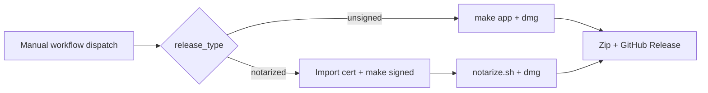

# Building GrokBuild

GrokBuild is built with **Swift Package Manager** (SPM). No Xcode project is required.

This personal line installs on Jimmy's Mac with `make ship` under **Apple Development** Team `DD2GCQJVB4`. Do not notarize. Do not publish a GitHub release titled `(Notarized)`.

For how the app works internally (sessions, MCP, updates, persistence), see [ARCHITECTURE.md](ARCHITECTURE.md).

## To Build & Run (Minimal Setup)

You only need **Xcode Command Line Tools**:

```bash
xcode-select --install
```

This is sufficient for:
- Compiling the app (`swift build`)
- Creating the `.app` bundle and DMG
- Codesigning with Apple Development for this Mac

### Quick start

```bash
make build          # or: swift build -c release
make test           # unit tests (Tests/GrokBuildTests/)
make run            # builds + launches .build/GrokBuild.app (release)
make run-debug      # debug build — includes Simulate Updates menu (see below)
```

You can also run the raw binary:

```bash
swift build -c release
./.build/release/GrokBuild
```

`make run` uses `scripts/build-dev-app.sh` for a lightweight `.app` wrapper; `make ship` installs the accepted `/Applications/GrokBuild.app`.

Both builders source `scripts/build-identity.sh` and stamp the bundle with
`GrokBuildBuildChannel`, `GrokBuildSourceRepository`,
`GrokBuildSourceBranch`, `GrokBuildSourceCommit`, and
`GrokBuildSourceDirty`. About and Settings → App display the same receipt.
Build from a clean committed checkout for an acceptance artifact; a dirty build
is labeled `(dirty)` and cannot masquerade as the settled personal line. The
canonical/retired repository contract lives in `CANONICAL_WORKTREE.md`.

Both builders also call `scripts/package-app-icon.sh`. `AppIcon.svg` is the
canonical vector master; `scripts/render-app-icon.swift` renders the committed
1024×1024 PNG fallback, and the shared packager fail-closes unless the resulting
ICNS contains all ten required macOS representations. Do not hand-copy a loose
PNG into either app bundle or let the dev and release icon paths diverge.

## For Development (Recommended)

If you're going to edit the SwiftUI code, install the **full Xcode** IDE from the App Store.

**Why full Xcode is worth it:**
- SwiftUI Previews (live canvas) — the biggest advantage
- Much better debugging tools (view inspector, environment values, etc.)
- Smoother experience when working with complex SwiftUI views

You can still build from the terminal with `make` or `swift build` even with full Xcode installed.

```bash
xed .          # open Package.swift in Xcode
```

Then select the `GrokBuild` scheme.

### Testing update UI locally

Debug builds (`make run-debug`) include **GrokBuild → Simulate Updates** (`#if DEBUG` — absent from release/`make run`/`make app` binaries). Use it to exercise the banner and update panel without publishing GitHub releases. Simulated app install relaunches GrokBuild (no binary swap); simulated CLI updates never run `grok update`.

To test real update flows:
- **CLI:** `grok update --version <older>` then **Check for Updates…** → click **Updates Available** on the banner → **Update grok CLI**
- **App:** this personal line reinstalls with `make ship`. Do not chase notarized GitHub app updates.

## Packaging

```bash
make app     # creates dist/GrokBuild.app (bundles skills, install helper, agent-desktop)
make dmg     # creates .app + DMG
```

Output:
- `dist/GrokBuild.app`
- `dist/GrokBuild-macOS.dmg`

GitHub release assets use versioned names, e.g. `GrokBuild-v0.1.10.app.zip` and `GrokBuild-v0.1.10-macOS.dmg`.

The build script (`scripts/build-macos-app.sh`) also:
- Renders and packages the canonical AppIcon into `Contents/Resources/AppIcon.icns`
- Copies the remaining Grok brand-mark assets into `Contents/Resources/`
- Stamps the personal repository, branch, exact git commit, channel, and dirty state into `Contents/Info.plist`
- Bundles `Resources/Skills/` into the app
- Copies `scripts/grokbuild-install-update.sh` → `Contents/Resources/grokbuild-install-update` (in-app upgrade helper)
- Bundles `agent-desktop` into `Contents/MacOS/` and verifies the copy runs (`agent-desktop version`). **Packaging fails if agent-desktop is missing.** Search order: `AGENT_DESKTOP_PATH`, then `~/.grokbuild/computer-use/agent-desktop` (Cursor Computer Use install), Homebrew/local bins, then `$PATH`. CI installs with `npm install -g agent-desktop`. Knowingly waive with `GROKBUILD_ALLOW_MISSING_AGENT_DESKTOP=1` only for a build whose Computer Use is non-functional.

## Scripts

| Script | Purpose |
|--------|---------|
| `scripts/build-macos-app.sh` | Assemble `dist/GrokBuild.app`, optional `--sign` |
| `scripts/build-dev-app.sh` | Lightweight `.build/GrokBuild.app` for `make run` |
| `scripts/package-app-icon.sh` | Shared fail-closed AppIcon/ICNS packaging for dev and release bundles |
| `scripts/render-app-icon.swift` | Deterministically render the canonical SVG master to a 1024×1024 PNG |
| `scripts/notarize.sh` | Unused on this line. `make notarize` is refused. |
| `scripts/release.sh` | Unsigned personal GitHub release only if explicitly asked; refuses notarized |
| `scripts/grokbuild-install-update.sh` | Used by the app at **Install and Restart** — wait for PID, `ditto` replace bundle, relaunch |

See also [scripts/README.md](scripts/README.md).

## Codesigning / Distribution

### Local config (`.env`)

Store signing credentials locally so you don't pass them on every command:

```bash
cp .env.example .env
# edit .env with your Apple Development SIGN_IDENTITY
```

`.env` is gitignored. The Makefile loads it automatically (`-include .env`).

Then install on this Mac:

```bash
make ship
make open
```

`make notarize` and `make release RELEASE_TYPE=notarized` are refused.

Command-line values still override `.env` (e.g. `make signed SIGN_IDENTITY="..."`).

To produce a local signed build:

```bash
make signed SIGN_IDENTITY="Apple Development: you@example.com (TEAMID)"
```

Or run the script directly:

```bash
./scripts/build-macos-app.sh --sign "Apple Development: you@example.com (TEAMID)"
```

### What the signing step does
- Builds with `swift build -c release`
- Assembles a proper `.app` bundle structure
- Signs each nested executable (`GrokBuild`, `GrokBuildComputerUseMCP`, `agent-desktop`)
  with the shared identifier `com.grokbuild.app`, hardened runtime, and a secure
  timestamp (`agent-desktop` additionally gets JIT/unsigned-executable-memory
  entitlements for its embedded JavaScript runtime), then signs the outer bundle with
  `--options runtime` — deliberately **without** `--deep`, which would re-sign the
  helpers with filename-derived identifiers and break the shared Accessibility grant

### Notes on entitlements
The main app carries the minimal unsigned-executable-memory entitlement needed for Swift runtime compatibility. The lifecycle HMAC key uses the standard macOS login Keychain so local SwiftPM builds do not require a provisioning profile; Keychain access stays off the main thread. `agent-desktop` separately receives the JIT entitlements required by its embedded JavaScript runtime.

## Notarization

This personal line does **not** notarize. `make notarize` is refused.
`make dmg` packages a local DMG and never calls the notary. Install with
`make ship` under Apple Development. `scripts/notarize.sh` remains for
upstream/CI parity only.

## In-app updates

GrokBuild ships a custom updater (not Sparkle). Two paths:

| Target | Mechanism |
|--------|-----------|
| **GrokBuild app** | Download `GrokBuild-{tag}.app.zip` from GitHub, verify codesign + Gatekeeper, replace bundle via `grokbuild-install-update` |
| **grok CLI** | Run `grok update` after shutting down live sessions |

### App updates on this personal line

This Mac installs GrokBuild with `make ship`. The in-app GrokBuild app-release feed stays off. Do not publish notarized GitHub app updates.

CLI updates remain `grok update`. Implementation: `GrokBuild/Services/UpdateChecker.swift`, `GrokCLIUpdater.swift`, `UpdatePanel.swift`. Full flow: [ARCHITECTURE.md — In-app updates](ARCHITECTURE.md#in-app-updates).

### Install helper

At **Install and Restart**, `AppUpdater` execs the bundled bash script:

```
Contents/Resources/grokbuild-install-update
```

Source: `scripts/grokbuild-install-update.sh` (copied during `make app`). It waits for the running app PID, replaces the bundle with `ditto`, and reopens the app.

In-app install requires:
- A writable install location (typically `/Applications`)
- Downloaded zip passing signature verification
- Matching Team ID when the installed app is signed

## GitHub Releases

This personal line does **not** publish GitHub releases as the install path.
Use `make ship`. The Actions Release workflow is upstream heritage. Do not
dispatch it for a `(Notarized)` title on this fork.

### CI (upstream heritage — leftover Phase 2)

Do not dispatch this workflow on the personal line. The install path is
`make ship`. The steps below document upstream/CI heritage only.

Workflow: `.github/workflows/release.yml`

**Trigger:** **Actions → Release → Run workflow** (manual dispatch only). Tag push auto-release is currently disabled in the workflow file.

Inputs:
- `release_type`: `unsigned` (default) or `notarized`. This personal fork refuses `notarized`.
- `version`: optional tag override; must match `VERSION` (e.g. `v0.1.11`)

Steps before dispatch:
1. Bump `VERSION`.
2. Commit and push to the branch you are releasing from.



#### Notarized CI release (default)

Requires repo secrets:

| Secret | Purpose |
|--------|---------|
| `MACOS_CERTIFICATE` | Base64-encoded `.p12` Developer ID cert |
| `MACOS_CERTIFICATE_PWD` | Password for the `.p12` |
| `SIGN_IDENTITY` | Codesign identity (defaults to `Developer ID Application`) |
| `APPLE_API_KEY_ID` | App Store Connect API key ID |
| `APPLE_API_ISSUER_ID` | App Store Connect issuer ID |
| `APPLE_API_KEY_BASE64` | Base64-encoded `.p8` API key |

CI installs `agent-desktop` globally (`npm install -g agent-desktop`) before building so it can be bundled into the app.

#### Unsigned CI release

Select `release_type: unsigned` in the workflow dispatch. No signing secrets required. Release notes include Gatekeeper bypass instructions.

**Notarization on CI:** `notarize.sh` supports Apple API keys (`APPLE_API_KEY_*`) for headless runners. Keychain profiles (`NOTARY_PROFILE`) work locally but not on ephemeral CI machines.

**Local vs CI credentials:**

| | Local (`.env` / keychain) | CI (GitHub secrets) |
|--|---------------------------|---------------------|
| Signing | `SIGN_IDENTITY` in Keychain | `MACOS_CERTIFICATE` p12 imported per job |
| Notarization | `NOTARY_PROFILE` (keychain) | Apple API key env vars |

The workflow creates/updates the GitHub release for tag `v{VERSION}` with versioned `.app.zip` and `.dmg` assets plus generated changelog notes.

### Local (`make release`)

For publishing entirely from your Mac (requires [GitHub CLI](https://cli.github.com/) authenticated with `gh auth login`):

```bash
# 1. Bump VERSION, commit
# 2. Publish unsigned release (default)
make release
```

`make release` is not the install path. This personal line uses `make ship`. If an unsigned personal GitHub release is ever explicitly asked for, `scripts/release.sh` still publishes only to `schmitzjimmy1-star/grok-build-desktop` and never to `origin`. `RELEASE_TYPE=notarized` is refused.

## SPM targets

| Target | Output |
|--------|--------|
| `GrokBuild` | Main windowed macOS app |
| `GrokBuildComputerUseCore` | Shared Computer Use contract library (app + helper + tests) |
| `GrokBuildComputerUseMCP` | Stdio MCP bridge → `agent-desktop` (bundled/copied at app build) |
| `GrokBuildTests` | Unit tests |

Platform: macOS 26+ (`Package.swift`).

## Brand mark

The Grok mark lives in the asset catalog. The imageset keeps its legacy filename for packaging compatibility:

- `GrokBuild/Resources/Assets.xcassets/MenuBarIcon.imageset/MenuBarIcon.png`
- `GrokBuild/Resources/Assets.xcassets/MenuBarIcon.imageset/MenuBarIcon@2x.png` (recommended)
- `...@3x.png` (also supported)

The build script copies these into `Contents/Resources/` for the welcome state and app-icon fallback. No need to duplicate PNGs at the project root.

## Related docs

| Doc | Use |
|-----|-----|
| [ARCHITECTURE.md](ARCHITECTURE.md) | App architecture, persistence, updates, task → file map |
| [AGENTS.md](AGENTS.md) | Agent entry point |
| [README.md](README.md) | User-facing feature list |
| [scripts/README.md](scripts/README.md) | Build script overview |
