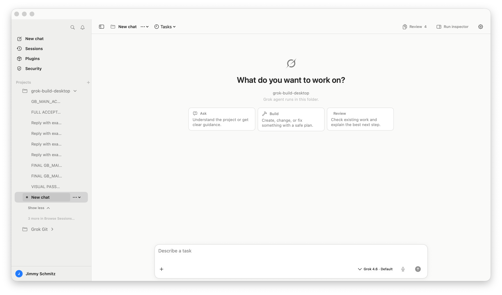
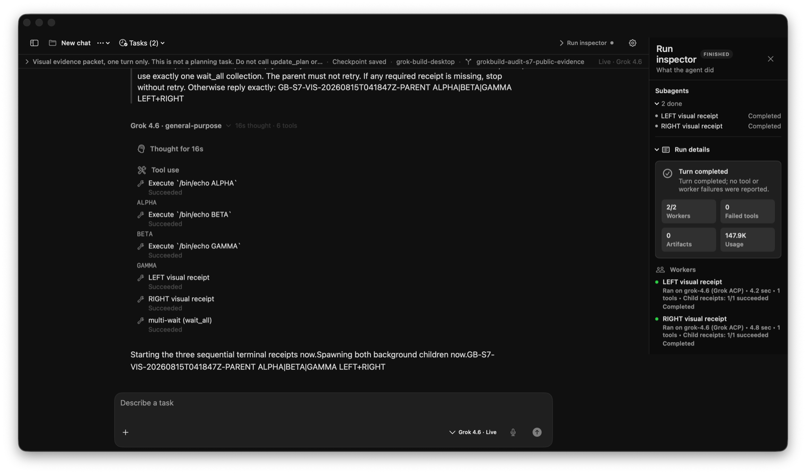
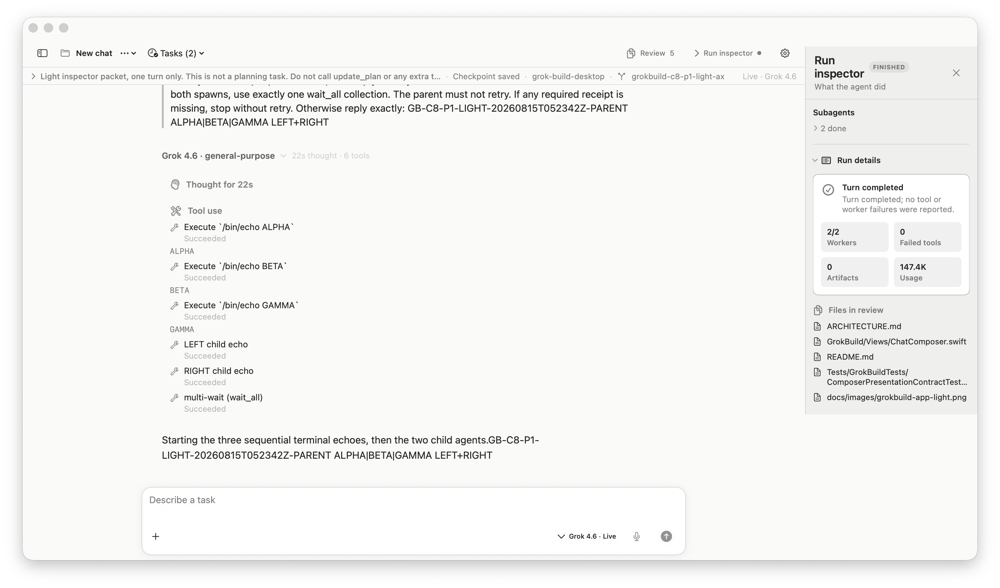

# GrokBuild Desktop App

> [!IMPORTANT]
> This checkout is Jimmy's maintained personal GrokBuild line:
> `schmitzjimmy1-star/grok-build-desktop`, branch `main`, installed
> as `/Applications/GrokBuild.app`. The older `jimmmy-Jim/Grok-Build-GUI`
> project is retired and must not be built or installed. See
> [`CANONICAL_WORKTREE.md`](CANONICAL_WORKTREE.md) before making changes.

Codex starts at [`GROKBUILD_ACP_CLIENT_AIM.md`](GROKBUILD_ACP_CLIENT_AIM.md):
GrokBuild is a thin ACP client; the grok CLI owns the agent.

GrokBuild is a native SwiftUI macOS workbench for the [`grok`](https://grok.com) CLI. It is a thin wrapper, not a second agent runtime. The CLI still owns ACP, MCP tools, skills, permissions, memory, plan mode, and subagents.

Work lives in a project folder as durable session tabs you can resume. New chat stays idle until Send. **Ask**, **Build**, and **Review** only seed an editable draft. After a turn, the transcript and **Run inspector** show the exact tools, children, and model/route receipts for that tab and process generation. GrokBuild does not invent a fallback provider or rewrite an older launch.








These screenshots are from the signed `/Applications/GrokBuild.app`. Dark is the existing-install default; Light is a real Settings → App appearance, not a recolored Dark PNG. Settings → App still offers System, Light, and Dark. The composer identifier is `grok-message-composer` and its accessibility label is **Message composer**. The visible placeholder is **Describe a task**; when the field is empty, that same phrase is the accessibility value. Welcome copy remains **What do you want to work on?** Acceptance history, Gates A–H, and campaign receipts live in [`ARCHITECTURE.md`](ARCHITECTURE.md) and [`docs/OUTSTANDING.md`](docs/OUTSTANDING.md).

## Requirements

- macOS 26 (Tahoe) or later
- The `grok` CLI installed, usually at `~/.grok/bin/grok`
- A logged-in CLI session — run `grok login` in Terminal before starting your first session (not needed if you only manage custom models)

## Quick Start

### Start with a project

1. Install and sign in to the `grok` CLI (`grok login`).
2. Open the signed personal build at `/Applications/GrokBuild.app`. Upstream releases do not contain this repair line.
3. Choose **Add Project** and pick a folder. It can be a code repo, a docs folder, or a scratch workspace.
4. Start a session. **Ask**, **Build**, or **Review** seed an editable draft; they do not send. Send is what talks to grok. The composer model menu holds the grouped model list plus reasoning effort, usage, and the exact route/process receipt.

### Custom models only

If you mainly use the grok TUI or CLI and just need a UI for providers and models:

1. Install the `grok` CLI and open GrokBuild Desktop App (no project or `grok login` required for this path).
2. Open **Settings → Models**.
3. Install a provider, use its declared connection method, run **Test connection**, then add one or more returned OpenAI-compatible models. OpenRouter supports S256 browser OAuth or a pasted API key; local Ollama needs no credential; the other official presets use API keys.
4. Provider secrets are stored in macOS Keychain with device-only accessibility. GrokBuild projects the official Grok `[model_providers.*]` + `model_provider` contract into owner-only (`0600`) `~/.grok/config.toml`; a signed helper returns the exact provider credential to the CLI on demand, so the secret is not copied into model tables.

GrokBuild does not load provider credentials from a project `.env` file. A custom or local endpoint may use an unverified model ID only through the explicit advanced path.

**Test connection** proves the key, endpoint, catalog response, and configured-model visibility. The Grok CLI still owns actual chat/tool routing, so a catalog can pass while a particular CLI completion endpoint or tool combination is unsupported; that failure is reported separately instead of being mislabeled as bad authentication.

## What GrokBuild Desktop App Is

GrokBuild Desktop App owns the macOS workbench: project navigation, durable session tabs, branch/worktree controls, build-oriented composer, diff review, settings, browser/computer-use enablement, and the local app update flow. The transcript is the record of work performed by an agent inside a project; GrokBuild is not designed or evaluated as a general-purpose chatbot. A common lightweight use is **Settings → Models** alone: manage custom providers and models for the shared `~/.grok/config.toml` without opening a project or starting a session.

It is **not** a replacement for the CLI. The `grok` CLI still owns agent reasoning, ACP, MCP tools, models, skills, subagents, plan mode, permissions, memory, hooks, plugins, and `AGENTS.md` instructions.

## Install

Jimmy's maintained app is built from this checkout and installed at
`/Applications/GrokBuild.app`. Its About panel and Settings → App show the
personal repository, branch, exact source commit, and dirty-state receipt; do
not accept `0.1.22` alone as proof of source identity. The preserved
[`rimusz/grok-build-desktop`](https://github.com/rimusz/grok-build-desktop)
remote is upstream reference, not the owner of the installed personal repair
line.

Install on this Mac with `make ship`. Do not treat a GitHub zip/dmg name as
the installed identity.

## Feature Highlights

### Sessions

- Streaming agent sessions for `grok agent stdio` with Markdown, public reasoning summaries, readable tool activity, permission prompts, plan/question cards, and diff review. Each assistant turn is one conversation-workbench story—model and authoritative outcome, public reasoning stages, plain-English tool actions, answer, then any turn-attributed changed files—rather than a stack of unrelated cards. **Working**, **Completed**, **Needs review**, **Failed**, **Stopped**, and **Cancelled** come only from live state or the turn checkpoint; legacy turns without a checkpoint stay unlabeled. Tool rows preserve receipt status and duration, reveal bounded output only on demand, and keep live command arguments behind the existing explicit disclosure. Repository-wide dirt that cannot be attributed to the turn remains on the header Review control instead of being claimed by the agent. Question, permission, and plan cards are owned by the exact ACP backend-session/request identity; activity rows never become a second reply surface, and plan approval continues the same turn without fabricating a `[Plan approved]` chat prompt. The completion bridge accepts grok's live `_x.ai/session_notification` lifecycle frames and settles only after exact tab/backend/generation ownership; a missing receipt fails closed instead of becoming synthetic success. Terminal exit code, timeout, and signal receipts override a generic outer `completed` status. ACP-emitted public reasoning summaries preserve ordered source chunks, join token deltas only across explicit whitespace/punctuation continuation, and add presentation-only stage boundaries when the backend supplied none; the transcript shows a bounded public summary, none of it becomes transcript/export state or hidden chain-of-thought capture, and full selectable evidence remains in the Run inspector.
- Multi-tab sessions with lazy restore, resumable grok sessions, and a session browser that lists grok history for every GrokBuild sidebar project (Resume still opens that session's folder). Resume consumes Grok's typed ACP `session/load` replay into a separate history buffer, verifies the exact backend/tab/process generation, and reconciles only the root user/assistant conversation into the app-owned presentation cache. The release app does not read the CLI's private root or child session files.
- Fresh-turn context accounting is provider-free and honest: GrokBuild separately reports observable project instructions/context, skill and MCP catalogs, requested/deferred schemas, transcript history, user content, and memory. Grok CLI-owned system instructions and provider wrappers remain explicitly **unmeasured** unless ACP exposes exact bytes; GrokBuild never guesses them. The maintained project instruction packet is 37% smaller without removing identity, safety, test, signing, or acceptance contracts, and unrequested MCP schemas stay deferred behind the CLI's progressive discovery path. Release acceptance uses evidence-derived ceilings—750 ms cold first window, 10 s cold first-intent readiness, 8 s cold and 3 s warm dispatch-to-first-chunk, zero idle owned processes, and 40K tokens for the minimal native terminal lane—as test gates, not as a second scheduler or token authority.
- Each local tab transcript is stored as an owner-only, atomic file under Application Support with a small metadata sidecar. Saved v1 preference blobs are copied and verified before use, then retained as rollback input for this release; tab switches update layout metadata without rewriting every transcript.
- Restore metadata is loaded off-main and only the selected tab hydrates its message body; rich Markdown parsing and visible Mermaid/display-LaTeX sizing are bounded by a process-local cache with explicit WebKit teardown. During streaming, incomplete code fences and tables remain behind a brief readable formatting state instead of being presented as finished raw syntax. Final tables use the available reading width with content-aware columns and horizontal overflow only when needed; Mermaid either renders or presents a labeled, copyable source fallback. Nested lists retain their indentation, ordered lists retain their authored numbers, and checklists render checked/unchecked state with level-aware accessibility labels; link-only groups are announced as source lists instead of a flat run of bullets. Readers can detach from streaming output without losing their place, then use the accessible **Jump to latest** action when ready. While the transcript is auto-following a live or settling answer, text selection is paused so AppKit selection overlays cannot fight the lazy transcript layout; copy returns after that window.
- Session restore uses the last tab you intentionally activated—not the tab with the longest transcript. Empty or divergent saved selections cannot outrank a viable recent transcript.
- Model and session-agent choices preserve intent: inherited tabs keep following their project/global default, while a picker choice remains an explicit per-tab override. Legacy saved models remain conservatively classified until the next explicit choice.
- The v3 session layout is committed with a separate integrity marker while the v2 layout remains untouched as rollback input. A failed/mismatched migration opens the legacy layout read-only instead of pretending the workspace is empty.
- Saved Grok backends are checked against the exact local transcript after `session/load` has returned its typed replay and before any provider prompt can dispatch. A restored tab never looks like New chat while its transcript is still loading: it shows **Loading saved conversation…** and the same three named, keyboard- and VoiceOver-readable choices—**Resume current task**, **Start new task**, and **Browse old tasks**—without Ask/Build/Review pills, a stale process warning, or a provider turn. Genuine New chat still gets those starters. A normal restored launch still waits for an explicit Resume or Send. Exact/prefix replay matches resume normally; missing, incomplete, divergent, or composite histories keep the loaded connection read-only for official recovery review without mutating the readable local cache. If the mismatch is discovered during Send, that same frozen Send intent tears down the rejected connection, preserves the predecessor, and creates a fresh successor before dispatch—no second click and no prompt reaches the rejected backend. **Relink** uses bounded standard `session/list` plus official `x.ai/session/updates` evidence when the connected CLI supports it, then re-fetches and re-verifies the chosen backend before tearing down the review connection. Known-old or unsupported CLIs report that review/detail is unavailable instead of scraping private files. One matching prompt never auto-binds a tab. Local-only work creates a fresh backend lazily on first send and labels it **New backend bound** rather than falsely verified; fallback/fork relationships are retained in the authenticated v3 ledger.
- Adaptive neutral visual system with a compact native SF type scale, centered reading column, flat matte surfaces, restrained corner radii, quiet status chrome, and real System/Light/Dark appearance support. Dark interactive chrome is near-white and Light interactive chrome is charcoal; warning, link, and status colors keep their separate semantic jobs. These tokens are app-owned, so a macOS purple/blue accent choice cannot leak into ordinary GrokBuild controls; Contrast, reduced transparency, reduced motion, and large text keep the same task hierarchy across modes.
- The composer starts at one accessible line and grows to eight for real multi-step requests. P3C keeps every 36×36 target while using 7 pt inner and 5 pt outer vertical padding and no decorative card shadow. The bottom row carries only immediate authoring controls (Codex parity Slice 4): one **+** add/context menu (files, MCP connections, skills/workflows including **Saved Workflows…**, Browser Tools, Computer Use), the run-mode control (only ACP-advertised ids), the model menu, voice, and Send. Context, usage, and route/process receipts live in the model menu; Review lives in the header and inline changed-files card; branch/worktree switching lives in More. P3D removed the duplicate live **Run / Working / Run inspector** transcript card: live phase and Stop remain in the task strip, thinking and readable tool receipts remain with the assistant turn, and current workers open the right activity canvas. Missing duration, ownership, artifact, or child-tool evidence says **not reported** instead of being estimated. The editor owns one native AppKit cursor rectangle, so the pointer is an I-beam only over text entry. The inspector's generation-bound **Live** projection withholds outcome and usage; the authoritative completion barrier replaces it with **Settled** worker/tool/artifact/model/process/continuity/usage evidence. A completed worker with a failed or unreconciled typed child tool is **Needs Review**, not clean green. User Stop remains a distinct local settled outcome and keeps cancelled/orphaned workers visible. Missing completion receipts preserve partial evidence and require reconnect instead of manufacturing success. Starting a new turn clears prior-turn live workers while scheduled tasks remain session-wide; Git review remains bounded and event-driven. GrokBuild does not run a permanent filesystem watcher.
- The native frontend follows the Codex desktop conversation shell: a compact command rail, nested projects and sessions, quiet task header, transcript-first canvas, optional **Run inspector** (docked at the default 1440×900 window), and wide **Describe a task** composer. A new chat offers compact **Ask**, **Build**, and **Review** chips that seed editable drafts in the selected project. They do not send a prompt. Those chips hide as soon as the composer has a draft. A fresh empty tab stays idle until Send: typing a draft does not spawn `grok agent stdio`. After Send, the composer and task header say **Starting agent…** / **Connecting** until the live model is confirmed. An idle inherited New chat labels the catalog model **Default**, not Unknown. Unknown is reserved for a receipt conflict or an empty picker. Complete model and receipt controls remain one click away.
- The composer can attach any enabled Grok MCP connection to one prompt from the network menu immediately left of the hammer. Attached connections appear as removable chips; selection requests their use but never claims it. Cached/CLI inventory proves only configuration, while **Process ready** is a generation-bound startup receipt. Catalog discovery is labeled discovery, not browser execution; only an exact qualified invocation receipt may name a server as used. Turns that used tools show the public thinking summary and redacted discovery/tool receipts beneath the model label by default, including after local transcript restore. Settled execute, terminal, and read rows include bounded output in the transcript; authoritative selectable details remain in the Run inspector so AppKit selection overlays never sit inside the transcript's lazy tool rows. Each tool has its own accessibility name (operation, server, status, duration) instead of one combined tool-details blob. Collapsing that turn still hides them. New-turn traces survive restore without rewriting Grok's backend history.

### Project Workflow

- Collapsible project sidebar with roomy folder rows, pinned projects, recent sessions for the selected project, session rename/close, one-click **New Project** onboarding, and an on-demand project filter. Folder glyph, project name, and session disclosure each occupy a stable column with clear hover and selection states. The session menu distinguishes **Close Local Tab** (remove only GrokBuild's transcript/layout projection and retain the CLI backend) from destructive **Delete Session**. Backend deletion runs only when the local tab, durable binding, and saved layout resolve to one exact backend ID; conflicting identities stop deletion, and a failed backend deletion is reported with the preserved ID. Ordinary app quit preserves backend history, and removing a workspace is local-only. The sidebar slides over a full-width chat canvas (Codex-style) instead of stealing a split-pane column. The titlebar row sits just under the traffic lights, keeps a sidebar toggle, and moves secondary actions into one menu. A quiet rule separates headers from content, and update banners clear the traffic-light row instead of colliding with it. Settings opens from the sidebar account row or Command-comma.
- Full-width Settings workspace with one compact internal navigation rail and a centered 760 pt content column; opening Settings never brings the project sidebar back or stacks two sidebars together. Switches use one small trailing control column, permission editors stay shallow and neutral, and Marketplace sources stack above the full-width plugin list instead of squeezing it into a split view. Technical monospace typography is reserved for actual commands and diagnostic logs.
- Settings mounts only the selected pane, so hidden diagnostics and loaders stop instead of quietly chewing resources. All fourteen panes now use the shared state contract: editable values survive pane changes as parent-owned drafts, inventories preserve a last successful result as stale on refresh failure, and row-local work stops with the hidden pane when safe. Browser Settings begins with neutral **Checking browser support…** copy, retains its last proven status during manual diagnostics, and withholds setup/install/destructive runtime controls until the first probe settles. An edit is never persisted until **Apply** or an explicit row action, every action states its persistence/restart/trust scope, and receipts distinguish Draft, Saved, Restart required, Live, Unknown, success, partial, and failure without leaking credentials. Future-only defaults say so; launch-affecting changes restart only the current live tab. Narrow windows and accessibility text stack form rows instead of crushing labels.
- Workbench focus order follows the task path from controls to transcript to composer, and Settings focuses the selected pane after sidebar navigation. Rich code exposes language and Copy, tables expose a linear row description, and Mermaid/LaTeX expose selectable source when a rich preview cannot render. VoiceOver receives terminal action results and continuity/model warnings without a streamed-token announcement storm.
- Per-tab **model** selection begins in a simple empty-session menu and remains available with per-project **reasoning effort** through the composer's model menu. Model labels distinguish Saved, Default, Connecting, Pending, Requested, Live, Last live, Rejected, and Unknown. An idle inherited New chat with a catalog model is Default, not Unknown. Connecting is the unconfirmed spawn after Send. Last live stays on the confirmed receipt; if an inherited tab followed a newer CLI or project default, the picker says Default instead of claiming that newer model was last live. Fresh chats seed this list from the installed `grok` CLI and fall back to Grok 4.6 plus Grok 4.5 while ACP connects; before a selected custom model becomes sendable, GrokBuild reasserts it through ACP and requires an exact effective-model readback so a provider tab cannot silently run the default Grok model.
- Clickable **route contracts** beside the context meter distinguish native xAI, direct providers, local endpoints, and brokered OpenRouter models. Their menu exposes the process/model receipt, endpoint host, pinned model state, and fallback boundary without exposing credentials. OpenRouter's downstream serving provider is explicitly labeled unproven because ACP confirms the effective model, not OpenRouter's internal provider choice.
- Git branch/worktree management from the session status row.
- `Open in` menu for Finder, Cursor, VS Code, Terminal, iTerm, and Zed.
- **Grok and provider sign-in** — **Settings → Models** shows coarse local Grok sign-in state and can launch the resolved CLI's xAI browser flow (`grok login --oauth`) without storing its session. OpenRouter supports exact-loopback S256 OAuth or paste-key setup; every other preset declares API-key or keyless connection explicitly.
- **Custom models (standalone)** — OpenAI-compatible providers and models in **Settings → Models** with device-only Keychain-backed provider secrets, typed catalog validation, redacted diagnostics, native Chat Completions / Responses / Anthropic Messages routing, and atomic owner-only writes to `~/.grok/config.toml`. Linked bearer providers use Grok's official `[model_providers.*]` contract and the bundled signed Keychain helper; local keyless endpoints get an explicit no-auth provider boundary. Remote keyless flat models fail closed, so a custom endpoint cannot inherit the signed-in xAI session token. Unowned advanced Grok structures remain byte-for-byte CLI-owned and visibly read-only. A pinned TOML 1.0 parser validates the whole document before the app's syntax-preserving targeted rewrite; GrokBuild-only UI hints and credential provenance stay in a non-secret sidecar. OpenAI preset models default to the Responses API. Usable on its own (no project/session); the live CLI/ACP catalog is the final model-picker membership authority.

### Agent Capabilities

- **Main agents** — browse agents discovered by `grok inspect --json` and choose a drafted default for future sessions. Agent selection and execution remain backend/session state; the primary chat chrome does not spend permanent space on a general-purpose picker.
- **Custom subagents (roles)** — create reusable roles with a name, optional model, and instruction. GrokBuild Desktop App writes them to `[subagents.roles.*]` in `~/.grok/config.toml` and stores instructions in `~/.grok/prompts/<name>.md`.
- **Using subagents** — keep the main agent as Default and prompt normally; grok delegates to matching subagents automatically, or you can ask for one by name (for example, *"use the researcher subagent to map the auth flow"*). **Run as custom role** in the agent picker runs the whole session as that role instead of spawning a child subagent. To block spawning child subagents, use **Settings → Permissions**.
- Inspect hooks, plugins, marketplace sources, compatibility layers, skills, and MCP servers from Settings with retained checking/empty/stale/error states. Plugin and marketplace mutations require explicit trust and show row-local receipts. MCP setup uses structured stdio/http/sse fields, preserves ordered argument boundaries, supports user/project scope, and redacts stored environment/header values; the installed CLI stores those values literally, so adding a secret requires a disclosure acknowledgment. Compatibility follows the current `externalCompat.cells` schema (including Codex sessions-only support) instead of treating malformed inspection output as an empty success.

### Optional Automation

Make Browser and Computer Use available from **Settings → Browser** / **Settings → Computer Use**, then explicitly turn either one on for the current thread from its composer indicator. Both helpers start off in every new thread; terminal/files/Git-only work neither launches them nor waits on their readiness. Changing a thread's selected helper reconnects only that tab and is disabled while a turn is live.

- **Browser control** — let Grok drive a real Chromium browser via `browser_*` MCP tools backed by [`agent-browser`](https://agent-browser.dev). Use a managed automation profile or attach to Chrome, Brave, Edge, Arc, or another Chromium browser over CDP. Every Grok session owns an isolated browser runtime key while the optional automation-session name remains its reusable login-state key; closing the tab or app closes that exact managed runtime instead of leaving a reparented browser daemon behind.
- **Computer Use** — let Grok drive native macOS UI via `computer_*` MCP tools backed by [`agent-desktop`](https://github.com/lahfir/agent-desktop) (bundled into the app at packaging time), with an allow/block action policy, screenshot gating, command timeouts, deterministic main-window targeting, a dedicated graceful/explicit-force `computer_close_app` contract, and optional Cursor MCP integration. Cursor Agent loads that optional install as `user-grokbuild-computer-use` from `~/.cursor/mcp.json`; a GrokBuild chat injects `grokbuild-computer-use` into grok. Same helper family, different hosts: Cursor drives the GrokBuild workbench, grok's Computer Use drives other Mac UI from inside a session, and they must not target the same app in one turn. **Test Computer Use** reports only a compact typed receipt (protocol/helper version, `computer_list_apps`, app count, bounded duration, and prerequisite proof); the app inventory and process identifiers are never shown in the default success message, while bounded redacted diagnostics remain opt-in. Editing a screenshot draft never asks macOS for Screen Recording; that prompt is gated behind the explicit **Request Screen Recording** action after the setting is applied.
- **Memory** — experimental and off by default. Enable it from Settings; memory remains a backend/CLI concern rather than permanent session chrome.
- Applying a launch-affecting Memory change restarts only the exact current live tab; a streaming turn queues and coalesces the restart. Success requires a matching newer process receipt, while a reconnect fork is disclosed as partial instead of false green. Tabs with no live process simply use the saved value when they next start.
- **Background tasks** — scheduled `/loop` tasks plus background shells, monitors, and subagents remain mirrored by `ChatStore` from ACP. The Tasks pill and Run inspector show **this turn's** live workers (`beginUserTurn` prunes prior-turn subagents **and** unmatched spawn receipts at each send while keeping scheduled tasks). Unbound `subagent_spawned` receipts (no matching spawn row) surface as synthetic inspector rows and Tasks pill entries without inventing a `BackgroundActivity`. Spawn tool, `subagent_spawned`, and `subagent_finished` receipts reconcile in any arrival order while ambiguous descriptions stay explicitly unbound. User **Stop** marks mid-child subagents **orphaned** (bound child, no `subagent_finished`) or **cancelled** (no child id) — never `"stopped"` as fake success. On Grok 1.0.5 or newer, terminal child receipts come from bounded `x.ai/session/updates` pages on the same per-tab ACP connection; installed 1.0.4 reports that detail unavailable rather than reading private CLI files. Reads still distinguish **unreadable** (`nil`) from **empty** (`[]`), and child prose never becomes tool evidence. The Run inspector shows spawn-created workers plus unbound spawn and finish-only receipts as expandable delegation rows (`grok-run-inspector-worker`): spawn tool id, child session, duration, tool count, and typed `tokens_used` / turn counts when `subagent_finished` supplied them (missing counts stay absent). It correlates spawn-call and child identities. Wait/collection and kill tool calls update an existing worker row and never invent a second worker. The inspector surfaces authoritative completed/failed/cancelled results plus explicit unknown/orphaned states when terminal evidence is missing. A live scheduler inventory now gives that exact session/backend/process generation a visible **Runtime pinned** lease: ordinary LRU switching cannot stop it, the Session dashboard and Tasks menu show its receipt and next checkpoint, and protected overflow warns when the normal four-process cap is exceeded. Long-horizon retention also covers non-scheduled work: a session with a running background shell, monitor, or live subagent (`ChatStore.hasActiveBackgroundTasks`) is protected from four-tab connection-cap eviction exactly like a busy turn, so opening other tabs cannot silently sever it. Active schedule status is surfaced directly in chrome — the top-bar Tasks pill turns into an orange **Scheduled** clock badge and each sidebar session row shows a schedule clock indicator — so pinned long-horizon work is visible without opening a menu. Cancel, Stop, close, quit, reconnect, or process failure releases the lease; restored or cached task metadata cannot recreate it until the live backend is observed again, and no daemon continues schedules after GrokBuild exits.
- **Navigation-only sidebar** (Codex parity Slice 1) — the left sidebar is projects and chats: New chat, Plugins, and Security are action buttons above pinned projects; **Recents** is the one session-discovery lane for the selected project, with search and an account row that opens Settings. Those actions never claim accessibility selection from focus, hover, or a prior click; the real session row owns persistent visual and semantic selection, or its project row does when no session is selected, while Settings owns its selected pane. The sidebar-header bell opens the **Session dashboard**. The former sidebar Activity lane, Agents hub, and Connections lane were removed as permanent sections; their capabilities remain in the Run inspector and session dashboard, the Settings → Agents pane (defaults and custom roles), and the composer's MCP attachment menu respectively — nothing was deleted from the runtime.
- **Run inspector** (Codex parity Slice 5, P3D live activity) — the header control is a quiet dropdown of phase, model, tokens, worker counts, and failures. Current workers automatically open a compact 340-point canvas that docks at ≥1,180 pt, overlays from 900..<1,180 pt, and collapses to a named/count strip below 900 pt. Each face shows one assignment, one status, and only a distinct current action; the raw parent request and exact parent/spawn/child/model/usage/tool reconciliation stay behind **Parent request** and **Details** disclosures. Completed workers with failed or unreconciled typed child tools show **Needs Review**. MCP evidence, Sources, and the deep ledger remain opt-in. Missing backend metrics stay absent rather than becoming fake zeroes; changed files live in the inline card and Review pane.
- **Run history and evidence export** — opening the Session dashboard takes one historical snapshot from the newest bounded local-message window; it does not recompute history for every streamed UI chunk. The dashboard groups durable assistant-turn checkpoints by retained backend identity without flattening turns. Every saved row is explicitly **historical**, never a substitute for Live state. **Copy redacted Markdown receipt** and **Export redacted JSON** produce deterministic, bounded local evidence from typed checkpoint fields only; receipts disclose when the source window was truncated, and emitted worker, artifact, and tool lists disclose retained versus observed counts. Prompts, response bodies, raw tool input/output, file paths, raw environment values, credentials, Keychain material, and private reasoning are excluded. Where older checkpoints did not retain route, parallel-group, or retry fields, exports say `not retained` rather than guessing.
- **Any model as your main agent** — model menus group your configured providers ("Your models") beside Grok's natives, and one click sets the current model as the default for new sessions in the project — so DeepSeek, GPT, Kimi, or any OpenRouter route can be the primary brain, not just a per-tab override.
- **One-submit first send** — Send is the only `grok agent stdio` launch gate. Typing a draft does not spawn the agent. If Return arrives before startup is ready, GrokBuild latches that exact draft once, shows the real
  preparation stage, and dispatches automatically after the selected model and
  requested connections are confirmed. Cancel before dispatch restores editing and
  sends nothing; repeated Return/click events cannot duplicate the request.
- **Durable task contract** — the collapsed thread header is one calm
  **objective · phase** line plus disclosure. Expand it to review the exact
  project/worktree/branch, model receipt, requested MCP/GUI
  tools, Git review state, saved checkpoint, and parent→child worker identities. A
  saved task can explicitly resume only through Grok's exact `session/load` plus the
  existing continuity check; Cancel, Stop, goal Pause/Resume, Continue as New, and
  Resume remain separate actions. GrokBuild never claims a task continues after its
  owning process exits, and it does not invent a pause operation for an active model
  call.
- **Thread-native review result** — settled typed plan steps retain the exact parent
  command/test receipts and successful artifact paths that were observed while each
  step was current. Review always re-reads the selected worktree through Git and
  makes **All changes**, **Unstaged**, **Staged**, **Last commit**, **Branch**, and
  **Last turn** scopes explicit. If last-turn attribution cannot be proved from a
  successful write/edit receipt, the pane says so and falls back to current
  repository truth. Per-file revert is offered only for a supported exact path: Git
  saves a recovery stash first, reverts that path, then proves unrelated dirt
  survived. Commit/push/PR readiness is visible review state; publication remains an
  explicit user action.
- **Subagent model routing, visible** — when a spawned worker matches one of your custom roles, its receipt says exactly where it routes: "Routes to deepseek-deepseek-v4-flash-0731 (configured)". The roles editor groups model choices by provider so your OpenRouter and API models are first-class routes.
- **Session usage HUD** — the composer's model menu keeps a running meter of settled-turn usage ("12.4k tokens · 3 calls · 2 turns"), with an honest dollar estimate range when a model's catalog pricing is known (captured automatically from OpenRouter's catalog during Test connection). No pricing, no fake $0.
- **Observed model performance, locally** — **Settings → Models → Observed on this Mac** groups bounded authoritative completion receipts by exact model, stable credential-free route identity, and comparable workload class. Custom routes use their frozen provider-facing model ID as the stable cohort name even when ACP confirms the equivalent local selector key; native xAI retains its confirmed effective model. Durable same-backend checkpoints plus ACP's authoritative backend user-prompt index identify later-prompt continuation across restored local tabs, including context after a stopped or failed attempt; provider-internal model-cycle counts never do. It recognizes native xAI's receipt-only `-build` usage alias, otherwise keeps unattributable fields missing, and counts a recovery success only from explicit successful retry receipts; failed child tools remain unrecovered when ACP exposes no child retry link. Measured latency/usage ranges plus completion, recovery, and unresolved-worker rates never auto-select a model, declare a winner, or claim OpenRouter's downstream provider. **Clear local observations** removes only this app-local evidence after exact confirmation; provider credentials, model configuration, Grok history, and transcripts are untouched.
- **Tool-run inspector** — while an agent works, each live tool row in the Run inspector expands to its full redacted input receipt. `search_tool` rows say capability discovery and never receive a browser-use/source claim; `use_tool` rows show the authoritative qualified tool and server (for example, `chrome-devtools__list_pages` via `chrome-devtools`). A requested qualified tool missing from a settled current-turn catalog receipt appears as **Unavailable for this turn**, not failed or succeeded use. Workers that finish mid-turn show their duration/tool-count receipts immediately.
- **Rhai workflows** — enable in Settings → Workflows (`[workflows] enabled` in config.toml, shared with the grok TUI). Workflow runs remain backend/CLI state and can be invoked through slash commands or the composer command menu; there is no permanent workflow status strip.
- **Session tools** — fork session (new tab with `--fork-session`), share link (`/share` + clipboard), `/btw` aside panel, create-skill sheet, and a status-grouped multi-session dashboard whose full-width, stable accessibility rows switch existing local tabs without launching a backend just for inspection.
- **Documents and spreadsheets** — use grok's document skills (`xlsx`, `docx`, `pptx`) to create, read, edit, and reformat Office files from paths in your workspace. Spreadsheet skills may need [LibreOffice](https://www.libreoffice.org/) installed for some conversions.

### App Experience

- A normal windowed Mac app with standard application menus, native SF Symbols, and no redundant status-item applet. Settings → App owns System/Light/Dark appearance selection and applies it without restarting a session.
- Grouped vertical Settings navigation keeps all configuration areas readable without a fourteen-tab horizontal traffic jam.
- In-app update panels for the `grok` CLI. This personal line installs with `make ship` under Apple Development. It does not offer notarized GitHub app updates.
- Adaptive SwiftUI design with accessibility labels for interactive status controls plus native link elements, semantic headings and nested lists/checklists, spoken equation labels, and table header/cell summaries in rich results. Rich rendering is detached from the main actor and reuses parsed content where message identity, content, width, appearance, and render version still match.

## Permissions & Privacy

- GrokBuild Desktop App talks to the local `grok` CLI; your prompts, tool calls, model routing, auth, and CLI-side storage follow the CLI's behavior.
- Browser control uses a separate managed Chromium profile by default. If you attach to an existing browser over CDP, Grok can interact with that browser window.
- Computer Use requires macOS Accessibility permission. Screenshots require Screen Recording and are optional.
- **Settings → Permissions** separates interactive **Ask**, **Auto**, and **Always approve** behavior from advanced automation modes. **Deny unapproved (CI)** is explicitly described as deny-by-default headless behavior, not as a low-interruption interactive mode. Permission cards describe the launched process receipt, not an unapplied Settings draft; an unexpected ACP request under Always approve is safely answered without blocking, while explicit deny rules, hooks, and sandbox limits still apply. Unattached MCP tools stay denied even under Always approve: the per-thread gate recognizes both `server__tool` names and split `serverName` + `toolName` fields, and only an explicit composer attachment can authorize that server.
- Permission rules and launch policy remain in a local draft until Apply. Applying them restarts only the current live tab, and its old live receipt remains visible until a matching newer process receipt proves the replacement.

## Building from source

### Minimal setup

You only need **Xcode Command Line Tools**:

```bash
xcode-select --install
```

That is enough to compile the app, create the `.app` bundle, and install with `make ship`.

```bash
make build          # build the release binary
make test           # run unit tests
make run            # build release + launch from .build/GrokBuild.app
make run-debug      # build debug + launch — includes menu **Simulate Updates**
make app            # create dist/GrokBuild.app
make dmg            # create the .app + DMG
```

See [BUILDING.md](BUILDING.md) for packaging and the `make ship` install path.

### Opening a self-built (unsigned) app

Local builds from `make app` / `make run` are unsigned. macOS Gatekeeper may block them the first time you open a copied `.app` (for example after moving `dist/GrokBuild.app` to `/Applications`):

1. **Right-click** `GrokBuild.app` → **Open**, then confirm **Open** (bypasses the block once).
2. Open **System Settings → Privacy & Security** and click **Open Anyway** next to the blocked-app message.
3. Or remove the quarantine attribute:
   ```bash
   xattr -cr /path/to/GrokBuild.app
   ```

This personal line stays on `/Applications/GrokBuild.app` via `make ship`. Rebuild from source when you want a new install.

### Recommended for SwiftUI work

If you plan to edit the SwiftUI code, install the **full Xcode** IDE from the App Store for:

- SwiftUI Previews (live canvas) — the biggest advantage
- Better debugging tools (view hierarchy, environment inspection)
- A smoother experience with complex SwiftUI views

You can still build from the terminal with `make` or `swift build` with full Xcode installed:

```bash
xed .          # open Package.swift in Xcode
```

### Signing on this Mac

```bash
cp .env.example .env   # optional: Apple Development SIGN_IDENTITY
make ship
make open
```

Signing uses the local **Apple Development** identity (Team `DD2GCQJVB4`). `make notarize` is refused. Full details: [BUILDING.md](BUILDING.md).

### Developer documentation

| Doc | Purpose |
|-----|---------|
| [ARCHITECTURE.md](ARCHITECTURE.md) | **Start here** — app structure, data flow, persistence, updates, common tasks → files |
| [AGENTS.md](AGENTS.md) | Agent/copilot entry point |
| [BUILDING.md](BUILDING.md) | Build, sign, notarize, release CI |
| [docs/OAUTH_OPENROUTER_ACP_PLAN.md](docs/OAUTH_OPENROUTER_ACP_PLAN.md) | Follow-on plan for endpoint hardening, OAuth/OpenRouter, optional ACP backends, cache audit, and Dock persistence |

Debug builds (`make run-debug`) include **GrokBuild → Simulate Updates** for testing the update UI without publishing releases. It is compiled out of release builds (`make run`, `make app`, GitHub releases).

## License

[Apache License 2.0](LICENSE). GrokBuild Desktop App is an independent desktop client for the Grok Build CLI and is not affiliated with, endorsed by, or sponsored by xAI.
