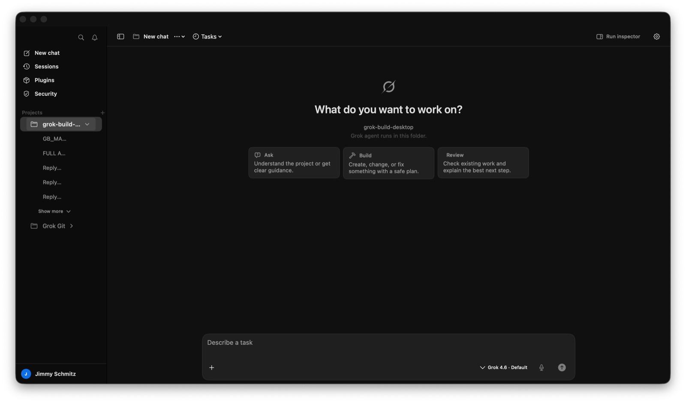

# GrokBuild Desktop App

> [!IMPORTANT]
> This checkout is Jimmy's maintained personal GrokBuild line:
> `schmitzjimmy1-star/grok-build-desktop`, branch `codex/warm-glass-ui`, installed
> as `/Applications/GrokBuild.app`. The older `jimmmy-Jim/Grok-Build-GUI`
> project is retired and must not be built or installed. See
> [`CANONICAL_WORKTREE.md`](CANONICAL_WORKTREE.md) before making changes.

GrokBuild Desktop App is a native SwiftUI macOS workbench for the [`grok`](https://grok.com) CLI. It is built for project work: persistent workspaces, resumable build sessions, git branches and worktrees, agents, tools, workflows, tasks, memory, skills, plugins, and reviewable output.

You can also install GrokBuild just to manage custom OpenAI-compatible models in **Settings → Models** (Keychain-backed provider credentials plus a CLI-compatible `~/.grok/config.toml`; no project or session needed), then use them in the grok TUI.



## Requirements

- macOS 26 (Tahoe) or later
- The `grok` CLI installed, usually at `~/.grok/bin/grok`
- A logged-in CLI session — run `grok login` in Terminal before starting your first session (not needed if you only manage custom models)

## Quick Start

### Start with a project

1. Install and sign in to the `grok` CLI (`grok login`).
2. Use the signed personal build at `/Applications/GrokBuild.app`, or build it from this canonical checkout. Upstream releases do not contain the personal repair line.
3. Open GrokBuild Desktop App and choose **Add Project**.
4. Pick a folder. It can be a code repo, a docs folder, or a scratch workspace.
5. Start a session, choose **Ask**, **Build**, or **Review** to seed an editable draft in that project folder — or type your own. Those starters do not send. Send is what talks to grok. Pick your model from the composer's grouped menu (Grok and your providers side by side); reasoning effort, context, usage, and the route/process receipt live in that same model menu.

### Custom models only

If you mainly use the grok TUI or CLI and just need a UI for providers and models:

1. Install the `grok` CLI and open GrokBuild Desktop App (no project or `grok login` required for this path).
2. Open **Settings → Models**.
3. Install a provider, use its declared connection method, run **Test connection**, then add one or more returned OpenAI-compatible models. OpenRouter supports S256 browser OAuth or a pasted API key; local Ollama needs no credential; the other official presets use API keys.
4. Provider secrets are stored in macOS Keychain with device-only accessibility. GrokBuild projects only the CLI-required model copy into owner-only (`0600`) `~/.grok/config.toml`, so `/model <id>` still works in the grok CLI/TUI and in GrokBuild sessions.

GrokBuild does not load provider credentials from a project `.env` file. A custom or local endpoint may use an unverified model ID only through the explicit advanced path.

**Test connection** proves the key, endpoint, catalog response, and configured-model visibility. The Grok CLI still owns actual chat/tool routing, so a catalog can pass while a particular CLI completion endpoint or tool combination is unsupported; that failure is reported separately instead of being mislabeled as bad authentication.

## What GrokBuild Desktop App Is

GrokBuild Desktop App owns the macOS workbench: project navigation, durable session tabs, branch/worktree controls, build-oriented composer, diff review, settings, browser/computer-use enablement, and the local app update flow. The transcript is the record of work performed by an agent inside a project; GrokBuild is not designed or evaluated as a general-purpose chatbot. A common lightweight use is **Settings → Models** alone: manage custom providers and models for the shared `~/.grok/config.toml` without opening a project or starting a session.

It is **not** a replacement for the CLI. The `grok` CLI still owns agent reasoning, ACP, MCP tools, models, skills, subagents, plan mode, permissions, memory, hooks, plugins, and `AGENTS.md` instructions.

## Install

Jimmy's maintained app is built from this checkout and installed at
`/Applications/GrokBuild.app`. Its About panel and Settings → App show the
personal repository, branch, exact source commit, and dirty-state receipt; do
not accept `0.1.20` alone as proof of source identity. The preserved
[`rimusz/grok-build-desktop`](https://github.com/rimusz/grok-build-desktop)
remote is upstream reference, not the owner of the installed personal repair
line.

Release assets are versioned, e.g. `GrokBuild-v0.1.10.app.zip` and `GrokBuild-v0.1.10-macOS.dmg`.

## Feature Highlights

### Sessions

- Streaming agent sessions for `grok agent stdio` with Markdown, compact thinking disclosures placed above their assistant answers, live tool cards, permission prompts, plan/question cards, and diff review. Question, permission, and plan cards are owned by the exact ACP backend-session/request identity; activity rows never become a second reply surface, and plan approval continues the same turn without fabricating a `[Plan approved]` chat prompt. The completion bridge accepts grok's live `_x.ai/session_notification` lifecycle frames and settles only after exact tab/backend/generation ownership; a missing receipt fails closed instead of becoming synthetic success. Terminal exit code, timeout, and signal receipts override a generic outer `completed` status. ACP-emitted public reasoning summaries preserve ordered source chunks, join token deltas only across explicit whitespace/punctuation continuation, and add presentation-only stage boundaries when the backend supplied none; selectable Show more stays bounded, the disclosure collapses when the turn settles, and none of it becomes transcript/export state or hidden chain-of-thought capture.
- Multi-tab sessions with lazy restore, resumable grok sessions, a session browser, and provenance-safe transcript recovery from grok's on-disk `chat_history.jsonl` when possible. Imported worker output remains visible but never proves root-conversation identity.
- Fresh-turn context accounting is provider-free and honest: GrokBuild separately reports observable project instructions/context, skill and MCP catalogs, requested/deferred schemas, transcript history, user content, and memory. Grok CLI-owned system instructions and provider wrappers remain explicitly **unmeasured** unless ACP exposes exact bytes; GrokBuild never guesses them. The maintained project instruction packet is 37% smaller without removing identity, safety, test, signing, or acceptance contracts, and unrequested MCP schemas stay deferred behind the CLI's progressive discovery path. Release acceptance uses evidence-derived ceilings—750 ms cold first window, 10 s cold first-intent readiness, 8 s cold and 3 s warm dispatch-to-first-chunk, zero idle owned processes, and 40K tokens for the minimal native terminal lane—as test gates, not as a second scheduler or token authority.
- Each local tab transcript is stored as an owner-only, atomic file under Application Support with a small metadata sidecar. Saved v1 preference blobs are copied and verified before use, then retained as rollback input for this release; tab switches update layout metadata without rewriting every transcript.
- Restore metadata is loaded off-main and only the selected tab hydrates its message body; rich Markdown parsing and visible Mermaid/display-LaTeX sizing are bounded by a process-local cache with explicit WebKit teardown. During streaming, incomplete code fences and tables remain behind a brief readable formatting state instead of being presented as finished raw syntax. Final tables use the available reading width with content-aware columns and horizontal overflow only when needed; Mermaid either renders or presents a labeled, copyable source fallback. Nested lists retain their indentation, ordered lists retain their authored numbers, and checklists render checked/unchecked state with level-aware accessibility labels; link-only groups are announced as source lists instead of a flat run of bullets. Readers can detach from streaming output without losing their place, then use the accessible **Jump to latest** action when ready.
- Session restore uses the last tab you intentionally activated—not the tab with the longest transcript. Empty or divergent saved selections cannot outrank a viable recent transcript.
- Model and session-agent choices preserve intent: inherited tabs keep following their project/global default, while a picker choice remains an explicit per-tab override. Legacy saved models remain conservatively classified until the next explicit choice.
- The v3 session layout is committed with a separate integrity marker while the v2 layout remains untouched as rollback input. A failed/mismatched migration opens the legacy layout read-only instead of pretending the workspace is empty.
- Saved Grok backends are checked against the exact local transcript before they start. A normal restored launch presents three named, keyboard- and VoiceOver-readable choices—**Resume current task**, **Start new task**, and **Browse old tasks**—without foregrounding a stale process warning or starting a provider turn. Exact/prefix matches resume normally; missing, incomplete, divergent, or composite histories keep local work readable, show a redacted continuity explanation, preserve the draft, and block Send instead of risking the wrong conversation. Recovery is explicit: **Relink** opens a bounded, redacted candidate review and re-verifies the selected history, while **Continue as New** durably records the predecessor and waits until the next real submission to create a backend. One matching prompt never auto-binds a tab. Local-only work creates a fresh backend lazily on first send and labels it **New backend bound** rather than falsely verified; fallback/fork relationships are retained in the authenticated v3 ledger.
- Adaptive neutral visual system with a compact native SF type scale, centered reading column, flat matte surfaces, restrained corner radii, quiet status chrome, and real System/Light/Dark appearance support. Contrast, reduced transparency, reduced motion, and large text keep the same task hierarchy across modes.
- The composer starts at one accessible line and grows to eight for real multi-step requests. The bottom row carries only immediate authoring controls (Codex parity Slice 4): one **+** add/context menu (files, MCP connections, skills/workflows, Browser Tools, Computer Use), the run-mode control, the model menu, voice, and Send. The former **Details** telemetry shelf is gone — context, usage, and the route/process receipt moved into the model menu, Review lives in the header and the inline changed-files card, Activity lives in the header toggle, and branch/worktree switching lives in the header's More menu. While a turn is live, a compact thread-native run spine projects the current phase, completed/remaining plan steps, active workers grouped under their owning step, and the exact current tool. After the answer settles, the same card remains below it as a checkpoint with retained tool receipts, artifact links, recovery state, and direct Activity/Review links. Missing tool duration, worker ownership, or artifact boundaries say **not reported** instead of being estimated. The spine and Activity consume the same generation-bound projection and settled snapshot; neither invents budget, token, usage, or outcome authority. A large final ACP message chunk is revealed through bounded display frames without changing its authoritative content, and completion waits for that reveal before backend reconciliation. The editor owns one native AppKit cursor rectangle, so the pointer is a stable I-beam only over text entry and returns to the normal arrow over controls and the surrounding workbench without hover timers or cursor-stack churn. During a turn, Activity renders a separate **Live** projection of only the current tab/backend/process generation's observed tools, changed worker rows, plan, and successful artifact receipts; it explicitly withholds outcomes and usage. The authoritative ACP completion barrier replaces that projection with a **Settled** snapshot containing worker outcomes, failed-tool counts, successful write/edit receipts under **Run artifacts** (including explicit external-artifact labels), the separately sourced **Files in review** list, model/process/MCP receipts, continuity provenance, usage, and the reported next action. A user Stop also creates a clearly labeled local settled outcome: it is never presented as a backend failure or completion receipt. Activity opens with the safe next action—re-verify the exact stopped tab/backend/generation before resuming, or start a fresh, ledgered run when that receipt does not match. A missing authoritative completion receipt likewise opens the drawer automatically, preserves partial evidence, withholds settled/usage claims, and requires reconnect instead of manufacturing success from a timer. Starting a new turn clears the old snapshot; session-wide background tracking remains separate and cannot leak prior worker rows into the new run. Git review refreshes are bounded and event-driven after successful writes and turn settlement; each refresh is a fresh selected-workspace Git status/diff snapshot. Assistant-provided `diff`/`patch` blocks are labeled examples and cannot change the changed-file count, open Preview, or become an apply input. GrokBuild does not run a permanent filesystem watcher.
- The native frontend follows the Codex desktop conversation shell: a compact command rail, nested projects and sessions, quiet task header, transcript-first canvas, optional floating Activity inspector, and wide **Describe a task** composer. A new chat offers restrained **Ask**, **Build**, and **Review** starters that seed editable drafts in the selected project. They do not send a prompt. A fresh empty tab warm-starts `grok agent stdio` when you begin typing or pick a starter; Send is still the grok turn. Complete model and receipt controls remain one click away.
- The composer can attach any enabled Grok MCP connection to one prompt from the network menu immediately left of the hammer. Attached connections appear as removable chips; selection requests their use but never claims it. Cached/CLI inventory proves only configuration, while **Process ready** is a generation-bound startup receipt. Catalog discovery is labeled discovery, not browser execution; only an exact qualified invocation receipt may name a server as used. Expanding **Build agent** keeps the public thinking summary and redacted discovery/tool receipts beneath the label and above the answer, and new-turn traces survive local transcript restoration without rewriting Grok's backend history.

### Project Workflow

- Collapsible project sidebar with pinned projects, recent sessions, session rename/close, one-click **New Project** onboarding, and an on-demand project filter. Closing a tab deletes its Grok backend only when the local tab, durable binding, and saved layout resolve to one exact backend ID; conflicting identities stop the close, and a failed backend deletion is reported with the preserved ID. Ordinary app quit preserves backend history, and removing a workspace is local-only. The chat toolbar keeps a sidebar toggle visible in the full-width canvas, moves secondary actions into one menu, and opens Settings directly.
- Full-width Settings workspace with one compact internal navigation rail and a centered 760 pt content column; opening Settings never brings the project sidebar back or stacks two sidebars together. Switches use one small trailing control column, permission editors stay shallow and neutral, and Marketplace sources stack above the full-width plugin list instead of squeezing it into a split view. Technical monospace typography is reserved for actual commands and diagnostic logs.
- Settings mounts only the selected pane, so hidden diagnostics and loaders stop instead of quietly chewing resources. All fourteen panes now use the shared state contract: editable values survive pane changes as parent-owned drafts, inventories preserve a last successful result as stale on refresh failure, and row-local work stops with the hidden pane when safe. Browser Settings begins with neutral **Checking browser support…** copy, retains its last proven status during manual diagnostics, and withholds setup/install/destructive runtime controls until the first probe settles. An edit is never persisted until **Apply** or an explicit row action, every action states its persistence/restart/trust scope, and receipts distinguish Draft, Saved, Restart required, Live, Unknown, success, partial, and failure without leaking credentials. Future-only defaults say so; launch-affecting changes restart only the current live tab. Narrow windows and accessibility text stack form rows instead of crushing labels.
- Workbench focus order follows the task path from controls to transcript to composer, and Settings focuses the selected pane after sidebar navigation. Rich code exposes language and Copy, tables expose a linear row description, and Mermaid/LaTeX expose selectable source when a rich preview cannot render. VoiceOver receives terminal action results and continuity/model warnings without a streamed-token announcement storm.
- Per-tab **model** selection begins in a simple empty-session menu and remains available with per-project **reasoning effort** through the composer's model menu. Model labels distinguish Saved, Default, Pending, Requested, Live, Last live, Rejected, and Unknown. Last live stays on the confirmed receipt; if an inherited tab followed a newer CLI or project default, the picker says Default instead of claiming that newer model was last live. Fresh chats seed this list from the installed `grok` CLI and fall back to Grok 4.6 plus Grok 4.5 while ACP connects; before a selected custom model becomes sendable, GrokBuild reasserts it through ACP and requires an exact effective-model readback so a provider tab cannot silently run the default Grok model.
- Clickable **route contracts** beside the context meter distinguish native xAI, direct providers, local endpoints, and brokered OpenRouter models. Their menu exposes the process/model receipt, endpoint host, pinned model state, and fallback boundary without exposing credentials. OpenRouter's downstream serving provider is explicitly labeled unproven because ACP confirms the effective model, not OpenRouter's internal provider choice.
- Git branch/worktree management from the session status row.
- `Open in` menu for Finder, Cursor, VS Code, Terminal, iTerm, and Zed.
- **Grok and provider sign-in** — **Settings → Models** shows coarse local Grok sign-in state and can launch the resolved CLI's xAI browser flow (`grok login --oauth`) without storing its session. OpenRouter supports exact-loopback S256 OAuth or paste-key setup; every other preset declares API-key or keyless connection explicitly.
- **Custom models (standalone)** — OpenAI-compatible providers and models in **Settings → Models** with device-only Keychain-backed provider secrets, typed catalog validation, redacted diagnostics, native Chat Completions / Responses / Anthropic Messages routing, and atomic owner-only writes to `~/.grok/config.toml`. GrokBuild-only UI hints and credential provenance live in a non-secret sidecar, so the CLI config contains only fields Grok understands. OpenAI preset models default to the Responses API. Usable on its own (no project/session); models are then available in the grok CLI/TUI and in GrokBuild sessions.

### Agent Capabilities

- **Main agents** — browse agents discovered by `grok inspect --json` and choose a drafted default for future sessions. Agent selection and execution remain backend/session state; the primary chat chrome does not spend permanent space on a general-purpose picker.
- **Custom subagents (roles)** — create reusable roles with a name, optional model, and instruction. GrokBuild Desktop App writes them to `[subagents.roles.*]` in `~/.grok/config.toml` and stores instructions in `~/.grok/prompts/<name>.md`.
- **Using subagents** — keep the main agent as Default and prompt normally; grok delegates to matching subagents automatically, or you can ask for one by name (for example, *"use the researcher subagent to map the auth flow"*). **Run as custom role** in the agent picker runs the whole session as that role instead of spawning a child subagent. To block spawning child subagents, use **Settings → Permissions**.
- Inspect hooks, plugins, marketplace sources, compatibility layers, skills, and MCP servers from Settings with retained checking/empty/stale/error states. Plugin and marketplace mutations require explicit trust and show row-local receipts. MCP setup uses structured stdio/http/sse fields, preserves ordered argument boundaries, supports user/project scope, and redacts stored environment/header values; the installed CLI stores those values literally, so adding a secret requires a disclosure acknowledgment. Compatibility follows the current `externalCompat.cells` schema (including Codex sessions-only support) instead of treating malformed inspection output as an empty success.

### Optional Automation

Make Browser and Computer Use available from **Settings → Browser** / **Settings → Computer Use**, then explicitly turn either one on for the current thread from its composer indicator. Both helpers start off in every new thread; terminal/files/Git-only work neither launches them nor waits on their readiness. Changing a thread's selected helper reconnects only that tab and is disabled while a turn is live.

- **Browser control** — let Grok drive a real Chromium browser via `browser_*` MCP tools backed by [`agent-browser`](https://agent-browser.dev). Use a managed automation profile or attach to Chrome, Brave, Edge, Arc, or another Chromium browser over CDP. Every Grok session owns an isolated browser runtime key while the optional automation-session name remains its reusable login-state key; closing the tab or app closes that exact managed runtime instead of leaving a reparented browser daemon behind.
- **Computer Use** — let Grok drive native macOS UI via `computer_*` MCP tools backed by [`agent-desktop`](https://github.com/lahfir/agent-desktop) (bundled into the app at packaging time), with an allow/block action policy, screenshot gating, command timeouts, deterministic main-window targeting, a dedicated graceful/explicit-force `computer_close_app` contract, and optional Cursor MCP integration. **Test Computer Use** reports only a compact typed receipt (protocol/helper version, `computer_list_apps`, app count, bounded duration, and prerequisite proof); the app inventory and process identifiers are never shown in the default success message, while bounded redacted diagnostics remain opt-in. Editing a screenshot draft never asks macOS for Screen Recording; that prompt is gated behind the explicit **Request Screen Recording** action after the setting is applied.
- **Memory** — experimental and off by default. Enable it from Settings; memory remains a backend/CLI concern rather than permanent session chrome.
- Applying a launch-affecting Memory change restarts only the exact current live tab; a streaming turn queues and coalesces the restart. Success requires a matching newer process receipt, while a reconnect fork is disclosed as partial instead of false green. Tabs with no live process simply use the saved value when they next start.
- **Background tasks** — scheduled `/loop` tasks plus background shells, monitors, and subagents remain mirrored by `ChatStore` from ACP. The Activity drawer shows only spawn-created workers, correlates their spawn-call and child identities, attaches wait/collection receipts to those rows, and surfaces authoritative completed/failed/cancelled results plus explicit unknown/orphaned states when terminal evidence is missing. Schedules only fire while GrokBuild Desktop App is open and that session process is alive (inactive tabs may be stopped by LRU eviction).
- **Navigation-only sidebar** (Codex parity Slice 1) — the left sidebar is projects and chats: New chat, Sessions, Plugins, and Security are action buttons above pinned projects with nested sessions, search, and the account/settings footer. Those actions never claim accessibility selection from focus, hover, or a prior click; the real session row owns persistent visual and semantic selection, or its project row does when no session is selected, while Settings owns its selected pane. The header bell opens the activity surface. The former sidebar Activity lane, Agents hub, and Connections lane were removed as permanent sections; their capabilities remain in the Activity drawer and dashboard, the Settings → Agents pane (defaults and custom roles), and the composer's MCP attachment menu respectively — nothing was deleted from the runtime.
- **A compact contextual inspector** (Codex parity Slice 5) — the Activity panel is now a small top-right overlay: subagent counts, Computer Use state with a Settings link, **MCP evidence** that separately names requested, configured, process-ready, discovered, exercised, and unavailable facts, and **Sources** containing only attachments plus servers with current-turn invocation receipts. The full evidence stack (workers, tools, artifacts, usage, continuity) lives one click away under Run details, with the same strict truth rules; changed files live in the inline card and the Review pane.
- **Any model as your main agent** — model menus group your configured providers ("Your models") beside Grok's natives, and one click sets the current model as the default for new sessions in the project — so DeepSeek, GPT, Kimi, or any OpenRouter route can be the primary brain, not just a per-tab override.
- **One-submit first send** — first typing warms the agent process. If Return arrives
  before startup is ready, GrokBuild latches that exact draft once, shows the real
  preparation stage, and dispatches automatically after the selected model and
  requested connections are confirmed. Cancel before dispatch restores editing and
  sends nothing; repeated Return/click events cannot duplicate the request.
- **Durable task contract** — expand the compact thread header to review the current
  objective, observed phase, exact worktree/branch, model receipt, requested MCP/GUI
  tools, Git review state, saved checkpoint, and parent→child worker identities. A
  saved task can explicitly resume only through Grok's exact `session/load` plus the
  existing continuity check; Cancel, Stop, goal Pause/Resume, Continue as New, and
  Resume remain separate actions. GrokBuild never claims a task continues after its
  owning process exits, and it does not invent a pause operation for an active model
  call.
- **Thread-native review result** — settled typed plan steps retain the exact parent
  command/test receipts and successful artifact paths that were observed while each
  step was current. Review always re-reads the selected worktree through Git and
  makes **All changes**, **Unstaged**, **Staged**, **Last commit**, **Branch**, and
  **Last turn** scopes explicit. If last-turn attribution cannot be proved from a
  successful write/edit receipt, the pane says so and falls back to current
  repository truth. Per-file revert is offered only for a supported exact path: Git
  saves a recovery stash first, reverts that path, then proves unrelated dirt
  survived. Commit/push/PR readiness is visible review state; publication remains an
  explicit user action.
- **Subagent model routing, visible** — when a spawned worker matches one of your custom roles, its receipt says exactly where it routes: "Routes to deepseek-deepseek-v4-flash-0731 (configured)". The roles editor groups model choices by provider so your OpenRouter and API models are first-class routes.
- **Session usage HUD** — the composer's model menu keeps a running meter of settled-turn usage ("12.4k tokens · 3 calls · 2 turns"), with an honest dollar estimate range when a model's catalog pricing is known (captured automatically from OpenRouter's catalog during Test connection). No pricing, no fake $0.
- **Tool-run inspector** — while an agent works, each live tool row in Activity expands to its full redacted input receipt. `search_tool` rows say capability discovery and never receive a browser-use/source claim; `use_tool` rows show the authoritative qualified tool and server (for example, `chrome-devtools__list_pages` via `chrome-devtools`). A requested qualified tool missing from a settled current-turn catalog receipt appears as **Unavailable for this turn**, not failed or succeeded use. Workers that finish mid-turn show their duration/tool-count receipts immediately.
- **Rhai workflows** — enable in Settings → Workflows (`[workflows] enabled` in config.toml, shared with the grok TUI). Workflow runs remain backend/CLI state and can be invoked through slash commands or the composer command menu; there is no permanent workflow status strip.
- **Session tools** — fork session (new tab with `--fork-session`), share link (`/share` + clipboard), `/btw` aside panel, create-skill sheet, and a status-grouped multi-session dashboard whose full-width, stable accessibility rows switch existing local tabs without launching a backend just for inspection.
- **Documents and spreadsheets** — use grok's document skills (`xlsx`, `docx`, `pptx`) to create, read, edit, and reformat Office files from paths in your workspace. Spreadsheet skills may need [LibreOffice](https://www.libreoffice.org/) installed for some conversions.

### App Experience

- A normal windowed Mac app with standard application menus, native SF Symbols, and no redundant status-item applet. Settings → App owns System/Light/Dark appearance selection and applies it without restarting a session.
- Grouped vertical Settings navigation keeps all configuration areas readable without a fourteen-tab horizontal traffic jam.
- In-app update panels for both GrokBuild Desktop App and the `grok` CLI. App updates are offered only for signed and notarized releases.
- Adaptive SwiftUI design with accessibility labels for interactive status controls plus native link elements, semantic headings and nested lists/checklists, spoken equation labels, and table header/cell summaries in rich results. Rich rendering is detached from the main actor and reuses parsed content where message identity, content, width, appearance, and render version still match.

## Permissions & Privacy

- GrokBuild Desktop App talks to the local `grok` CLI; your prompts, tool calls, model routing, auth, and CLI-side storage follow the CLI's behavior.
- Browser control uses a separate managed Chromium profile by default. If you attach to an existing browser over CDP, Grok can interact with that browser window.
- Computer Use requires macOS Accessibility permission. Screenshots require Screen Recording and are optional.
- **Settings → Permissions** separates interactive **Ask**, **Auto**, and **Always approve** behavior from advanced automation modes. **Deny unapproved (CI)** is explicitly described as deny-by-default headless behavior, not as a low-interruption interactive mode. Permission cards describe the launched process receipt, not an unapplied Settings draft; an unexpected ACP request under Always approve is safely answered without blocking, while explicit deny rules, hooks, and sandbox limits still apply.
- Permission rules and launch policy remain in a local draft until Apply. Applying them restarts only the current live tab, and its old live receipt remains visible until a matching newer process receipt proves the replacement.

## Building from source

### Minimal setup

You only need **Xcode Command Line Tools**:

```bash
xcode-select --install
```

That is enough to compile the app, create the `.app` bundle and DMG, and codesign/notarize.

```bash
make build          # build the release binary
make test           # run unit tests
make run            # build release + launch from .build/GrokBuild.app
make run-debug      # build debug + launch — includes menu **Simulate Updates**
make app            # create dist/GrokBuild.app
make dmg            # create the .app + DMG
```

See [BUILDING.md](BUILDING.md) for packaging, signing, notarization, and GitHub releases.

### Opening a self-built (unsigned) app

Local builds from `make app` / `make run` are unsigned. macOS Gatekeeper may block them the first time you open a copied `.app` (for example after moving `dist/GrokBuild.app` to `/Applications`):

1. **Right-click** `GrokBuild.app` → **Open**, then confirm **Open** (bypasses the block once).
2. Open **System Settings → Privacy & Security** and click **Open Anyway** next to the blocked-app message.
3. Or remove the quarantine attribute:
   ```bash
   xattr -cr /path/to/GrokBuild.app
   ```

Self-built apps do not receive in-app upgrade offers. Use a notarized GitHub release for one-click updates, or keep rebuilding from source.

### Recommended for SwiftUI work

If you plan to edit the SwiftUI code, install the **full Xcode** IDE from the App Store for:

- SwiftUI Previews (live canvas) — the biggest advantage
- Better debugging tools (view hierarchy, environment inspection)
- A smoother experience with complex SwiftUI views

You can still build from the terminal with `make` or `swift build` with full Xcode installed:

```bash
xed .          # open Package.swift in Xcode
```

### Signing & notarization

```bash
cp .env.example .env   # optional: SIGN_IDENTITY, NOTARY_PROFILE
make signed SIGN_IDENTITY="Developer ID Application: Your Name (TEAMID)"
make notarize NOTARY_PROFILE=AC_PASSWORD
make release RELEASE_TYPE=notarized
```

Signing requires a **Developer ID Application** certificate, and notarization requires App Store Connect access. Full details: [BUILDING.md](BUILDING.md).

### Developer documentation

| Doc | Purpose |
|-----|---------|
| [ARCHITECTURE.md](ARCHITECTURE.md) | **Start here** — app structure, data flow, persistence, updates, common tasks → files |
| [AGENTS.md](AGENTS.md) | Agent/copilot entry point |
| [BUILDING.md](BUILDING.md) | Build, sign, notarize, release CI |
| [docs/OAUTH_OPENROUTER_ACP_PLAN.md](docs/OAUTH_OPENROUTER_ACP_PLAN.md) | Follow-on plan for endpoint hardening, OAuth/OpenRouter, optional ACP backends, cache audit, and Dock persistence |

Debug builds (`make run-debug`) include **GrokBuild → Simulate Updates** for testing the update UI without publishing releases. It is compiled out of release builds (`make run`, `make app`, GitHub releases).

## License

[Apache License 2.0](LICENSE). GrokBuild Desktop App is an independent desktop client for the Grok Build CLI and is not affiliated with, endorsed by, or sponsored by xAI.
