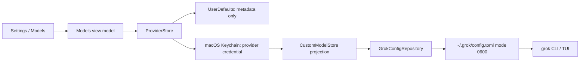

# GrokBuild architecture audit

Date: 2026-07-31

Branch audited: `codex/warm-glass-ui`

## Executive decision

GrokBuild remains a thin native shell around `grok agent stdio`. The audit found no reason to duplicate the Grok runtime in Swift. The risky seams were configuration ownership, credential duplication, provider error classification, process restart scope, and undersized navigation controls. Those seams were repaired. Large-file and notification refactors without a demonstrated correctness or latency benefit are deferred.

OAuth, OpenRouter, alternate ACP backends, endpoint trust hardening, and the operational cache/Dock omissions are specified in the follow-on [OAuth, OpenRouter, and ACP-backend plan](OAUTH_OPENROUTER_ACP_PLAN.md). OpenRouter is an opt-in provider route, not a replacement for Grok or a silent fallback for direct providers.

## Capability ownership and lifecycle

| Capability | UI entry | Swift owner | Grok/runtime owner | Persistence | Process impact | Visible failure/result | Decision |
|---|---|---|---|---|---|---|---|
| Chat and tools | `ChatView` composer | `ChatStore` → `GrokProcess`; client answers ACP permission requests | `grok agent stdio` owns reasoning, tool execution, permissions, and session state | Grok session plus GrokBuild transcript/layout stores | Long-lived process per live session | Transcript, tool cards, permission UI, connection state | **Keep** |
| Main ↔ Settings navigation | Toolbar/sidebar gear, Settings Session button, Escape | `ContentView.AppRoute` and persisted selected settings tab | None | Selected Settings tab in app state | None | Route changes on the first action; active session/model remains intact | **Fixed** |
| Custom provider metadata | Settings → Models | `CustomModelsSettingsViewModel`, `ProviderStore` | None | UserDefaults, excluding credentials | Catalog refresh only | Provider connection card | **Fixed** |
| Provider credentials | Provider editor | `KeychainProviderCredentialStore` | Grok CLI still requires per-model `api_key` | Keychain service `com.grokbuild.provider-credential`; projected CLI copy in config | No restart by itself | Key saved/missing badge; actionable migration issue | **Fixed** |
| Shared Grok configuration | Models, workflows, compatibility, subagent roles | `GrokConfigRepository` plus pure section rewriters | Grok CLI reads the result | `~/.grok/config.toml`, atomically replaced and forced to `0600` | Depends on typed change | Save/apply state or error | **Fixed** |
| Model protocol/context | Settings → Models and composer | `CustomModelStore` | Grok native `api_backend` and `context_window` | Model table in owner-only TOML | Affected-model reload | Protocol and context shown on model card/editor | **Fixed** |
| GrokBuild model UI hints | Settings → Models and composer | `CustomModelMetadataStore` | None | Non-secret UserDefaults sidecar keyed by model ID | None | Preserved across model saves without CLI warnings | **Fixed** |
| Provider catalog validation | Test connection | `ProviderModelFetcher` | Provider `GET /models` endpoint | Last result remains in Models-pane state for the current app run | None | Connected, unauthorized, rate limited, endpoint missing, unavailable, incompatible, offline, empty catalog, or model missing | **Fixed** |
| Default model | Save Default | `CustomModelStore` → `ConfigurationChange.defaultModel` | Used by future Grok sessions | `[models].default` | Never restarts a current session | Disabled until dirty; Saved/error | **Fixed** |
| Provider/model mutation | Models pane | `ConfigurationChange.models` → every live `ChatStore` | Affected Grok process | Config plus Keychain/UserDefaults | Only idle sessions currently using an affected model restart; streaming sessions queue; unaffected sessions stay up | Applying/reloaded/queued system status | **Fixed** |
| Browser tools | Settings → Browser | `BrowserSettingsStore`, `AgentBrowserService`; injected by `ChatStore` | `agent-browser` MCP and external/managed browser own automation | Draft/applied UserDefaults keys, separate browser profile | Explicit Apply restarts active Grok connections | Readiness/status cards and Apply state | **Keep; verify** |
| Computer use | Settings → Computer Use | `ComputerUseSettingsStore`, `ComputerUseService`; injected by `ChatStore` | Bundled helper and Agent Desktop | Draft/applied UserDefaults keys | Explicit Apply restarts active Grok connections | Permission/readiness/status UI | **Keep** |
| Settings keep-alive | Settings tabs | `SettingsKeepAlivePolicy` | None | In-memory visited-tab state | None | Avoids state loss while not mounting every pane up front | **Keep** |
| Broad notification surface | Menu and legacy settings events | `NotificationCenter` consumers | None | None | Varies | Existing UI/status paths | **Defer** gradual typed replacement; no proven data-loss bug in untouched paths |

## Data and secret flow

There is intentionally one plaintext credential copy: the model table `api_key` required by the standalone Grok CLI. It is no longer duplicated in UserDefaults, and the config repository forces the containing file to owner-read/write only after every GrokBuild write. No `.env` file participates in this path.

Migration is idempotent. An existing Keychain value wins; otherwise the saved provider value wins; otherwise one matching model value is accepted. Conflicting model credentials stop that provider's migration. A new Keychain value is read back before legacy metadata is sanitized. Storage failure rolls back newly created Keychain entries and returns the pre-migration in-memory providers.

The startup config migration also removes older GrokBuild schema violations. It imports `grokbuild_*` capability hints into the non-secret sidecar, projects legacy context to native `context_window`, moves `gpt-5.6-terra` on the official OpenAI endpoint to Grok's supported Responses backend, translates each obsolete compatibility `enabled` value to Grok's supported capability cells, and removes the ignored `plugins.disabled_mcp_servers` field after retaining a one-time non-secret backup. Model credentials, MCP servers, valid plugin settings, and unrelated CLI content are preserved.

## Configuration ownership rules

`GrokConfigRepository` is the only GrokBuild mutation boundary for `~/.grok/config.toml`. Every writer:

1. enters the repository's serialized critical section;
2. rereads the latest file;
3. performs a pure, targeted section rewrite;
4. writes a `0600` temporary file in `~/.grok`;
5. atomically renames it over the destination; and
6. reapplies `0600`.

This prevents GrokBuild panes from clobbering one another and preserves unrelated CLI content. It does not lock out a simultaneous external Grok CLI or text-editor write; cross-process advisory locking is deferred until there is evidence that the CLI mutates the same file during these short edits.

MCP invocation is default-off per thread. GrokBuild adds Grok's
`MCPTool(*__*)` deny rule to a no-attachment launch and, when Grok 1.0.0
surfaces that denial as an ACP permission request, selects Grok's reject option.
That gate precedes Yolo and Always Approve. An explicit thread/turn attachment
restarts with the gate open; Grok CLI still discovers and executes the MCP, and
the Swift client never calls an MCP tool itself.

## Provider contract

Provider authentication is typed as bearer, API-key header, both only for an explicit preset, or none. Validation returns a typed result instead of collapsing every failure into “bad key.” Official presets can save only a model returned by their live catalog. Custom and local providers may use an unverified model ID only through the explicit advanced toggle. Redacted diagnostics include endpoint, auth mode, credential presence, result, catalog count, missing IDs, and check time—never the credential.

## Process and session lifecycle

Configuration changes carry affected model IDs and an impact. Default-only changes apply to future sessions. Provider/model changes refresh all live catalogs, but restart only idle sessions actively using an affected model. A streaming affected session queues the reload until its response completes. Settings entry, tab switching, validation, and return navigation do not write the active session model.

Browser settings retain the draft/applied split. Port `9222` is meaningful only for external CDP mode. The acceptance gate checks that one apply/restart does not create a stale connection-refused loop, runaway CPU, or repeated retry spam.

## Keep, fix, defer

### Keep

- Grok CLI ownership of agent behavior, tool execution, permissions, sessions, and MCP orchestration.
- One `ChatStore`/`GrokProcess` per live session.
- Settings visited-tab keep-alive policy.
- Existing graphite visual language and explicit browser/computer Apply semantics.

### Fixed now

- Serialized atomic config writes and owner-only permissions.
- CLI-schema-clean model metadata, compatibility toggles, and legacy plugin cleanup.
- Native API-backend selection and preservation of unmanaged CLI model fields.
- OpenAI `gpt-5.6-terra` routing through Grok's native Responses backend, proven by an exact-`OK` CLI smoke.
- Keychain-backed provider credentials and transactional migration.
- Typed provider auth and validation failures.
- Targeted, streaming-aware model reloads across all live stores.
- One route model for main/settings navigation.
- 32×32 shared toolbar controls and visible async states.
- Dedicated Models-pane state owner and connection cards.

### Deferred

- Splitting every Settings pane solely to reduce file size.
- Replacing every legacy notification without a concrete failure.
- Cross-process TOML locking without evidence of a real collision.
- Browser back/forward redesign; this audit targets main ↔ Settings stickiness.
- OpenAuth, arbitrary custom OAuth issuers, AG-UI, LiteLLM, and full OpenHands hosting. The follow-on plan first adds a documented OpenRouter PKCE flow and separately gates a generic ACP/Goose spike.
