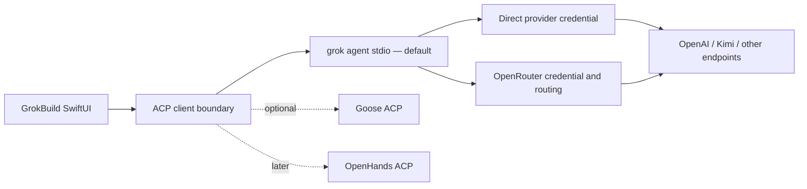

# GrokBuild OAuth, OpenRouter, and ACP-backend plan

Date: 2026-07-31

Status: Slice 12 provider-auth implementation and installed acceptance complete

Default product decision: **Grok-first, ACP-open; OpenRouter is optional routing, never a silent fallback**

## Slice 12 implementation checkpoint — 2026-08-01

The provider-auth portion of this plan is now implemented without adding a dependency or
second agent runtime. `ProviderCredentialMetadata` persists only credential kind, issuer,
connection/update time, and last validation; secret values remain in Keychain using
`kSecAttrAccessibleAfterFirstUnlockThisDeviceOnly`, with only the grok-required owner-only
`config.toml` projection. Existing Keychain entries migrate idempotently as API-key
credentials.

OpenRouter now offers **Connect with OpenRouter…** and paste-key paths. The S256 PKCE
listener binds only `127.0.0.1`, requires its random exact path, is single-result,
cancellable, and bounded by timeout. Local disconnect and remote key management are
visibly separate. Grok sign-in is represented independently: Settings probes `grok models`
without inference, keeps only coarse signed-in state, and opens the resolved CLI with
`login --oauth`; GrokBuild never stores the Grok login session.

Every built-in provider now declares an explicit connection method and has a fixture-pinned
endpoint, authentication-header, API-backend, and catalog contract. Generic custom OAuth,
OAuth token-set/refresh handling, arbitrary issuers, alternate ACP backends, and richer
OpenRouter account/catalog metadata remain deferred rather than being faked.

## Why this is a separate phase

The first audit repaired the immediate security and reliability failures without making the SwiftUI app a second Grok runtime. It secured the existing API-key path, classified provider failures, narrowed process restarts, and fixed the sticky main ↔ Settings controls.

OAuth and alternate agent harnesses cross different ownership boundaries. Provider OAuth supplies a credential for a model endpoint. ACP authentication signs into an agent runtime. OpenRouter routes inference across model providers. Goose or OpenHands would replace the agent backend for a session. Treating those as one generic “login” feature would recreate the exact bolted-on mess this work is meant to remove.



OpenRouter support does **not** depend on adding another agent backend. It should ship against the existing Grok runtime first. The ACP-backend work remains a separately gated extension.

## Omissions found after the first audit

These are concrete gaps, not speculative refactors:

1. **Endpoint trust is inferred from string containment.** `isLocalEndpoint` can mistake a hostname containing `localhost` for loopback, omits IPv6 loopback, and suppresses credentials for every local endpoint even when the user explicitly configured authentication.
2. **Remote HTTP can carry a credential.** Custom providers currently accept `http://` without an owner-only loopback/LAN policy. Redirect behavior is not part of the provider contract, so a credential-bearing validation request lacks an explicit same-origin rule.
3. **Remote keyless providers are accidentally blocked.** The editor and fetch eligibility rebuild part of the provider with bearer defaults, so an explicit `.none` authentication choice is not consistently respected.
4. **Credentials are modeled as one opaque string.** That is sufficient for an API key but cannot represent origin, OAuth state, expiry, refresh behavior, scopes, revocation support, or agent-managed login.
5. **ACP authentication is ignored.** `GrokProcess.initializeACP()` reads model state but does not retain advertised `authMethods`, negotiate `authenticate`, expose `logout`, or validate the returned protocol version and agent identity.
6. **Catalog compatibility is too shallow for a router.** `FetchedModel` keeps only an ID and owner. OpenRouter exposes context, modalities, supported parameters, pricing, and expiration; agent use needs at least tool/reasoning compatibility and a clear routed-provider label.
7. **The original operational asks were dropped.** The prior plan did not include the requested cache/temp audit or keeping the installed GrokBuild icon in the Dock while the app is closed.

Resolved in the reliability pass: model/provider links now persist in `CustomModelMetadataStore` and infer only on one unambiguous endpoint match; OpenAI `gpt-5.6-terra` now uses Grok's native Responses backend and passes the required CLI smoke. Runtime smoke remains an acceptance gate because catalog success alone still cannot prove an arbitrary provider/backend combination.

Resolved in the Fable 5 endpoint-trust pass (2026-07-31): items 1–3 above are fixed in source. `ProviderEndpointPolicy` classifies locality from the parsed URL host (exact loopback `localhost`/`*.localhost`/`127.0.0.0/8`/`::1`, plus the `0.0.0.0` and `host.docker.internal` aliases kept for existing setups); remote `http://` now fails model/provider validation and `ProviderModelFetcher.request(for:)` refuses to attach a credential over cleartext (typed `insecureEndpoint`); `ProviderRedirectPolicyDelegate` bounds catalog redirects to three same-origin hops with cross-origin and https→http refused (typed `redirectBlocked`); and `canFetch` passes the caller's explicit auth scheme through so `.none` keyless remote providers can Test connection/Fetch models. Covered by `ProviderEndpointPolicyTests` plus new `ProviderReliabilityTests` fixtures — 324 tests green. Slice 12 resolves item 4 for API keys and OpenRouter-issued keys; ACP agent authentication and richer routed-catalog capability metadata in items 5–6 remain deferred.

## Workstream 1 — endpoint and provider identity hardening

Introduce a pure `ProviderEndpointPolicy` used by editing, validation, diagnostics, and request construction.

- Parse endpoints with `URLComponents`; compare normalized scheme and host, never substring matches.
- Treat only exact loopback hosts/addresses as loopback. Include `localhost`, IPv4 loopback, and `::1`.
- Require HTTPS for every credential-bearing remote request.
- Allow plain HTTP on exact loopback. Allow an unauthenticated LAN endpoint only through an explicit advanced “insecure local network” path with a persistent warning; never send a secret through that path.
- Do not let “local” silently override the selected authentication scheme. Locality supplies a default; `ProviderAuthScheme` decides whether a header is sent.
- Reject credential-bearing cross-origin redirects, HTTPS → HTTP downgrades, and redirects to a different host. Surface a typed redirect-policy failure.
- Give official presets immutable origins and auth contracts. Custom providers retain an advanced path but receive the same transport protections.

Persist the model/provider relationship explicitly in `CustomModelMetadataStore`, the non-secret UserDefaults sidecar keyed by model ID. Do not add GrokBuild-only fields to Grok's schema-owned TOML. Migration may infer a link from `base_url` only when exactly one provider matches. Zero matches remain unlinked; multiple matches produce a visible conflict instead of choosing the first provider.

## Workstream 2 — credential and OAuth contract

Split transport headers from credential acquisition:

```swift
enum ProviderCredentialKind: String, Codable {
    case apiKey
    case oauthIssuedKey
    case oauthTokenSet
    case agentManaged
    case none
}
```

- Keep non-secret metadata in UserDefaults: credential kind, issuer/provider identifier, connection date, last validation, expiry, scopes, and whether remote revocation is supported.
- Keep API keys, access tokens, and refresh tokens only in macOS Keychain. Use stable provider IDs, explicit device-only accessibility, and transactional read-back/rollback.
- Continue projecting only a CLI-compatible API key into `[model.*].api_key`, protected by `0600`, when the Grok CLI requires it.
- Never project refresh tokens, OAuth verifiers, authorization codes, cookies, or agent-login tokens into TOML.
- Make “Disconnect locally” distinct from “Revoke remotely.” If a provider has no delegated revocation endpoint, say so and link to its account/key management page rather than claiming the key was revoked.
- Direct OpenAI and Kimi API-key setups remain supported. Do not imply that a ChatGPT or Kimi consumer subscription grants API access unless that provider documents the exact delegated flow.

Generic OAuth support begins as a capability contract, not an arbitrary issuer text field. Each enabled preset must define its documented authorization URL, token/key exchange, callback rules, scopes, and revocation semantics. Unverified custom OAuth remains deferred.

## Workstream 3 — OpenRouter preset and OAuth PKCE

Add an official OpenRouter preset:

- Base URL: `https://openrouter.ai/api/v1`
- Inference/catalog auth: bearer
- Connection choices: **Connect with OpenRouter** (recommended) or **Paste API key**
- Routing label: every imported model visibly says “via OpenRouter”; direct provider models remain distinct

The OAuth path uses the system browser and OpenRouter’s documented S256 PKCE flow.

- Generate a cryptographically random verifier; store it only in memory for one attempt.
- Bind an ephemeral callback listener to loopback only, with a random path and bounded timeout.
- Accept one callback matching the expected host, port, and path; reject unsolicited, duplicate, expired, or malformed callbacks.
- Exchange the code over HTTPS, read back the issued user-controlled key from Keychain, then discard the code and verifier.
- Cancellation and network/exchange failures return the provider card to a retryable state without modifying the previous credential.
- Where the authorization API supports it, offer an explicit spending cap before leaving the app. Never invent or silently raise a limit.

After connection, use the authenticated current-key endpoint to display redacted key label, expiry, usage/limit status, and free-tier state. These fields are status metadata, not secrets. Add an optional account-page action for remote key management.

The OpenRouter catalog adapter should retain:

- model ID and human name;
- context length and input modalities;
- `tools`, `tool_choice`, and reasoning support;
- expiration/deprecation state;
- concise pricing metadata for disclosure, not billing prediction.

The model picker needs search and filters rather than dumping hundreds of rows into one menu. Default the agent-compatible view to text models supporting tools; expose incompatible/chat-only models through an advanced path with a clear warning. Imported context/vision/reasoning metadata seeds GrokBuild fallbacks, while ACP-reported live model capabilities remain authoritative.

OpenRouter attribution headers may be used for GrokBuild-owned catalog/account calls. Do not claim completion attribution unless the Grok CLI can project those headers into its provider requests; record that as a CLI capability dependency.

## Workstream 4 — ACP backend abstraction

This is an optional extension after OpenRouter works through Grok.

- Extract the reusable subprocess/JSON-RPC transport from `GrokProcess` into an `ACPProcess` driven by an `AgentBackendDescriptor`.
- Keep Grok as the default backend and preserve Grok-specific launch flags in a Grok adapter.
- Validate negotiated ACP version, record agent identity/capabilities, retain `authMethods`, call `authenticate` only with an advertised method ID, and call `logout` only when the agent advertises it.
- Namespace persisted sessions by backend ID. Existing sessions migrate to `grok`; a Grok session ID must never be resumed through Goose or OpenHands.
- Capability-gate model switching, modes, session load, MCP injection, images, permissions, browser/computer use, and logout. Unsupported controls explain why they are unavailable instead of failing silently.
- Let each agent own its tools, context window, provider configuration, and credentials. GrokBuild must not copy the provider Keychain into another agent’s config.
- Require an explicitly installed, resolved executable and a version receipt. Do not run `npx -y`, curl-piped installers, or mutable “latest” commands when starting a chat.

The first bounded spike is Goose because it is open, multi-provider, MCP-aware, and works as an ACP server. The spike passes only if it can preserve GrokBuild’s session/update, permission, cancellation, and resume expectations without Grok-specific conditionals leaking through the shared transport. OpenHands remains the heavier sandbox/server candidate if a concrete isolation or remote-execution need appears. Cursor remains an optional commercial compatibility path, not the core harness.

## Workstream 5 — operational omissions

### Cache and temporary files

Run a read-only, size-first disk audit before deleting anything:

- GrokBuild application support, preferences, caches, saved state, logs, crash reports, update downloads, and temporary packaging output;
- Grok CLI cache/log/session locations and browser/computer-use profiles;
- repository `.build`, `dist`, test artifacts, and large temporary files;
- unrelated system-wide large caches only as separately labeled leads, not assumed GrokBuild residue.

Classify each path as keep, rebuildable cache, historical evidence, or safe cleanup candidate. Any cleanup must list exact paths and recovery impact first. Add size/age retention only where GrokBuild itself owns the files; do not build a generic Mac cleaner into the app.

### Persistent Dock icon

This is macOS Dock state, not an app runtime feature. Verify the signed app is installed at the stable path `/Applications/GrokBuild.app`, has the expected bundle identifier/icon, then enable **Options → Keep in Dock** and confirm the icon remains after quitting. Do not add a menu-bar helper or keep a background process alive merely to preserve the icon.

## Test matrix

Automated coverage must include:

- exact loopback parsing, IPv6 loopback, deceptive hostnames, authenticated loopback, insecure LAN opt-in, remote HTTP rejection, downgrade/cross-origin redirects, and secret stripping;
- durable provider linkage, ambiguous migration conflicts, endpoint changes, and two providers sharing one base URL;
- credential-envelope migration, Keychain accessibility, rollback, disconnect versus revoke, expiry, and log/diagnostic redaction;
- deterministic PKCE vectors plus random-verifier shape, wrong callback path/port, replay, cancellation, timeout, exchange 400/403/5xx, malformed response, and previous-key preservation;
- OpenRouter catalog, current-key status, large-catalog search/filtering, missing model, expired model, no-tools model, pricing parsing, 401, 429, and offline behavior;
- ACP version mismatch, agent identity, no auth, one/multiple advertised auth methods, auth required, failed/cancelled auth, logout supported/unsupported, session namespace, and capability-gated UI;
- no session model or backend change from entering Settings, connecting a provider, fetching a catalog, cancelling OAuth, or returning to Session.

Live acceptance against `/Applications/GrokBuild.app` must show:

1. OpenRouter OAuth opens in the system browser, returns once, and never reveals a key.
2. The provider card shows “Connected via OAuth,” redacted account/key status, and a searchable catalog.
3. A selected tool-capable model is written to owner-only config and appears in the Grok model picker.
4. One minimal `Reply OK` smoke runs through the Grok CLI, reports returned usage/cost when available, and stops on the first error. Catalog success alone is not called working.
5. Direct OpenAI/Kimi entries remain unchanged and are never silently rerouted.
6. Wrong, cancelled, expired, offline, and rate-limited states recover on one action without freezing the pane.
7. The Dock icon remains after quitting, and the disk audit produces an exact, reversible cleanup list.

The OAuth login and any billable smoke require visible user authorization at execution time. No account connection, charge, provider-key revocation, cleanup, installation, publication, or release is authorized merely by this planning document.

## Keep / fix / spike / defer

| Decision | Scope |
|---|---|
| **Keep** | Grok default runtime; ACP boundary; direct API keys; Keychain source of truth; `0600` CLI projection; current graphite UI |
| **Fix before OAuth** | Richer credential metadata (endpoint trust/redirect policy and explicit keyless auth landed 2026-07-31) |
| **Build next** | OpenRouter preset, S256 PKCE, account/key status, rich searchable catalog, routed-provider disclosure, Grok CLI smoke |
| **Spike after** | Generic ACP process plus Goose backend, with backend-scoped sessions and advertised auth/capabilities |
| **Defer** | OpenAuth server, arbitrary custom OAuth issuers, AG-UI, LiteLLM gateway, full OpenHands server, silent provider fallback, and a second Swift model runtime |

## Live OpenRouter OAuth closure — 2026-08-02

The authorized installed-app acceptance completed the first four live gates in this plan. `Connect with OpenRouter` opened the system browser, the S256 flow returned through the exact random loopback callback, and GrokBuild stored the issued credential in macOS Keychain without displaying or logging it. The provider card now reports **OpenRouter OAuth**, local disconnect remains separate from remote key management, and the authenticated catalog returned 337 models.

The existing DeepSeek route plus newly imported Gemini 2.5 Flash and GPT-4.1 Mini were each exercised through one minimal billable turn. For every model, the exact marker contract, generation-bound live model receipt, backend history model ID, and one-call usage record agreed. Total-token/provider-duration receipts were: DeepSeek 13,459 / 2,043 ms; Gemini 10,917 / 707 ms; GPT-4.1 Mini 10,966 / 3,007 ms. No fallback or silent provider substitution occurred.

The acceptance also closed a post-merge blocker that the earlier catalog-only Slice 12 deliberately could not detect. Grok CLI 0.2.118 may accept a launch `--model` while `session/new` still retains the default model. GrokBuild now reasserts the requested selection through ACP and requires exact readback before enabling a send. A custom table key is equivalent only to its own declared provider-facing `model` value; unrelated readbacks remain a hard failure. Generic OAuth issuers, refresh-token sets, richer OpenRouter account telemetry, alternate ACP backends, and remote revocation automation remain deferred.
